> **📌 질문은 <strong>[zzsza님의 Datascience-Interview-Questions](https://github.com/zzsza/Datascience-Interview-Questions)</strong>를 참고하였습니다.**

## Table of Contents

- [딥러닝은 무엇인가요? 딥러닝과 머신러닝의 차이는?](#1)
- [Cost Function과 Activation Function은 무엇인가요?](#2)
- [Tensorflow, PyTorch 특징과 차이가 뭘까요?](#3)
- [Data Normalization은 무엇이고 왜 필요한가요?](#4)
- [알고있는 Activation Function에 대해 알려주세요. (Sigmoid, ReLU, LeakyReLU, Tanh 등)](#5)
- [오버피팅일 경우 어떻게 대처해야 할까요?](#6)
- [하이퍼 파라미터는 무엇인가요?](#7)
- [Weight Initialization 방법에 대해 말해주세요. 그리고 무엇을 많이 사용하나요?](#8)
- [볼츠만 머신은 무엇인가요?](#9)
- [TF, PyTorch 등을 사용할 때 디버깅 노하우는?](#10)
- [뉴럴넷의 가장 큰 단점은 무엇인가? 이를 위해 나온 One-Shot Learning은 무엇인가?](#11)
- [요즘 Sigmoid 보다 ReLU를 많이 쓰는데 그 이유는?](#12)
  - [Non-Linearity라는 말의 의미와 그 필요성은?](#12-1)
  - [ReLU로 어떻게 곡선 함수를 근사하나?](#12-2)
  - [ReLU의 문제점은?](#12-3)
  - [Bias는 왜 있는걸까?](#12-4)
- [Gradient Descent에 대해서 쉽게 설명한다면?](#13)
  - [왜 꼭 Gradient를 써야 할까? 그 그래프에서 가로축과 세로축 각각은 무엇인가? 실제 상황에서는 그 그래프가 어떻게 그려질까?](#13-1)
  - [GD 중에 때때로 Loss가 증가하는 이유는?](#13-2)
  - [Back Propagation에 대해서 쉽게 설명 한다면?](#13-3)
- [Local Minima 문제에도 불구하고 딥러닝이 잘 되는 이유는?](#14)
  - [GD가 Local Minima 문제를 피하는 방법은?](#14-1)
  - [찾은 해가 Global Minimum인지 아닌지 알 수 있는 방법은?](#14-2)
- [Training 세트와 Test 세트를 분리하는 이유는?](#15)
  - [Validation 세트가 따로 있는 이유는?](#15-1)
  - [Test 세트가 오염되었다는 말의 뜻은?](#15-2)
  - [Regularization이란 무엇인가?](#15-3)
- [Batch Normalization의 효과는?](#16)
  - [Dropout의 효과는?](#16-1)
  - [BN 적용해서 학습 이후 실제 사용시에 주의할 점은? 코드로는?](#16-2)
  - [GAN에서 Generator 쪽에도 BN을 적용해도 될까?](#16-3)
- [SGD, RMSprop, Adam에 대해서 아는대로 설명한다면?](#17)
  - [SGD에서 Stochastic의 의미는?](#17-1)
  - [미니배치를 작게 할때의 장단점은?](#17-2)
  - [모멘텀의 수식을 적어 본다면?](#17-3)
- [간단한 MNIST 분류기를 MLP+CPU 버전으로 numpy로 만든다면 몇줄일까?](#18)
  - [어느 정도 돌아가는 녀석을 작성하기까지 몇시간 정도 걸릴까?](#18-1)
  - [Back Propagation은 몇줄인가?](#18-2)
  - [CNN으로 바꾼다면 얼마나 추가될까?](#18-3)
- [간단한 MNIST 분류기를 TF, PyTorch 등으로 작성하는데 몇시간이 필요한가?](#19)
  - [CNN이 아닌 MLP로 해도 잘 될까?](#19-1)
  - [마지막 레이어 부분에 대해서 설명 한다면?](#19-2)
  - [학습은 BCE loss로 하되 상황을 MSE loss로 보고 싶다면?](#19-3)
- [딥러닝할 때 GPU를 쓰면 좋은 이유는?](#20)
  - [GPU를 두개 다 쓰고 싶다. 방법은?](#20-1)
  - [학습시 필요한 GPU 메모리는 어떻게 계산하는가?](#20-2)

---

## #1

#### 딥러닝은 무엇인가요? 딥러닝과 머신러닝의 차이는?

딥러닝이란 **여러 층을 가진 인공신경망(Artificial Neural Network, ANN)을 사용하여 머신러닝 학습을 수행하는 것**으로, 심층학습이라고도 부른다.

딥러닝은 엄밀히 말하자면 머신러닝에 포함되는 개념이다. 따라서 전통적인 머신러닝 기법과 딥러닝 기법의 차이를 설명하고자 한다.

(인공신경망, 퍼셉트론에 대한 내용은 [reference](http://tcpschool.com/deep2018/deep2018_deeplearning_intro)를 참고)

머신러닝과 딥러닝의 가장 큰 차이점은 다음과 같다. 기존 머신러닝에서는 학습하려는 데이터의 여러 특징 중에서 **어떤 특징을 추출할지 사람이 직접 분석하고 판단**해야하는 반면, 딥러닝에서는 기계가 **자동으로 학습하려는 데이터에서 특징을 추출**하여 학습하게 된다. 따라서 특징 추출에 사람이 개입(feature engineering)하면 머신러닝, 개입하지 않으면 딥러닝이다.
또한, 딥러닝은 머신러닝보다 큰 데이터셋과 긴 학습시간이 필요하다. 정형데이터는 주로 머신러닝, 비정형데이터는 주로 딥러닝 방식을 사용한다.

> **AI, ML, DL**


**인공지능이란** 인간이 가지고 있는 인식, 판단 등의 지적 능력을 모델링하여 컴퓨터에서 구현하는 것이다. 머신러닝, 딥러닝 외에도 다양한 분야가 인공지능 내에 포함된다.

**머신러닝이란** 데이터를 기반으로 패턴을 학습하고 결과를 예측하는 알고리즘 기법이다. 머신러닝은 조건이 복잡하고 규칙이 다양한 경우에, 데이터를 기반으로 일정한/숨겨진 패턴을 찾아내서 문제를 해결한다. 머신러닝의 단점은 데이터에 매우 의존적이라는 것이다. 즉, 좋은 품질의 데이터를 갖추지 못하면 머신러닝 수행결과도 좋지 않다는 것이다.

머신러닝은 아래와 같이 분류된다.

|                             지도 학습                             |          비지도 학습           |
| :---------------------------------------------------------------: | :----------------------------: |
| 분류, 회귀, 추천시스템<br/>시각/음성 인지(DL), 텍스트분석/NLP(DL) | 클러스터링, 차원축소, 강화학습 |

#### References

- [딥러닝, 데이터로 세상을 파악하다(1) - LG CNS](https://blog.lgcns.com/2212)
- [CH01)01.머신러닝의 개념 - 파이썬 머신러닝 완벽가이드(도서)](http://m.yes24.com/goods/detail/69752484)
- [9)딥러닝이란? - TCP SCHOOLS.com](http://tcpschool.com/deep2018/deep2018_deeplearning_intro)

---

## #2

#### Cost Function과 Activation Function은 무엇인가요?

> **cost function**

모델은 데이터에 대해 현재 예측을 얼마나 잘하고 있는지 알아야 학습 방향을 어느 방향으로, 얼마나 개선할지 판단할 수 있다.

이 때, 예측 값과 데이터 값의 차이에 대한 함수를 **cost function**(MSE, CrossEntropy 등) 이라고 한다.

**cost function** 을 최소화함으로써 모델을 적절한 표현력을 갖추도록 학습시킬 수 있다.

> **activation function**

데이터를 예측하기 위해 선형 모델을 사용할 수 있다. 하지만 선형 모델의 경우 복잡한 데이터에 대해서는 적절한 예측을 못한다. 따라서 이를 처리하기 위해 **비선형 모델**이 필요하다.

선형 모델을 비선형 모델로 만들어주는 역할을 하는 함수가 바로 활성화 함수 **activation function**(Sigmoid, ReLU 등) 이다.

비선형 함수인 활성화 함수가 선형 함수와 결합됨으로써 선형 모델은 비선형 모델이 된다.

선형 모델은 깊게 쌓을 수 없다. 깊게 쌓아도 하나의 층을 잘 튜닝한 것과 다르지 않기 때문이다.

비선형 모델은 깊게 쌓을 수 있다. 선형으로 만들었다가 비선형으로 만드는 작업을 계속 반복할 수 있기 때문이다. 이로 인해 모델은 복잡한 데이터에 대해 더 표현력이 좋아질 수 있다.

활성화 함수는 입력 값에 대해 더 높게 혹은 더 낮게 만들 수 있기 때문에 활성화 함수라고 불린다.

#### References

- [5. 결과 값을 비교하는 방식(Cost function) - 대소니](https://daeson.tistory.com/166)
- [Activation Functions에 대해 알아보자 - Steve-Lee's Deep Insight](https://deepinsight.tistory.com/113)
- [활성화 함수(activation function)을 사용하는 이유 - 프라이데이](https://ganghee-lee.tistory.com/30)

---

## #3

#### Tensorflow, PyTorch 특징과 차이가 뭘까요?

|    구분     |     Tensorflow     |       PyTorch       |
| :---------: | :----------------: | :-----------------: |
|  패러다임   |   Define and Run   |    Define by Run    |
| 그래프 형태 | Static graph(정적) | Dynamic graph(동적) |

Tensorflow와 Pytorch의 가장 큰 차이점은 딥러닝을 구현하는 패러다임이 다르다는 것이다. Tensorflow는 **Define-and-Run**인 반면에, Pytorch는 **Define-by-Run**이다.

<strong>Define and Run (Tensorflow)</strong>은 코드를 직접 돌리는 환경인 세션을 만들고, placeholder를 선언하고 이것으로 계산 그래프를 만들고(Define), 코드를 실행하는 시점에 데이터를 넣어 실행하는(Run) 방식이다. 이는 계산 그래프를 명확히 보여주면서 실행시점에 데이터만 바꿔줘도 되는 유연함을 장점으로 갖지만, 그 자체로 비직관적이다.

<strong>Define by Run (PyTorch)</strong>은 선언과 동시에 데이터를 집어넣고 세션도 필요없이 돌리면 되기때문에 코드가 간결하고 난이도가 낮은 편이다.

두 프레임워크 모두 계산 그래프를 정의하고 자동으로 그래디언트를 계산하는 기능이 있다. 하지만 Tensorflow의 계산 그래프는 정적이고 Pytorch는 동적이다.

즉 Tensorflow에서는 계산 그래프를 한 번 정의하고 나면 그래프에 들어가는 입력 데이터만 다르게 할 수 있을 뿐 같은 그래프만을 실행할 수 있다. 하지만 PyTorch는 각 순전파마다 새로운 계산 그래프를 정의하여 이용한다.


#### References

- [PyTorch - 위키백과](https://ko.wikipedia.org/wiki/PyTorch)
- [3. PyTorch VS TensorFlow - Dev](https://dev-jm.tistory.com/4)

---

## #4

#### Data Normalization은 무엇이고 왜 필요한가요?

**Data Normalization(데이터 정규화)이란** feature들의 분포(scale)을 조절하여 균일하게 만드는 방법이다. 데이터 정규화가 필요한 이유는 데이터 feature 간 scale 차이가 심하게 날 때, 큰 범위를 가지는 feature(ex. 가격)가 작은 범위를 가지는 feature(ex. 나이)보다 더 강하게 모델에 반영될 수 있기 때문이다.

즉, 데이터 정규화는 모든 데이터 포인트가 동일한 정도의 스케일(중요도)로 반영되도록 하는 역할을 수행하며, 아래와 같은 장점을 얻을 수 있다.

- 학습속도가 개선된다.
- 노이즈가 작아지므로 오버피팅을 억제시킨다.
- 데이터를 덜 치우치게 만드므로, 좋은 성능을 보인다.


> **Regularization, Normalization, Standardization**

**Regularization(정규화, 규제)** 란 모델에 제약(penalty)를 주어 모델의 복잡성을 낮추고, 이를 통해 오버피팅을 방지하는 방법이다. 제약을 사용하면 학습 정확도(train accuracy)는 조금 낮아질 수 있지만, 테스트 정확도(test accuracy)를 높일 수 있다. 정규화에는 `Drop out, Early Stopping, Weight decay(Parameter Norm Penalty)`와 같은 방법이 존재한다.

(자세한 Regularization 방법은 [reference](https://bsm8734.github.io/posts/bc-d012-3-dlbasic-optimization-regularization/) 참고)

**Normalization, Standardization**은 모두 데이터의 범위(scale)을 축소하는 방법이다.(re-scaling) 데이터의 범위 재조정이 필요한 이유는 `데이터의 범위가 너무 넓은 곳에 퍼져있을 때(scale이 크다면), 데이터셋이 outlier를 지나치게 반영`하여 오버피팅이 될 가능성이 높기 때문이다. 두 방법은 scale 조절 방식에 차이가 존재한다.

**Normalization(정규화)** 방법에는 Batch Normalization, Min-Max Normalization 등이 있다.

- `Batch Normalization`: 적용시키려는 레이어의 통계량, 분포를 정규화시키는 방법이다.
- `Min-Max Normalization`: 모든 데이터 중에서 가장 작은 값을 0, 가장 큰 값을 1로 두고, 나머지 값들은 비율을 맞춰서 모두 0과 1 사이의 값으로 스케일링하는 방법이다. 모든 feature들의 스케일이 동일하지만, 이상치(outlier)를 잘 처리하지 못한다. 식은 아래와 같다.

$$
x= {{x - x_{min}} \over {x_{max} - x_{min}}}
$$

**Standardization(표준화)** 란 표준화 확률변수를 구하는 방법이다. 이는 `z-score를 구하는 방법`을 의미한다. z-score normalization이라 불리기도 한다.

- `Z-score`: 관측값이 평균 기준으로 얼마나 떨어져있는지 나타낼 때 사용한다. 각 데이터에서 데이터 전체의 평균을 빼고, 이를 표준편차로 나누는 방식이다. 이상치(outlier)를 잘 처리하지만, 정확히 동일한 척도로 정규화 된 데이터를 생성하지는 않는다. 식은 아래와 같다.

$$
z-score = {{x-{\mu}} \over {\sigma}}
$$

#### References

- [딥러닝 기초 Optimization_Regularization - Sally blog](https://bsm8734.github.io/posts/bc-d012-3-dlbasic-optimization-regularization/)
- [머신 러닝\_Normalization, Standardization, Regularization 비교 - 프로그래밍 학습 블로그](https://m.blog.naver.com/qbxlvnf11/221476122182)
- [정규화(Normalization) 쉽게 이해하기 - 아무튼 워라벨](http://hleecaster.com/ml-normalization-concept/)
- [정규화(Normalization)의 목적과 방법들 - Deep Learning with Writing](https://mole-starseeker.tistory.com/31)
- [데이터 일반화 vs 표준화 (Normalization and Standardization of Data) - 컴퓨터와 수학, 몽상 조금](https://skyil.tistory.com/50)

---

## #5

#### 알고있는 Activation Function에 대해 알려주세요. (Sigmoid, ReLU, LeakyReLU, Tanh 등)

> **Sigmoid**

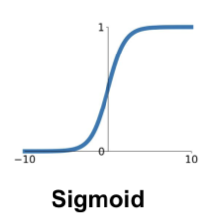

sigmoid 함수는 $s(z) = \frac{1}{1 + e^{-z}}$로, 입력을 0~1 사이의 값으로 바꿔준다.

입력 값이 크거나 작을 때 기울기가 0에 가까워지는 `saturation` 문제가 있다. 이는 `gradient vanishing` 문제를 야기하므로 요즘에는 활성화 함수로서 잘 사용되지 않는다.

또한 값이 `zero-centered` 가 아니기 때문에 입력값의 부호에 그대로 영향을 받으므로 경사하강법 과정에서 정확한 방향으로 가지 못하고 지그재그로 움직이는 문제가 있다. ([12-3 참고](#12-3))

> **Tanh**

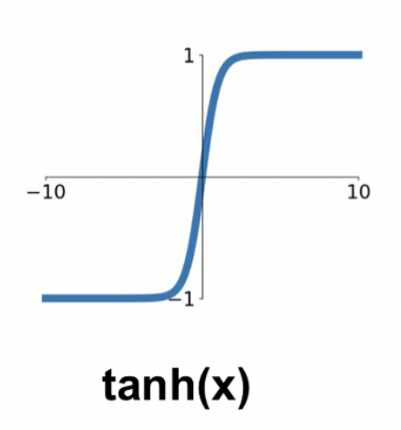

tanh 함수는 입력을 -1~1 사이의 값으로 바꿔준다. sigmoid 함수와 마찬가지로 `saturation` 문제가 있다.

**> ReLU**

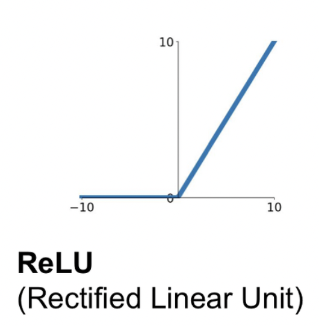

ReLU 함수는 $f(x) = max(0, x)$으로, 입력이 양수면 그대로, 음수면 0을 출력한다. 계산 효율과 성능에서 뛰어난 성능을 보여 가장 많이 사용되는 활성화 함수이다. 양의 입력에 대해서는 `saturation` 문제가 발생하지 않는다. 음의 입력 값에 대해서는 어떤 업데이트도 되지 않는 `Dead ReLU` 문제가 발생한다.

> **Leaky ReLU**

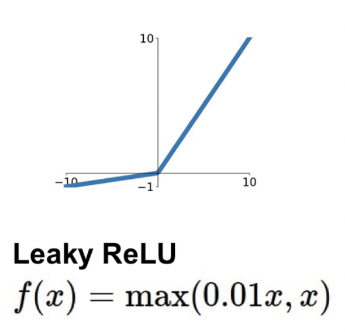

>

Leaky ReLU는 $f(x) = max(0.01x, x)$으로, ReLU 와 마찬가지로 좋은 성능을 유지하면서 음수 입력이 0이 아니게 됨에 따라 `Dead ReLU` 문제를 해결하였다.

#### References

- [Activation Functions에 대해 알아보자 - Steve-Lee's Deep Insight](https://deepinsight.tistory.com/113)
- [[신경망] 6. 활성화 함수 (Activation Function) - 분석벌레의 공부방](https://analysisbugs.tistory.com/55)

---

## #6

#### 오버피팅일 경우 어떻게 대처해야 할까요?

> **Early Stopping**

training loss는 계속 낮아지더라도 validation loss는 올라가는 시점을 overfitting으로 간주하여 학습을 종료하는 방법이다.


> **Parameter Norm Penalty / Weight Decay**

비용함수에 제곱을 더하거나($L_2 Regularization$) 절댓값을 더해서($L_1 Regularization$) weight의 크기에 페널티를 부과하는 방법을 말한다.

$$
total cost = loss(D ; W) + \frac{\alpha}{2} \lVert W \rVert^2_2
$$

> **Data augmentation**

훈련 데이터의 개수가 적을 때, 데이터에 인위적으로 변화를 주어 훈련 데이터의 수를 늘리는 방법이다.

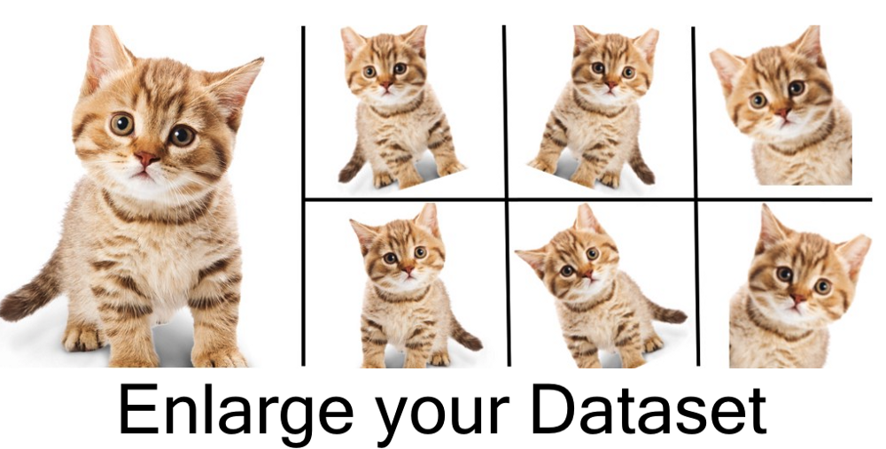

> **Noise robustness**

노이즈나 이상치같은 엉뚱한 데이터가 들어와도 흔들리지 않는(robust 한) 모델을 만들기 위해 input data나 weight에 일부러 노이즈를 주는 방법을 말한다.

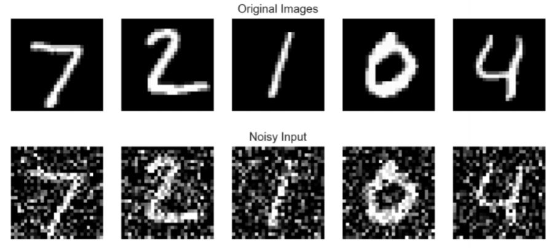

> **Label smoothing**

모델이 Ground Truth를 정확하게 예측하지 않아도 되게 만들어 주어 정확하지 않은 학습 데이터셋에 치중되는 경향(overconfident)을 막아주는 방법이다.

> **Dropout**

각 계층 마다 일정 비율의 뉴런을 임의로 정해 drop 시키고 나머지 뉴런만 학습하도록 하는 방법을 말한다. 매 학습마다 drop 되는 뉴런이 달라지기 때문에 서로 다른 모델들을 앙상블 하는 것과 같은 효과가 있다. dropout은 **학습 시에만 적용**하고, 추론 시에는 적용하지 않는다.


> **Batch normalization**

활성화함수의 활성화값 또는 출력값을 정규화하는 방법이다. 각 hidden layer에서 정규화를 하면서 입력분포가 일정하게 되고, 이에 따라 Learning rate을 크게 설정해도 괜찮아진다. 결과적으로 학습속도가 빨라지는 효과가 있다.

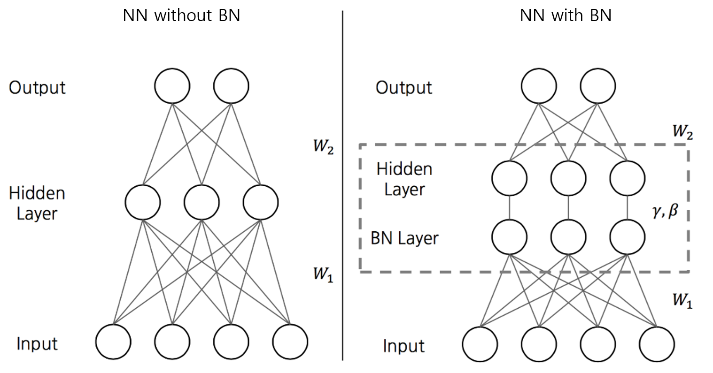

#### References

- [인공신경망 ( ANN ) #6-3 최적화 : 오버피팅 방지( weight decay, droupout ) / 하이퍼파라미터 최적화 - 엄범](https://umbum.dev/222)
- [딥러닝6. Dropout & Early stopping을 통한 최적화 - 살아가는동안](https://m.blog.naver.com/jeonghj66/222004874975)
- [[딥러닝개념] 딥러닝 효과적으로 학습하기(2) (ft. regularization) - WE GONNA MAKE IT](https://wegonnamakeit.tistory.com/9)
- [[Label Smoothing] 요약 정리 - Computer Vision :)](https://cvml.tistory.com/9)
- [문과생도 이해하는 딥러닝 (10) - 배치 정규화 - 데이터 분석하는 문과생, 싸코](https://sacko.tistory.com/44)

---

## #7

#### 하이퍼 파라미터는 무엇인가요?

하이퍼 파라미터(Hyper-parameter)는 모델링할 때, **사용자가 직접 세팅해주는 값**을 뜻한다. 하이퍼 파라미터는 정해진 최적의 값이 없으며, 사용자의 선험적 지식을 기반으로 설정(휴리스틱)한다. 예를들어 딥러닝의 하이퍼 파라미터에는 학습률, 배치 사이즈 등이 있고, 가중치는 학습 과정에서 바뀌는 값이며 이는 파라미터에 속한다. 하이퍼 파라미터 튜닝 기법에는 Manual Search, Grid Search, Random Search, Bayesian Optimization 등이 있다. 딥러닝에서의 하이퍼 파라미터는 아래의 그림을 참고한다.

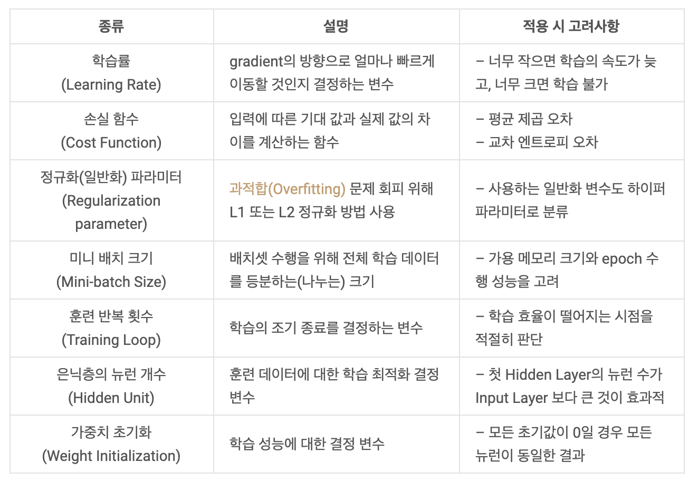

> **파라미터 vs 하이퍼 파라미터**

파라미터와 하이퍼 파라미터를 구분하는 기준은 사용자가 직접 설정하느냐 아니냐이다. **사용자가 직접 설정하면 하이퍼 파라미터, 모델 혹은 데이터에 의해 결정되면 파라미터**이다.

딥러닝에서 하이퍼 파라미터는 `학습률, 배치 크기, 은닉층의 개수` 등이 있고, 파라미터는 `가중치, 편향` 등이 있다.


> **용어 정리**

- 선험적 지식: 경험하지 않아도 알 수 있는 것을 말한다.
- 휴리스틱: 체계적이면서 합리적인 판단이 굳이 필요하지 않은 상황에서 사람들이 빠르게 사용할 수 있도록, 보다 용이하게 구성된 간편추론의 방법이다. '대충 어림짐작하기', '눈대중으로 맞추기' 등의 방법을 일컫는다.

#### References

- [13.파라미터(Parameter)와 하이퍼 파라미터(Hyper parameter) - 귀퉁이 서재](https://bkshin.tistory.com/entry/%EB%A8%B8%EC%8B%A0%EB%9F%AC%EB%8B%9D-13-%ED%8C%8C%EB%9D%BC%EB%AF%B8%ED%84%B0Parameter%EC%99%80-%ED%95%98%EC%9D%B4%ED%8D%BC-%ED%8C%8C%EB%9D%BC%EB%AF%B8%ED%84%B0Hyper-parameter)
- [하이퍼파라미터(Hyperparameter) - 도리의 디지털라이프](http://blog.skby.net/%ED%95%98%EC%9D%B4%ED%8D%BC%ED%8C%8C%EB%9D%BC%EB%AF%B8%ED%84%B0-hyperparameter/)

---

## #8

#### Weight Initialization 방법에 대해 말해주세요. 그리고 무엇을 많이 사용하나요?

딥러닝에서 가중치를 잘 초기화하는 것은 기울기 소실이나 local minima 등의 문제를 야기할 수 있기 때문에 중요하다.

> **LeCun Initialization**

딥러닝의 대가 LeCun 교수님이 제시한 초기화 방법으로 들어오는 노드 수에 대해 정규 분포와 균등 분포를 따르는 방법이 있다.

- **정규 분포를 따르는 방법**

$$
W \sim N(0, Var(W)), \quad Var(W) = \sqrt{\frac{1}{n_{in}}}
$$

- **균등 분포를 따르는 방법**

$$
W \sim U(- \sqrt{\frac{1}{n_{in}}}, + \sqrt{\frac{1}{n_{in}}})
$$

> **Xavier Initialization** (또는 Glorot Initialization)

LeCun 방법과 비슷하지만 들어오는 노드 수와 나가는 노드 수에 의존하고, 적절한 상수값도 발견하여 사용한 방법이다.

- **정규 분포를 따르는 방법**

$$
W \sim N(0, Var(W)), \quad Var(W) = \sqrt{\frac{2}{n_{in} + n_{out}}}
$$

- **균등 분포를 따르는 방법**

$$
W \sim U(- \sqrt{\frac{6}{n_{in} + n_{out}}}, + \sqrt{\frac{6}{n_{in} + n_{out}}})
$$

sigmoid 나 tanh 함수와는 좋은 결과를 보여주지만 ReLU 함수와 사용할 경우 0에 수렴하는 문제가 발생한다.  
따라서 `sigmoid` 나 `tanh` 함수와 주로 많이 사용한다.

> **He Initialization** (또는 Kaiming Initialization)

`ReLU` 와 함께 많이 사용되는 방법으로, LeCun 방법과 같지만 상수를 다르게 하였다. 들어오는 노드만 고려한다.

- **정규 분포를 따르는 방법**

$$
W \sim N(0, Var(W)), \quad Var(W) = \sqrt{\frac{2}{n_{in}}}
$$

- **균등 분포를 따르는 방법**

$$
W \sim U(- \sqrt{\frac{6}{n_{in}}}, + \sqrt{\frac{6}{n_{in}}})
$$

#### References

- [가중치 초기화 (Weight Initialization) - reniew's blog](https://reniew.github.io/13/)
- [[Deep learning] 가중치 초기화(weight initialization) (feat. Xavier, He,normal, uniform) - 독립성이 강한 ISFP](https://resultofeffort.tistory.com/114)

---

## #9

#### 볼츠만 머신은 무엇인가요?

볼츠만 머신은 가시층(Visible Layer)와 은닉층(Hidden Layer), 총 두 개의 층으로 신경망을 구성하는 방법이다.

볼츠만 머신은 모든 뉴런이 연결되어 있는 완전 그래프 형태이며, 제한된 볼츠만 머신(RBM)에서는 같은 층의 뉴런들은 연결되어 있지 않은 모양이다.

기본적으로 단층구조이며, 확률 모델이다. 분류나 선형 회귀 분석 등에 사용될 수 있다.

특히 DBN(Deep Belief Network)에서는 RBM들을 쌓아올려, 각 볼츠만 머신을 순차적으로 학습시킨다.

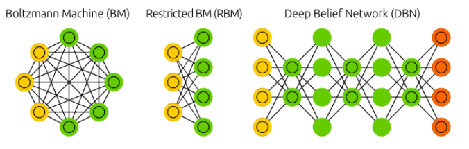

<div align='center'>

</div>
<br/>

색깔 별 cell의 역할은 아래와 같다.


#### References

- [Interview Question & Answer 출근 루틴, 하루 3문제 - YongWook](https://yongwookha.github.io/MachineLearning/2021-01-29-interview-question)
- [Restricted Boltzmann Machine - 공돌이의 수학정리노트](https://angeloyeo.github.io/2020/10/02/RBM.html)

---

## #10

#### TF, PyTorch 등을 사용할 때 디버깅 노하우는?

오류가 발생하는 곳, 중요한 데이터가 바뀌는 지점을 디버깅 포인트로 두고, 확인하는 방법이 있다. 또, IDE에서 다양한 디버깅 extension을 지원하기 때문에 이를 잘 활용하면 좋은 인사이트를 얻을 수 있다. 예를들어, vs code의 jupyter extension을 사용하면 데이터 프레임, 변수값등을 보기 쉽게 정렬하여 확인할 수 있다.

디버깅 노하우도 중요하지만, 오류에 대한 대처방식을 익히면 좋다. 디버깅 하지 않고 오류에 대처할 수 있으므로, 디버깅 시간을 아껴준다. 예를들어, 딥러닝 학습을 위한 코드를 작성할 때, 가장 많이 발생하는 오류는 CUDA out of memory와 shape 오류이다.(개인적인 의견) out of memory와 같은 오류는 배치 사이즈를 줄인다거나, 입력 데이터의 사이즈를 줄이는 방식으로 해결할 수 있다. shape 오류는 디버깅을 통해서 현재 입력 데이터의 shape, type등을 확인하고, 함수의 파라미터가 요구하는 shape, type에 맞게 변형하는 과정이 필요하다.

추가적으로 딥러닝 디버깅 툴은 아니지만, logging tool로서 tensorboard, wandb 등이 매우 유용하게 사용될 수 있다.

---

## #11

#### 뉴럴넷의 가장 큰 단점은 무엇인가? 이를 위해 나온 One-Shot Learning은 무엇인가?

사람은 처음 보는 물건 (새 레이블) 에 대해 조금만 봐도 다른 것과 이 물건을 구분해낼 수 있다. 하지만 뉴럴넷은 이 물건을 구분해내기 위해서는 이 물건에 대한 많은 데이터를 학습해야한다.

**One-shot Learning** 은 뉴럴넷도 새로운 레이블을 지닌 데이터가 적을 때 (one-shot 에서는 한 개) 에도 모델이 좋은 성능을 내도록 사용되는 방법이다.

이를 위해서는 기존에 다른 레이블의 많은 데이터를 학습하여 데이터의 특성을 잘 이해하는 **pretrained** 모델이 필요하다.

학습된 모델에 새로운 레이블의 데이터 하나 던져 주면 모델은 데이터의 특성에 대한 이해를 바탕으로 이 레이블에 대해서도 이해를 하게 된다.

#### References

- [One-shot learning (siamese network) - sji](https://aimaster.tistory.com/48)
- [One shot learning, Siamese Network 이해 - Deep Play](https://3months.tistory.com/507)

---

## #12

#### 요즘 sigmoid 보다 ReLU를 많이 쓰는데 그 이유는?


우선 sigmoid와 ReLU 함수의 모양을 보자. sigmoid는 값이 큰 양수일수록 1에, 큰 음수일수록 0에 가까워진다. 반면 ReLU는 값이 양수이면 원래 값을 그대로 가져가고, 음수이면 0이다.

요즘 sigmoid보다 ReLU를 많이 쓰는 가장 큰 이유는 **기울기 소실 문제(Gradient Vanishing)** 때문이다. 기울기는 연쇄 법칙(Chain Rule)에 의해 국소적 미분값을 누적 곱을 시키는데, sigmoid의 경우 기울기가 항상 0과 1사이의 값이므로 이 값을 연쇄적으로 곱하게 되면 0에 수렴할 수 밖에 없다. 반면 ReLU는 값이 양수일 때, 기울기가 1이므로 연쇄 곱이 1보다 작아지는 것을 어느 정도 막아줄 수 있다.

다만, ReLU는 값이 음수이면, 기울기가 0이기 때문에 일부 뉴런이 죽을 수 있다는 단점이 존재한다. 이를 보완한 활성화 함수로 Leaky ReLU가 있다.

#### References

- [ML — sigmoid 대신 ReLU? 상황에 맞는 활성화 함수 사용하기 - Minkyeong Kim](https://medium.com/@kmkgabia/ml-sigmoid-%EB%8C%80%EC%8B%A0-relu-%EC%83%81%ED%99%A9%EC%97%90-%EB%A7%9E%EB%8A%94-%ED%99%9C%EC%84%B1%ED%99%94-%ED%95%A8%EC%88%98-%EC%82%AC%EC%9A%A9%ED%95%98%EA%B8%B0-c65f620ad6fd)
- [[히스] Gradient Vanishing 해결을 위한 ReLU 와 ResNet - boostcamp-ai-tech-4/peer-session](https://github.com/boostcamp-ai-tech-4/peer-session/issues/52)
- [딥러닝에서 사용하는 활성화함수 - reniew's blog](https://reniew.github.io/12/)

---

## #12-1

#### Non-Linearity라는 말의 의미와 그 필요성은?

비선형(non-linearity)의 뜻을 알기 위해서는 우선 선형(linearity)가 무엇인지 알아야 한다. 어떤 모델이 선형적(linearity)라고 한다면 그 모델은 변수 $x_1, x_2, ... , x_n$과 가중치 $w_1, w_2, ... , w_n$으로 $y = w_1 * x_1 + w_2 * x_2 + ... + w_n * x_n$으로 표현할 수 있으며, 가산성(Additreivityly)과 동차성(Homogeneity)을 만족해야 한다.

- **가산성**: 임의의 수 $x, y$에 대해 $f(x+y) = f(x) + f(y)$가 성립
- **동차성**: 임의의 수 $x, \alpha$에 대해 $f(\alpha x) = \alpha f(x)$가 성립

이를 만족하지 못하는 모델을 비선형 관계에 있는 모델이라고 한다.

딥러닝에서 이런 비선형 관계는 활성화 함수(activation function)을 도입함으로써 표현할 수 있다. 그럼 비선형 관계 즉, 활성화 함수가 왜 필요할까? 바로 **활성화 함수를 사용해 여러 층을 쌓아서 더 복잡한 표현을 하기 위해서**이다. 활성화 함수가 $h(x) = cx$인 선형 함수라고 생각해보자. 이 때 $n$개의 층을 쌓았다고 할 때, 모델은 $y = h^n(x) = c^nx$로 나타낼 수 있다. $c^n=k$라는 상수로 치환하면 결국 1층을 가진 신경망과 동일하다. 그렇기 때문에 비선형인 활성화 함수가 필요한 것이다.

#### References

- [[밑바닥 딥러닝] 신경망 - 코딩하는펭귄의 저장소](https://cooding-penguin.netlify.app/dl-from-scratch/neural-network/#%EB%B9%84%EC%84%A0%ED%98%95-%ED%95%A8%EC%88%98)
- [선형성 - 위키백과](https://ko.wikipedia.org/wiki/%EC%84%A0%ED%98%95%EC%84%B1)

---

## #12-2

#### ReLU로 어떻게 곡선 함수를 근사하나?

ReLU는 양수일 때 <!-- $y=x$ --> 인 선형 함수와 음수일 때 <!-- $y=0$ --> 인 선형 함수 두 개를 결합된 형태이다. 그렇지만 ReLU는 선형 함수가 갖는 가산성을 만족하지 못하기 때문에 비선형 함수로 볼 수 있다. 하지만 ReLU가 어떻게 곡선 함수를 근사할 수 있을까?


ReLU를 여러 개 결합하면, 특정 지점에서 특정 각도만큼 선형 함수를 구부릴 수 있다. 이 성질을 이용하여 곡선 함수 뿐만 아니라 모든 함수에 근사를 할 수 있게 된다.

#### References

- [활성화 함수(Activation function) 설명 (Sigmoid, ReLU, LeakyReLU, tanh) - 별보는두더지](https://mole-starseeker.tistory.com/m/39)
- [Q2) Sigmoid 보다 ReLu를 많이 쓰는 이유? - JINSOL KIM](https://gaussian37.github.io/math-question-q2/)
- [How do ReLU Neural Networks approximate any continuous function? - towards data science](https://towardsdatascience.com/how-do-relu-neural-networks-approximate-any-continuous-function-f59ca3cf2c39)
- [Finally, an intuitive explanation of why ReLU works](https://towardsdatascience.com/if-rectified-linear-units-are-linear-how-do-they-add-nonlinearity-40247d3e4792)

---

## #12-3

#### ReLU의 문제점은?

ReLU의 가장 큰 문제점은 바로 <strong>죽은 뉴런(Dead Neurons)</strong>이다. ReLU는 결과값이 음수인 경우 모두 0으로 취급하는데, back propagation시 기울기에 0이 곱해져 해당 부분의 뉴런은 죽고 그 이후의 뉴런 모두 죽게 된다. 이를 해결한 Leaky ReLU는 값이 음수일 때 조금의 음의 기울기를 갖도록 하여 뉴런이 조금이라도 기울기를 갖도록 한다. 또 다른 방법으로는 입력값에 아주 조금의 편향(bias)를 주어 ReLU를 왼쪽으로 조금 이동시키는 방법이 있다. 이렇게 되면 입력값은 모두 양수이므로 뉴런이 모두 활성화가 되어 뉴런이 죽지 않는다. 관련 내용은 [CS231n 6강 16:45](https://youtu.be/wEoyxE0GP2M?t=1005)를 참고!

두 번째 문제는 <strong>편향 이동(Bias Shift)</strong>이다. ReLU는 항상 0이상의 값을 출력하기 때문에 활성화값의 평균이 0보다 커 zero-centered하지 않다. 활성화값이 zero-centered되지 않으면 가중치 업데이트가 동일한 방향으로만 업데이트가 돼서 학습 속도가 느려질 수가 있다. 관련 내용은 [CS231n 6강 8:46](https://youtu.be/wEoyxE0GP2M?t=526)을 참고!

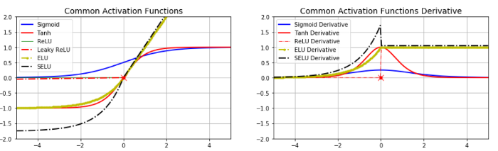

이를 해결하기 위해 배치 정규화(Batch Normalization)을 사용하거나 zero-centered된 ELU, SeLU와 같은 활성화 함수를 사용한다.

#### References

- [Neural Network - Machine Learning Blog](https://nmhkahn.github.io/NN)
- [What are the disadvantages of using the ReLu when using Neural Networks? - Quora](https://www.quora.com/What-are-the-disadvantages-of-using-the-ReLu-when-using-Neural-Networks)
- [05-1. 심층 신경망 학습 - 활성화 함수, 가중치 초기화 EXCELSIOR](https://excelsior-cjh.tistory.com/177)
- [computer-vision-study-2020s/week3/week3.md - CoodingPenguin/computer-vision-study-2020s](https://github.com/CoodingPenguin/computer-vision-study-2020s/blob/master/week3/week3.md#lecture-6)
- [Activation Functions in Neural Networks - Kshitij Khurana](https://medium.com/@kshitijkhurana3010/activation-functions-in-neural-networks-ed88c56b611b)
- [A Gentle Introduction to the Rectified Linear Unit (ReLU)](https://machinelearningmastery.com/rectified-linear-activation-function-for-deep-learning-neural-networks/)

---

## #12-4

#### 편향(bias)는 왜 있는걸까?


편향(bias)는 활성화 함수가 왼쪽 혹은 오른쪽으로 이동한다. 가중치(weight)는 활성화 함수의 가파른 정도 즉, 기울기를 조절하는 반면, 편향(bias)는 **활성화 함수를 움직임으로써 데이터에 더 잘 맞도록 한다.**

#### References

- [Glossary of Deep Learning: Bias - Jaron Collis](https://medium.com/deeper-learning/glossary-of-deep-learning-bias-cf49d9c895e2)
- [What is the role of the bias in neural networks? - stackoverflow](https://stackoverflow.com/questions/2480650/what-is-the-role-of-the-bias-in-neural-networks)

---

## #13

#### Gradient Descent에 대해서 쉽게 설명한다면?

Gradient Descent는 어떤 함수의 극소점을 찾기 위해 gradient 반대 방향으로 이동해 가는 방법이다.


딥러닝에서는 Loss function을 최소화시키기 위해 파라미터에 대해 Loss function을 미분하여 그 기울기값(gradient)을 구하고, 경사가 하강하는 방향으로 파라미터 값을 점진적으로 찾기위해 사용된다.

Gradient Descent를 수식으로 표현하면 아래와 같다.

$$
W_{t+1} \leftarrow W_t - \eta g_t
$$

Gradient Descent의 문제점으로는 크게 두 가지가 있다.

첫 번째로 적절한 <strong>step size(learning rate)</strong>가 필요하다. step size가 큰 경우 한 번 이동하는 거리가 커지므로 빠르게 수렴할 수 있다는 장점이 있다. 하지만, step size를 너무 크게 설정해버리면 최소값을 계산하도록 수렴하지 못하고 함수 값이 계속 커지는 방향으로 최적화가 진행될 수 있다.

한편 step size가 너무 작은 경우 발산하지는 않을 수 있지만 최적의 x를 구하는데 소요되는 시간이 오래 걸린다는 단점이 있다.


두 번째로 **local minima 문제**이다. gradient descent 알고리즘을 시작하는 위치는 매번 랜덤하기 때문에 어떤 경우에는 local minima에 빠져 계속 헤어나오지 못하는 경우도 생긴다. (자세한 내용은 [#14-1. GD가 Local Minima 문제를 피하는 방법은?](#14-1) 참고)

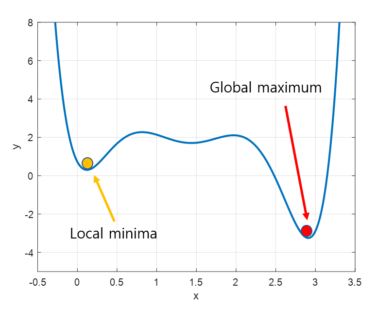

#### References

- [경사하강법(gradient descent) - 공돌이의 수학정리노트](https://angeloyeo.github.io/2020/08/16/gradient_descent.html)
- [Gradient Descent 탐색 방법 - 다크 프로그래머](https://darkpgmr.tistory.com/133)

---

## #13-1

#### 왜 꼭 Gradient를 써야 할까? 그 그래프에서 가로축과 세로축 각각은 무엇인가? 실제 상황에서는 그 그래프가 어떻게 그려질까?

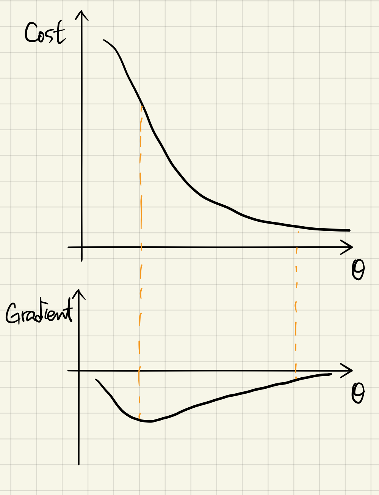

Gradient가 양수이면 올라가는 방향이며 음수이면 내려가는 방향이다. 실제 상황에서는 Gradient 그래프가 0을 중심으로 진동하는 모양이 될 것이다.

#### References

- [Interview Question & Answer 출근 루틴, 하루 3문제 - YongWook](https://yongwookha.github.io/MachineLearning/2021-01-29-interview-question)

---

## #13-2

#### GD 중에 때때로 Loss가 증가하는 이유는?

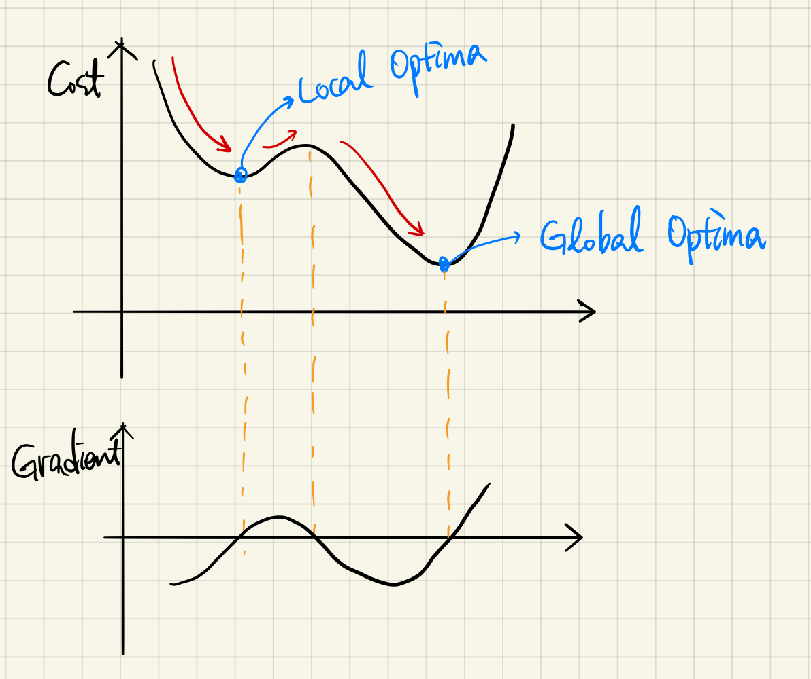

minima에 들어갔다가 나오는 경우일 것이다. 실제로 사용되는 GD에서는 local minima 문제를 피하기 위해 Momentum 등의 개념을 도입한 RMSprop, Adam 등의 optimization 전략을 사용한다.

각 optimization 전략에 따라 gradient가 양수인 방향으로도 parameter update step을 가져가는 경우가 생길 수 있으며, 이 경우에는 Loss가 일시적으로 증가할 수 있다.

(자세한 내용은 [#17. SGD, RMSprop, Adam에 대해서 아는대로 설명한다면?](#17) 참고)

#### References

- [Interview Question & Answer 출근 루틴, 하루 3문제 - YongWook](https://yongwookha.github.io/MachineLearning/2021-01-29-interview-question)

---

## #13-3

#### Back Propagation에 대해서 쉽게 설명 한다면?

역전파 알고리즘은 Loss에 대한 입력값의 기울기(미분값)를 출력층 layer에서부터 계산하여 거꾸로 전파시키는 것이다.

이렇게 거꾸로 전파시켜서 최종적으로 출력층에서의 output값에 대한 입력층에서의 input data의 기울기 값을 구할 수 있다.

이 과정에서 **chain rule**이 이용된다.

출력층 바로 전 layer에서부터 기울기(미분값)을 계산하고 이를 점점 거꾸로 전파시키면서 전 layer들에서의 기울기와 서로 곱하는 형식으로 나아가면 최종적으로 출력층의 output에 대한 입력층에서의 input의 기울기(미분값)을 구할 수가 있다. 이를 그림으로 나타내면 아래와 같다.


역전파 알고리즘이 해결한 문제가 바로 파라미터가 매우 많고 layer가 여러개 있을때 가중치w와 b를 학습시키기 어려웠다는 문제이다.

이는 역전파 알고리즘으로 각 layer에서 기울기 값을 구하고 그 기울기 값을 이용하여 Gradient descent 방법으로 가중치w와 b를 update시키면서 해결되었다.

#### References

- [딥러닝 역전파 backpropagation이란? - 프라이데이](https://ganghee-lee.tistory.com/31)
- [3.14. 순전파(forward propagation), 역전파(back propagation), 연산 그래프 - Dive into Deep Learning](https://ko.d2l.ai/chapter_deep-learning-basics/backprop.html)

---

## #14

#### Local Minima 문제에도 불구하고 딥러닝이 잘 되는 이유는?

local minima 문제가 사실은 고차원(High Dimensional)의 공간에서는 발생하기 힘든, 매우 희귀한 경우이기 때문이다. 실제 딥러닝 모델에서는 weight가 수도없이 많으며, 그 수많은 weight가 모두 local minima에 빠져야 weight update가 정지되기 때문에 local minima는 큰 문제가 되지 않는다.

> **Local Minima 문제에도 불구하고 딥러닝이 잘 되는, 더 구체적인 이유**

고차원의 공간에서 모든 축의 방향으로 오목한 형태가 형성될 확률은 거의 0에 가깝다. 따라서, 고차원의 공간에서 대부분의 critical point는 local minima가 아니라 saddle point다. 그리고, 고차원의 공간에서 설령 local minima가 발생한다 하더라도 이는 global minimum이거나 또는 global minimum과 거의 유사한 수준의 에러 값을 갖는다. 왜냐하면, critical point에 포함된 위로 볼록인 방향 축의 비율이 크면 클수록 높은 에러를 가지기 때문이다.(실험적 결과) local minima는 위로 볼록인 경우가 하나도 없는 경우이기 때문에 결과적으로 매우 낮은 에러를 갖게 될 것이다.

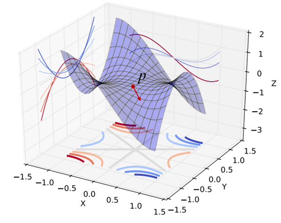

> **Critical point, Saddle point, Local minimum**

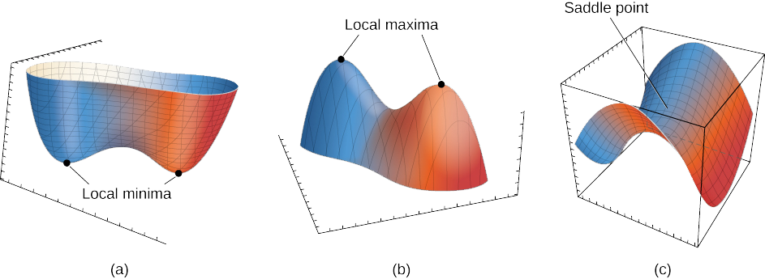

- `critical point`: 일차 미분이 0인 지점이다. (local/global)minima, (local/global)maxima, saddle point를 가리킴
- `local minimum`: 모든 방향에서 극소값을 만족하는 점
- `global minimum`: 모든 방향에서 극소값을 만족하는 점 중에 가장 값이 작은 점(정답)
- `saddle point`: 어느 방향에서 보면 극대값이지만 다른 방향에서 보면 극소값이 되는 점

#### References

- [NeuralNetwork (3) Optimazation2 - Cornor's Blog](<https://wjddyd66.github.io/dl/NeuralNetwork-(3)-Optimazation2/>)
- [Local Minima 문제에 대한 새로운 시각 - 다크 프로그래머](https://darkpgmr.tistory.com/148)
- [05-1.심층 신경망 학습-활성화 함수, 가중치 초기화 - EXCELSIOR](https://excelsior-cjh.tistory.com/177)

---

## #14-1

#### GD(Gradient Descent)가 Local Minima 문제를 피하는 방법은?

Local minima 문제를 피하는 방법으로는 **Momentum, Nesterov Accelerated Gradient(NAG), Adagrad, Adadelta, RMSprop, Adam** 등이 있다.

**SGD**는 Stochastic Gradient Descent으로, 하나 혹은 여러개의 데이터를 확인한 후에 어느 방향으로 갈 지 정하는 가장 기초적인 방식이다.

**Momentum**이란 관성을 의미하며, 이전 gradient의 방향성을 담고있는 `momentum` 인자를 통해 흐르던 방향을 어느 정도 유지시켜 local minima에 빠지지 않게 만든다. 즉, 관성을 이용하여, 학습 속도를 더 빠르게 하고, 변곡점을 잘 넘어갈 수 있도록 해주는 역할을 수행한다.


**Nesterov Accelerated Gradient(NAG)** 는 모멘텀과 비슷한 역할을 수행하는 `Look-ahead gradient `인자를 포함하여, $a$ 라는 `accumulate gradient`가 gradient를 감소시키는 역할을 한다. 모멘텀과 다른 점은, 미리 한 스텝을 옮겨가본 후에 어느 방향으로 갈지 정한다는 것이다.

**Adagrad**란 뉴럴넷의 파라미터가 많이 바뀌었는지 적게 바뀌었는지 확인하고, 적게 변한건 더 크게 변하게 하고, 크게 변한건 더 작게 변화시키는 방법이다. Adagrad는 `sum of gradient squares`($G_t$)를 사용하는데, 이는 그래디언트가 얼만큼 변했는지를 제곱해서 더하는 것이므로 계속 커진다는 문제가 발생한다. $G_t$가 계속 커지면 분모가 점점 무한대에 가까워지게 되어, $W$ 업데이트가 되지 않게 되어, 뒤로 갈수록 학습이 점점 안되는 문제점이 발생한다.

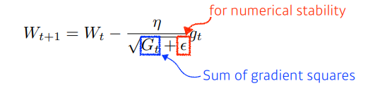

**Adadelta**는 `Exponential Moving Average(EMA)`를 사용하여, Adagrad의 $G_t$가 계속 커지는 현상을 막을 수 있다. EMA는 현재 타임스텝으로부터 `윈도우 사이즈만큼의 파라미터 변화(그래디언트 제곱의 변화)를 반영`하는 역할을 하는데, 이전의 값을 모두 저장하는 것이 아닌, `이전 변화량에 특정 비율을 곱해 더한 인자`를 따로 두는 방식이다. Adadelta는 learning rate가 없다.

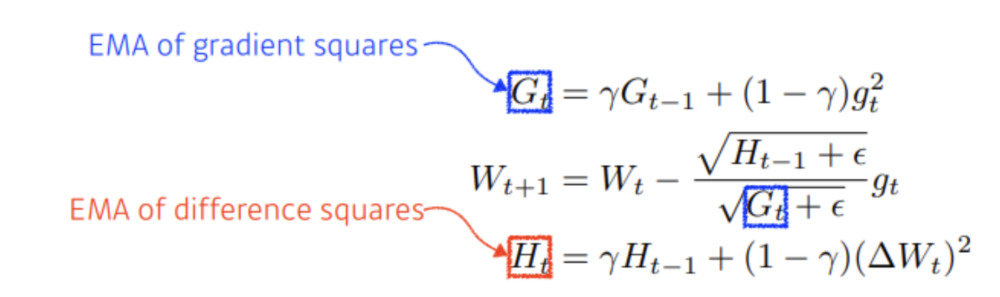

(**Momentum**의 더 자세한 내용은 [모멘텀의 수식을 적어 본다면?](#17-3) 참고)  
(**SGD, RMSprop, Adam**에 대한 설명은 [SGD, RMSprop, Adam에 대해서 아는대로 설명한다면?](#17) 참고)

#### References

- [딥러닝 기초 Optimization-Gradient Descent Methods - Sally blog](https://bsm8734.github.io/posts/bc-d012-2-dlbasic-optimization-gradient-descent-methods/)
- [NeuralNetwork (3) Optimazation2 - Cornor's Blog](<https://wjddyd66.github.io/dl/NeuralNetwork-(3)-Optimazation2/>)

---

## #14-2

#### 찾은 해가 Global Minimum인지 아닌지 알 수 있는 방법은?

Gradient Descent 방식에서 local minima에 도달함은 증명되어있으나, global minima에 도달하는 것은 보장되지 않았다. 또한, 현재 지점이 global minima인지도 알 수 없다. 딥러닝에서 다루는 문제가 convexity를 만족하지 않기 때문이다. 대신, local minima를 찾는다면, 그 지점이 곧 global minima일 가능성이 크다. [Local Minima 문제에도 불구하고 딥러닝이 잘 되는 이유는?](#14)에서 언급했듯, saddle point가 아닌 완전한 local minimum이 발생하는 경우는 희귀하다. 따라서 모든 방향에서 아래로 볼록인 local minima를 발견한다면, 그 지점이 바로 global minima일 가능성이 높다.

#### References

- [Local Minima 문제에 대한 새로운 시각 - 다크 프로그래머](https://darkpgmr.tistory.com/148)
- [0021 Gradient Descent & Momentum - Deepest Documentation](https://deepestdocs.readthedocs.io/en/latest/002_deep_learning_part_1/0021/)

---

## #15

#### Training 세트와 Test 세트를 분리하는 이유는?

모델은 데이터에 대해 예측값을 만들고 정답과 비교하며 업데이트되면서 학습이 된다. 그런데 학습 데이터에 대해서는 좋은 성능을 낸다 하더라도 본 적 없는 데이터에 대해서는 잘 대응하지 못하는 **오버피팅** 문제가 생긴다면 좋은 모델이 아니다.

이를 막기 위해 학습된 모델이 처음 보는 데이터에도 강건하게 성능을 내는지 판단하기 위한 수단으로 test 세트를 따로 만든다.

#### References

- [test와 validation - ML Basics](https://wikidocs.net/31019)

---

## #15-1

#### Validation 세트가 따로 있는 이유는?

모델을 학습시키고 test 데이터를 통해 모델의 일반화 성능을 파악하고, 다시 모델에 새로운 시도를 하고 test 데이터를 통해 모델의 성능을 파악한다고 생각해보자.

이 경우, 모델은 결국 test 데이터에도 오버피팅이 되어 다시 처음 보는 데이터를 주면 좋은 성능을 보장할 수 없게 된다.

이 문제를 막기 위해 validation 세트를 사용한다. validation 세트를 통해 모델의 성능을 평가하고 하이퍼파라미터 등을 수정하는 것이다.

즉, train 데이터로 모델을 학습시키고 valid 데이터로 학습된 모델의 성능 평가를 하고 더 좋은 방향으로 모델을 수정한다. 그리고 최종적으로 만들어진 모델로 test 데이터를 통해 최종 성능을 평가한다.

#### References

- [test와 validation - ML Basics](https://wikidocs.net/31019)

---

## #15-2

#### Test 세트가 오염되었다는 말의 뜻은?

test 데이터는 한 번도 학습에서 본 적 없는 데이터여야 한다. 그런데 train 데이터가 test 데이터와 흡사하거나 포함되기까지한다면 test 데이터는 더이상 학습된 모델의 성능 평가를 객관적으로 하지 못한다.

이렇듯 test 데이터가 train 데이터와 유사하거나 포함된 경우에 test 세트가 오염되었다고 말한다.

#### References

- [7. Data Leakage - 분리수거장](https://m.blog.naver.com/hongjg3229/221811766581)

---

## #15-3

#### Regularization이란 무엇인가?

모델의 오버피팅을 막고 처음 보는 데이터에도 잘 예측하도록 만드는 방법을 Regularization(일반화)라고 한다.  

대표적인 방법으로 [Dropout](https://github.com/boostcamp-ai-tech-4/ai-tech-interview/blob/main/answers/3-deep-learning.md#16-1), [L1, L2 Regularization](https://github.com/boostcamp-ai-tech-4/ai-tech-interview/blob/main/answers/2-machine-learning.md#21) 등이 존재한다.  

#### References  

- [L1 and L2 regularization for Deep Learning - Ujwal Tewari's Medium](https://medium.com/analytics-vidhya/regularization-understanding-l1-and-l2-regularization-for-deep-learning-a7b9e4a409bf)

---

## #16

#### Batch Normalization의 효과는?


배치 정규화(Batch Normalization)은 학습 시 **미니배치 단위로 입력의 분포가 평균이 0, 분산이 1이 되도록 정규화**한다. 더불어 $\gamma$로 스케일과 $\beta$로 이동 변환을 수행한다. 이렇게 배치 정규화를 사용하면 다음과 같은 효과를 얻을 수 있다.

- `장점 1` 기울기 소실/폭발 문제가 해결되어 큰 학습률을 설정할 수 있어 학습속도가 빨라진다.
- `장점 2` 항상 입력을 정규화시키기 때문에 가중치 초깃값에 크게 의존하지 않아도 된다.
- `장점 3` 자체적인 규제(Regularization) 효과가 있어 Dropout이나 Weight Decay와 같은 규제 방법을 사용하지 않아도 된다.

#### References

- [Batch Normalization - Steve-Lee's Deep Insight](https://deepinsight.tistory.com/116)
- [Understanding Batch Normalization for Neural Networks - towards data science](https://towardsdatascience.com/understanding-batch-normalization-for-neural-networks-1cd269786fa6)
- [Batch Normalization - 라온 피플](https://m.blog.naver.com/laonple/220808903260)
- [[Deep Learning] Batch Normalization (배치 정규화) - 꾸준희](https://eehoeskrap.tistory.com/430)

---

## #16-1

#### Dropout의 효과는?


드롭아웃(Dropout)은 <strong>설정된 확률 $p$만큼 은닉층(hidden layer)에 있는 뉴런을 무작위로 제거하는 방법</strong>으로, 오버피팅을 방지하기 위한 방법 중 하나이다. (정확히는 출력을 0으로 만들어 더이상의 전파가 되지 않도록 한다.) 드롭아웃(Dropout)은 학습 때마다 무작위로 뉴런을 제거하므로 매번 다른 모델을 학습시키는 것으로 해석할 수 있다. 그리고 추론 시 출력에 제거 확률 $p$를 곱함으로써 앙상블 학습에서 여러 모델의 평균을 내는 효과를 얻을 수 있다.

#### References

- [3.13. 드롭아웃(dropout) - Dive into Deep Learning](https://ko.d2l.ai/chapter_deep-learning-basics/dropout.html)
- [An Intuitive Explanation to Dropout - towards data science](https://towardsdatascience.com/an-intuitive-explanation-to-dropout-749c7fb5395c)

---

## #16-2

#### BN 적용해서 학습 이후 실제 사용시에 주의할 점은? 코드로는?

학습 과정에서는 미니 배치의 평균과 분산을 계산하여 배치 정규화를 적용하지만, 추론 시에는 학습 데이터 전체에 대한 평균과 분산을 계산하여 적용을 해야 한다. 왜냐하면 사용자가 설정한 배치의 크기에 따라 추론 결과가 변할 수도 있기 때문이다.

#### References

- [Batch Normalization (ICML 2015) - SanghyukChun's Blog](http://sanghyukchun.github.io/88/)

---

## #16-3

#### GAN에서 Generator 쪽에도 BN을 적용해도 될까?

일반적으로 GAN에서는 생성기(Generator)의 출력층(Output Layer)에만 BN(Batch Normalization)을 적용하지 않는다. 왜냐하면 생성기가 만든 이미지가 BN을 지나면 실제 이미지와는 값의 범위가 달라지기 때문이다.

#### References

- [초짜 대학원생의 입장에서 이해하는 Deep Convolutional Generative Adversarial Network (DCGAN) (1) - Jaejun Yoo's Playground](http://jaejunyoo.blogspot.com/2017/02/deep-convolutional-gan-dcgan-1.html)

---

## #17

#### SGD, RMSprop, Adam에 대해서 아는대로 설명한다면?

> **SGD**

Loss Function을 계산할 때 전체 train set을 사용하는 것을 Batch Gradient Descent 라고 한다. 그러나 이렇게 계산을 할 경우 한번 step을 내딛을 때 전체 데이터에 대해 Loss Function을 계산해야 하므로 너무 많은 계산량이 필요하다.

이를 방지하기 위해 보통은 Stochastic Gradient Descent(SGD)라는 방법을 사용한다. 이 방법에서는 loss function을 계산할 때 전체 데이터(batch) 대신 데이터 한 개 또는 일부 조그마한 데이터의 모음(mini-batch)에 대해서만 loss function을 계산한다.

**데이터 한 개**를 사용하는 경우를 <strong>Stochastic Gradient Descent(SGD)</strong>, <strong>데이터의 일부(mini-batch)</strong>를 사용하는 경우를 <strong>mini-batch Stochastic Gradient Descent(mini-batch SGD)</strong>라고 하지만 **오늘날의 딥러닝에서 일반적으로 통용되는 SGD는 mini-batch SGD이다.**

이 방법은 batch gradient descent 보다 다소 부정확할 수는 있지만, 훨씬 계산 속도가 빠르기 때문에 같은 시간에 더 많은 step을 갈 수 있으며 여러 번 반복할 경우 보통 batch의 결과와 유사한 결과로 수렴한다.

또한, SGD를 사용할 경우 Batch Gradient Descent에서 빠질 local minima에 빠지지 않고 더 좋은 방향으로 수렴할 가능성도 있다.

> **RMSprop**

RMSProp은 딥러닝의 대가 제프리 힌톤이 제안한 방법으로서, Adagrad의 단점을 해결하기 위한 방법이다.

Adagrad의 식에서 gradient의 제곱값을 더해나가면서 구한 $G_t$부분을 합이 아니라 지수평균으로 바꾸어서 대체한 방법이다.

이렇게 대체를 할 경우 Adagrad처럼 $G_t$가 무한정 커지지는 않으면서 최근 변화량의 변수간 상대적인 크기 차이는 유지할 수 있다.

식으로 나타내면 다음과 같다.


> **Adam**

Adam(Adaptive Moment Estimation)은 RMSProp과 Momentum 방식을 합친 것 같은 알고리즘이다.

이 방식에서는 Momentum 방식과 유사하게 지금까지 계산해온 기울기의 지수평균을 저장하며, RMSProp과 유사하게 기울기의 제곱값의 지수평균을 저장한다.

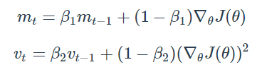

다만, Adam에서는 m과 v가 처음에 0으로 초기화되어 있기 때문에 학습의 초반부에서는 $m_t, v_t$가 0에 가깝게 bias 되어있을 것이라고 판단하여 이를 unbiased 하게 만들어주는 작업을 거친다.

$m_t, v_t$의 식을 ∑ 형태로 펼친 후 양변에 expectation을 씌워서 정리해보면, 다음과 같은 보정을 통해 unbiased 된 expectation을 얻을 수 있다.

이 보정된 expectation들을 가지고 gradient가 들어갈 자리에 $\widehat{m_t}, G_t$가 들어갈 자리에 $\widehat{v_t}$를 넣어 계산을 진행한다.


#### References

- [Gradient Descent Optimization Algorithms 정리 - Beomsu Kim's Blog](http://shuuki4.github.io/deep%20learning/2016/05/20/Gradient-Descent-Algorithm-Overview.html)
- [딥러닝 Optimization 함수 정리 - rueki](https://rueki.tistory.com/187)

---

## #17-1

#### SGD에서 Stochastic의 의미는?

SGD는 Loss Function을 계산할 때 전체 train dataset을 사용하는 Batch Gradient Descent와 다르게 일부 조그마한 데이터의 모음(mini-batch)에 대해서만 loss function을 계산한다.

`Stochastic`은 **mini-batch가 전체 train dataset에서 무작위로 선택된다**는 것을 의미한다.

#### References

- [Gradient Descent Optimization Algorithms 정리 - Beomsu Kim's Blog](http://shuuki4.github.io/deep%20learning/2016/05/20/Gradient-Descent-Algorithm-Overview.html)

---

## #17-2

#### 미니배치를 작게 할때의 장단점은?

> **장점**

- 한 iteration의 계산량이 적어지기 때문에 step 당 속도가 빨라진다.
- 적은 Graphic Ram으로도 학습이 가능하다.

> **단점**

- 데이터 전체의 경향을 반영하기 힘들다. 업데이트를 항상 좋은 방향으로 하지만은 않는다.

(batch size에 관련된 논문은 [Batch Size in Deep Learning - hyeonseob](https://blog.lunit.io/2018/08/03/batch-size-in-deep-learning/) 참고)

#### References

- [[호기심] mini-batch는 왜 사용하는가? - 담백한오늘](https://dambaekday.tistory.com/1)

---

## #17-3

#### 모멘텀의 수식을 적어 본다면?

Momentum 방식은 말 그대로 Gradient Descent를 통해 이동하는 과정에 일종의 `관성`을 주는 것이다.

현재 Gradient를 통해 이동하는 방향과는 별개로, 과거에 이동했던 방식을 기억하면서 그 방향으로 일정 정도를 추가적으로 이동하는 방식이다.

$$
v_t = \gamma v_{t-1} + \eta\nabla_{\theta}J(\theta)
$$

$$
\theta = \theta - v_t
$$

이 때, $v_t$는 time step t에서의 이동 벡터이며, $\gamma$는 얼마나 momentum을 줄 것인지에 대한 momentum term이다.

#### References

- [Gradient Descent Optimization Algorithms 정리 - Beomsu Kim's Blog](http://shuuki4.github.io/deep%20learning/2016/05/20/Gradient-Descent-Algorithm-Overview.html)

---

## #18

#### 간단한 MNIST 분류기를 MLP+CPU 버전으로 numpy로 만든다면 몇줄일까?

2-layer 신경망을 구현한다고 했을 때, 100줄 이내로 만들 수 있다.

#### References

- [deeplearning_from_scratch - youbeebee](https://github.com/youbeebee/deeplearning_from_scratch/blob/master/ch4.%EC%8B%A0%EA%B2%BD%EB%A7%9D%20%ED%95%99%EC%8A%B5/4.5.%ED%95%99%EC%8A%B5%20%EC%95%8C%EA%B3%A0%EB%A6%AC%EC%A6%98%20%EA%B5%AC%ED%98%84%ED%95%98%EA%B8%B0.py)
- [4장.신경망 학습 - 밑바닥부터 시작하는 딥러닝(도서)](http://m.yes24.com/Goods/Detail/34970929)

---

## #18-1

#### 어느 정도 돌아가는 녀석을 작성하기까지 몇시간 정도 걸릴까?

간단한 MNIST 분류기를 MLP+CPU 버전으로 numpy로 만든, 참고 코드([deeplearning_from_scratch - youbeebee](https://github.com/youbeebee/deeplearning_from_scratch/blob/master/ch4.%EC%8B%A0%EA%B2%BD%EB%A7%9D%20%ED%95%99%EC%8A%B5/4.5.%ED%95%99%EC%8A%B5%20%EC%95%8C%EA%B3%A0%EB%A6%AC%EC%A6%98%20%EA%B5%AC%ED%98%84%ED%95%98%EA%B8%B0.py))의 경우, 15 에폭 기준 0.9 이상의 정확도가 나온다고 한다. 이 100줄 가량의 코드를 작성하는데 걸리는 시간은 사람마다 다르겠지만, 구조를 정확히 알고있다면 오래걸려도 30분 내에는 작성할 수 있을 것이라 생각한다. 그러나 pretrain되지 않은 모델의 경우, 학습시간이 꽤 오래걸린다고 한다.

#### References

- [3.6.2.신경망의 추론 처리 - 밑바닥부터 시작하는 딥러닝(도서)](http://m.yes24.com/Goods/Detail/34970929)

---

## #18-2

#### Back Propagation은 몇줄인가?

참고 코드(경사하강법 적용) 기준으로 10줄이면 구현할 수 있다. `gradient_descent` 함수를 각 레이어별로 적용하면 미분값을 적용시킬 수 있다.

```python
# 가중치 매개변수의 기울기를 구함
def numerical_gradient(f, x):
    h = 1e-4
    grad = np.zeros_like(x)  # x와 형상이 같은 배열을 생성

    for idx in range(x.size):
        tmp_val = x[idx]
        # f(x+h) 계산
        x[idx] = tmp_val + h
        fxh1 = f(x)

        # f(x-h) 계산
        x[idx] = tmp_val - h
        fxh2 = f(x)

        grad[idx] = (fxh1 - fxh2) / (2 * h)
        x[idx] = tmp_val  # 값 복원

    return grad

for key in ('W1', 'b1', 'W2', 'b2'):
    network.params[key] -= learning_rate * grad[key]
```

#### References

- [deeplearning_from_scratch - youbeebee](https://github.com/youbeebee/deeplearning_from_scratch/blob/master/ch4.%EC%8B%A0%EA%B2%BD%EB%A7%9D%20%ED%95%99%EC%8A%B5/4.4.%EA%B8%B0%EC%9A%B8%EA%B8%B0.py)
- [4.5.신경망학습\_학습 알고리즘 구현하기 - 밑바닥부터 시작하는 딥러닝(도서)](http://m.yes24.com/Goods/Detail/34970929)

---

## #18-3

#### CNN으로 바꾼다면 얼마나 추가될까?

filter의 수, 크기, padding, stride 등에 대한 내용과 pooling layer등 레이어에 관한 정의가 추가되므로 약 50줄 정도 추가된다.

MLP 버전과 CNN 버전의 참고코드는 아래와 같다.

- [MLP 참고 코드](https://github.com/youbeebee/deeplearning_from_scratch/blob/master/ch4.%EC%8B%A0%EA%B2%BD%EB%A7%9D%20%ED%95%99%EC%8A%B5/4.5.%ED%95%99%EC%8A%B5%20%EC%95%8C%EA%B3%A0%EB%A6%AC%EC%A6%98%20%EA%B5%AC%ED%98%84%ED%95%98%EA%B8%B0.py)
- [CNN 참고 코드](https://github.com/youbeebee/deeplearning_from_scratch/blob/master/ch7.CNN/7.5.CNN%20%EA%B5%AC%ED%98%84%ED%95%98%EA%B8%B0.py)

#### References

- [deeplearning_from_scratch - youbeebee](https://github.com/youbeebee/deeplearning_from_scratch/blob/master/ch7.CNN/7.5.CNN%20%EA%B5%AC%ED%98%84%ED%95%98%EA%B8%B0.py)
- [4.5.신경망학습\_학습 알고리즘 구현하기 - 밑바닥부터 시작하는 딥러닝(도서)](http://m.yes24.com/Goods/Detail/34970929)

---

## #19

#### 간단한 MNIST 분류기를 TF, PyTorch 등으로 작성하는데 몇시간이 필요한가?

TF 나 Pytorch 를 몇 번 사용해본 사람이라면 도큐먼트 참고도 하고 적당히 구글링도 하면, MNIST 분류기의 `데이터 다운로드, 데이터셋, 데이터로더, 모델 세팅, 학습, 추론` 를 구현하는데 2시간이 걸리지 않을 것이라 생각한다.

강력한 성능을 내는 모델도 이러한 프레임워크를 사용하면 빠른 시간 내에 구현해낼 수 있음에 감사하고, 추상화가 잘 된 함수들일지라도 안에서는 어떤 동작을 하는지 알고 사용해야한다.

---

## #19-1

#### CNN이 아닌 MLP로 해도 잘 될까?

Convolution 레이어는 receptive field 를 통해 이미지의 위치 정보까지 고려할 수 있다는 장점이 있다.

반면 MLP 는 모두 Fully connected 구조이므로 이미지의 특징을 이해하는데 픽셀마다 위치를 고려할 수 없게된다.

따라서 MNIST 분류기에서 MLP 를 사용하면 CNN 을 사용했을 때보다 성능이 낮다.

---

## #19-2

#### 마지막 레이어 부분에 대해서 설명 한다면?

MNIST 분류기는 Convolution 레이어를 깊게 쌓으며 숫자 이미지의 작은 특징부터 큰 특징까지 파악한다.

마지막 레이어, `Fully connected 레이어`는 이미지 데이터의 특징을 취합하여 10개의 숫자 중 적절한 숫자로 분류하는 역할을 한다.

만약 더 많은 레이블에 대해 분류해야 한다면 마지막 레이어의 out dimension 을 그에 맞게 설정하면 된다.

---

## #19-3

#### 학습은 BCE loss로 하되 상황을 MSE loss로 보고 싶다면?

train 과정에서 criterion 은 BinaryCrossEntropy 를 사용하고, valid 데이터를 이용한 valid loss 를 구하는 과정에서는 MeanSquaredLoss 를 사용한다.

---

## #20

#### 딥러닝할 때 GPU를 쓰면 좋은 이유는?

GPU(Graphics Processing Unit)은 부동 소수점 연산을 수행하는 많은 코어가 있어 수 많은 연산을 **병렬처리**할 수 있다. 또한 CPU보다 더 큰 메모리 대역폭을 가지고 있기 때문에 **큰 데이터를 더 효율적으로 빠르게 처리**할 수 있다.

> 메모리 대역폭(Memory Bandwidth)란 메모리가 처리할 수 있는 초당 데이터양을 뜻한다.

#### References

- [What is a GPU and do you need one in Deep Learning? - towards data science](https://towardsdatascience.com/what-is-a-gpu-and-do-you-need-one-in-deep-learning-718b9597aa0d)

---

## #20-1

#### GPU를 두개 다 쓰고 싶다. 방법은?

Pytorch의 경우 `torch.nn.DataParallel`을 사용하여 여러 개의 GPU를 사용할 수 있다.

- `torch.device`를 **cuda**로 설정한다.
- `nn.DataParallel`을 사용하여 모델을 감싼다.
- 모델을 `model.to(device)`를 사용하여 GPU로 보낸다.

#### References

- [OPTIONAL: DATA PARALLELISM - Pytorch Tutorials](https://pytorch.org/tutorials/beginner/blitz/data_parallel_tutorial.html)

---

## #20-2

#### 학습시 필요한 GPU 메모리는 어떻게 계산하는가?

Pytorch를 기준으로 볼 때 `something.to('cuda')`로 변환하는 모든 것들을 생각해보면 된다. 보통 GPU로 올리는 것은 모델과 데이터셋이므로, <strong>(모델의 크기 + 데이터의 크기 × 배치 크기)</strong>로 학습시 필요한 메모리 크기를 계산할 수 있다.

---
