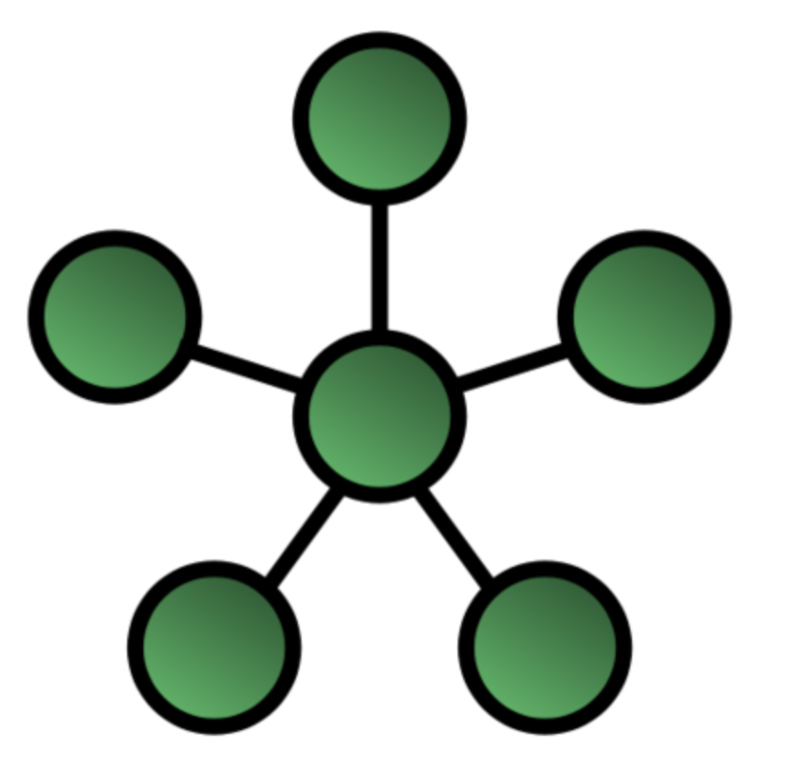
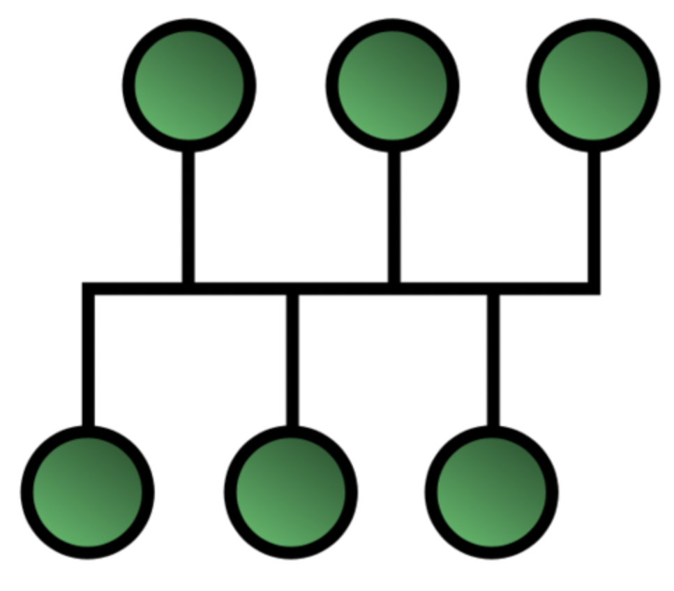
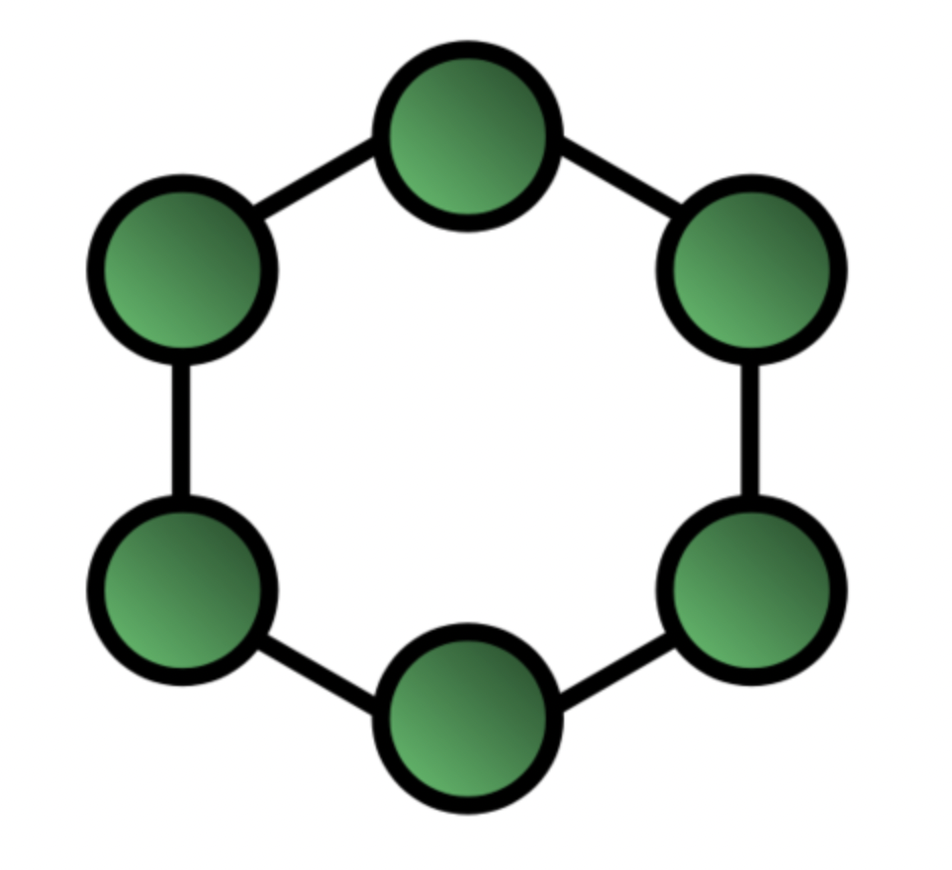
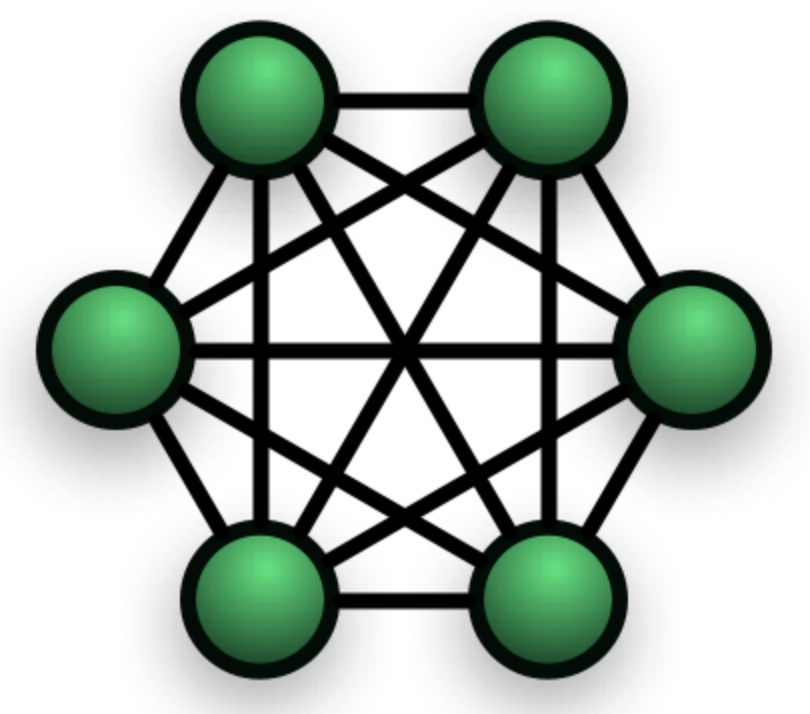
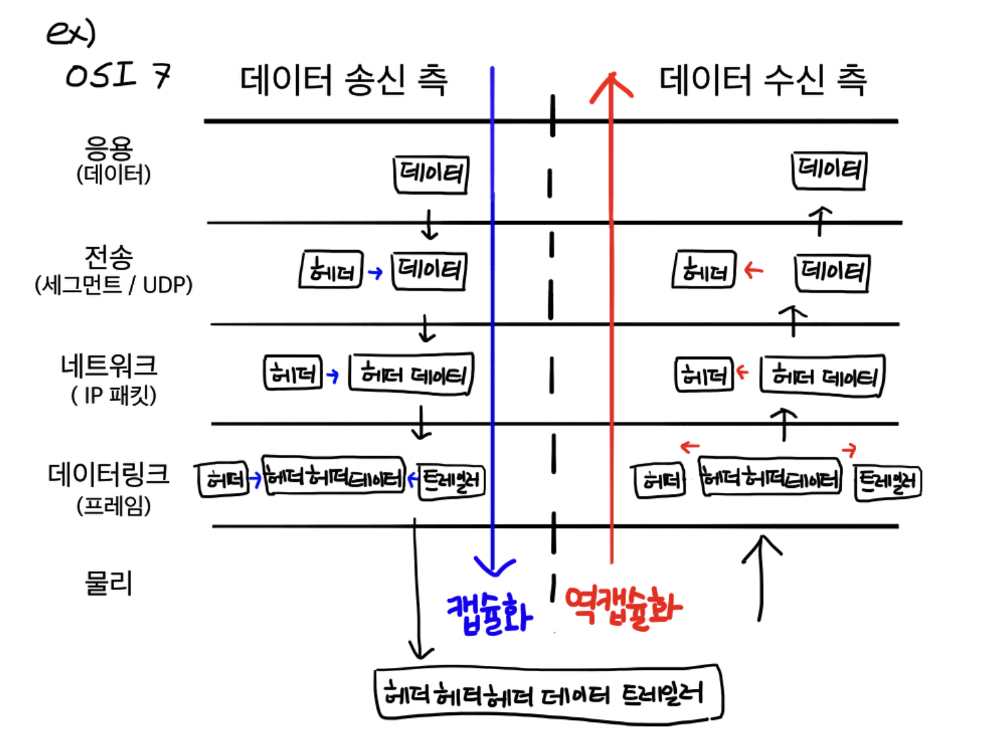
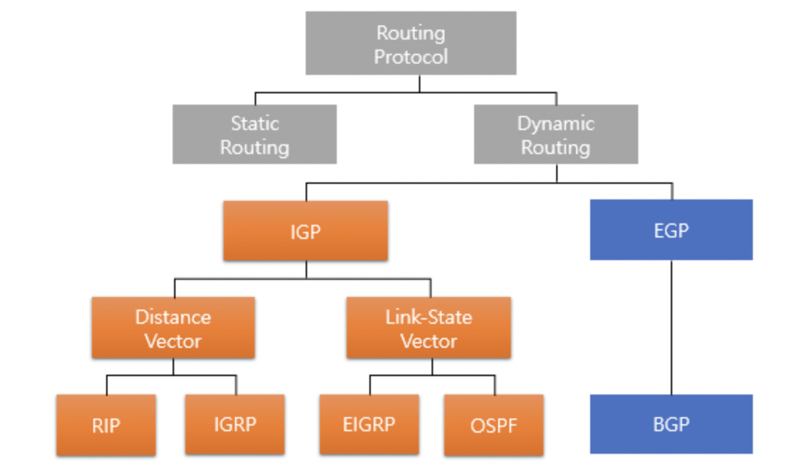

  <h1>🌐 Network 🌐</h1>

> 질문 중 일부는 <strong>[WeareSoft님의 tech-interview](https://github.com/WeareSoft/tech-interview)</strong>를 참고하였으며, 질문에 대한 답변은 직접 작성하였습니다.

---

## Table of Contents

- [TCP/IP의 각 계층을 설명해주세요.](#1)
- [OSI 7계층와 TCP/IP 계층의 차이를 설명해주세요.](#2)
- [Frame, Packet, Segment, Datagram을 비교해주세요.](#3)
- [TCP와 UDP의 차이를 설명해주세요.](#4)
- [TCP와 UDP의 헤더를 비교해주세요.](#5)
- [TCP의 3-way-handshake와 4-way-handshake를 비교 설명해주세요.](#6)
- [TCP의 연결 설정 과정(3단계)과 연결 종료 과정(4단계)이 단계가 차이나는 이유가 무엇인가요?](#7)
- [만약 Server에서 FIN 플래그를 전송하기 전에 전송한 패킷이 Routing 지연이나 패킷 유실로 인한 재전송 등으로 인해 FIN 패킷보다 늦게 도착하는 상황이 발생하면 어떻게 될까요?](#8)
- [초기 Sequence Number인 ISN을 0부터 시작하지 않고 난수를 생성해서 설정하는 이유가 무엇인가요?](#9)
- [HTTP와 HTTPS에 대해서 설명하고 차이점에 대해 설명해주세요.](#10)
- [HTTP 요청/응답 헤더의 구조를 설명해주세요.](#11)
- [HTTP와 HTTPS 동작 과정을 비교해주세요.](#12)
- [CORS가 무엇인가요?](#13)
- [HTTP GET과 POST 메서드를 비교/설명해주세요.](#14)
- [쿠키(Cookie)와 세션(Session)을 설명해주세요.](#15)
- [DNS가 무엇인가요?](#16)
- [REST와 RESTful의 개념을 설명하고 차이를 말해주세요.](#17)
- [소켓(Socket)이 무엇인가요? 자신 있는 언어로 간단히 소켓 생성 예시를 보여주세요.](#18)
- [Socket.io와 WebSocket의 차이를 설명해주세요.](#19)
- [IPv4와 IPv6 차이를 설명해주세요.](#20)
- [MAC Address가 무엇인가요?](#21)
- [라우터와 스위치, 허브의 차이를 설명해주세요.](#22)
- [SMTP가 무엇인가요?](#23)
- [노트북으로 `www.google.com`에 접속을 했습니다. 요청을 보내고 받기까지의 과정을 자세히 설명해주세요.](#24)
- [여러 네트워크 topology에 대해 간단히 소개해주세요.](#25)
- [subnet mask에 대해서 설명해주세요.](#26)
- [data encapsulation이 무엇인가요?](#27)
- [DHCP를 설명해주세요.](#28)
- [routing protocol을 몇 가지 설명해주세요. (ex. link state, distance vector)](#29)
- [이더넷(ethernet)이 무엇인가요?](#30)
- [client와 server의 차이점을 설명해주세요.](#31)
- [delay, timing(jitter), throughput 차이를 설명해주세요.](#32)

---

## #1

#### TCP/IP의 각 계층을 설명해주세요.

#### References

---

## #2

#### OSI 7계층와 TCP/IP 계층의 차이를 설명해주세요.

#### References

---

## #3

#### Frame, Packet, Segment, Datagram을 비교해주세요.

#### References

---

## #4

#### TCP와 UDP의 차이를 설명해주세요.

#### References

---

## #5

#### TCP와 UDP의 헤더를 비교해주세요.

#### References

---

## #6

#### TCP의 3-way-handshake와 4-way-handshake를 비교 설명해주세요.

#### References

---

## #7

#### TCP의 연결 설정 과정(3단계)과 연결 종료 과정(4단계)이 단계가 차이나는 이유가 무엇인가요?

#### References

---

## #8

#### 만약 Server에서 FIN 플래그를 전송하기 전에 전송한 패킷이 Routing 지연이나 패킷 유실로 인한 재전송 등으로 인해 FIN 패킷보다 늦게 도착하는 상황이 발생하면 어떻게 될까요?

#### References

---

## #9

#### 초기 Sequence Number인 ISN을 0부터 시작하지 않고 난수를 생성해서 설정하는 이유가 무엇인가요?

#### References

---

## #10

#### HTTP와 HTTPS에 대해서 설명하고 차이점에 대해 설명해주세요.

#### References

---

## #11

#### HTTP 요청/응답 헤더의 구조를 설명해주세요.

#### References

---

## #12

#### HTTP와 HTTPS 동작 과정을 비교해주세요.

#### References

---

## #13

#### CORS가 무엇인가요?

#### References

---

## #14

#### HTTP GET과 POST 메서드를 비교/설명해주세요.

#### References

---

## #15

#### 쿠키(Cookie)와 세션(Session)을 설명해주세요.

#### References

---

## #16

#### DNS가 무엇인가요?

#### References

---

## #17

#### REST와 RESTful의 개념을 설명하고 차이를 말해주세요.

#### References

---

## #18

#### 소켓(Socket)이 무엇인가요? 자신 있는 언어로 간단히 소켓 생성 예시를 보여주세요.

#### References

---

## #19

#### Socket.io와 WebSocket의 차이를 설명해주세요.

#### References

---

## #20

#### IPv4와 IPv6 차이를 설명해주세요.

#### References

---

## #21

#### MAC Address가 무엇인가요?

#### References

---

## #22

#### 라우터와 스위치, 허브의 차이를 설명해주세요.

#### References

---

## #23

#### SMTP가 무엇인가요?

#### References

---

## #24

#### 노트북으로 `www.google.com`에 접속을 했습니다. 요청을 보내고 받기까지의 과정을 자세히 설명해주세요.

#### References

---

## #25

#### 여러 네트워크 topology에 대해 간단히 소개해주세요.
##### 네트워크 토폴로지
컴퓨터끼리 정보를 교환하고 교류하는 형태를 의미하는 네트워크에서 토폴로지는 컴퓨터들의 특정한 망구성 방식을 의미한다.

하나의 네트워크 구성 방식을 보더라도, 노드와 링크와 같은 물리적 배치로 구분하는 **물리적 토폴로지**와 노드 간의 데이터 흐름으로 구분하는 **논리적 토폴로지**로 네트워크 구성을 각각 판단할 수 있다.

##### Star
중앙에 위치한 메인 노드를 통해 다른 노드와 소통할 수 있는 구조

장점
- 장애 발견이 쉽고 관리가 용이함

단점
- 메인 노드에 장애가 발생하면 전체 네트워크 사용 불가능

    

 

##### Bus
버스라는 공통 배선을 통해 노드들이 연결되어 있어서, 한 노드의 신호가 모든 노드에 전달됨 (타겟 노드만 신호에 반응을 하고 다른 노드는 무시함)

장점
- 노드 추가 및 삭제가 용이
- 한 노드에 장애가 발생해도 다른 노드에 영향을 주지 않음

단점
- 공통 배선의 크기(대역폭)가 제한되어 있으므로 배선에 과부하가 걸릴 경우 네트워크 성능 저하

    

 

##### Ring
각 노드가 양 옆으로 연결된 원형 구조, 단방향으로 신호가 전달됨

장점
- 단방향 구조로 단순하고, 중간에 있는 노드들이 증폭기의 역할을 해줌 (거리 제약 적어짐)

단점
- 노드 추가 및 삭제가 어려움

    

 

##### Mesh
다수의 노드가 서로 연결된 형태 (모두 연결되면 완전 연결형, 일부만 연결되면 부분 연결형)

장점
- 노드의 장애에 영향받지 않으며 유연한 대처가 가능함, 안정적임

단점
- 망 구축 비용이 크고, 노드 추가에도 비용이 많이 듬

    

 

    

 

#### References
- [네트워크 토폴로지 정의 및 종류 - 브릭봇](https://m.blog.naver.com/PostView.naver?isHttpsRedirect=true&blogId=brickbot&logNo=220418950837)
- [토폴로지 - 풍뎅아 공부하자](https://sungks.tistory.com/268)
---

## #26

#### subnet mask에 대해서 설명해주세요.

##### IP 주소와 서브네팅 (subnetting)
IPv4 의 경우 2^(8*4=32) 의 숫자로 주소를 표현하고, 이를 국가, 회사 등 잘게 나눠 어느 영역을 쓰게할 것인지 결정한다.

한정된 자원이기 때문에 효율적으로 노드에 주소를 할당하는게 중요하다. 이를 위해 IP 를 쪼개는, 네트워크 파트 + 호스트 파트로 구성하는 서브네팅을 활용한다.

기본적으로 IP 주소에 따라 5 개의 클래스로 구분된다. 각 클래스에 따라 네트워크 파트와 호스트 파트가 정해진다.

    

 

위와 같은 클래스 구조와 더불어 더욱 효율적인 서브네팅을 위해서 사용하는 방법이 서브넷 마스크이다.

##### 서브넷 마스크 (subnet mask)
할당된 IP 주소는 기본적으로 네트워크 파트와 호스트 파트가 정해져있다. 

효율적인 주소 관리를 위해 내부적으로 호스트 파트를 새로운 네트워크 파트와 호스트 파트로 나눌 수 있다. 이 때 서브넷 마스크를 활용할 수 있다.

만약 C 클래스인 192.12.16.1 IP, 255.255.255.0 서브넷 마스크(호스트 파트)가 할당되었을 때 마지막 8 비트를 1111 0000 으로 구분했다면, 4 비트만큼의 네트워크 파트 (그룹) 4 비트만큼의 호스트 (멤버) 를 할당할 수 있다. 이렇게 된다면 동일 네트워크 간에는 커뮤니케이션이 자유롭지만, 다른 네트워크 간에는 라우터를 거쳐야 커뮤니케이션을 할 수 있다.

#### References
- [IP 주소 및 서브넷 마스크 - 보안전문가가 되자](https://m.blog.naver.com/PostView.naver?isHttpsRedirect=true&blogId=hatesunny&logNo=220790654612)
- [[Network] IP주소 클래스(A,B,C class)란? Limky 삽질 블로그](https://limkydev.tistory.com/168?category=954021)
- [서브네팅 목적 및 개념 - 트레비스의 IT 라이프](https://travislife.tistory.com/53)

---

## #27

#### data encapsulation이 무엇인가요?
data encapsulation 은 데이터를 보내는 송신측에서 데이터를 생성하는 방법으로, 네트워크 계층에서 상위 계층에서부터 하위 계층으로 내려올 때마다 각 계층의 헤더를 붙여 보내는 데이터로 만들어낸다.

반대로 데이터를 받는 수신측에서는 데이터를 받은 후에 계층을 거슬러 올라가면서 헤더를 떼내며 데이터를 파악한다.

    

 

#### References
- [[network] 캡슐화 & 역캡슐화 (encalsulation & decapsulation) - CHAEN](https://ychae-leah.tistory.com/20)
- [[네트워크] TCP/ IP 캡슐화 - jhkang-dev](https://jhkang-tech.tistory.com/20)

---

## #28

#### DHCP를 설명해주세요.
DHCP (Dynamic Host Configuration Protocol) 는 동적으로 IP 주소나 기타 정보들을 관리해주는 프로토콜을 말한다. 관리해야하는 컴퓨터가 많고 이들의 IP 를 모두 직접 할당하고 관리하려면 상당히 복잡하고 시간이 많이들지만, DHCP 를 사용하면 이러한 문제점을 해결할 수  있다.

DHCP 는 UDP 를 사용하여 클라이언트/서버 구조로 통신한다.
그 과정은 아래와 같다.

1. DHCP discover  
: 컴퓨터가 동일 서브넷으로 브로드캐스팅(255.255.255.255) 으로 DHCP 서버를 찾음
2. DHCP offer  
: DHCP 가 사용가능한 IP 주소의 리스트를 컴퓨터에게 전달함
3. DHCP request  
: 컴퓨터가 리스트 중 하나의 IP 주소를 선택하여 서버에 전달
4. DHCP ack  
: DHCP 가 컴퓨터에게 해당 IP 주소를 허락/거절하는 메세지를 전달

##### 장점
- DHCP 서버에서 자동으로 IP 를 관리해주므로 편리함
  - IP 에 변동이 있을 때, DHCP 에만 정보를 입력하면 됨
  - 자동 할당
- 사용중인 컴퓨터에 대해서만 할당하므로 효율적임

##### 단점
- DHCP 서버에 의존하기 때문에 서버가 다운되는 경우 모든 컴퓨터에서 인터넷을 할 수 없음
- 초기 DHCP 세팅 시간 및 트래픽이 큼
- 단말 컴퓨터를 끌 경우, 완전히 주소가 release 될 때 까지 해당 IP 를 사용할 수 없음

#### References
- [DHCP 열심히 정리한 글 :) - Don't forget your time](https://m.blog.naver.com/PostView.naver?isHttpsRedirect=true&blogId=hai0416&logNo=221578608161)
- [DHCP란 그 개념부터 알아보자 - 네트워크보안](https://m.blog.naver.com/PostView.naver?isHttpsRedirect=true&blogId=haionvpn&logNo=40181076143)

---

## #29

#### routing protocol을 몇 가지 설명해주세요. (ex. link state, distance vector)

    

 

패킷을 전달할 때 어느 경로로 갈지 정하는 것을 라우팅이라고 한다.

##### 라우팅 경로 고정 여부
어떤 경로로 라우팅할지를 미리 정해두냐 동적으로 정하냐에 따라 `정적 라우팅`, `동적 라우팅` 으로 구분한다.

##### 내/외부 라우팅
동적 라우팅에서 AS (Auotonomous System, 하나의 네트워크 관리자에 의해 관리되는 네트워크 집단) 를 기준으로 내부적으로 동작하냐, 외부적으로 동작하냐에 따라 `내부 라우팅` (RIP, IGRP, OSPF, EIGRP) 과 `외부 라우팅` (BGP, EGP) 으로 나눈다.

##### 라우팅 테이블 관리
동적 라우팅에서 어떤 방식으로 라우팅 테이블을 관리하느냐에 따라서도 방법이 다르다.
크게 link state, distance vector 방법이 있다.

`distance vector` 방법은 현재 위치 (단말 또는 라우터) 까지의 방향과 거리를 기록한 라우팅 테이블을 인접한 라우터들에게 전달하고 갱신한다.
메모리가 적게 들고 구성이 쉽지만, 전체 테이블 구성 시간이 길어질 수 있고 같은 경로를 반복해서 도는 루핑 문제가 발생할 수 있다. (EIGRP 는 루핑이 발생하지 않음)

`link state` 방법은 인접 테이블에 정보를 전달했으면 또 그 인접 테이블들은 이 정보를 바로 인접 테이블로 넘겨, 직접 연결되지 않은 모든 라우터들도 현재 정보를 파악할 수 있다.
정확하고 루핑 문제가 없다는 장점이 있어 대형 네트워크에서 많이 사용되지만 메모리의 소모와 cpu 로드가 많다는 단점이 있다.

#### References
- [라우팅 프로토콜(Routing Protocol) - 자비스가 필요해](https://needjarvis.tistory.com/159)
- [라우팅 프로토콜 종류 - 개발일기](https://developmentdiary.tistory.com/494)
- [라우팅 프로토콜의 종류 - 청년 고득녕](https://m.blog.naver.com/PostView.naver?isHttpsRedirect=true&blogId=nackji80&logNo=221431942767)
- [디스턴스 벡터/링크 스테이트 - 이삭이의 토스트 공장](https://toastfactory.tistory.com/286)

---

## #30

#### 이더넷(ethernet)이 무엇인가요?
이더넷은 근거리 유선 통신을 위해 사용되는 네트워킹 방법으로 [CSMA/CD](https://security-nanglam.tistory.com/193)프로토콜을 사용한다.  IEEE 802.3 에 표준으로 정의되었다.

장점
- 적은 용량의 데이터를 보낼 때 성능이 좋다.
- 비용이 적고 관리가 쉽다.
- 구조가 단순하다.

단점
- 캐리어 충돌이 발생할 수 있다.
- 충돌이 발생하면 지연이 생긴다.

*CSMA/CD 방법을 간략히 말하자면 버스 구조로 통신을 하는데 캐리어라는 네트워킹 상의 신호를 감지하여 캐리어가 없으면 정보를 보내는 방식이다. 

#### References
- [[네트워크] 이더넷(Ethernet) - DevOwen](https://devowen.com/351)
- [[네트워크] 이더넷? _ Ethernet에 대하여 - 낭람](https://security-nanglam.tistory.com/192)

---

## #31

#### client와 server의 차이점을 설명해주세요.

#### References

---

## #32

#### delay, timing(jitter), throughput 차이를 설명해주세요.

#### References

---
