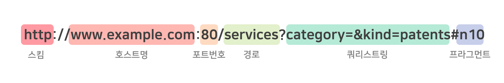

<div align='center'>
  <h1>🌐 Network 🌐</h1>
</div>

> 질문 중 일부는 <strong>[WeareSoft님의 tech-interview](https://github.com/WeareSoft/tech-interview)</strong>를 참고하였으며, 질문에 대한 답변은 직접 작성하였습니다.

---

## Table of Contents

- [TCP/IP의 각 계층을 설명해주세요.](#1)
- [OSI 7계층와 TCP/IP 계층의 차이를 설명해주세요.](#2)
- [Frame, Packet, Segment, Datagram을 비교해주세요.](#3)
- [TCP와 UDP의 차이를 설명해주세요.](#4)
- [TCP와 UDP의 헤더를 비교해주세요.](#5)
- [TCP의 3-way-handshake와 4-way-handshake를 비교 설명해주세요.](#6)
- [TCP의 연결 설정 과정(3단계)과 연결 종료 과정(4단계)이 단계가 차이나는 이유가 무엇인가요?](#7)
- [만약 Server에서 FIN 플래그를 전송하기 전에 전송한 패킷이 Routing 지연이나 패킷 유실로 인한 재전송 등으로 인해 FIN 패킷보다 늦게 도착하는 상황이 발생하면 어떻게 될까요?](#8)
- [초기 Sequence Number인 ISN을 0부터 시작하지 않고 난수를 생성해서 설정하는 이유가 무엇인가요?](#9)
- [HTTP와 HTTPS에 대해서 설명하고 차이점에 대해 설명해주세요.](#10)
- [HTTP 요청/응답 헤더의 구조를 설명해주세요.](#11)
- [HTTP와 HTTPS 동작 과정을 비교해주세요.](#12)
- [CORS가 무엇인가요?](#13)
- [HTTP GET과 POST 메서드를 비교/설명해주세요.](#14)
- [쿠키(Cookie)와 세션(Session)을 설명해주세요.](#15)
- [DNS가 무엇인가요?](#16)
- [REST와 RESTful의 개념을 설명하고 차이를 말해주세요.](#17)
- [소켓(Socket)이 무엇인가요? 자신 있는 언어로 간단히 소켓 생성 예시를 보여주세요.](#18)
- [Socket.io와 WebSocket의 차이를 설명해주세요.](#19)
- [IPv4와 IPv6 차이를 설명해주세요.](#20)
- [MAC Address가 무엇인가요?](#21)
- [라우터와 스위치, 허브의 차이를 설명해주세요.](#22)
- [SMTP가 무엇인가요?](#23)
- [노트북으로 `www.google.com`에 접속을 했습니다. 요청을 보내고 받기까지의 과정을 자세히 설명해주세요.](#24)
- [여러 네트워크 topology에 대해 간단히 소개해주세요.](#25)
- [subnet mask에 대해서 설명해주세요.](#26)
- [data encapsulation이 무엇인가요?](#27)
- [DHCP를 설명해주세요.](#28)
- [routing protocol을 몇 가지 설명해주세요. (ex. link state, distance vector)](#29)
- [이더넷(ethernet)이 무엇인가요?](#30)
- [client와 server의 차이점을 설명해주세요.](#31)
- [delay, timing(jitter), throughput 차이를 설명해주세요.](#32)

---

## #1

#### TCP/IP의 각 계층을 설명해주세요.

#### References

---

## #2

#### OSI 7계층와 TCP/IP 계층의 차이를 설명해주세요.

#### References

---

## #3

#### Frame, Packet, Segment, Datagram을 비교해주세요.

#### References

---

## #4

#### TCP와 UDP의 차이를 설명해주세요.

#### References

---

## #5

#### TCP와 UDP의 헤더를 비교해주세요.

#### References

---

## #6

#### TCP의 3-way-handshake와 4-way-handshake를 비교 설명해주세요.

#### References

---

## #7

#### TCP의 연결 설정 과정(3단계)과 연결 종료 과정(4단계)이 단계가 차이나는 이유가 무엇인가요?

#### References

---

## #8

#### 만약 Server에서 FIN 플래그를 전송하기 전에 전송한 패킷이 Routing 지연이나 패킷 유실로 인한 재전송 등으로 인해 FIN 패킷보다 늦게 도착하는 상황이 발생하면 어떻게 될까요?

#### References

---

## #9

#### 초기 Sequence Number인 ISN을 0부터 시작하지 않고 난수를 생성해서 설정하는 이유가 무엇인가요?

#### References

---

## #10

#### HTTP와 HTTPS에 대해서 설명하고 차이점에 대해 설명해주세요.

#### References

---

## #11

#### HTTP 요청/응답 헤더의 구조를 설명해주세요.

#### References

---

## #12

#### HTTP와 HTTPS 동작 과정을 비교해주세요.

#### References

---

## #13

#### CORS가 무엇인가요?

#### References

---

## #14

#### HTTP GET과 POST 메서드를 비교/설명해주세요.

#### References

---

## #15

#### 쿠키(Cookie)와 세션(Session)을 설명해주세요.

#### References

---

## #16

#### DNS가 무엇인가요?

#### References

---

## #17

#### REST와 RESTful의 개념을 설명하고 차이를 말해주세요.

`REST`란 **Re**presentational **S**tate **T**ransfer의 약자로, <u>URI로 자원(Resource)을 명시하고 HTTP 메서드를 통해 해당 자원에 대한 CRUD 연산을 적용하는 것</u>을 의미한다.

여기서의 자원은 데이터베이스의 정보를 말한다. 하지만 클라이언트가 직접 데이터베이스에 접속해 변경하는 것은 매우 위험한 방식 이다. 그래서 이를 막기 위해 REST API를 사용하는 것이다. **클라이언트**가 서버에 데이터를 조회·생성·삭제·업데이트를 하겠다고 <u>HTTP 메서드로 요청</u>을 하면 **서버**는 로직에 따라 데이터베이스에 접근하여 <u>요청을 처리</u>한다.

`RESTful`은 REST 아키텍처로 구현된 웹 서비스를 나타내기 위한 용어로, "REST API를 제공하는 웹 서비스는 RESTful하다"처럼 사용된다.

> **HTTP 메서드 종류**

요청의 종류에 다라 다른 HTTP 메서드를 사용하는데 주로 사용하는 대표적인 메서드는 다음과 같다.

| 메서드 | 역할                                                    |
| :----: | :------------------------------------------------------ |
|  GET   | 데이터를 조회한다.                                      |
|  POST  | 데이터를 등록한다. 인증 작업을 거칠 때 사용하기도 한다. |
| DELETE | 데이터를 삭제한다.                                      |
|  PUT   | 데이터를 새 정보로 통째로 업데이트할 때 사용한다.       |
| PATCH  | 데이터의 특정 필드를 수정할 때 사용한다.                |

> **URI란?**

URI는 Uniform Resource Identifier의 약자로, 자원을 식별자로 취급하여 나타내는 주소를 말한다. URI의 종류로 URL과 URN이 있다. URI는 일반적으로 다음과 같은 형식을 갖고 있다.



#### References

- [[Network] REST란? REST API란? RESTful이란? - HeeJeong Kwon](https://gmlwjd9405.github.io/2018/09/21/rest-and-restful.html)
- [REST API 제대로 알고 사용하기 - NHN Cloud Meetup!](https://meetup.toast.com/posts/92)
- [URL과 URI의 의미와 차이점 (Difference between URL & URI) - Lael's World](https://blog.lael.be/post/61)
- [통합 자원 식별자 - 위키피디아](https://ko.wikipedia.org/wiki/%ED%86%B5%ED%95%A9_%EC%9E%90%EC%9B%90_%EC%8B%9D%EB%B3%84%EC%9E%90)
- [21장. 백엔드 프로그래밍: Node.js의 Koa 프레임워크 - 리액트를 다루는 기술](http://www.yes24.com/Product/Goods/79260300)

---

## #18

#### 소켓(Socket)이 무엇인가요? 자신 있는 언어로 간단히 소켓 생성 예시를 보여주세요.

소켓(Socket)이란 Application 프로세스와 end-to-end 통신을 제공하는 Transport 프로토콜 사이의 문을 말한다. 즉, Application에서 Transport 프로토콜을 쓰기 위한 API를 말한다.

소켓은 크게 UDP와 TCP 두종 종류로 분류할 수 있다. 자세한 내용은 [#4. TCP와 UDP의 차이를 설명해주세요.](#4)을 참고!

파이썬으로 TCP에서의 소켓과 UDP에서의 소켓 생성 코드를 구현하면 다음과 같다. 소켓을 생성한다고 바로 통신을 할 수 없으며 실제 통신을 하기 위해는 바인딩, 연결 등 추가 작업이 필요하다.

> **TCP**

- TCP Client

```python
from socket import *

server_name = "example.com"
server_port = 1234

client_socket = socket(AF_INET, SOCKET_STREAM)  # 소켓 생성
client_socket.connect((server_name, server_port)) # 서버에 연결 요청
```

- TCP Server

```python
from socket import *

server_port = 1234

server_socket = socket(AF_INET, SOCKET_STREAM)  # 소켓 생성
server_socket.bind(('', server_port)) # 소켓에 주소 바인딩
server_socket.listen(1) # 클라이언트 연결 대기

(client_socket, client_address) = server_socket.accept()  # 클라이언트 연결 수락
```

> **UDP**

- UDP Client

```python
from socket import *

server_name = "example.com"
server_port = 1234

client_socket = socket(AF_INET, SOCK_DGRAM) # 소켓 생성
```

- UDP Server

```python
from socket import *

server_port = 1234
server_socket = socket(AF_NET, SOCK_DGRAM)  # 소켓 생성
server_socket.bind(('', server_port)) # 소켓에 주소 바인딩
```

#### References

- [Chapter 2. Application Layer - Computer Networking: A Top-Down Approach](http://www.yes24.com/Product/Goods/24320296?OzSrank=2)

---

## #19

#### Socket.io와 WebSocket의 차이를 설명해주세요.

#### References

---

## #20

#### IPv4와 IPv6 차이를 설명해주세요.

#### References

---

## #21

#### MAC Address가 무엇인가요?

#### References

---

## #22

#### 라우터와 스위치, 허브의 차이를 설명해주세요.

#### References

---

## #23

#### SMTP가 무엇인가요?

#### References

---

## #24

#### 노트북으로 `www.google.com`에 접속을 했습니다. 요청을 보내고 받기까지의 과정을 자세히 설명해주세요.

#### References

---

## #25

#### 여러 네트워크 topology에 대해 간단히 소개해주세요.

#### References

---

## #26

#### subnet mask에 대해서 설명해주세요.

#### References

---

## #27

#### data encapsulation이 무엇인가요?

#### References

---

## #28

#### DHCP를 설명해주세요.

#### References

---

## #29

#### routing protocol을 몇 가지 설명해주세요. (ex. link state, distance vector)

#### References

---

## #30

#### 이더넷(ethernet)이 무엇인가요?

#### References

---

## #31

#### client와 server의 차이점을 설명해주세요.

#### References

---

## #32

#### delay, timing(jitter), throughput 차이를 설명해주세요.

#### References

---

```

```
