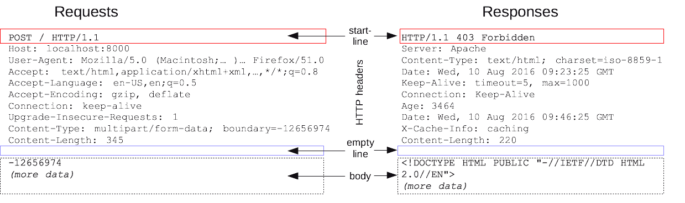

  <h1>🌐 Network 🌐</h1>

> 질문 중 일부는 <strong>[WeareSoft님의 tech-interview](https://github.com/WeareSoft/tech-interview)</strong>를 참고하였으며, 질문에 대한 답변은 직접 작성하였습니다.

---

## Table of Contents

- [TCP/IP의 각 계층을 설명해주세요.](#1)
- [OSI 7계층와 TCP/IP 계층의 차이를 설명해주세요.](#2)
- [Frame, Packet, Segment, Datagram을 비교해주세요.](#3)
- [TCP와 UDP의 차이를 설명해주세요.](#4)
- [TCP와 UDP의 헤더를 비교해주세요.](#5)
- [TCP의 3-way-handshake와 4-way-handshake를 비교 설명해주세요.](#6)
- [TCP의 연결 설정 과정(3단계)과 연결 종료 과정(4단계)이 단계가 차이나는 이유가 무엇인가요?](#7)
- [만약 Server에서 FIN 플래그를 전송하기 전에 전송한 패킷이 Routing 지연이나 패킷 유실로 인한 재전송 등으로 인해 FIN 패킷보다 늦게 도착하는 상황이 발생하면 어떻게 될까요?](#8)
- [초기 Sequence Number인 ISN을 0부터 시작하지 않고 난수를 생성해서 설정하는 이유가 무엇인가요?](#9)
- [HTTP와 HTTPS에 대해서 설명하고 차이점에 대해 설명해주세요.](#10)
- [HTTP 요청/응답 헤더의 구조를 설명해주세요.](#11)
- [HTTP와 HTTPS 동작 과정을 비교해주세요.](#12)
- [CORS가 무엇인가요?](#13)
- [HTTP GET과 POST 메서드를 비교/설명해주세요.](#14)
- [쿠키(Cookie)와 세션(Session)을 설명해주세요.](#15)
- [DNS가 무엇인가요?](#16)
- [REST와 RESTful의 개념을 설명하고 차이를 말해주세요.](#17)
- [소켓(Socket)이 무엇인가요? 자신 있는 언어로 간단히 소켓 생성 예시를 보여주세요.](#18)
- [Socket.io와 WebSocket의 차이를 설명해주세요.](#19)
- [IPv4와 IPv6 차이를 설명해주세요.](#20)
- [MAC Address가 무엇인가요?](#21)
- [라우터와 스위치, 허브의 차이를 설명해주세요.](#22)
- [SMTP가 무엇인가요?](#23)
- [노트북으로 `www.google.com`에 접속을 했습니다. 요청을 보내고 받기까지의 과정을 자세히 설명해주세요.](#24)
- [여러 네트워크 topology에 대해 간단히 소개해주세요.](#25)
- [subnet mask에 대해서 설명해주세요.](#26)
- [data encapsulation이 무엇인가요?](#27)
- [DHCP를 설명해주세요.](#28)
- [routing protocol을 몇 가지 설명해주세요. (ex. link state, distance vector)](#29)
- [이더넷(ethernet)이 무엇인가요?](#30)
- [client와 server의 차이점을 설명해주세요.](#31)
- [delay, timing(jitter), throughput 차이를 설명해주세요.](#32)

---

## #1

#### TCP/IP의 각 계층을 설명해주세요.

#### References

---

## #2

#### OSI 7계층와 TCP/IP 계층의 차이를 설명해주세요.

#### References

---

## #3

#### Frame, Packet, Segment, Datagram을 비교해주세요.

#### References

---

## #4

#### TCP와 UDP의 차이를 설명해주세요.

#### References

---

## #5

#### TCP와 UDP의 헤더를 비교해주세요.

#### References

---

## #6

#### TCP의 3-way-handshake와 4-way-handshake를 비교 설명해주세요.

#### References

---

## #7

#### TCP의 연결 설정 과정(3단계)과 연결 종료 과정(4단계)이 단계가 차이나는 이유가 무엇인가요?

#### References

---

## #8

#### 만약 Server에서 FIN 플래그를 전송하기 전에 전송한 패킷이 Routing 지연이나 패킷 유실로 인한 재전송 등으로 인해 FIN 패킷보다 늦게 도착하는 상황이 발생하면 어떻게 될까요?

#### References

---

## #9

#### 초기 Sequence Number인 ISN을 0부터 시작하지 않고 난수를 생성해서 설정하는 이유가 무엇인가요?

Connection을 맺을 때 사용하는 포트는 유한 범위 내에서 사용하고 시간이 지남에 따라 재사용된다.

따라서 두 통신 호스트가 과거에 사용된 포트 번호 쌍을 사용하는 가능성이 존재한다.

서버 측에서는 패킷의 SYN을 보고 패킷을 구분하게 되는데 난수가 아닌 순차적인 number가 전송된다면 이전의 connection으로부터 오는 패킷으로 인식할 수 있다.

이러한 문제가 발생할 가능성을 줄이기 위해서 난수로 ISN을 설정하는 것이다.

#### References

- [[Network] (TCP) 3-way-handshake & 4-way-handshake - 어제보다 한 걸음 더](https://k39335.tistory.com/21)

---

## #10

#### HTTP와 HTTPS에 대해서 설명하고 차이점에 대해 설명해주세요.

- <strong>HTTP(Hyper Text Transfer Protocol)</strong>

HTTP란 **서버/클라이언트 모델을 따라 데이터를 주고받기 위한 프로토콜**이다. 즉, HTTP는 인터넷에서 하이퍼텍스트를 교환하기 위한 통신 규약으로, 80번 포트를 사용하고 있다. 따라서 HTTP 서버가 80번 포트에서 요청을 기다리고 있으며, 클라이언트는 80번 포트로 요청을 보내게 된다.

HTTP는 1989년 팀 버너스 리(Tim Berners Lee)에 의해 처음 설계되었으며, WWW(World-Wide-Web) 기반에서 세계적인 정보를 공유하는데 큰 역할을 하였다.
  

- <strong>HTTPS(Hyper Text Transfer Protocol Secure)</strong>

HTTPS는 **HTTP에 데이터 암호화가 추가된 프로토콜**이다. HTTPS는 HTTP와 다르게 433번 포트를 사용하며, 네트워크 상에서 중간에 제3자가 정보를 볼 수 없도록 공개키 암호화를 지원하고 있다.
  

HTTP는 암호화가 추가되지 않았기 때문에 보안에 취약한 반면, HTTPS는 안전하게 데이터를 주고받을 수 있다. 하지만 HTTPS를 이용하면 암호화/복호화의 과정이 필요하기 때문에 HTTP보다 속도가 느리다. 또한 HTTPS는 인증서를 발급하고 유지하기 위한 추가 비용이 발생하다.

개인 정보와 같은 민감한 데이터를 주고받아야 한다면 HTTPS를 이용해야 하지만, 단순한 정보 조회 등 만을 처리하고 있다면 HTTP를 이용하면 된다.

#### References

- [[Web] HTTP와 HTTPS 및 차이점 - MangKyu's Diary](https://mangkyu.tistory.com/98)

---

## #11

#### HTTP 요청/응답 헤더의 구조를 설명해주세요.

- **HTTP Request Headers**
  - 해당 request에 대한 추가 정보(addtional information)를 담고 있는 부분
    - ex. request 메세지 body의 총 길이(Content-Length) 등
  - Key:Value 값으로 되어있다.
    - ex. HOST:google.com → Key=HOST, Value=google.com
  - Headers는 크게 3부분으로 나뉜다(general headers, request headers, entity headers)
  - 자주 사용되는 header 정보에는 다음이 있다.
    - Host
      - 요청이 전송되는 target의 host url
        - ex. google.com
    - User-Agent
      - 요청을 보내는 클라이언트의 대한 정보
        - ex. 웹브라우저에 대한 정보
    - Accept
      - 해당 요청이 받을 수 있는 응답(response) 타입
    - Connection
      - 해당 요청이 끝난후에 클라이언트와 서버가 계속해서 네트워크 컨넥션을 유지 할것인지 아니면 끊을것인지에 대해 지시하는 부분
    - Content-Type
      - 해당 요청이 보내는 메세지 body의 타입
        - ex. JSON을 보내면 application/json
    - Content-Length
      - 메세지 body의 길이
  

- **HTTP Response Headers**
  - Response의 headers와 동일하다.
  - 다만 response에서만 사용되는 header 값들이 있다.
    - ex. User-Agent 대신에 Server 헤더가 사용된다.
  

  
    
  

#### References

- [HTTP 구조 및 핵심 요소 - teddybearjung](https://velog.io/@teddybearjung/HTTP-%EA%B5%AC%EC%A1%B0-%EB%B0%8F-%ED%95%B5%EC%8B%AC-%EC%9A%94%EC%86%8C)
- [[네트워크] http 란 - 인생의 로그캣](https://noahlogs.tistory.com/34?category=827412)
- [HTTP 메시지 - MDN Web Docs](https://developer.mozilla.org/ko/docs/Web/HTTP/Messages)

---

## #12

#### HTTP와 HTTPS 동작 과정을 비교해주세요.

  
    
  
    
  

#### References

- [HTTP & DNS & TCP 정의 및 동작원리 - lkh's](https://lkhlkh23.tistory.com/76)
- [[Web 기초] HTTP 통신 과정 - MYSTERICO BLOG](https://mysterico.tistory.com/29)
- [[Web 기초] HTTPS의 동작 원리 (feat. 와이어샤크) - MYSTERICO BLOG](https://mysterico.tistory.com/30)

---

## #13

#### CORS가 무엇인가요?

교차 출처 리소스 공유(Cross-Origin Resource Sharing, CORS)는 추가 HTTP 헤더를 사용하여, 한 출처에서 실행 중인 웹 애플리케이션이 다른 출처의 선택한 자원에 접근할 수 있는 권한을 부여하도록 브라우저에 알려주는 체제이다.

> CORS 체제는 브라우저와 서버 간의 안전한 교차 출처 요청 및 데이터 전송을 지원한다. 최신 브라우저는 XMLHttpRequest 또는 Fetch와 같은 API에서 CORS를 사용하여 교차 출처 HTTP 요청의 위험을 완화 한다.

- 웹 애플리케이션은 리소스가 자신의 출처(도메인, 프로토콜, 포트)와 다를 때 교차 출처 HTTP 요청을 실행한다.
- 브라우저는 보안 상의 이유로, 스크립트에서 시작한 교차 출처 HTTP 요청을 제한한다.
  - ex) domain-a.com ↔ domain-b.com 간의 요청은 CORS 정책 위반으로, 브라우저에서 요청을 제한
- 따라서 다른 출처의 리소스를 불러오기 위해서는, 그 출처에서 교차 출처 리소스 공유에 대한 헤더(CORS)를 응답시 반환 해주어야 한다.

**CORS의 동작 원리**

1. 기본적으로 웹은 다른 출처의 리소스를 요청할 때는 HTTP 프로토콜을 사용하여 요청을 하는데, 이때 브라우저는 요청 헤더 (request header)에 `Origin` 필드에 요청을 보내는 출처를 담아 전송한다.
2. 서버는 요청에 대한 응답을 하는데, 응답 헤더(response header)에 `Access-Control-Allow-Origin`이라는 값에 '이 리소스를 접근하는 것이 허용된 출처'를 내려준다.
이후 응답을 받은 브라우저는 자신이 보냈던 요청의 Origin과 서버가 보내준 응답의 `Access-Control-Allow-Origin`을 비교해 본 후 이 응답이 유효한 응답인지 아닌지를 결정한다.
  

  

#### References

- [CORS란 무엇인가 ? - pilyeooong.log](https://velog.io/@pilyeooong/CORS%EB%9E%80-%EB%AC%B4%EC%97%87%EC%9D%B8%EA%B0%80)
- [교차 출처 리소스 공유 - 위키백과](https://ko.wikipedia.org/wiki/%EA%B5%90%EC%B0%A8_%EC%B6%9C%EC%B2%98_%EB%A6%AC%EC%86%8C%EC%8A%A4_%EA%B3%B5%EC%9C%A0)

---

## #14

#### HTTP GET과 POST 메서드를 비교/설명해주세요.

- **GET**

GET은 클라이언트에서 서버로 어떠한 리소스로부터 정보를 요청하기 위해 사용되는 메서드이다.

GET을 통한 요청은 URL 주소 끝에 파라미터로 포함되어 전송되며, 이 부분을 쿼리 스트링(query string)이라고 부른다.

방식은 URL 끝에 `?`를 붙이고 그다음 `변수명1=값1&변수명2=값2...` 형식으로 이어 붙이면 된다.

> ex. `www.example.com/show?name1=value1&name2=value2`

서버에서는 `name1`과 `name2`라는 파라미터 명으로 각각 `value1`과 `value2`의 파라미터 값을 전달받을 수 있다.

- GET의 특징
  - GET 요청은 캐시가 가능하다. 
    - GET을 통해 서버에 리소스를 요청할 때 웹 캐시가 요청을 가로채 서버로부터 리소스를 다시 다운로드하는 대신 리소스의 복사본을 반환한다. HTTP 헤더에서 cache-control 헤더를 통해 캐시 옵션을 지정할 수 있다.
  - GET 요청은 브라우저 히스토리에 남는다.
  - GET 요청은 북마크 될 수 있다.
  - GET 요청은 길이 제한이 있다.
  - GET 요청은 중요한 정보를 다루면 안 된다.
  - GET은 데이터를 요청할 때만 사용된다.
  
 
- **POST**

POST는 클라이언트에서 서버로 리소스를 생성하거나 업데이트하기 위해 데이터를 보낼 때 사용되는 메서드이다.

POST는 전송할 데이터를 HTTP 메시지 body 부분에 담아서 서버로 보낸다.(body의 타입은 Content-Type 헤더에 따라 결정된다.)

GET에서 URL의 파라미터로 보냈던 `name1=value1&name2=value2`가 body에 담겨 보내진다 생각하면 된다.

POST로 데이터를 전송할 때 길이 제한이 따로 없어 용량이 큰 데이터를 보낼 때 사용하거나 GET처럼 데이터가 외부적으로 드러나는 건 아니라서 보안이 필요한 부분에 많이 사용된다. 

POST를 통한 데이터 전송은 보통 HTML form을 통해 서버로 전송된다. 

- POST의 특징
  - POST 요청은 캐시 되지 않는다.
  - POST 요청은 브라우저 히스토리에 남지 않는다.
  - POST 요청은 북마크 되지 않는다.
  - POST 요청은 데이터 길이에 제한이 없다.
  

- **차이점**
  - 사용목적: GET은 서버의 리소스에서 데이터를 요청할 때, POST는 서버의 리소스를 새로 생성하거나 업데이트할 때 사용한다.
  - 요청에 body 유무: GET은 URL 파라미터에 요청하는 데이터를 담아 보내기 때문에 HTTP 메시지에 body가 없다. POST는 body에 데이터를 담아 보내기 때문에 당연히 HTTP 메시지에 body가 존재한다.
  - 멱등성(idempotent): GET 요청은 멱등이며, POST는 멱등이 아니다.

> **멱등이란?** 멱등의 사전적 정의는 연산을 여러 번 적용하더라도 결과가 달라지지 않는 성질을 의미한다. GET은 리소스를 조회한다는 점에서 여러 번 요청하더라도 응답이 똑같을 것이다. 반대로 POST는 리소스를 새로 생성하거나 업데이트할 때 사용되기 때문에 멱등이 아니라고 볼 수 있다.(POST 요청이 발생하면 서버가 변경될 수 있다.)

#### References

- [[네트워크] get 과 post 의 차이 - 인생의 로그캣](https://noahlogs.tistory.com/35)

---

## #15

#### 쿠키(Cookie)와 세션(Session)을 설명해주세요.

- <strong>쿠키(Cookie)</strong>

쿠키는 클라이언트(브라우저) 로컬에 저장되는 키와 값이 들어있는 작은 데이터 파일이다.

사용자 인증이 유효한 시간을 명시할 수 있으며, 유효 시간이 정해지면 브라우저가 종료되어도 인증이 유지된다는 특징이 있다.

쿠키는 클라이언트의 상태 정보를 로컬에 저장했다가 참조한다.

Response Header에 Set-Cookie 속성을 사용하면 클라이언트에 쿠키를 만들 수 있다.

쿠키는 사용자가 따로 요청하지 않아도 브라우저가 Request 시에 Request Header를 넣어서 자동으로 서버에 전송한다.

- 쿠키의 동작 방식
  1. 클라이언트가 페이지를 요청
  2. 서버에서 쿠키를 생성
  3. HTTP 헤더에 쿠키를 포함 시켜 응답
  4. 브라우저가 종료되어도 쿠키 만료 기간이 있다면 클라이언트에서 보관
  5. 같은 요청을 할 경우 HTTP 헤더에 쿠키를 함께 보냄
  6. 서버에서 쿠키를 읽어 이전 상태 정보를 변경할 필요가 있을 때 쿠키를 업데이트하여 변경된 쿠키를 HTTP 헤더에 포함시켜 응답
  

- <strong>세션(Session)</strong>

세션은 쿠키를 기반하고 있지만, 사용자 정보 파일을 브라우저에 저장하는 쿠키와 달리 세션은 서버 측에서 관리한다.

서버에서는 클라이언트를 구분하기 위해 세션 ID를 부여하며 웹 브라우저가 서버에 접속해서 브라우저를 종료할 때까지 인증 상태를 유지한다.

접속 시간에 제한을 두어 일정 시간 응답이 없다면 정보가 유지되지 않게 설정이 가능하다.

사용자에 대한 정보를 서버에 두기 때문에 쿠키보다 보안에 좋지만, 사용자가 많아질수록 서버 메모리를 많이 차지하게 된다.

즉 동접자 수가 많은 웹 사이트인 경우 서버에 과부하를 주게 되므로 성능 저하의 요인이 된다.

클라이언트가 Request를 보내면, 해당 서버의 엔진이 클라이언트에게 유일한 ID를 부여하는 데 이것이 세션 ID다.

- 세션의 동작 방식
  1. 클라이언트가 서버에 접속 시 세션 ID를 발급
  2. 클라이언트는 세션 ID에 대해 쿠키를 사용해서 저장하고 가지고 있음
  3. 클라이언트는 서버에 요청할 때, 이 쿠키의 세션 ID를 서버에 전달해서 사용
  4. 서버는 세션 ID를 전달받아서 별다른 작업 없이 세션 ID로 세션에 있는 클라언트 정보를 가져옴
  5. 클라이언트 정보를 가지고 서버 요청을 처리하여 클라이언트에게 응답
  

- **차이점**
  - 사용자의 정보가 저장되는 위치
    - 쿠키는 서버의 자원을 전혀 사용하지 않으며, 세션은 서버의 자원을 사용한다.
  - 보안
    - 쿠키는 클라이언트 로컬에 저장되기 때문에 변질되거나 request에서 스니핑 당할 우려가 있어서 보안에 취약하다.
    - 세션은 쿠키를 이용해서 세션 ID만 저장하고 그것으로 구분해서 서버에서 처리하기 때문에 비교적 보안성이 좋다.
  - 라이프 사이클
    - 쿠키는 만료시간이 있지만 파일로 저장되기 때문에 브라우저를 종료해도 계속해서 정보가 남아 있을 수 있다. 또한 만료 기간을 넉넉하게 잡아두면 쿠키 삭제를 할 때까지 유지될 수도 있다.
    - 반면에 세션도 만료시간을 정할 수 있지만 브라우저가 종료되면 만료시간에 상관없이 삭제된다.
  - 속도
    - 쿠키에 정보가 있기 때문에 서버에 요청 시 속도가 빠르다.
    - 세션은 정보가 서버에 있기 때문에 처리가 요구되어 비교적 느린 속도를 낸다.

세션은 서버의 자원을 사용하기 때문에 무분별하게 만들다 보면 서버의 메모리가 감당할 수 없어질 수가 있고 속도가 느려질 수 있기 때문에 쿠키를 함께 사용한다.

#### References

- [쿠키와 세션 개념 - 라이언 서버](https://interconnection.tistory.com/74)

---

## #16

#### DNS가 무엇인가요?

- **Domain**

모든 네트워크 통신에는 고유의 주소, 즉 IP 주소가 필요하다.

이때 통신을 주고받는 주체가 되는 네트워크에 연결되어 있는 모든 장치들을 host라고 한다.

IP는 사람이 이해하고 기억하기 어렵기 때문에 이를 위해서 각 ip에 부여한 이름이 도메인이다.

예를 들어 210.89.164.90의 도메인은 naver.com이다.
  

- <strong>DNS(Domain Name Service)</strong>

DNS(Domain Name Server 또는 Domain Name Service 모두를 의미)를 통해 네트워크 통신은 IP 주소를 사용하는데 어떻게 도메인을 가지고 통신을 할 수 있다.

DNS는 숫자로 이루어진 IP 주소와 일정한 형식을 가진 도메인을 서로 매핑 시키고 정보를 가지고 있다.

예를 들어 네이버에 접속하기 위해 주소창에 도메인(naver.com)을 입력하면, 컴퓨터는 해당 도메인이 연결된 네임서버(DNS)로 가서 서버 IP를 요청한다.

요청받은 네임 서버는 해당 도메인과 연결되어 있는 서버 IP(210.89.164.90)를 찾은 후, 컴퓨터에게 알려준다.

이처럼 도메인에 연결된 서버의 주소를 찾아주는 역할이 네임서버(DNS)이다.
  

- **브라우저가 도메인에 해당하는 IP를 찾는 순서**
1. local cache 안에 검색한 해당 도메인의 IP가 있는지 확인한다. 이미 해당 도메인을 방문한 적이 있다면 컴퓨터가 해당 도메인의 IP를 기억하고 있으므로 그것을 사용한다.
2. 만약 캐시에 없다면 컴퓨터 내부에 파일 형태로 존재하는 hosts 파일을 검색해서 찾는다. 해당 hosts 파일에 특정 도메인과 IP를 매핑 시켜놓으면 해당 도메인은 지정한 IP로 이동한다.
3. 만약 위의 경우에서 도메인에 대한 IP를 찾지 못하면 최종적으로 DNS를 검색한다.
  

  

#### References

- [[Network] 네트워크 기초 개념 - 차근차근 개발로그](https://hyuntaekhong.github.io/blog/Network/#3-dnsdomain-name-service)
- [Domain, DNS란 무엇인가 - 매일의 공부 기록](https://study-recording.tistory.com/8)

---

## #17

#### REST와 RESTful의 개념을 설명하고 차이를 말해주세요.

#### References

---

## #18

#### 소켓(Socket)이 무엇인가요? 자신 있는 언어로 간단히 소켓 생성 예시를 보여주세요.

#### References

---

## #19

#### Socket.io와 WebSocket의 차이를 설명해주세요.

#### References

---

## #20

#### IPv4와 IPv6 차이를 설명해주세요.

#### References

---

## #21

#### MAC Address가 무엇인가요?

#### References

---

## #22

#### 라우터와 스위치, 허브의 차이를 설명해주세요.

#### References

---

## #23

#### SMTP가 무엇인가요?

#### References

---

## #24

#### 노트북으로 `www.google.com`에 접속을 했습니다. 요청을 보내고 받기까지의 과정을 자세히 설명해주세요.

#### References

---

## #25

#### 여러 네트워크 topology에 대해 간단히 소개해주세요.

#### References

---

## #26

#### subnet mask에 대해서 설명해주세요.

#### References

---

## #27

#### data encapsulation이 무엇인가요?

#### References

---

## #28

#### DHCP를 설명해주세요.

#### References

---

## #29

#### routing protocol을 몇 가지 설명해주세요. (ex. link state, distance vector)

#### References

---

## #30

#### 이더넷(ethernet)이 무엇인가요?

#### References

---

## #31

#### client와 server의 차이점을 설명해주세요.

#### References

---

## #32

#### delay, timing(jitter), throughput 차이를 설명해주세요.

#### References

---
