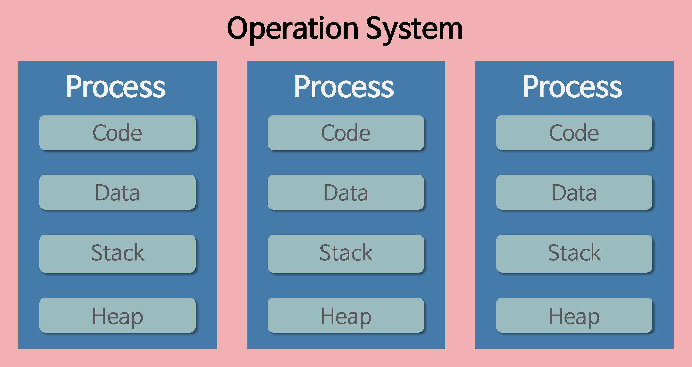
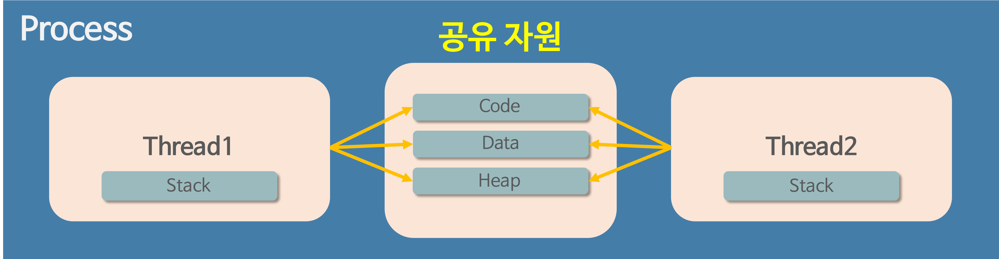

  <h1>🖥️ Operating System 🖥️</h1>

> 질문 중 일부는 <strong>[WeareSoft님의 tech-interview](https://github.com/WeareSoft/tech-interview)</strong>를 참고하였으며, 질문에 대한 답변은 직접 작성하였습니다.

---

## Table of Contents

- [프로세스와 스레드의 차이(Process vs Thread)를 알려주세요.](#1)
- [멀티 프로세스 대신 멀티 스레드를 사용하는 이유를 설명해주세요.](#2)
- [캐시의 지역성에 대해 설명해주세요.](#3)
- [Thread-safe에 대해 설명해주세요. (hint: critical section)](#4)
- [뮤텍스와 세마포어의 차이를 설명해주세요.](#5)
- [스케줄러가 무엇이고, 단기/중기/장기로 나누는 기준에 대해 설명해주세요.](#6)
- [CPU 스케줄러인 FCFS, SJF, SRTF, Priority Scheduling, RR에 대해 간략히 설명해주세요.](#7)
- [동기와 비동기의 차이를 설명해주세요.](#8)
- [메모리 관리 전략에는 무엇이 있는지 간략히 설명해주세요.](#9)
- [가상 메모리에 대해 설명해주세요.](#10)
- [교착상태(데드락, Deadlock)의 개념과 조건을 설명해주세요.](#11)
- [사용자 수준 스레드와 커널 수준 스레드의 차이를 설명해주세요.](#12)
- [외부 단편화와 내부 단편화에 대해 설명해주세요.](#13)
- [Context Switching이 무엇인지 설명하고 과정을 나열해주세요.](#14)
- [Swapping에 대해 설명해주세요.](#15)

---

## #1

#### 프로세스와 스레드의 차이(Process vs Thread)를 알려주세요.

<strong>프로그램(Program)</strong>이란 파일이 저장 장치에 저장되어 있지만 메모리에 올라가 있지 않은 정적인 상태를 말한다.

<strong>프로세스(Process)</strong>란 운영체제로부터 시스템 자원을 할당받는 작업의 단위로 메모리에 올라와 실행되고 있는 프로그램의 인스턴스(독립적인 개체)를 의미한다.

> **할당받는 시스템 자원의 예**
- CPU 시간
- 운영되기 위해 필요한 주소 공간
- Code, Data, Stack, Heap의 구조로 되어 있는 독립된 메모리 영역

> **프로세스의 특징**
- 프로세스는 각각 독립된 메모리 영역(Code, Data, Stack, Heap의 구조)을 할당받는다.
- 프로세스당 최소 1개의 스레드(메인 스레드)를 가지고 있다.
- 각 프로세스는 별도의 주소 공간에서 실행되며, 한 프로세스는 다른 프로세스의 변수나 자료구조에 접근할 수 없다.
- 한 프로세스가 다른 프로세스의 자원에 접근하려면 프로세스 간의 통신(IPC, Inter-Process Communication)을 사용해야 한다.

  

 

<strong>스레드(Thread)</strong>란 프로세스가 할당받은 자원을 이용하는 실행의 단위로 프로세스와는 다른 더 작은 실행 단위 개념이다. 스레드는 프로세스의 코드에 정의된 절차에 따라 실행되는 특정한 수행 경로이다.

> **스레드의 특징**
- 스레드는 프로세스 내에서 각각 Stack 영역만 따로 할당받고 Code, Data, Heap 영역은 공유한다.
- 스레드는 한 프로세스 내에서 동작되는 여러 실행의 흐름으로, 프로세스 내의 주소 공간이나 자원들(힙 공간 등)을 같은 프로세스 내에 스레드끼리 공유하면서 실행된다.
- 같은 프로세스 안에 있는 여러 스레드들은 같은 힙 공간을 공유한다. 반면에 프로세스는 다른 프로세스의 메모리에 직접 접근할 수 없다.
- 각각의 스레드는 별도의 레지스터와 스택을 갖고 있지만, 힙 메모리는 서로 읽고 쓸 수 있다.
- 한 스레드가 프로세스 자원을 변경하면, 다른 이웃 스레드(sibling thread)도 그 변경 결과를 즉시 볼 수 있다.

  

#### References

- [[OS] 프로세스와 스레드의 차이 - Heee's Development Blog](https://gmlwjd9405.github.io/2018/09/14/process-vs-thread.html)
- [프로세스와 스레드의 차이 - 개발장](https://velog.io/@raejoonee/%ED%94%84%EB%A1%9C%EC%84%B8%EC%8A%A4%EC%99%80-%EC%8A%A4%EB%A0%88%EB%93%9C%EC%9D%98-%EC%B0%A8%EC%9D%B4)

---

## #2

#### 멀티 프로세스 대신 멀티 스레드를 사용하는 이유를 설명해주세요.

**멀티 프로세스**란 하나의 응용프로그램을 여러 개의 프로세스로 구성하여 각 프로세스가 하나의 작업을 처리하도록 하는 것이다.
- 장점
  - 여러 개의 자식 프로세스 중 하나에 문제가 발생하면 그 자식 프로세스만 죽는 것 이상으로 다른 영향이 확산되지 않는다.
- 단점
  - Context Switching에서의 오버헤드
    - Context Switching 과정에서 캐시 메모리 초기화 등 무거운 작업이 진행되고 많은 시간이 소모되는 등의 오버헤드가 발생하게 된다.
    - 프로세스는 각각의 독립된 메모리 영역을 할당받았기 때문에 프로세스 사이에서 공유하는 메모리가 없어, Context Switching가 발생하면 캐시에 있는 모든 데이터를 모두 리셋하고 다시 캐시 정보를 불러와야 한다.
  - 프로세스 사이의 어렵고 복잡한 통신 기법(IPC)
    - 프로세스는 각각의 독립된 메모리 영역을 할당받았기 때문에 하나의 프로그램에 속하는 프로세스들 사이의 변수를 공유할 수 없다.

> **Context Switching**

CPU에서 여러 프로세스를 돌아가면서 작업을 처리하는 데 이 과정을 Context Switching라 한다. 동작 중인 프로세스가 대기를 하면서 해당 프로세스의 상태(Context)를 보관하고, 대기하고 있던 다음 순서의 프로세스가 동작하면서 이전에 보관했던 프로세스의 상태를 복구하는 작업을 말한다.

**멀티 스레드**란 하나의 응용프로그램을 여러 개의 스레드로 구성하고 각 스레드로 하여금 하나의 작업을 처리하도록 하는 것이다. 윈도우, 리눅스 등 많은 운영체제들이 멀티 프로세싱을 지원하고 있지만 멀티 스레드를 기본으로 하고 있다. 웹 서버는 대표적인 멀티 스레드 응용 프로그램이다.
- 장점
  - 시스템 자원 소모 감소(자원의 효율성 증대)
    - 프로세스를 생성하여 자원을 할당하는 시스템 콜이 줄어들어 자원을 효율적으로 관리할 수 있다.
  - 시스템 처리량 증가(처리 비용 감소)
    - 스레드 간 데이터를 주고받는 것이 간단해지고 시스템 자원 소모가 줄어들게 된다.
    - 스레드 사이의 작업량이 작아 Context Switching이 빠르다.
  - 간단한 통신 방법으로 인한 프로그램 응답 시간 단축
    - 스레드는 프로세스 내의 Stack 영역을 제외한 모든 메모리를 공유하기 때문에 통신의 부담이 적다.
- 단점
  - 주의 깊은 설계가 필요하다.
  - 디버깅이 까다롭다.
  - 단일 프로세스 시스템의 경우 효과를 기대하기 어렵다.
  - 다른 프로세스에서 스레드를 제어할 수 없다.(프로세스 밖에서 스레드 각각을 제어할 수 없다.)
  - 멀티 스레드의 경우 자원 공유의 문제가 발생한다.(동기화 문제)
  - 하나의 스레드에 문제가 발생하면 전체 프로세스가 영향을 받는다.

> <strong>동기화 문제(Synchronization Issue)</strong>

멀티 스레드를 사용하면 각각의 스레드 중 어떤 것이 어떤 순서로 실행될지 그 순서를 알 수 없다. 만약 A 스레드가 어떤 자원을 사용하다가 B 스레드로 제어권이 넘어간 후 B 스레드가 해당 자원을 수정했을 때, 다시 제어권을 받은 A 스레드가 해당 자원에 접근하지 못하거나 바뀐 자원에 접근하게 되는 오류가 발생할 수 있다.

이처럼 여러 스레드가 함께 전역 변수를 사용할 경우 발생할 수 있는 충돌을 동기화 문제라고 한다.

> **멀티 프로세스 대신 멀티 스레드를 사용하는 이유**

1. 자원의 효율성 증대

프로세스 간의 Context Switching 시 단순히 CPU 레지스터 교체뿐만 아니라 RAM과 CPU 사이의 캐시 메모리에 대한 데이터까지 초기화되므로 오버헤드가 발생한다. 멀티 프로세스로 실행되는 작업을 멀티 스레드로 실행할 경우, **프로세스를 생성하여 자원을 할당하는 시스템 콜이 줄어들어** 자원을 효율적으로 관리할 수 있다.

스레드는 프로세스 내의 메모리를 공유하기 때문에 독립적인 프로세스와 달리 스레드 간 데이터를 주고받는 것이 간단해지고 시스템 자원 소모가 줄어들게 된다.

2. 처리 비용 감소 및 응답 시간 단축

스레드는 Stack 영역을 제외한 모든 메모리를 공유하기 때문에 프로세스 간의 통신(IPC)보다 스레드 간의 통신의 비용이 적으므로 작업들 간의 통신의 부담이 줄어든다.

Context Switching 시 스레드는 Stack 영역만 처리하기 때문에 프로세스 간의 전환 속도보다 스레드 간의 전환 속도가 빠르다.

#### References

- [[OS] 프로세스와 스레드의 차이 - Heee's Development Blog](https://gmlwjd9405.github.io/2018/09/14/process-vs-thread.html)
- [프로세스와 스레드의 차이 - 개발장](https://velog.io/@raejoonee/%ED%94%84%EB%A1%9C%EC%84%B8%EC%8A%A4%EC%99%80-%EC%8A%A4%EB%A0%88%EB%93%9C%EC%9D%98-%EC%B0%A8%EC%9D%B4)

---

## #3

#### 캐시의 지역성에 대해 설명해주세요.

**캐시 메모리**는 CPU의 처리 속도와 메모리의 속도 차이로 인한 병목현상을 완화하기 위해 사용하는 고속 버퍼 메모리이다. 주기억장치에 있는 데이터를 액세스하려면 배교적 오랜 시간이 걸리게 되는데 이를 줄이기 위해 데이터를 빠르게 액세스할 수 있도록 중간에 캐시 메모리를 두는 것이다. 주기억장치 내에서 자주 읽고 쓰는 데이터의 일부를 캐시 메모리에 불러와 속도 차이를 줄이고, 주기억장치와 CPU 간 신호 교환에 이용되는 Memory Bandwith를 I/O 사용에 집중할 수 있게 만든다.

캐시 메모리는 `적중률(Hit rate)`을 극대화하기 위해 데이터 `지역성(Locality)의 원리`를 사용한다. 지역성의 전제조건으로는 프로그램은 모든 코드나 데이터를 균등하게 액세스하지 않는다는 특성을 기본으로 한다. 즉, `지역성(Locality)`이란 기억 장치 내의 정보를 균일하게 액세스하는 것이 아닌 어느 한순간에 특정 부분을 집중적으로 참조하는 특성이다.

> <strong>적중률(Hit rate)</strong>

캐시 메모리가 있는 컴퓨터 시스템은 CPU가 메모리에 접근하기 전 먼저 캐시 메모리에서 원하는 데이터의 존재 여부를 확인한다. 이때 필요한 데이터가 있는 경우를 적중(hit), 없는 경우를 실패(miss)라고 한다.

**요청한 데이터를 캐시 메모리에서 찾을 확률**을 <strong>적중률(hit rate)</strong>이라고 한다.

캐시 메모리의 성능은 적중률에 의해 결정된다.

  

 

**데이터 지역성**은 대표적으로 `시간적 지역성(Temporal Locality)`, `공간적 지역성(Spatial Locality)`, `순차적 지역성(Sequential)`으로 나뉜다.

<strong>시간적 지역성(temporal locality)</strong>: CPU가 한 번 참조한 데이터는 다시 참조할 가능성이 높다.

<strong>공간적 지역성(spatial locality)</strong>: CPU가 참조한 데이터와 인접한 데이터 역시 참조될 가능성이 높다.

<strong>순차적 지역성(sequential locality)</strong>: 분기가 발생하지 않는 한 명령어는 메모리에 저장된 순서대로 인출/실행된다.

지역성은 어디까지나 경향에 대한 것이므로 항상 캐시의 높은 적중률을 보장해 주지는 않는다.

#### References

- [[OS] 캐시(Cache) ? - 어제보다 한 걸음 더](https://k39335.tistory.com/38)
- [캐시(Cache) 메모리와 지역성::하드웨어 - 제이붐](https://junboom.tistory.com/34)
- [캐시 - 위키백과](https://ko.wikipedia.org/wiki/%EC%BA%90%EC%8B%9C)
- [캐시 메모리(cache memory)의 개요 정리 - 코알라알락's BLOG](https://zion830.tistory.com/46)

---

## #4

#### Thread-safe에 대해 설명해주세요. (hint: critical section)

#### References

---

## #5

#### 뮤텍스와 세마포어의 차이를 설명해주세요.

#### References

---

## #6

#### 스케줄러가 무엇이고, 단기/중기/장기로 나누는 기준에 대해 설명해주세요.

#### References

---

## #7

#### CPU 스케줄러인 FCFS, SJF, SRTF, Priority Scheduling, RR에 대해 간략히 설명해주세요.

#### References

---

## #8

#### 동기와 비동기의 차이를 설명해주세요.

#### References

---

## #9

#### 메모리 관리 전략에는 무엇이 있는지 간략히 설명해주세요.

#### References

---

## #10

#### 가상 메모리에 대해 설명해주세요.

#### References

---

## #11

#### 교착상태(데드락, Deadlock)의 개념과 조건을 설명해주세요.

#### References

---

## #12

#### 사용자 수준 스레드와 커널 수준 스레드의 차이를 설명해주세요.

#### References

---

## #13

#### 외부 단편화와 내부 단편화에 대해 설명해주세요.

#### References

---

## #14

#### Context Switching이 무엇인지 설명하고 과정을 나열해주세요.

#### References

---

## #15

#### Swapping에 대해 설명해주세요.

#### References

---
