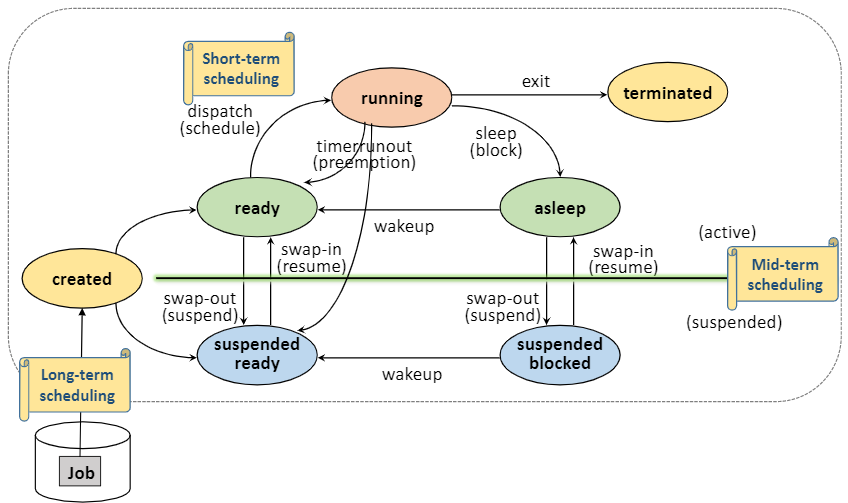

<div align='center'>
  <h1>🖥️ Operating System 🖥️</h1>
</div>

> 질문 중 일부는 <strong>[WeareSoft님의 tech-interview](https://github.com/WeareSoft/tech-interview)</strong>를 참고하였으며, 질문에 대한 답변은 직접 작성하였습니다.

---

## Table of Contents

- [프로세스와 스레드의 차이(Process vs Thread)를 알려주세요.](#1)
- [멀티 프로세스 대신 멀티 스레드를 사용하는 이유를 설명해주세요.](#2)
- [캐시의 지역성에 대해 설명해주세요.](#3)
- [Thread-safe에 대해 설명해주세요. (hint: critical section)](#4)
- [뮤텍스와 세마포어의 차이를 설명해주세요.](#5)
- [스케줄러가 무엇이고, 단기/중기/장기로 나누는 기준에 대해 설명해주세요.](#6)
- [CPU 스케줄러인 FCFS, SJF, SRTF, RR, Priority Scheduling에 대해 간략히 설명해주세요.](#7)
- [동기와 비동기의 차이를 설명해주세요.](#8)
- [메모리 관리 전략에는 무엇이 있는지 간략히 설명해주세요.](#9)
- [가상 메모리에 대해 설명해주세요.](#10)
- [교착상태(데드락, Deadlock)의 개념과 조건을 설명해주세요.](#11)
- [사용자 수준 스레드와 커널 수준 스레드의 차이를 설명해주세요.](#12)
- [외부 단편화와 내부 단편화에 대해 설명해주세요.](#13)
- [Context Switching이 무엇인지 설명하고 과정을 나열해주세요.](#14)
- [Swapping에 대해 설명해주세요.](#15)

---

## #1

#### 프로세스와 스레드의 차이(Process vs Thread)를 알려주세요.

#### References

---

## #2

#### 멀티 프로세스 대신 멀티 스레드를 사용하는 이유를 설명해주세요.

#### References

---

## #3

#### 캐시의 지역성에 대해 설명해주세요.

#### References

---

## #4

#### Thread-safe에 대해 설명해주세요. (hint: critical section)

`스레드 안전(Thread-safe)`이란 <u>멀티 스레드 프로그래밍에서 일반적으로 어떤 함수나 변수, 객체를 여러 스레드가 동시에 접근해도 프로그램 실행에 문제가 없음</u>을 뜻한다. 즉, 멀티 스레드 환경에서 여러 쓰레드가 동시에 동일한 코드를 실행시켰을 때 올바른 결과를 얻는 것을 말한다.

```python
import threading
from threading import Thread

def increase_count():
    global count
    for _ in range(1000000):
        count += 1
    print("현재 스레드:", threading.current_thread().name)
    print("스레드 count:", count)


if __name__=="__main__":
    count = 0

    # 스레드 생성
    thread_a = Thread(target=increase_count, name="thread a")
    thread_b = Thread(target=increase_count, name="thread b")

    # 스레드 실행
    thread_a.start()
    thread_b.start()

    # 스레드 종료
    thread_a.join()
    thread_b.join()

    print("최종 count:", count)
```

다음은 스레드 안전하지 않은 경우의 코드이다. 사용자가 원하는 결과는 스레드가 함수를 실행한 수에 1000000을 곱한 값이 count의 값이 되는 것이다. 하지만 다음 코드를 실행하면, count는 2000000가 아닌 1448523이 나온다. (실행할 때마다 값이 달라진다)

왜 그럴까? 바로 <u>두 스레드가 count 변수를 공유하고 있기 때문</u>이다. 이 때 공유 자원에 접근하는 코드 영역을 `임계 영역(critical section)`이라고 하며, 둘 이상의 프로세스가 동시에 임계 영역에 접근하는 것을 막는 것을 `상호 배제(mutual exclusion)`라고 한다.

#### References

- [스레드 안전 - 위키백과](https://ko.wikipedia.org/wiki/%EC%8A%A4%EB%A0%88%EB%93%9C_%EC%95%88%EC%A0%84)
- [[OS] Lecture 6. Process Synchronization and Mutual Exclusion (1/7) - Introduction / 운영체제 강의 - HPC Lab. KOREATECH](https://www.youtube.com/watch?v=wdaf2gy83uU&list=PLBrGAFAIyf5rby7QylRc6JxU5lzQ9c4tN&index=12&ab_channel=HPCLab.KOREATECHHPCLab.KOREATECH)

---

## #5

#### 뮤텍스와 세마포어의 차이를 설명해주세요.

#### References

---

## #6

#### 스케줄러가 무엇이고, 단기/중기/장기로 나누는 기준에 대해 설명해주세요.

시스템 내에는 여러 개의 프로세스가 존재한다. 이 때 시간(time)과 공간(space) 즉, <u>자원을 할당할 프로세스를 선택</u>해야 하는데, 이 역할을 맡은 것을 `스케줄러`라고 한다.

스케줄러의 목적은 **시스템 성능 향상**이며 대표적인 시스템 성능 지표로 응답시간(response time), 작업 처리량(throughput), 자원 활용도(resource utilization)이 있다. **목적에 따라 다양한 성능 지표를 고려**하여 스케줄러를 선택한다.

스케줄러는 <u>발생하는 빈도와 할당하는 자원</u>에 따라 **장기/중기/단기 스케줄러**로 나눌 수 있다.

`장기 스케줄러(Long-term Scheduler)`는 시스템에 제출할 작업을 결정하는 Job Scheduling(Job → created)에서 사용하며, 시스템 내에 프로세스 수를 조절한다. 이 때 중요한 것은 CPU든 I/O든 모두 써서 효율성을 높이기 위해서 I/O bounded와 compute-bounded 프로세스들을 잘 섞어서 선택해야 한다.

`중기 스케줄러(Mid-term Scheduler)`는 메모리 할당을 결정하는 Memory Allocation(suspended ready → ready)에서 사용한다.

`단기 스케줄러(Short-term Scheduler)`는 프로세서를 할당한 프로세스를 결정하는 Process Scheduling(ready → running)에서 사용하며, 가장 빈번하게 발생하므로 매우 빨라야 한다.

> **응답시간 vs 작업 처리량 vs 자원 활용도**

- `응답시간(response time)`: 작업 요청으로부터 응답을 받을 때까지의 시간
- `작업 처리량(throughput)`: 단위 시간 동안 완료된 작업의 수
- `자원 활용도(resource time)`: 주어진 시간동안 자원이 활용된 시간

> **I/O Bounded 프로세스 vs Compute-bounded 프로세스**

- `I/O Bounded 프로세스`: I/O 대기시간이 긴 프로세스
- `Compute-bounded 프로세스`: CPU 사용시간이 긴 프로세스

> **스케줄링의 단계**

<div align='center'>

</div>
<br/>

#### References

- [[OS] Lecture 5. Process Scheduling (1/4) / 운영체제 강의 - HPC Lab. KOREATECH](https://www.youtube.com/watch?v=_gNeoGQx-Tc&list=PLBrGAFAIyf5rby7QylRc6JxU5lzQ9c4tN&index=8&ab_channel=HPCLab.KOREATECHHPCLab.KOREATECH)

---

## #7

#### CPU 스케줄러인 FCFS, SJF, SRTF, RR, Priority Scheduling에 대해 간략히 설명해주세요.

> **스케줄링 정책**

스케줄링 정책(scheduling policy)에 따라 스케줄러를 **선점/비선점**과 **정적/동적 우선순위**로 나눌 수 있다.

- `비선점 스케줄링(Non-preemptive scheduling)`: 할당 받을 자원을 스스로 반납할 때까지 사용한다. 이는 Context Switching 부하가 적다는 장점이 있지만, 잦은 우선순위 역전으로 평균 응답시간이 증가한다는 단점이 있다.

- `선점 스케쥴링(Preemptive Scheduling)`: 타의에 의해 자원을 빼앗길 수 있다. 비선점 스케줄링과 다르게 Context Switching 부하가 크지만, 응답성이 높으므로 real-time system, time-sharing system에 적합하다.

- `정적 우선순위(Static Priority)`: 프로세스 생성 시 결정된 우선순위가 유지된다. 이는 구현을 쉽게 하고, Context Switching이 덜 일어나기 때문에 부하가 적다. 하지만 시스템 환경 변화에 대한 대응이 어렵다.

- `동적 우선순위(Dynamic Priority)`: 프로세스의 상태 변화에 따라 우선순위를 변경한다. 구현이 복잡하지만 시스템 환경 변화에 유연하게 대응이 가능하다.

> **대표적인 스케줄러**

`FCFS(First Come First Service)`는 비선점 스케줄러로, **Ready Queue에 먼저 도착한 프로세스를 먼저 처리**한다. 자원을 효율적으로 사용할 수 있어 일괄 처리 시스템에 적합하다. 하지만 만약 수행시간이 긴 프로세스가 먼저 도착하면 다른 프로세스의 대기시간이 길어지는 Convoy Effect로 인해 평균 응답시간이 길다는 단점이 있다.

`RR(Round Robin)`은 선점 스케줄러로, Ready Queue에 먼저 도착한 프로세스를 처리한다는 점에서 FCFS와 같지만 **자원 사용 시간(time quantum)이 있다는 점**에서 차이가 있다. 프로세스가 할당된 시간이 지나면 자원을 반납하게 하여 특정 프로세스의 자원 독점을 방지한다.

`SJF(Shortest Job First)`는 비선점 스케줄러로, **CPU burst time이 가장 작은 프로세스를 먼저 처리**한다. 가장 실행시간이 적은 프로세스를 먼저 처리하기 때문에 대기 시간을 줄일 수 있지만, 실행시간을 예측한다는 점에서 비현실적이며 계속해서 짧은 프로세스만 처리하므로 긴 프로세스는 뒤로 밀린다는 단점이 있다.

`SRTF(Shortest Remaining Time First)`는 선점 스케줄러로, **잔여 실행 시간이 더 적은 프로세스를 먼저 처리**한다. SJF의 장점을 극대화 했으나, 프로세스 생성 시 총 실행 시간 예측이 필요하고 잔여 시간을 계속 추적해야 해서 ovehead가 크고 구현 및 사용이 비현실적이다.

`Priority Scheduling`은 각 프로세스에 지정된 우선순위를 기준으로 **높은 우선순위를 가진 프로세스를 먼저 처리**한다. 이 방식의 단점은 계속해서 우선순위가 높은 프로세스가 들어오면 그 프로세스를 먼저 처리하므로 낮은 프로세스는 뒤로 밀리는 starvation 문제가 발생한다. 이는 일정 시간 이상 기다리면 프로세스의 우선순위를 높여주는 aging 방식으로 해결할 수 있다.

#### References

- [[OS] Lecture 5. Process Scheduling (2/4) - FCFS, RR / 운영체제 강의 - HPC Lab. KOREATECH](https://www.youtube.com/watch?v=r1JVA7yOPAM&list=PLBrGAFAIyf5rby7QylRc6JxU5lzQ9c4tN&index=9&ab_channel=HPCLab.KOREATECHHPCLab.KOREATECH)
- [[OS] Lecture 5. Process Scheduling (3/4) - SPN, SRTN, HRRN / 운영체제 강의 - HPC Lab. KOREATECH](https://www.youtube.com/watch?v=keY9Wi7scEs&list=PLBrGAFAIyf5rby7QylRc6JxU5lzQ9c4tN&index=10&ab_channel=HPCLab.KOREATECHHPCLab.KOREATECH)
- [CPU Scheduling, Process 이해하기 - 어쩐지 오늘은](https://zzsza.github.io/development/2018/07/29/cpu-scheduling-and-process/)

---

## #8

#### 동기와 비동기의 차이를 설명해주세요.

#### References

---

## #9

#### 메모리 관리 전략에는 무엇이 있는지 간략히 설명해주세요.

#### References

---

## #10

#### 가상 메모리에 대해 설명해주세요.

#### References

---

## #11

#### 교착상태(데드락, Deadlock)의 개념과 조건을 설명해주세요.

#### References

---

## #12

#### 사용자 수준 스레드와 커널 수준 스레드의 차이를 설명해주세요.

#### References

---

## #13

#### 외부 단편화와 내부 단편화에 대해 설명해주세요.

#### References

---

## #14

#### Context Switching이 무엇인지 설명하고 과정을 나열해주세요.

#### References

---

## #15

#### Swapping에 대해 설명해주세요.

#### References

---
