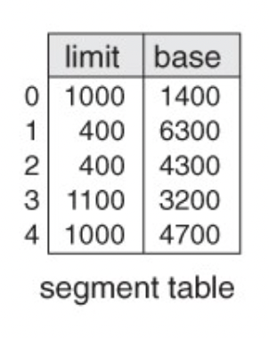
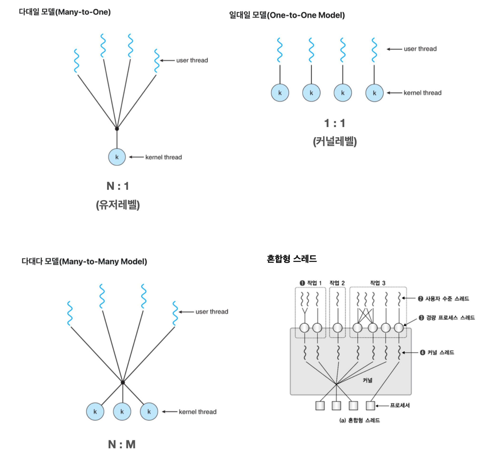
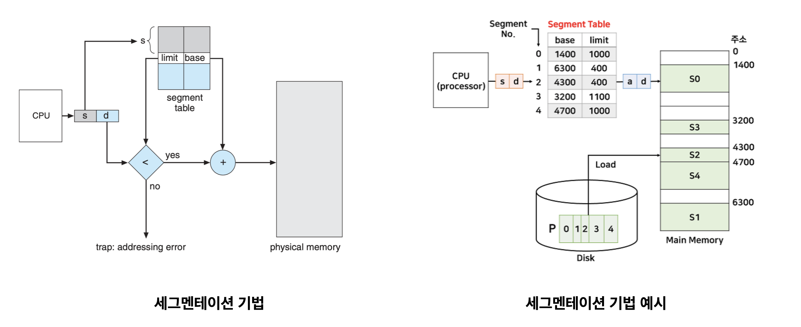
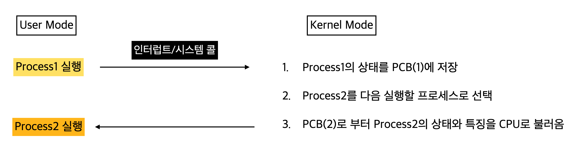

> **질문은 <strong>[WeareSoft님의 tech-interview](https://github.com/WeareSoft/tech-interview)</strong>를 참고하였습니다.**

## Table of Contents

- [프로세스와 스레드의 차이(Process vs Thread)를 알려주세요.](#1)
- [멀티 프로세스 대신 멀티 스레드를 사용하는 이유를 설명해주세요.](#2)
- [캐시의 지역성에 대해 설명해주세요.](#3)
- [Thread-safe에 대해 설명해주세요. (hint: critical section)](#4)
- [뮤텍스와 세마포어의 차이를 설명해주세요.](#5)
- [스케줄러가 무엇이고, 단기/중기/장기로 나누는 기준에 대해 설명해주세요.](#6)
- [CPU 스케줄러인 FCFS, SJF, SRTF, RR, Priority Scheduling에 대해 간략히 설명해주세요.](#7)
- [동기와 비동기의 차이를 설명해주세요.](#8)
- [메모리 관리 전략에는 무엇이 있는지 간략히 설명해주세요.](#9)
- [가상 메모리에 대해 설명해주세요.](#10)
- [교착상태(데드락, Deadlock)의 개념과 조건을 설명해주세요.](#11)
- [사용자 수준 스레드와 커널 수준 스레드의 차이를 설명해주세요.](#12)
- [외부 단편화와 내부 단편화에 대해 설명해주세요.](#13)
- [Context Switching이 무엇인지 설명하고 과정을 나열해주세요.](#14)
- [Swapping에 대해 설명해주세요.](#15)

---

## #1

#### 프로세스와 스레드의 차이(Process vs Thread)를 알려주세요.

<strong>프로그램(Program)</strong>이란 파일이 저장 장치에 저장되어 있지만 메모리에 올라가 있지 않은 정적인 상태를 말한다.

<strong>프로세스(Process)</strong>란 운영체제로부터 시스템 자원을 할당받는 작업의 단위로 메모리에 올라와 실행되고 있는 프로그램의 인스턴스(독립적인 개체)를 의미한다.

> **할당받는 시스템 자원의 예**

- CPU 시간
- 운영되기 위해 필요한 주소 공간
- Code, Data, Stack, Heap의 구조로 되어 있는 독립된 메모리 영역

> **프로세스의 특징**

- 프로세스는 각각 독립된 메모리 영역(Code, Data, Stack, Heap의 구조)을 할당받는다.
- 프로세스당 최소 1개의 스레드(메인 스레드)를 가지고 있다.
- 각 프로세스는 별도의 주소 공간에서 실행되며, 한 프로세스는 다른 프로세스의 변수나 자료구조에 접근할 수 없다.
- 한 프로세스가 다른 프로세스의 자원에 접근하려면 프로세스 간의 통신(IPC, Inter-Process Communication)을 사용해야 한다.


<strong>스레드(Thread)</strong>란 프로세스가 할당받은 자원을 이용하는 실행의 단위로 프로세스와는 다른 더 작은 실행 단위 개념이다. 스레드는 프로세스의 코드에 정의된 절차에 따라 실행되는 특정한 수행 경로이다.

> **스레드의 특징**

- 스레드는 프로세스 내에서 각각 Stack 영역만 따로 할당받고 Code, Data, Heap 영역은 공유한다.
- 스레드는 한 프로세스 내에서 동작되는 여러 실행의 흐름으로, 프로세스 내의 주소 공간이나 자원들(힙 공간 등)을 같은 프로세스 내에 스레드끼리 공유하면서 실행된다.
- 같은 프로세스 안에 있는 여러 스레드들은 같은 힙 공간을 공유한다. 반면에 프로세스는 다른 프로세스의 메모리에 직접 접근할 수 없다.
- 각각의 스레드는 별도의 레지스터와 스택을 갖고 있지만, 힙 메모리는 서로 읽고 쓸 수 있다.
- 한 스레드가 프로세스 자원을 변경하면, 다른 이웃 스레드(sibling thread)도 그 변경 결과를 즉시 볼 수 있다.


#### References

- [[OS] 프로세스와 스레드의 차이 - Heee's Development Blog](https://gmlwjd9405.github.io/2018/09/14/process-vs-thread.html)
- [프로세스와 스레드의 차이 - 개발장](https://velog.io/@raejoonee/%ED%94%84%EB%A1%9C%EC%84%B8%EC%8A%A4%EC%99%80-%EC%8A%A4%EB%A0%88%EB%93%9C%EC%9D%98-%EC%B0%A8%EC%9D%B4)

---

## #2

#### 멀티 프로세스 대신 멀티 스레드를 사용하는 이유를 설명해주세요.

**멀티 프로세스**란 하나의 응용프로그램을 여러 개의 프로세스로 구성하여 각 프로세스가 하나의 작업을 처리하도록 하는 것이다.

- `장점`: 여러 개의 자식 프로세스 중 하나에 문제가 발생하면 그 자식 프로세스만 죽는 것 이상으로 다른 영향이 확산되지 않는다.
- `단점`
  - Context Switching 과정에서 캐시 메모리 초기화 등 무거운 작업이 진행되고 많은 시간이 소모되는 등의 오버헤드가 발생하게 된다.
  - 프로세스는 각각의 독립된 메모리 영역을 할당받았기 때문에 하나의 프로그램에 속하는 프로세스들 사이의 변수를 공유할 수 없다.

**멀티 스레드**란 하나의 응용프로그램을 여러 개의 스레드로 구성하고 각 스레드로 하여금 하나의 작업을 처리하도록 하는 것이다. 윈도우, 리눅스 등 많은 운영체제들이 멀티 프로세싱을 지원하고 있지만 멀티 스레드를 기본으로 하고 있다. 웹 서버는 대표적인 멀티 스레드 응용 프로그램이다.

- `장점`
  - 프로세스를 생성하여 자원을 할당하는 시스템 콜이 줄어들어 자원을 효율적으로 관리할 수 있다.
  - 스레드 간 데이터를 주고받는 것이 간단해지고 시스템 자원 소모가 줄어들게 된다.
  - 스레드 사이의 작업량이 작아 Context Switching이 빠르다.
  - 스레드는 프로세스 내의 Stack 영역을 제외한 모든 메모리를 공유하기 때문에 통신의 부담이 적다.
- `단점`
  - 주의 깊은 설계가 필요하며, 디버깅이 까다롭다.
  - 단일 프로세스 시스템의 경우 효과를 기대하기 어렵다.
  - 프로세스 밖에서 스레드 각각을 제어할 수 없다.
  - 멀티 스레드의 경우 자원 공유의 문제가 발생한다.(동기화 문제)
  - 하나의 스레드에 문제가 발생하면 전체 프로세스가 영향을 받는다.

> **멀티 프로세스 대신 멀티 스레드를 사용하는 이유**

- **자원의 효율성 증대**

프로세스 간의 Context Switching 시 단순히 CPU 레지스터 교체뿐만 아니라 RAM과 CPU 사이의 캐시 메모리에 대한 데이터까지 초기화되므로 오버헤드가 발생한다. 멀티 프로세스로 실행되는 작업을 멀티 스레드로 실행할 경우, **프로세스를 생성하여 자원을 할당하는 시스템 콜이 줄어들어** 자원을 효율적으로 관리할 수 있다.

스레드는 프로세스 내의 메모리를 공유하기 때문에 독립적인 프로세스와 달리 스레드 간 데이터를 주고받는 것이 간단해지고 시스템 자원 소모가 줄어들게 된다.

- **처리 비용 감소 및 응답 시간 단축**

스레드는 Stack 영역을 제외한 모든 메모리를 공유하기 때문에 프로세스 간의 통신(IPC)보다 스레드 간의 통신의 비용이 적으므로 작업들 간의 통신의 부담이 줄어든다.

Context Switching 시 스레드는 Stack 영역만 처리하기 때문에 프로세스 간의 전환 속도보다 스레드 간의 전환 속도가 빠르다.

> **Context Switching**

CPU에서 여러 프로세스를 돌아가면서 작업을 처리하는 데 이 과정을 Context Switching라 한다. 동작 중인 프로세스가 대기를 하면서 해당 프로세스의 상태(Context)를 보관하고, 대기하고 있던 다음 순서의 프로세스가 동작하면서 이전에 보관했던 프로세스의 상태를 복구하는 작업을 말한다.

> <strong>동기화 문제(Synchronization Issue)</strong>

멀티 스레드를 사용하면 각각의 스레드 중 어떤 것이 어떤 순서로 실행될지 그 순서를 알 수 없다. 만약 A 스레드가 어떤 자원을 사용하다가 B 스레드로 제어권이 넘어간 후 B 스레드가 해당 자원을 수정했을 때, 다시 제어권을 받은 A 스레드가 해당 자원에 접근하지 못하거나 바뀐 자원에 접근하게 되는 오류가 발생할 수 있다.

이처럼 여러 스레드가 함께 전역 변수를 사용할 경우 발생할 수 있는 충돌을 동기화 문제라고 한다.

Context Switching에 대한 자세한 내용은 [#14. Context Switching이 무엇인지 설명하고 과정을 나열해주세요.](#14) 참고!

#### References

- [[OS] 프로세스와 스레드의 차이 - Heee's Development Blog](https://gmlwjd9405.github.io/2018/09/14/process-vs-thread.html)
- [프로세스와 스레드의 차이 - 개발장](https://velog.io/@raejoonee/%ED%94%84%EB%A1%9C%EC%84%B8%EC%8A%A4%EC%99%80-%EC%8A%A4%EB%A0%88%EB%93%9C%EC%9D%98-%EC%B0%A8%EC%9D%B4)

---

## #3

#### 캐시의 지역성에 대해 설명해주세요.

**캐시 메모리**는 CPU의 처리 속도와 메모리의 속도 차이로 인한 병목현상을 완화하기 위해 사용하는 고속 버퍼 메모리이다. 주기억장치에 있는 데이터를 액세스하려면 비교적 오랜 시간이 걸리게 되는데 이를 줄이기 위해 데이터를 빠르게 액세스할 수 있도록 중간에 캐시 메모리를 두는 것이다. 주기억장치 내에서 자주 읽고 쓰는 데이터의 일부를 캐시 메모리에 불러와 속도 차이를 줄이고, 주기억장치와 CPU 간 신호 교환에 이용되는 Memory Bandwidth를 I/O 사용에 집중할 수 있게 만든다.

캐시 메모리는 `적중률(Hit rate)`을 극대화하기 위해 데이터 `지역성(Locality)의 원리`를 사용한다. 지역성의 전제조건으로는 프로그램은 모든 코드나 데이터를 균등하게 액세스하지 않는다는 특성을 기본으로 한다. 즉, `지역성(Locality)`이란 기억 장치 내의 정보를 균일하게 액세스하는 것이 아닌 어느 한순간에 특정 부분을 집중적으로 참조하는 특성이다.

**데이터 지역성**은 대표적으로 `시간적 지역성(Temporal Locality)`, `공간적 지역성(Spatial Locality)`, `순차적 지역성(Sequential Locality)`으로 나뉜다.

<strong>시간적 지역성(temporal locality)</strong>: CPU가 한 번 참조한 데이터는 다시 참조할 가능성이 높다.

<strong>공간적 지역성(spatial locality)</strong>: CPU가 참조한 데이터와 인접한 데이터 역시 참조될 가능성이 높다.

<strong>순차적 지역성(sequential locality)</strong>: 분기가 발생하지 않는 한 명령어는 메모리에 저장된 순서대로 인출/실행된다.

지역성은 어디까지나 경향에 대한 것이므로 항상 캐시의 높은 적중률을 보장해 주지는 않는다.

> <strong>적중률(Hit rate)</strong>

캐시 메모리가 있는 컴퓨터 시스템은 CPU가 메모리에 접근하기 전 먼저 캐시 메모리에서 원하는 데이터의 존재 여부를 확인한다. 이때 필요한 데이터가 있는 경우를 적중(hit), 없는 경우를 실패(miss)라고 한다.

**요청한 데이터를 캐시 메모리에서 찾을 확률**을 <strong>적중률(hit rate)</strong>이라고 한다.

캐시 메모리의 성능은 적중률에 의해 결정된다.


#### References

- [[OS] 캐시(Cache) ? - 어제보다 한 걸음 더](https://k39335.tistory.com/38)
- [캐시(Cache) 메모리와 지역성::하드웨어 - 제이붐](https://junboom.tistory.com/34)
- [캐시 - 위키백과](https://ko.wikipedia.org/wiki/%EC%BA%90%EC%8B%9C)
- [캐시 메모리(cache memory)의 개요 정리 - 코알라알락's BLOG](https://zion830.tistory.com/46)

---

## #4

#### Thread-safe에 대해 설명해주세요. (hint: critical section)

`스레드 안전(Thread-safe)`이란 <u>멀티 스레드 프로그래밍에서 일반적으로 어떤 함수나 변수, 객체를 여러 스레드가 동시에 접근해도 프로그램 실행에 문제가 없음</u>을 뜻한다. 즉, 멀티 스레드 환경에서 여러 쓰레드가 동시에 동일한 코드를 실행시켰을 때 올바른 결과를 얻는 것을 말한다.

```python
import threading
from threading import Thread

def increase_count():
    global count
    for _ in range(1000000):
        count += 1


if __name__=="__main__":
    count = 0

    # 스레드 생성
    thread_a = Thread(target=increase_count, name="thread a")
    thread_b = Thread(target=increase_count, name="thread b")

    # 스레드 실행
    thread_a.start()
    thread_b.start()

    # 스레드 종료
    thread_a.join()
    thread_b.join()

    print("최종 count:", count)
```

다음은 스레드 안전하지 않은 경우의 코드이다. 사용자가 원하는 결과는 스레드가 함수를 실행한 수에 1000000을 곱한 값이 count의 값이 되는 것이다. 하지만 다음 코드를 실행하면, count는 2000000가 아닌 1448523이 나온다. (실행할 때마다 값이 달라진다)

왜 그럴까? 바로 <u>두 스레드가 count 변수를 공유하고 있기 때문</u>이다. 이 때 공유 자원에 접근하는 코드 영역을 `임계 영역(critical section)`이라고 하며, 둘 이상의 프로세스가 동시에 임계 영역에 접근하는 것을 막는 것을 `상호 배제(mutual exclusion)`라고 한다.

파이썬에서는 threading 모듈에 있는 Lock 객체로 상호 배제를 시킬 수 있다. 다음 코드를 실행하면 최종 count는 우리가 원했던 2000000이 나온다.

```python
import threading
from threading import Thread

def increase_count():
    lock.acquire()
    global count
    for _ in range(1000000):
        count += 1
    lock.release()


if __name__=="__main__":
    count = 0

    # 스레드 락 생성
    lock = threading.Lock()

    # 스레드 생성
    thread_a = Thread(target=increase_count, name="thread a")
    thread_b = Thread(target=increase_count, name="thread b")

    # 스레드 실행
    thread_a.start()
    thread_b.start()

    # 스레드 종료
    thread_a.join()
    thread_b.join()

    print("최종 count:", count)
```

#### References

- [스레드 안전 - 위키백과](https://ko.wikipedia.org/wiki/%EC%8A%A4%EB%A0%88%EB%93%9C_%EC%95%88%EC%A0%84)
- [[OS] Lecture 6. Process Synchronization and Mutual Exclusion (1/7) - Introduction / 운영체제 강의 - HPC Lab. KOREATECH](https://www.youtube.com/watch?v=wdaf2gy83uU&list=PLBrGAFAIyf5rby7QylRc6JxU5lzQ9c4tN&index=12&ab_channel=HPCLab.KOREATECHHPCLab.KOREATECH)

---

## #5

#### 뮤텍스와 세마포어의 차이를 설명해주세요.

`상호배제(Mutual Exclusion, Mutex)`는 **한 스레드/프로세스가 임계 영역에 있으면 다른 스레드/프로세스가 못 들어오도록 막는 것**을 말한다. 상호배제는 다음과 같이 수행된다.

1. 임계 영역 진입 전 다른 스레드/프로세스가 임계 영역에 안에 있는지 검사한다.
2. 없다면 임계 영역에 진입하여 공유 자원에 접근한다. 있다면 기다린다.
3. 끝나면 임계 영역을 벗어나 다른 프로세스에게 임계 영역에 벗어났음을 알린다.

`세마포어(Semaphore)`는 현재 **공유 자원에 접근할 수 있는 스레드/프로세스의 수를 나타내는 값을 두어 상호배제를 하는 방법**을 말한다. 세마포어는 변수로 음이 아닌 정수 S(여러 개가 존재 가능)와, 함수로 초기화 연산, P(검사), V(증가) 연산이 있으며, 다음과 같이 수행된다.

1. 변수 S를 초기화 연산을 통해 초기화 시킨다.
2. P 함수를 실행하여 S가 0보다 큰지 검사한다.
3. 만약 0보다 크다면, S를 1 감소시키고 임계 영역에 진입하여 공유 자원에 접근한다.
4. 크지 않다면, 스레드/프로세스를 Ready Queue에 넣어 대기시킨다.
5. 임계 영역에서 나온 스레드/프로세스는 V 함수를 실행하여 Ready Queue에 스레드/프로세스가 있는지 체크한다. 만약 있다면, 그 중 1개를 임계 영역에 진입시킨다. 없다면, S를 1 증가시킨다.

#### References

- [뮤텍스(Mutex)와 세마포어(Semaphore)의 차이 - Worth spreading](https://worthpreading.tistory.com/90)
- [[OS] Lecture 6. Process Synchronization and Mutual Exclusion (1/7) - Introduction / 운영체제 강의 - HPC Lab. KOREATECH](https://www.youtube.com/watch?v=wdaf2gy83uU&list=PLBrGAFAIyf5rby7QylRc6JxU5lzQ9c4tN&index=12&ab_channel=HPCLab.KOREATECHHPCLab.KOREATECH)
- [[OS] Lec 6. Process Synchronization and Mutual Exclusion (5/7) - Semaphore (OS supported Sol. 2) - HPC Lab. KOREATECH](https://www.youtube.com/watch?v=CitsUz-Dx7A&list=PLBrGAFAIyf5rby7QylRc6JxU5lzQ9c4tN&index=16&ab_channel=HPCLab.KOREATECHHPCLab.KOREATECH)

---

## #6

#### 스케줄러가 무엇이고, 단기/중기/장기로 나누는 기준에 대해 설명해주세요.

시스템 내에는 여러 개의 프로세스가 존재한다. 이 때 시간(time)과 공간(space) 즉, <u>자원을 할당할 프로세스를 선택</u>해야 하는데, 이 역할을 맡은 것을 `스케줄러`라고 한다.

스케줄러의 목적은 **시스템 성능 향상**이며 대표적인 시스템 성능 지표로 응답시간(response time), 작업 처리량(throughput), 자원 활용도(resource utilization)이 있다. **목적에 따라 다양한 성능 지표를 고려**하여 스케줄러를 선택한다.

스케줄러는 <u>발생하는 빈도와 할당하는 자원</u>에 따라 **장기/중기/단기 스케줄러**로 나눌 수 있다.

`장기 스케줄러(Long-term Scheduler)`는 시스템에 제출할 작업을 결정하는 Job Scheduling(Job → created)에서 사용하며, 시스템 내에 프로세스 수를 조절한다. 이 때 중요한 것은 CPU든 I/O든 모두 써서 효율성을 높이기 위해서 I/O bounded와 compute-bounded 프로세스들을 잘 섞어서 선택해야 한다.

`중기 스케줄러(Mid-term Scheduler)`는 메모리 할당을 결정하는 Memory Allocation(suspended ready → ready)에서 사용한다.

`단기 스케줄러(Short-term Scheduler)`는 프로세서를 할당 받을 프로세스를 결정하는 Process Scheduling(ready → running)에서 사용하며, 가장 빈번하게 발생하므로 매우 빨라야 한다.

> **응답시간 vs 작업 처리량 vs 자원 활용도**

- `응답시간(response time)`: 작업 요청으로부터 응답을 받을 때까지의 시간
- `작업 처리량(throughput)`: 단위 시간 동안 완료된 작업의 수
- `자원 활용도(resource time)`: 주어진 시간동안 자원이 활용된 시간

> **I/O Bounded 프로세스 vs Compute-bounded 프로세스**

- `I/O Bounded 프로세스`: I/O 대기시간이 긴 프로세스
- `Compute-bounded 프로세스`: CPU 사용시간이 긴 프로세스

> **스케줄링의 단계**


#### References

- [[OS] Lecture 5. Process Scheduling (1/4) / 운영체제 강의 - HPC Lab. KOREATECH](https://www.youtube.com/watch?v=_gNeoGQx-Tc&list=PLBrGAFAIyf5rby7QylRc6JxU5lzQ9c4tN&index=8&ab_channel=HPCLab.KOREATECHHPCLab.KOREATECH)

---

## #7

#### CPU 스케줄러인 FCFS, SJF, SRTF, RR, Priority Scheduling에 대해 간략히 설명해주세요.

> **스케줄링 정책**

스케줄링 정책(scheduling policy)에 따라 스케줄러를 **선점/비선점**과 **정적/동적 우선순위**로 나눌 수 있다.

- `비선점 스케줄링(Non-preemptive scheduling)`: 할당 받을 자원을 스스로 반납할 때까지 사용한다. 이는 Context Switching 부하가 적다는 장점이 있지만, 우선순위가 높은 프로세스가 들어올 경우 우선순위가 역전되어 우선순위가 낮은 프로세스의 처리 시간이 늘어나 평균 응답시간이 증가한다는 단점이 있다.

- `선점 스케쥴링(Preemptive Scheduling)`: 타의에 의해 자원을 빼앗길 수 있다. 비선점 스케줄링과 다르게 Context Switching 부하가 크지만, 응답성이 높으므로 real-time system, time-sharing system에 적합하다.

- `정적 우선순위(Static Priority)`: 프로세스 생성 시 결정된 우선순위가 유지된다. 이는 구현을 쉽게 하고, Context Switching이 덜 일어나기 때문에 부하가 적다. 하지만 시스템 환경 변화에 대한 대응이 어렵다.

- `동적 우선순위(Dynamic Priority)`: 프로세스의 상태 변화에 따라 우선순위를 변경한다. 구현이 복잡하지만 시스템 환경 변화에 유연하게 대응이 가능하다.

> **대표적인 스케줄러**

`FCFS(First Come First Service)`는 비선점 스케줄러로, **Ready Queue에 먼저 도착한 프로세스를 먼저 처리**한다. 자원을 효율적으로 사용할 수 있어 일괄 처리 시스템에 적합하다. 하지만 만약 수행시간이 긴 프로세스가 먼저 도착하면 다른 프로세스의 대기시간이 길어지는 Convoy Effect로 인해 평균 응답시간이 길다는 단점이 있다.

`RR(Round Robin)`은 선점 스케줄러로, Ready Queue에 먼저 도착한 프로세스를 처리한다는 점에서 FCFS와 같지만 **자원 사용 시간(time quantum)이 있다는 점**에서 차이가 있다. 프로세스가 할당된 시간이 지나면 자원을 반납하게 하여 특정 프로세스의 자원 독점을 방지한다.

`SJF(Shortest Job First)`는 비선점 스케줄러로, **CPU burst time이 가장 작은 프로세스를 먼저 처리**한다. 가장 실행시간이 적은 프로세스를 먼저 처리하기 때문에 대기 시간을 줄일 수 있지만, 실행시간을 예측한다는 점에서 비현실적이며 계속해서 짧은 프로세스만 처리하므로 긴 프로세스는 뒤로 밀린다는 단점이 있다.

`SRTF(Shortest Remaining Time First)`는 선점 스케줄러로, **잔여 실행 시간이 더 적은 프로세스를 먼저 처리**한다. SJF의 장점을 극대화 했으나, 프로세스 생성 시 총 실행 시간 예측이 필요하고 잔여 시간을 계속 추적해야 해서 ovehead가 크고 구현 및 사용이 비현실적이다.

`Priority Scheduling`은 각 프로세스에 지정된 우선순위를 기준으로 **높은 우선순위를 가진 프로세스를 먼저 처리**한다. 이 방식의 단점은 계속해서 우선순위가 높은 프로세스가 들어오면 그 프로세스를 먼저 처리하므로 낮은 프로세스는 뒤로 밀리는 starvation 문제가 발생한다. 이는 일정 시간 이상 기다리면 프로세스의 우선순위를 높여주는 aging 방식으로 해결할 수 있다.

#### References

- [[OS] Lecture 5. Process Scheduling (2/4) - FCFS, RR / 운영체제 강의 - HPC Lab. KOREATECH](https://www.youtube.com/watch?v=r1JVA7yOPAM&list=PLBrGAFAIyf5rby7QylRc6JxU5lzQ9c4tN&index=9&ab_channel=HPCLab.KOREATECHHPCLab.KOREATECH)
- [[OS] Lecture 5. Process Scheduling (3/4) - SPN, SRTN, HRRN / 운영체제 강의 - HPC Lab. KOREATECH](https://www.youtube.com/watch?v=keY9Wi7scEs&list=PLBrGAFAIyf5rby7QylRc6JxU5lzQ9c4tN&index=10&ab_channel=HPCLab.KOREATECHHPCLab.KOREATECH)
- [CPU Scheduling, Process 이해하기 - 어쩐지 오늘은](https://zzsza.github.io/development/2018/07/29/cpu-scheduling-and-process/)

---

## #8

#### 동기와 비동기의 차이를 설명해주세요.

**동기**는 요청에 대한 결과를 받은 후에야 다음 요청을 진행하는 방식으로 결과를 받을 때까지 대기해야한다. 동기는 직관적인 구조이지만 비효율적이다.

**비동기**는 요청 결과에 관계 없이 바로 다음 요청을 수행하고, 결과는 `콜백` 함수를 통해 받는다. 비동기는 설계가 복잡하지만 효율적이다.


> **Blocking, Non-Blocking**

**Blocking** 과 **Non-Blocking** 은 결과에 대한 관점보다는 `System Call(직접 제어할 수 없는 대상의 처리)` 의 관점으로 이해할 수 있다.

**Blocking** 은 System Call 이 완료될 때까지 Waiting Queue 에서 대기한다.

**Non-Blocking** 은 System Call 이 완료와 상관없이 자신의 작업을 진행한다.

#### References

- [동기(Synchronous) 작업과 비동기(Asynchronous) 작업, 그리고 블락(Blocking) 과 넌블락(Non-Blocking) 의 개념 - Jins' Dev Inside](https://jins-dev.tistory.com/entry/%EB%8F%99%EA%B8%B0Synchronous-%EC%9E%91%EC%97%85%EA%B3%BC-%EB%B9%84%EB%8F%99%EA%B8%B0Asynchronous-%EC%9E%91%EC%97%85-%EA%B7%B8%EB%A6%AC%EA%B3%A0-%EB%B8%94%EB%9D%BDBlocking-%EA%B3%BC-%EB%84%8C%EB%B8%94%EB%9D%BDNonBlocking-%EC%9D%98-%EA%B0%9C%EB%85%90)
- [Synchronous(동기) Vs Asynchronous(비동기) - Nesoy Blog](https://nesoy.github.io/articles/2017-01/Synchronized)
- [[용어정리] 동기방식&비동기방식 비교 - 고구마](https://jieun0113.tistory.com/73)
- [동기방식, 비동기방식 - fromzoo](https://velog.io/@codemcd/Sync-VS-Async-Blocking-VS-Non-Blocking-sak6d01fhx)

---

## #9

#### 메모리 관리 전략에는 무엇이 있는지 간략히 설명해주세요.

제한된 메모리 크기를 효율적으로 사용하기 위해 메모리 관리 전략이 필요하다.

> **스왑**

프로세스가 실행되기 위해서는 메모리에 올라가야한다. 실행되어야 하는 여러 프로세스 중, 기존에 메모리에 올라간 프로세스를 보조 기억장치 (HDD, SSD) 로 보내는 것을 swap-out, 보조 기억장치에 있던 프로세스를 메모리에 올리는 것을 swap-in 이라고 한다. 어떤 프로세스를 swap-out 시킬지에 대한 대표적인 방법으로는 round-robin 이 있다.

더 자세한 설명은 [15. Swapping에 대해 설명해주세요](#15)을 참고!

> **압축**

메모리에 프로세스들을 올리다보면 아래 사진과 같이 빈 공간(free) 이 생긴다. 이 공간을 fragmentation(단편화) 이라고 한다. 현재 메모리에서 프로세스와 단편화를 파악하고 프로세스가 연속적으로 메모리 주소에 할당되게 단편화를 없애는 방법을 압축이라 한다. 압축은 효율적이지 못하기 때문에 좋은 메모리 관리 방법이 아니다.


> **페이징**

메모리에 연속적으로 프로세스를 할당하지 않고, 메모리를 페이지라는 단위로 물리적으로 나눠서 페이지에 프로세스를 올리는 방법이다. 프로세스가 페이지 크기보다 크다면 여러 페이지를 사용한다.
페이지 크기보다 작은 프로세스가 할당되면 내부적으로 공간이 남는 내부 단편화가 발생할 수 있다.

> **세그멘테이션**

페이징은 물리적 단위로 메모리를 나눴다면, 세그멘테이션은 논리적 단위로 메모리를 나눈다. 이를 위해 세그멘테이션 테이블을 사용하고, 테이블에는 시작주소인 base 와 최대 크기인 limit 가 포함되어 있다.
세그멘테이션은 세그멘트 간에 할당되지 않은 공간이 남는 외부 단편화가 발생할 수 있다.



#### References

- [[CS 기초 - 운영체제] 메모리 관리 전략 - deannn.log](https://velog.io/@deannn/CS-%EA%B8%B0%EC%B4%88-%EC%9A%B4%EC%98%81%EC%B2%B4%EC%A0%9C-%EB%A9%94%EB%AA%A8%EB%A6%AC-%EA%B4%80%EB%A6%AC-%EC%A0%84%EB%9E%B5)
- [스와핑이란? - 양햄찌가 만드는 세상](https://jhnyang.tistory.com/103)
- [[운영체제(OS)] 14. 세그멘테이션 - 끄적끄적](https://velog.io/@codemcd/%EC%9A%B4%EC%98%81%EC%B2%B4%EC%A0%9COS-14.-%EC%84%B8%EA%B7%B8%EB%A9%98%ED%85%8C%EC%9D%B4%EC%85%98)

---

## #10

#### 가상 메모리에 대해 설명해주세요.

메모리의 크기보다 큰 프로세스는 어떻게 해야 실행이될까? 이 문제를 해결하기 위한 방법으로, 프로세스에서 필요한 부분만 메모리에 올려 실행이 가능하게 동작하는 방법을 가상 메모리라고 한다. 페이지와 세그멘테이션 중 주로 페이지를 이용하는 **Demand Paging** 방법을 사용한다.

**Demand Paging** 는 프로세스에서 현재 필요한 페이지만 메모리에 올리는 방법이다. 이를 위한 페이지 테이블은 기존의 테이블에서 valid 와 modified 가 추가적으로 필요하다.


valid 는 해당 페이지가 메모리에서 사용되고 있는지를 나타낸다. 페이지가 메모리에 없는 경우 (valid == 0) 를 **page fault** 라고 한다. 아래의 과정으로 페이지를 메모리에 할당한다.

1. 해당 페이지 valid bit 확인
2. valid 가 0 이면 CPU 인터럽트, 해당 ISR 로 이동
3. ISR 에서 backing store 를 탐색하여 해당 프로세스의 페이지 찾음
4. 해당 페이지를 빈 프레임에 할당
5. 페이지 테이블 갱신 (valid 1 로 변경)
6. 다시 프로세스 실행

여러 프로세스의 필요한 페이지를 메모리에 올리는 것은 효율적이다. 하지만 결국 한정된 자원을 쓰다보면 메모리가 꽉차는 시점이 생긴다. 이 때 어떤 페이지를 내릴지 **Page Replacement** 를 판단해야 한다.

메모리에 올라갔던 페이지가 다시 내려가면 victim page 라고 하는데, modified bit 를 확인하여 페이지가 수정되지 않은 (modified == 0) 페이지 중 랜덤하게 혹은 가장 먼저 올라온 페이지를 내릴 수 있다.

#### References

- [가상 메모리 - Hashtag](https://m.blog.naver.com/PostView.naver?isHttpsRedirect=true&blogId=yeop9657&logNo=220729107141)
- [[운영체제(OS)] 15. 가상메모리 - 끄적끄적](https://velog.io/@codemcd/%EC%9A%B4%EC%98%81%EC%B2%B4%EC%A0%9COS-15.-%EA%B0%80%EC%83%81%EB%A9%94%EB%AA%A8%EB%A6%AC)

---

## #11

#### 교착상태(데드락, Deadlock)의 개념과 조건을 설명해주세요.

교착상태란, 두 개 이상의 작업이 서로 상대방의 작업이 끝나기 만을 기다리고 있기 때문에 결과적으로 아무것도 완료되지 못하는 상태를 가리킨다. 교착상태의 조건은 아래와 같다.

- **상호배제**(Mutual exclusion) : 프로세스들이 필요로 하는 자원에 대해 배타적인 통제권을 요구한다.
- **점유대기**(Hold and wait) : 프로세스가 할당된 자원을 가진 상태에서 다른 자원을 기다린다.
- **비선점**(No preemption) : 프로세스가 어떤 자원의 사용을 끝낼 때까지 그 자원을 뺏을 수 없다.
- **순환대기**(Circular wait) : 각 프로세스는 순환적으로 다음 프로세스가 요구하는 자원을 가지고 있다.

현재 대부분의 운영체제들은 교착상태를 막는 것이 불가능하여, 운영체제마다 각기 다른 방법으로 교착상태에 대응한다. 주요 접근 방식은 `예방`, `회피`, `무시`, `발견`, `회복` 등이 있다. 이 중에서 예방은 위의 `교착상태의 조건` 중 하나를 제거하는 방식으로 진행되며, 회피는 부가적인 교착상태 회피 알고리즘을 사용한다. 또한 회복을 위해서는 "교착상태에 있는 프로세스들을 하나씩 종료해가는 방법"과 "사용되는 자원이 적은 프로세스 등을 위주로 자원을 선점할 수 있도록 하는 방법"이 쓰인다.

> **[Dining Philosophers](https://m.blog.naver.com/hirit808/221788147057)** 문제를 떠올리면, 쉽게 이해할 수 있다.

#### References

- [교착 상태 - 위키백과](https://ko.wikipedia.org/wiki/%EA%B5%90%EC%B0%A9_%EC%83%81%ED%83%9C)
- [[OS] 교착상태란 무엇인가? - 코딩팩토리](https://coding-factory.tistory.com/311)
- [KOCW 운영체제 8: 식사하는 철학자 문제, 해결 코드(Dining Philosopher Problem) - 큐의 Qriosity Log](https://m.blog.naver.com/hirit808/221788147057)

---

## #12

#### 사용자 수준 스레드와 커널 수준 스레드의 차이를 설명해주세요.

**사용자 수준 스레드**란, 유저 레벨에서 생성되고 동작하는 스레드이다. 커널이 제공하는 pthread와 같은 **스레드 라이브러리**를 사용하여 스레드를 만들고, 사용자 단에서 스레드를 관리한다는 특징을 가진다.

사용자 수준 스레드는 스케줄링 결정이나 동기화를 위해 커널을 호출하지 않고 사용자 수준의 스레드 스케줄러를 이용한다. 따라서 (사용자/커널)모드 전환과 Context Switch가 없어, 인터럽트 발생 시에도 오버헤드가 적다. 그러나 사용자 수준 스레드는 시스템 전반에 걸친 스케줄링 우선순위를 지원하지 않기 때문에, 무슨 스레드가 먼저 동작할 지 모른다는 단점과 프로세스에 속한 스레드 중 I/O 작업등에 의해 하나라도 블락(block)이 걸린다면 전체 스레드가 블락된다는 단점도 존재한다.

**커널 수준 스레드**란, 커널 레벨에서 생성되는 스레드로, 커널이 직접 관리한다는 특징이 있다. 하나의 프로세스는 적어도 하나의 커널 스레드를 가지게 되며, 프로그래머 요청에 따라 스레드를 생성하더라도, **스케줄링하는 주체가 커널**이면 커널 레벨(Kernel Level) 스레드라고 한다.

커널 수준 스레드는 다음과 같은 장점을 가지고 있다. 프로세스의 스레드들을 몇몇 프로세서에 한꺼번에 디스패치(dispatch) 할 수 있기 때문에 멀티프로세서 환경에서 매우 빠르게 동작한다. 또한 다른 스레드가 입출력 작업이 다 끝날 때까지 다른 스레드를 사용해 다른 작업을 진행할 수 있다. 커널이 각 스레드를 개별적으로 관리할 수 있으며, 커널이 직접 스레드를 제공해 주기 때문에 안정성과 다양한 기능이 제공된다.

반면에 스케줄링과 동기화를 위해 커널을 호출하는데 무겁고 오래걸린다는 단점이 있다. 또한, 커널 수준 스레드는 스케줄링 과정에서, 저장한 내용을 다시 불러오는 과정이 필요하다. 이는, 사용자 모드에서 커널 모드로의 전환이 빈번하게 이뤄져 성능 저하를 유발한다. 또한 사용자가 프로그래밍할 때 구현하기 어렵고 자원을 더 많이 소비하는 경향이 있다는 단점이 있다.

> **멀티 스레드 모델**



사용자 수준 스레드와 커널 수준 스레드에 얘기하기 전에, 멀티 스레드 모델을 먼저 이해하는 것이 좋다. 멀티 스레드 모형이 위와 같이 존재하고, 어떤 멀티 스레드 모델을 사용하느냐에 따라서, 다르게 동작하기 때문에 사용자/커널 수준 스레드 차이가 발생하는 것이다. 추가적으로, 다대다 모델과 일대일 모델과 다대일 모델을 모두 채택하여 사용하는 경우가 있는데, 이를 `혼합형 모델`이라고 한다.

> **사용자/커널 수준 스레드 구조 차이**


> **스레드를 생성하는 방법**

- **kernel의 지원없이 완전히 user space에서만 library를 제공하는 방법**: 라이브러리의 함수를 호출하는 것은 시스템 호출이 아니라 사용자 공간의 지역함수를 호출한다.
- **운영체제에 의해 kernel space에서 구현하는 방법**: 라이브러리 API를 호출하는 것은 kernel system call을 사용한다.

#### References

- [커널 레벨 스레드 vs 사용자 레벨 스레드 - Crocus](https://www.crocus.co.kr/1255)
- [운영체제 - 쓰레드란?(Thread,사용자 수준 쓰레드, 커널 수준 쓰레드, 혼합형 쓰레드) -코딩스타트](https://coding-start.tistory.com/199)
- [스레드 모델, 사용 - ckstn0777](https://velog.io/@ckstn0777/OS-%EC%8A%A4%EB%A0%88%EB%93%9C-%EB%AA%A8%EB%8D%B8-%EC%82%AC%EC%9A%A9)

---

## #13

#### 외부 단편화와 내부 단편화에 대해 설명해주세요.

**메모리 단편화(Memory Fragmentation)** 는 RAM에서 메모리의 공간이 작은 조각으로 나뉘어져 사용가능한 메모리가 존재하지만, 할당이 불가능한 상태를 말한다. 자세히 설명하자면, 어떤 태스크가 메모리를 할당받기 위해서는, 연속된 메모리 공간이 필요하다. 그러나 메모리 단편화가 일어나면, 할당되지 않은 메모리의 총량이 충분해도, 이들이 작은 메모리 파편(Memory Fragment)으로 존재하고 있기 때문에 메모리 할당이 불가능한 상황이 발생한다.


**내부 단편화(Internal Fragmentation)** 란, 메모리를 할당할 때 프로세스가 필요한 양보다 더 큰 메모리가 할당되어서 프로세스에서 사용하는 메모리 공간이 낭비 되는 상황을 말한다. 예를 들어, 메모장을 켰는데 OS가 4kb를 할당해주었다고 해보자. 그런데 실제로는 1kb만큼만 사용했다고 한다면, 필요 이상으로 프로세스가 메모리를 할당받았으므로 내부 단편화가 3kb만큼 생겼다고 할 수 있다.

**외부 단편화(External Fragmentation)** 란, 작은 메모리가 중간중간에 존재해서 메모리 공간은 충분하지만 실제로 할당할 수 없는 상황을 말한다. 메모리가 할당되고 해제되는 작업이 반복될 때 작은 메모리가 중간에 생기게 된다. 이를 hole이라고 부른다. 이렇게 중간에 끼인 hole들이 많아지면, 메모리 낭비로 인해, 총 가용공간이 충분하더라도 새로운 태스크가 메모리를 할당받지 못하는 상황이 올 수 있다.  
예를 들어, 위의 그림처럼 메모리의 할당과 해제의 반복으로 인해 메모리 중간에 빈 hole들이 만들어졌다고 해보자. 현재 모든 hole의 총합은 16MB 이고, 9MB짜리 프로세스를 할당하고자 한다. 빈 메모리의 공간중에 제일 큰 빈 메모리(hole)의 크기가 9MB 보다 작을 때, 외부 단편화가 일어났다고 할 수 있다.

> **메모리 할당 방법**

메모리 할당 방법은 크게 연속할당 방식과 불연속 할당 방식으로 나뉠 수 있다. **연속할당 방식**에는 `고정분할 방식`, `가변분할 방식`이 있고, **불연속 할당 방식**에는 `페이징 기법`과 `세그멘테이션 기법`, `페이지드 세그멘테이션`(Paged Segmentations) 기법 등이 있다.

- **압축(Compaction)기법**

주기적으로 삭제 공간을 회수하여, 메모리 공간을 정리하는 방식이다. 그러나 비용이 많이 든다는 단점이 있다.

- **페이징(Paging)기법**: 가상메모리사용, 외부 단편화 해결, 내부 단편화 존재


쉽게말해, 프로세스를 일정한 단위로 잘라서 사용하자는 방식이다. 프로세스의 주소 공간을 동일한 크기의 페이지 단위로 나누어 물리적 메모리의 서로 다른 위치에 페이지들을 저장하는 방식을 말한다. 이때, 논리(가상) 메모리의 단위는 페이지(page), 물리 메모리의 단위는 프레임(frame)이라고 부른다.

페이징 기법을 사용하면 연속적이지 않은 공간도 활용할 수 있기 때문에 외부 단편화 문제를 해결할 수 있다. 대신 페이지 단위에 알맞게 꽉채워 쓰는게 아니므로 내부 단편화 문제는 여전히 존재한다. 페이지 단위를 작게하면 내부 단편화 문제도 해결할 수 있겠지만 대신 page mapping 과정이 많아지므로 오히려 효율이 떨어질 수 있다.

- **세그멘테이션(Segmentation)기법**: 가상메모리사용, 내부 단편화 해결, 외부 단편화 존재



하나의 프로세스를 구성하는 주소 공간은 일반적으로 코드, 데이터, 스택 등의 의미 있는 단위들로 구성되며, 이렇게 기능적인 구조를 하나의 세그먼트 단위로 삼아, 분할하여 저장된다. 즉, 페이징기법에서 가상메모리를 같은 크기의 단위로 분할했지만 세그멘테이션 기법에서는 가상메모리를 서로 크기가 다른 논리적 단위인 세그먼트로 분할해서 메모리를 할당하여 실제 메모리 주소로 변환을 하게 된다. 각 세그먼트는 연속적인 공간에 저장되어 있다. 세그먼트들의 크기가 다르기 때문에 미리 분할해 둘 수 없고 메모리에 적재될 때 빈 공간을 찾아 할당해야한다. 마찬가지로 mapping을 위해 세그먼트 테이블이 필요하다.

프로세스가 필요한 메모리 만큼 할당해주기 때문에 내부단편화는 일어나지 않으나 여전히 중간에 프로세스가 메모리를 해제하면 생기는 hole, 즉 외부 단편화 문제는 여전히 존재한다.

#### References

- [메모리 단편화(Memory Fragmentation)가 무엇이고 왜 발생하는가? - 기본기를 쌓는 정아마추어 코딩블로그](https://jeong-pro.tistory.com/91)
- [os/CH.07 메모리 관리 - cs-special-forces-headquarters](https://github.com/LandvibeDev/cs-special-forces-headquarters/blob/main/os/CH.07%20%EB%A9%94%EB%AA%A8%EB%A6%AC%20%EA%B4%80%EB%A6%AC/CH07%20%EB%A9%94%EB%AA%A8%EB%A6%AC%20%EA%B4%80%EB%A6%AC%201b36c524aebc4550908d46538a87c73e.md)
- [메모리 단편화(Memory Fragmentation)가 무엇이고 왜 발생하는가? - 기본기를 쌓는 정아마추어 코딩블로그](https://jeong-pro.tistory.com/91)

---

## #14

#### Context Switching이 무엇인지 설명하고 과정을 나열해주세요.

Context Switching이란, 현재 실행중인 프로세스의 정보를 저장하고 다른 프로세스를 실행시킬 때 발생한다. CPU는 하나의 프로세스 정보만 기억할 수 있기 때문에, 다른 프로세스를 실행하기 위해서는, 기존에 실행중이던 프로세스의 상태 또는 레지스터 값(Context)을 PCB에 저장해야 한다. 기존의 값을 저장한 후, 다음 실행시킬 프로세스의 상태와 레지스터값을 PCB에서 읽어와서 레지스터에 적재하는 작업을 Context Switching 이라 한다.

Context Switching 과정은 다음과 같다.



1. Interrupt나 시스템 호출에 의해 context switching 요구
2. User Mode에서 Kernel Mode로 변경
3. 기존 프로세스의 현재 context를 PCB에 저장
4. 다음에 실행할 프로세스의 상태정보를 PCB에서 복구한 후 다음 프로세스를 실행
5. Kernel Mode에서 User Mode로 변경

> **Context Switching이 발생하는 상황**

Context Switching은 인터럽트 발생 시에 발생하고, 인터럽트는 실행 중인 CPU 사용 할당 시간을 모두 소모하거나, 입출력을 위해 대기하는 경우에 발생하며, 프로세스의 CPU 제어권이 다른 프로세스에게 이양되는 상황으로 볼 수 있다. 따라서, 프로세스 상태와도 관련이 있으며, 3가지 상태 변화에 따라 인터럽트가 발생한다. Context Switch를 하는 주체는 OS 스케줄러이다.

1. `running` → `ready`
2. `ready` → `running`
3. `running` → `waiting`

> **PCB(Process Control Block)**

프로세스를 관리하는데 있어 필요한 정보(메타 데이터)를 담고있는 운영체제 커널의 자료구조이다. 프로세스가 생성될 때마다 고유의 PCB가 생성되며, 프로세스가 완료되면 PCB는 제거된다. PCB에는 `Process ID`, `Process State`(ex. ready, running), `Program Counter`(다음 instruction), `Register 값`, `Pointer`, `CPU scheduling/Memory/Process information` 등의 정보가 포함된다.

> **Thread 단위의 Context Switching**

Process는 Thread보다 Context Switching 오버헤드가 크다. Thread는 Stack 영역을 제외한 모든 메모리를 공유하기 때문이다.

#### References

- [os/CH.05 프로세스 관리 - cs-special-forces-headquarters](https://github.com/LandvibeDev/cs-special-forces-headquarters/blob/main/os/CH.05%20%ED%94%84%EB%A1%9C%EC%84%B8%EC%8A%A4%20%EA%B4%80%EB%A6%AC/CH.05%20%ED%94%84%EB%A1%9C%EC%84%B8%EC%8A%A4%20%EA%B4%80%EB%A6%AC.md)
- [OS - Context Switch(컨텍스트 스위치)가 무엇인가? - 기본기를 쌓는 정아마추어 코딩블로그](https://jeong-pro.tistory.com/93)
- [[Context Switching] 프로세스와 쓰레드에서의 컨텍스트 스위칭 - 은비로운 개발일기](https://agh2o.tistory.com/12)
- [Context Switching - 지식덤프](http://jidum.com/jidums/view.do?jidumId=442)
- [[OS] PCB와 Context Switching - require('develop')](https://m.blog.naver.com/adamdoha/222019884898)

---

## #15

#### Swapping에 대해 설명해주세요.

스와핑(Swapping)이란, **주기억장치(메인메모리)에 적재한 하나의 프로세스와 보조기억장치(하드디스크)에 적재한 다른 프로세스의 메모리를 교체하는 기법**이다.

프로세스가 실행되기 위해서는, 프로세스의 명령어와 명령어가 접근하는 데이터가 메모리에 적재되어있어야 한다. 메모리가 부족하면, 메모리 내에 존재하던 기존 프로세스를 backing store(하드디스크, 보조기억장치)라는 공간으로 내릴 수 있다.(=쫒아낸다) 그리고 다시 필요할 때 메모리에 불러와서 사용할 수도 있다. 필요없는 데이터를 backing store에 저장하는 것을 swap out, 필요한 데이터를 메모리에 올리는 것을 swap in이라고 한다. (메모리 기준으로 in, out) **프로세스 단위로 swap in, swap out하는 것**을 swapping이라고 한다.

> **표준 스와핑과 페이지 단위 스와핑**


스와핑을 사용하면, 실제 물리 메모리보다 더 많은 프로세스를 수용할 수 있다. 스와핑의 가장 중요한 역할은 프로세스의 수를 조절하여, 다중 프로그래밍의 정도(degree of muliprogramming)를 조절 할 수 있다는 것이다. 유휴 상태가 오래 지속되는 프로세스가 스와핑에 적합하며, swap out 될 대상 프로세스는 스와퍼(swapper)라고 불리는 **중기 스케쥴러**(medium-term scheduler)에 의해 선정된다. 주의할 점은, 스와핑이라는 개념이 프로세스가 종료되어 그 주소 공간을 디스크로 내쫓는 것이 아니라, 특정한 이유로 수행 중인 프로세스의 주소 공간을 일시적으로 메모리에서 디스크로 내려놓는 것을 의미한다는 것이다.

그러나 위와 같이 프로세스 단위로 스와핑하는 표준 스와핑 방법은 최근에 많이 사용되지 않는다. 메모리와 저장장치 사이에 프로세스 전체를 이동시키는 것이 힘들기 때문이다. 대신, 페이지 단위 스와핑을 이용한다.

> **Backing Store**

스왑 영역(swap area)라고도 부르며, 디스크 내에 파일 시스템과는 별도로 존재하는 일정 영역을 말한다. 프로세스가 수행중인 동안에만 디스크에 일시적으로 저장하는 공간이므로 저장 기간이 상대적으로 짧은 저장공간이다. 다수의 사용자 프로세스를 담을 수 있을 만큼 충분히 큰 저장공간이어야 하고 어느 정도의 접근 속도가 보장되어야 한다는 특징이 있다.

#### References

- [[운영체제]Swapping 스와핑(swap 스왑)이란? - 양햄찌가 만드는 세상](https://jhnyang.tistory.com/103)
- [운영체제에서 스와핑(swapping) - 노는 게 제일 좋아](https://luv-n-interest.tistory.com/478)
- [os/CH.07 메모리 관리 - cs-special-forces-headquarters](https://github.com/LandvibeDev/cs-special-forces-headquarters/blob/main/os/CH.07%20%EB%A9%94%EB%AA%A8%EB%A6%AC%20%EA%B4%80%EB%A6%AC/CH07%20%EB%A9%94%EB%AA%A8%EB%A6%AC%20%EA%B4%80%EB%A6%AC%201b36c524aebc4550908d46538a87c73e.md)
