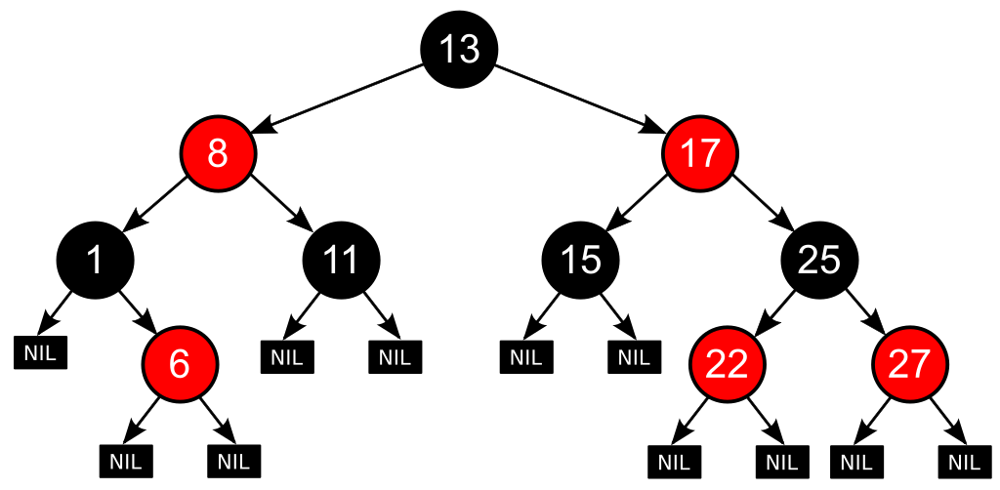
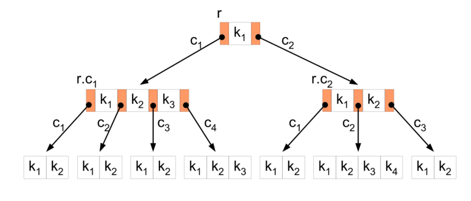

  <h1>🗂 Data Structure 🗂</h1>

> 질문은 <strong>[WeareSoft님의 tech-interview](https://github.com/WeareSoft/tech-interview)</strong>를 참고하였으며, 질문에 대한 답변은 직접 작성하였습니다.

---

## Table of Contents

- [linked list](#1)
  - [single linked list](#1-1)
  - [double linked list](#1-2)
  - [circular linked list](#1-3)
- [hash table](#2)
- [stack](#3)
- [queue](#4)
  - [circular queue](#4-1)
- [graph](#5)
- [tree](#6)
  - [binary tree](#6-1)
  - [full binary tree](#6-2)
  - [complete binary tree](#6-3)
  - [bst(binary search tree)](#6-4)
- [heap(binary heap)](#7)
  - [min heap](#7-1)
  - [max heap](#7-2)
- [Red-black Tree](#8)
- [B-Tree](#9)

---

## #1

#### linked list

#### References

---

## #1-1

#### single linked list

#### References

---

## #1-2

#### double linked list

#### References

---

## #1-3

#### circular linked list

#### References

---

## #2

#### hash table

#### References

---

## #3

#### stack

#### References

---

## #4

#### queue

#### References

---

## #4-1

#### circular queue

#### References

---

## #5

#### graph

#### References

---

## #6

#### tree

#### References

---

## #6-1

#### binary tree

#### References

---

## #6-2

#### full binary tree

#### References

---

## #6-3

#### complete binary tree

#### References

---

## #6-4

#### bst(binary search tree)

#### References

---

## #7

#### heap(binary heap)

#### References

---

## #7-1

#### min heap

#### References

---

## #7-2

#### max heap

#### References

---

## #8

#### Red-black Tree

> **레드-블랙트리의 정의**

  
   
  <small>출처: <a href="https://en.wikipedia.org/wiki/Red%E2%80%93black_tree">Red-black tree - Wikipedia</a></small>

레드-블랙 트리(Red-Black Tree)는 이진탐색트리(Binary Search Tree)의 한 종류로, 삽입(insert), 삭제(delete), 검색(retrieval) 연산을 <!-- $O(\log N)$ --> 에 수행하도록 보장하는 **균형 잡힌 트리**를 말한다. 즉, 트리의 높이가 <!-- $\log N$ --> 이 되도록 한다.

레드-블랙 트리는 **다음의 조건**을 만족한다.

- 모든 노드는 빨간색 혹은 검은색이다.
- 루트 노드는 검은색이다.
- `NULL` 혹은 `NIL`로 표기된 리프노드는 검정색이다.
- 빨간색 노드의 자식 노드는 검정색이다. 즉, 빨간색 노드가 연속적으로 나올 수 없다.
- 리프노드에서 루트노드까지 가는 경로에서 만나는 검은색 노드의 개수는 같다.

> **레드-블랙트리가 균형 잡힌 트리인 이유**

레드-블랙 트리의 **5번째 조건** 때문인데, 검은색 노드의 개수가 B이고 빨간색 노드가 최소가 되는 경우와 최대가 되는 경우를 생각해보자. 빨간색 노드가 최소가 되려면, 빨간색 노드 자체가 없어야 하고 총 노드의 개수는 B개이다. 빨간색 노드가 최대가 되려면, `검정-빨강-검정-빨강-...`으로 반복되어야 한다. 이 경우 총 노드의 개수는 2B이다.

그러므로 최소 경로와 최대 경로의 차이는 2배보다 크지 않으므로 레드-블랙 트리는 균형 잡힌 트리라고 말할 수 있다.

> **레드-블랙 트리의 연산**

레드-블랙 트리의 연산으로 `검색`, `삽입`, `제거`가 있다. 자세한 내용은 [레드-블랙 트리/동작 - 위키백과](https://ko.wikipedia.org/wiki/%EB%A0%88%EB%93%9C-%EB%B8%94%EB%9E%99_%ED%8A%B8%EB%A6%AC#%EB%8F%99%EC%9E%91)를 참고!

#### References

- [알고리즘) Red-Black Tree - ZeddiOS](https://zeddios.tistory.com/237)
- [고급 주제 - 코딩인터뷰 완전분석](http://www.yes24.com/Product/Goods/44305533)
- [[레드-블랙 트리 - 위키백과](https://ko.wikipedia.org/wiki/%EB%A0%88%EB%93%9C-%EB%B8%94%EB%9E%99_%ED%8A%B8%EB%A6%AC#%EB%8F%99%EC%9E%91)]

---

## #9

#### B-Tree

> **B-트리의 정의**

  
   
  <small>출처: <a href="https://commons.wikimedia.org/wiki/File:B-tree-definition.png">B-tree Definition - Wikimedia</a></small>

B-트리는 이진 트리(Binary Tree)를 확장해 모든 리프 노드들이 같은 높이를 갖도록 하는 트리이다. 노드 내에 여러 개의 key가 있을 수 있으며, 최대 key의 개수에 따라 2개이면 2차 B-트리, N개면 N차 B-트리라고 부른다.

B-트리는 **다음의 조건**을 만족한다.

- 노드의 key의 개수가 N이면, 자식 노드의 개수는 N+1이다.
- 노드 내의 key는 오름차순으로 정렬되어 있다.
- 루트 노드는 2개 이상의 자식을 가져야 한다.
- 루트 노드를 제외한 나머지 노드들은 적어도 최대 M/2개의 key를 가져야 한다.
  - M은 B-트리의 차수를 말한다.
- 리프 노드는 모두 같은 레벨에 있어야 한다.

> **B-트리의 연산**

B-트리의 연산은 `검색`과 `삽입`, `제거`가 있다. 다음 연산은 B-트리 연산을 이해할 수 있는 자료로 이것을 참고!

- B-트리 연산 시뮬레이션: [B-Tree Algorithm Visualizations](https://www.cs.usfca.edu/~galles/visualization/BTree.html)
- B-트리 연산 개념 정리: [[자료구조] 그림으로 알아보는 B-Tree - emplam27.log](https://velog.io/@emplam27/%EC%9E%90%EB%A3%8C%EA%B5%AC%EC%A1%B0-%EA%B7%B8%EB%A6%BC%EC%9C%BC%EB%A1%9C-%EC%95%8C%EC%95%84%EB%B3%B4%EB%8A%94-B-Tree)

> **B-트리 vs B+ 트리**

B+ 트리는 B-트리와 비슷하지만 리프노드가 연결리스트의 형태를 띄어 선형 검색이 가능한 트리이다. 모든 노드에 key와 data가 있는 B 트리와는 달리 B+ 트리는 리프 노드에만 data가 존재한다. 또한 `삽입`과 `제거` 연산 모두 리프 노드에서만 이루어진다.

#### References

- [[자료구조] 그림으로 알아보는 B-Tree - emplam27.log](https://velog.io/@emplam27/%EC%9E%90%EB%A3%8C%EA%B5%AC%EC%A1%B0-%EA%B7%B8%EB%A6%BC%EC%9C%BC%EB%A1%9C-%EC%95%8C%EC%95%84%EB%B3%B4%EB%8A%94-B-Tree)
- [[자료구조] 그림으로 알아보는 B+Tree - emplam27.log](https://velog.io/@emplam27/%EC%9E%90%EB%A3%8C%EA%B5%AC%EC%A1%B0-%EA%B7%B8%EB%A6%BC%EC%9C%BC%EB%A1%9C-%EC%95%8C%EC%95%84%EB%B3%B4%EB%8A%94-B-Plus-Tree)
- [B트리 - 위키백과](https://ko.wikipedia.org/wiki/B_%ED%8A%B8%EB%A6%AC)
- [B-Tree 개념 정리 - Jlog](https://hyungjoon6876.github.io/jlog/2018/07/20/btree.html)

---
