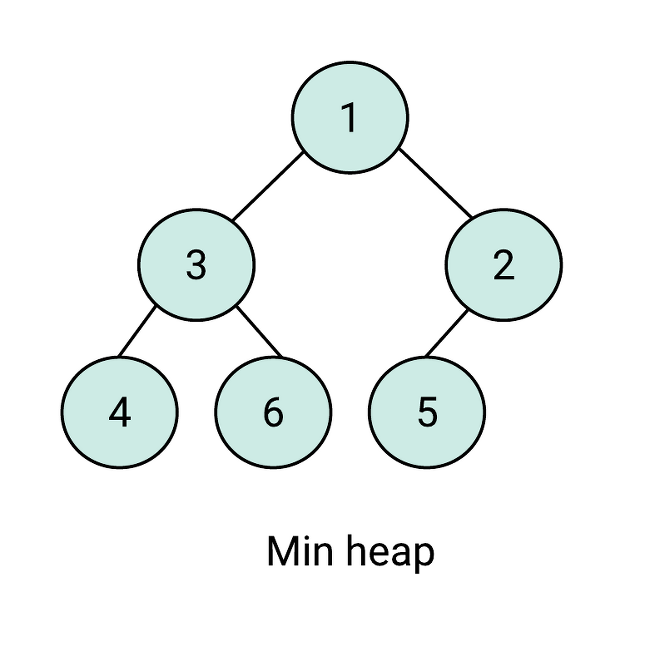
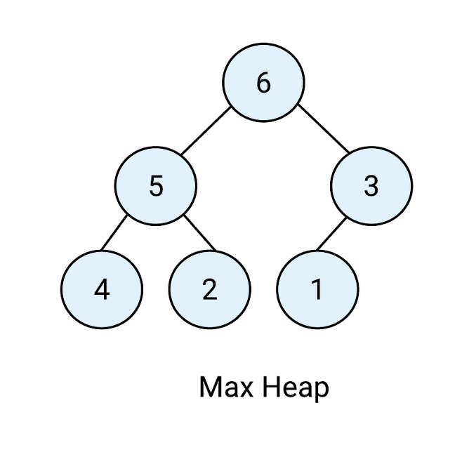

  <h1>🗂 Data Structure 🗂</h1>

> 질문은 <strong>[WeareSoft님의 tech-interview](https://github.com/WeareSoft/tech-interview)</strong>를 참고하였으며, 질문에 대한 답변은 직접 작성하였습니다.

---

## Table of Contents

- [linked list](#1)
  - [single linked list](#1-1)
  - [double linked list](#1-2)
  - [circular linked list](#1-3)
- [hash table](#2)
- [stack](#3)
- [queue](#4)
  - [circular queue](#4-1)
- [graph](#5)
- [tree](#6)
  - [binary tree](#6-1)
  - [full binary tree](#6-2)
  - [complete binary tree](#6-3)
  - [bst(binary search tree)](#6-4)
- [heap(binary heap)](#7)
  - [min heap](#7-1)
  - [max heap](#7-2)
- [red-black tree](#8)
- [b+ tree](#9)

---

## #1

#### linked list

#### References

---

## #1-1

#### single linked list

#### References

---

## #1-2

#### double linked list

#### References

---

## #1-3

#### circular linked list

#### References

---

## #2

#### hash table

#### References

---

## #3

#### stack

#### References

---

## #4

#### queue

#### References

---

## #4-1

#### circular queue

#### References

---

## #5

#### graph

#### References

---

## #6

#### tree

tree는 그래프의 일종으로, 부모 노드 밑에 여러 자식 노드가 연결되고, 자식 노드 각각에 다시 자식 노드가 연결되는 재귀적 형태의 자료구조이다. 노드들은 서로 다른 자식 노드를 가지며 이때 각 노드는 재사용 되지 않는다.

> 특징

- 반드시 하나의 루트 노드만이 존재한다.
- 모든 자식 노드는 한 개의 부모 노드만을 가진다.
- 서로 다른 임의의 두 노드에 대해 두 노드를 연결하는 경로는 유일하다.
- 사이클을 가지는 노드 집합이 존재하지 않는다.
- 노드가 N개인 트리는 항상 N-1개의 간선을 가진다.

> 용어

  

 

- 노드(node): 트리를 구성하는 기본 원소
- 루트 노드(root node/root): 트리에서 부모가 없는 최상위 노드, 트리의 시작점
- 부모 노드(parent node): 루트 노드 방향으로 직접 연결된 노드
- 자식 노드(child node): 루트 노드 반대 방향으로 직접 연결된 노드
- 형제 노드(siblings node): 같은 부모 노드를 갖는 노드들
- 잎 노드(leaf node)/단말 노드(terminal node): 자식이 없는 노드
- 경로(path): 한 노드에서 다른 한 노드에 이르는 길 사이에 있는 노드들의 순서
- 길이(length): 출발 노드에서 도착 노드까지 거치는 노드의 개수
- 깊이(depth): 루트 경로의 길이
- 레벨(level): 루트 노드(level=1)부터 노드까지 연결된 링크 수의 합
- 높이(height): 가장 긴 루트 경로의 길이
- 차수(degree): 각 노드의 자식의 개수
- 트리의 차수(degree of tree): 트리의 최대 차수 = max[deg1, deg2, ..., degn]
- 크기(size): 노드의 개수
- 너비(width): 가장 많은 노드를 갖고 있는 레벨의 크기

#### References

- [[자료구조] 트리(Tree)란 - HeeJeong Kwon](https://gmlwjd9405.github.io/2018/08/12/data-structure-tree.html)
- [트리의 종류와 이해 - cjmp1](http://www.secmem.org/blog/2019/05/09/%ED%8A%B8%EB%A6%AC%EC%9D%98-%EC%A2%85%EB%A5%98%EC%99%80-%EC%9D%B4%ED%95%B4/)
- [[자료구조] 트리? + 이진 트리 (Binary Tree) - Suyeon's Blog](https://suyeon96.tistory.com/29)
- [트리(그래프) - 나무위키](https://namu.wiki/w/%ED%8A%B8%EB%A6%AC(%EA%B7%B8%EB%9E%98%ED%94%84))

---

## #6-1

#### binary tree

  

 

이진 트리(binary tree)는 각각의 노드가 최대 두 개의 자식 노드를 가지는 트리를 말한다. 즉, 모든 노드의 차수(degree)가 2 이하인 트리를 말한다. 이진 트리의 모든 서브 트리들은 모두 이진 트리이다.

> 순회(Traversal) 방법
- 전위 순회(preorder)
  1. 노드를 방문한다.
  2. 왼쪽 서브 트리를 전위 순회한다.
  3. 오른쪽 서브 트리를 전위 순회한다.
- 중위 순회(inorder)
  1. 왼쪽 서브 트리를 중위 순회한다.
  2. 노드를 방문한다.
  3. 오른쪽 서브 트리를 중위 순회한다.
- 후위 순회(postorder)
  1. 왼쪽 서브 트리를 후위 순회한다.
  2. 오른쪽 서브 트리를 후위 순회한다.
  3. 노드를 방문한다.
- 레벨 순서 순회(level-order)
  - 모든 노드를 낮은 레벨부터 차례대로 순회한다. 레벨 순서 순회는 너비 우선 순회(breadth-first traversal)라고도 한다.

#### References

- [이진 트리 - 위키백과](https://ko.wikipedia.org/wiki/%EC%9D%B4%EC%A7%84_%ED%8A%B8%EB%A6%AC)
- [이진 탐색 트리: 이론과 소개 - 오늘도 MadPlay!](https://madplay.github.io/post/binary-search-tree)
- [트리 순회 - 위키백과](https://ko.wikipedia.org/wiki/%ED%8A%B8%EB%A6%AC_%EC%88%9C%ED%9A%8C)

---

## #6-2

#### full binary tree

  

 

full binary tree는 단말 노드들을 제외한 모든 노드들이 2개의 자식 노드를 가지는 binary tree이다.

#### References

- [Binary Tree 종류 - Heap 구현 사전지식 - YABOONG](https://yaboong.github.io/data-structures/2018/02/10/1_binary-tree-1/)

---

## #6-3

#### complete binary tree

  

 

완전 이진 트리(complete binary tree)는 마지막 level을 제외한 나머지 level에 노드들이 가득 차있고, 마지막 level에서 노드는 가장 왼쪽부터 채워지는 형태의 binary tree이다.

#### References

- [Binary Tree 종류 - Heap 구현 사전지식 - YABOONG](https://yaboong.github.io/data-structures/2018/02/10/1_binary-tree-1/)

---

## #6-4

#### bst(binary search tree)

  

 

이진 탐색 트리(binary search tree)는 아래의 성질을 갖고 있는 이진 트리이다.
- 각각의 모든 노드들의 값(key)은 중복된 값이 아니다.
- 노드의 왼쪽 서브트리에는 그 노드의 값보다 작은 값들을 지닌 노드들로 이루어져 있다.
- 노드의 오른쪽 서브트리에는 그 노드의 값보다 큰 값들을 지닌 노드들로 이루어져 있다.
- 좌우 서브트리는 각각이 다시 이진 탐색 트리여야 한다.

> 탐색(Search)

- 검색하고자 하는 값을 루트 노드와 먼저 비교하고, 일치할 경우 루트 노드를 리턴한다.
  - 불일치하고 검색하고자 하는 값이 루트 노드의 값보다 작을 경우 왼쪽 서브트리에서 재귀적으로 검색한다.
  - 불일치하고 검색하고자 하는 값이 루트 노드의 값보다 큰 경우 오른쪽 서브트리에서 재귀적으로 검색한다.

> 삽입(Insert)

- 삽입을 하기 전, 탐색을 수행한다.
- 트리를 탐색한 후 키와 일치하는 노드가 없으면 마지막 노드에서 키와 노드의 크기를 비교해서 왼쪽이나 오른쪽에 새로운 노드를 삽입한다.

> 삭제(Delete)

삭제하려는 노드의 자식 수에 따라
- 자식 노드가 없는 노드(리프 노드) 삭제: 해당 노드를 단순히 삭제한다.
- 자식 노드가 1개인 노드 삭제: 해당 노드를 삭제하고 그 위치에 해당 노드의 자식 노드를 대입한다.
- 자식 노드가 2개인 노드 삭제: 삭제하고자 하는 노드의 값을 해당 노드의 왼쪽 서브트리에서 가장 큰 값으로 변경하거나, 오른쪽 서브트리에서 가장 작은 값으로 변경한 뒤, 해당 노드(왼쪽 서브트리에서 가장 큰 값을 가지는 노드 또는 오른쪽 서브트리에서 가장 작은 값을 가지는 노드)를 삭제한다.

> 복잡도

BST의 탐색, 삽입, 삭제의 복잡도는 모두 <!-- $O(h)$ --> 이다. (h: BST의 높이(height))

BST는 평균 시간 복잡도가 <!-- $O(\log_2 n)$ --> 이지만 최악의 경우 <!-- $O(n)$ --> 이다. (skewed tree 이면 node의 수만큼 시간이 소요됨)
  - tree가 complete binary tree 거나 full binary tree 이면 <!-- $O(\log_2 n)$ --> , skewed tree 이면 <!-- $O(n)$ --> 

#### References

- [이진 탐색 트리 - 위키백과](https://ko.wikipedia.org/wiki/%EC%9D%B4%EC%A7%84_%ED%83%90%EC%83%89_%ED%8A%B8%EB%A6%AC)
- [Binary Search Tree - 불곰](https://brownbears.tistory.com/392)
- [6. Binary Search Tree - JuHy_](https://ju-hy.tistory.com/90)

---

## #7

#### heap(binary heap)

<strong>힙(heap)</strong>

최대값 및 최소값을 찾아내는 연산을 빠르게 하기 위해 고안된 완전 이진 트리를 기본으로 한 자료구조로서 다음의 속성을 만족한다.

- A가 B의 부모 노드이면, A의 키값과 B의 키값 사이에는 대소관계가 성립한다.

heap의 종류에는 [min heap](#7-1), [max heap](#7-2)이 있다.

각 노드의 자식 노드의 최대 개수는 힙의 종류에 따라 다르지만, 대부분의 경우는 자식 노드의 개수가 최대 2개인 이진 힙(binary heap)을 사용한다.

힙에서는 가장 높은(혹은 가장 낮은) 우선순위를 가지는 노드가 항상 루트 노드에 오게 되는 특징이 있으며, 이를 응용하여 우선순위 큐와 같은 추상적 자료형을 구현할 수 있다.

<strong>이진 힙(binary heap)</strong>

이진 힙은 다음과 같은 두 가지 특징을 갖는다.

트리를 T, 임의 내부 노드를 v라고 하면 다음과 같다.
  1. 루트 노드를 제외한 각 내부 노드는 `key(T.parent(v)) < key(v)` 또는 `key(T.parent(v)) > key(v)`이다. (즉, 키 값은 오름차순이거나 내림차순이다.)
  2. 마지막 왼쪽 결합 노드들의 레벨을 제외한 다른 모든 레벨들은 완전 이진 트리를 형성한다.

힙 리스트(heap list)로 표현할 때 i번째 노드의 왼쪽 자식 노드의 위치는 2i가 되며, i번째 노드의 오른쪽 자식 노드의 위치는 2i+1이고, 또한 i번째 노드의 부모 노드의 위치는 i/2가 된다.

> 복잡도

<!-- $O(\log n)$ --> 

#### References

- [힙 (자료 구조) - 위키백과](https://ko.wikipedia.org/wiki/%ED%9E%99_(%EC%9E%90%EB%A3%8C_%EA%B5%AC%EC%A1%B0))

---

## #7-1

#### min heap

  

 

최소 힙(min heap)은 부모 노드의 키 값이 자식 노드의 키 값보다 작거나 같은 완전 이진 트리이다.

- key(부모 노드)<!-- $\leq$ --> key(자식 노드)

#### References

- [[자료구조] 힙(heap)이란 - HeeJeong Kwon](https://gmlwjd9405.github.io/2018/05/10/data-structure-heap.html)

---

## #7-2

#### max heap

  

 

최대 힙(max heap)은 부모 노드의 키 값이 자식 노드의 키 값보다 크거나 같은 완전 이진 트리이다.

- key(부모 노드)<!-- $\geq$ --> key(자식 노드)

#### References

- [[자료구조] 힙(heap)이란 - HeeJeong Kwon](https://gmlwjd9405.github.io/2018/05/10/data-structure-heap.html)

---

## #8

#### red-black tree

#### References

---

## #9

#### b+ tree

#### References

---
