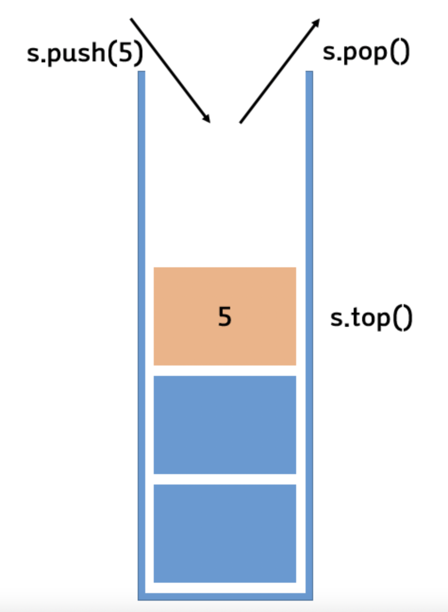
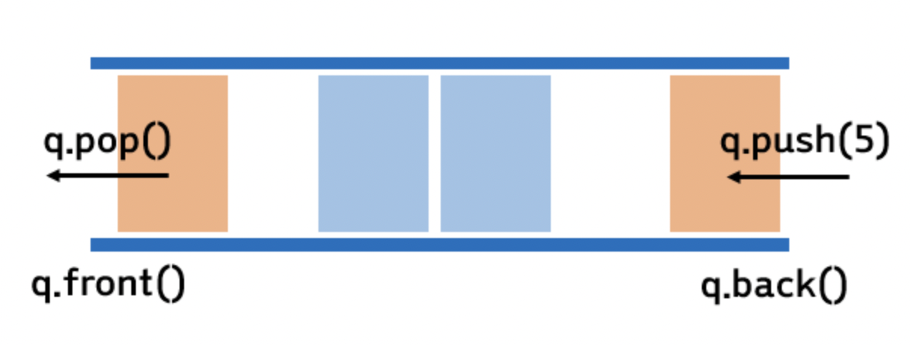
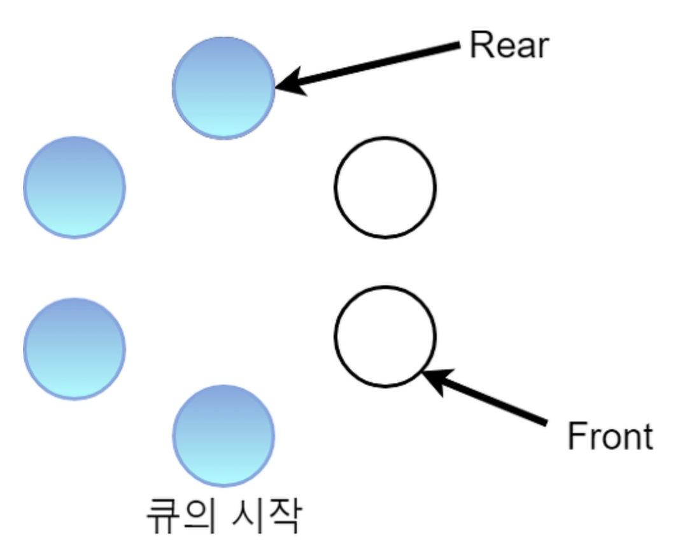

  <h1>🗂 Data Structure 🗂</h1>

> 질문은 <strong>[WeareSoft님의 tech-interview](https://github.com/WeareSoft/tech-interview)</strong>를 참고하였으며, 질문에 대한 답변은 직접 작성하였습니다.

---

## Table of Contents

- [linked list](#1)
  - [single linked list](#1-1)
  - [double linked list](#1-2)
  - [circular linked list](#1-3)
- [hash table](#2)
- [stack](#3)
- [queue](#4)
  - [circular queue](#4-1)
- [graph](#5)
- [tree](#6)
  - [binary tree](#6-1)
  - [full binary tree](#6-2)
  - [complete binary tree](#6-3)
  - [bst(binary search tree)](#6-4)
- [heap(binary heap)](#7)
  - [min heap](#7-1)
  - [max heap](#7-2)
- [red-black tree](#8)
- [b+ tree](#9)

---

## #1

#### linked list

#### References

---

## #1-1

#### single linked list

#### References

---

## #1-2

#### double linked list

#### References

---

## #1-3

#### circular linked list

#### References

---

## #2

#### hash table

#### References

---

## #3

#### stack

**LIFO (Last In First Out)** 구조의 자료형으로 한 쪽으로만 데이터를 넣고 뺄 수 있다.

`push` 명령으로 데이터를 넣고, `pop` 명령으로 가장 마지막에 들어간 데이터를 빼낸다.

    

 

stack 은 브라우저의 뒤로가기 기능, ctrl + z (되돌리기), 지역 변수와 매개변수를 저장하는 stack 메모리 등에 사용된다. 이외에도 DFS 알고리즘 등 다양한 곳에 사용되는 자료형이다.

stack 에 데이터가 꽉 차서 더 넣을 공간이 없는데 데이터를 push 하는 경우 `overflow`, 반대로 데이터가 없는데 pop 하는 경우를 `underflow` 라고 한다.

#### References
- [[자료구조] 스택, 큐는 무엇인가? - 마이구미](https://mygumi.tistory.com/357)
- [[자료구조] 스택(Stack), 큐(Queue), 덱(Deque) - Choiiis](https://velog.io/@choiiis/%EC%9E%90%EB%A3%8C%EA%B5%AC%EC%A1%B0-%EC%8A%A4%ED%83%9DStack%EA%B3%BC-%ED%81%90Queue)

---

## #4

#### queue

**FIFO (First In First Out)** 구조의 자료형으로 출구(front)와 입구(rear or back)가 따로 존재하여 먼저 입력된 데이터가 먼저 반환된다.

`push` 명령으로 rear 에 자료를 넣는다. rear += 1 되어 다음에 데이터를 받을 메모리를 가리켜야 한다.  
`pop` 명령으로 front 에서 데이터를 빼낸다. front += 1 되어 다음에 데이터를 반환할 메모리를 가리켜야 한다.

    

 

queue 는 CPU 연산처리 작업대기, 프린터 인쇄, 프로세스 관리 등 들어온 순서를 보장해야하는 경우 사용된다. 이외에도 BFS 알고리즘 등에 사용된다.

queue 의 rear 가 기리키는 공간에 데이터가 있는데 데이터를 push 하는 경우 `overflow`, 반대로 front 가 가리키는 공간에 데이터가 없는데 pop 하는 경우를 `underflow` 라고 한다.

#### References
- [[자료구조] 스택, 큐는 무엇인가? - 마이구미](https://mygumi.tistory.com/357)
- [[자료구조] 스택(Stack), 큐(Queue), 덱(Deque) - Choiiis](https://velog.io/@choiiis/%EC%9E%90%EB%A3%8C%EA%B5%AC%EC%A1%B0-%EC%8A%A4%ED%83%9DStack%EA%B3%BC-%ED%81%90Queue)

---

## #4-1

#### circular queue

크기가 N 인 queue 에서 모든 원소를 다 채우면 rear 는 N-1 을 가리킨다. 이 때, pop 으로 제일 처음 원소를 제거하면 queue 에 남은 공간 1개가 생긴다. 하지만 rear 는 마지막을 가리키고 있기 때문에 더이상 원소를 추가할 수 없다. 이 문제를 해결하기 위해 원형 형태의 `circular queue` 를 사용한다.

    

 

queue 와 같이 FIFO 구조이다.   

처음에는 front 와 rear 가 같은 메모리를 가리킨다.   
데이터를 입력하기 위해 rear 는 메모리가 꽉찼는지 검사한다. 꽉찬 경우는 rear 다음 번의 메모리가 front 를 가리키는 경우 (rear + 1 == front) 인데, 꽉차지 않았다면 데이터를 입력하고 rear 는 다음 메모리로 이동한다.  
데이터를 반환하기 위해 front 는 메모리가 비었는지 검사한다. 빈 경우에는 현재 front 위치와 rear 위치가 같은 경우 (rear == front) 인데, 비지 않았다면 데이터를 반환하고 front 는 다음 메모리로 이동한다.

#### References
- [[자료구조] 큐(QUEUE)와 원형큐(CIRCULAR QUEUE) 개념과 구현 - reakwon](https://reakwon.tistory.com/30)

---

## #5

#### graph

그래프는 정점과 간선으로 이루어진 자료구조이다. 정점 간의 연결관계는 간선으로 나타낸다.

##### 그래프의 종류

  

간선이 담고있는 정보와 연결 상태에 따라 그래프의 종류가 나뉜다. 두 정점을 연결하는 간선에 방향이 없다면 `무방향 그래프`, 두 정점을 연결하는 간선에 방향이 존재하면 `방향 그래프`라고 부른다. 방향 그래프는 간선의 방향으로만 이동할 수 있다. 두 정점을 이동할 때 비용이 발생하면 `가중치 그래프`로 나타낼 수 있다. 모든 정점이 간선으로 연결된 경우, `완전 그래프`라고 부른다.

##### 그래프 구현 방식

- 인접행렬 방식
  - 노드를 인덱스로 삼는 2차원 배열을 만든다.
  - 각 노드가 간선으로 연결되어있으면 배열에 1을 넣어주고, 연결되지 않았다면 0을 넣어준다.
  - 두 노드의 연결관계를 조회할 때, O(1) 시간이 걸린다.
  - 그러나 모든 정점에 대해, 간선 정보를 입력해야하므로 초기화에 <!-- $O(N^2)$ -->  시간이 소요된다.
 - 노드의 수가 많고, 간선의 수가 적은 그래프의 경우에, 공간을 낭비하게 된다.

  

- 인접리스트 방식
  - 그래프의 노드들을 리스트로 표현한다. head 노드와 연결된 노드들을 링크에 달아준다.
  - 한 정점에 연결된 노드들의 정보를 얻기 위해서 O(M) 시간이 걸린다.(M: 간선의 수)
  - 간선 정보만 유지하므로, 공간 낭비가 적다.
  - 두 정점이 연결되었는지 확인하기 위해서 O(M) 시간이 걸리며, 구현이 비교적 어렵다.

##### 그래프 용어

그래프에서 사용하는 용어는 다음과 같다.

- `정점(vertice)` : 노드(node)라고도 하며 정점에는 데이터가 저장된다.
- `간선(edge)`: 링크(arcs)라고도 하며 노드간의 관계를 나타낸다.
- `인접 정점(adjacent vertex)` : 간선에 의해 직접 연결된 정점이다.
- `단순 경로(simple-path)` : 경로 중 반복되는 정점이 없는것, 같은 간선을 자나가지 않는 경로이다.
- `차수(degree)` : 무방향 그래프에서 하나의 정점에 인접한 정점의 수이다.
- `진출 차수(out-degree)` : 방향그래프에서 사용되는 용어로 한 노드에서 외부로 향하는 간선의 수를 뜻한다.
- `진입차수(in-degree)` : 방향그래프에서 사용되는 용어로 외부 노드에서 들어오는 간선의 수를 뜻한다.

#### References

- [[Algorithm] 자료구조 그래프(Graph)란 무엇인가? - 코딩팩토리](https://coding-factory.tistory.com/610)

---

## #6

#### tree

#### References

---

## #6-1

#### binary tree

#### References

---

## #6-2

#### full binary tree

#### References

---

## #6-3

#### complete binary tree

#### References

---

## #6-4

#### bst(binary search tree)

#### References

---

## #7

#### heap(binary heap)

#### References

---

## #7-1

#### min heap

#### References

---

## #7-2

#### max heap

#### References

---

## #8

#### red-black tree

#### References

---

## #9

#### b+ tree

#### References

---
