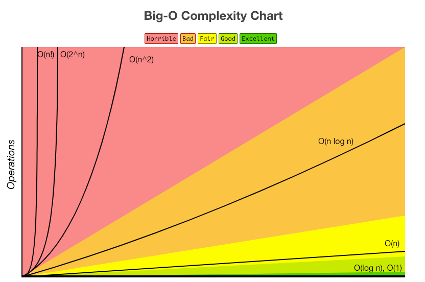
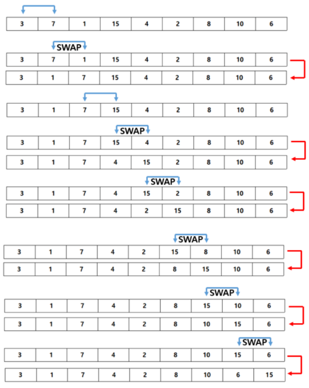
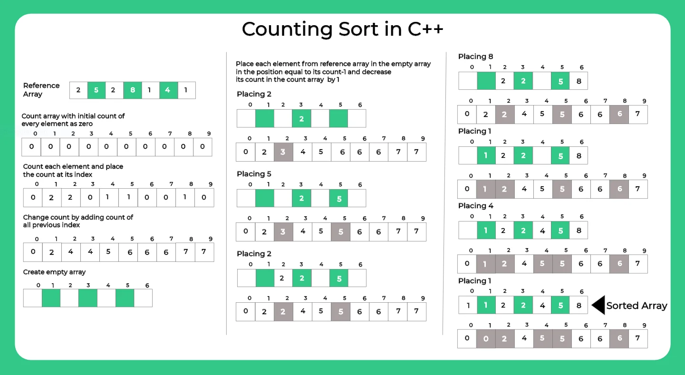
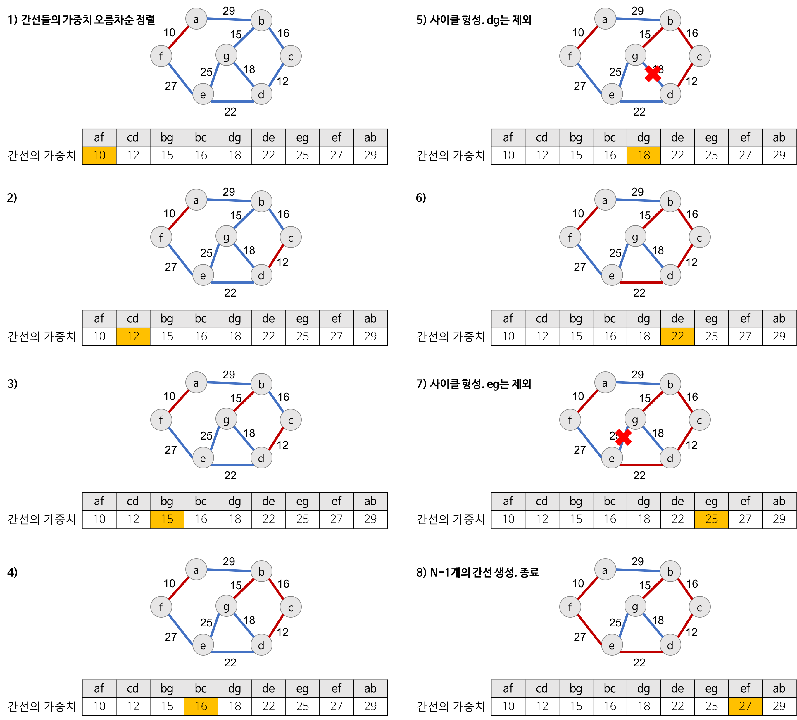

> **📌 질문은 <strong>[WeareSoft님의 tech-interview](https://github.com/WeareSoft/tech-interview)</strong>를 참고하였습니다.**

## Table of Contents

- [시간, 공간 복잡도](#1)
- Sort Algorithm
  - [Bubble Sort](#2-1)
  - [Selection Sort](#2-2)
  - [Insertion Sort](#2-3)
  - [Merge Sort](#2-4)
  - [Heap Sort](#2-5)
  - [Quick Sort](#2-6)
  - [Counting Sort](#2-7)
  - [Radix Sort](#2-8)
- [Divide and Conquer](#3)
- [Dynamic Programming](#4)
- [Greedy Algorithm](#5)
- [Graph](#6)
  - [Graph Traversal: BFS, DFS](#6-1)
  - [Shortest Path](#6-2)
    - [Dijkstra](#6-2-1)
    - [Floyd-Warshall](#6-2-2)
    - [Bellman-Ford](#6-2-3)
  - [Minimum Spanning Tree](#6-3)
    - [Prim](#6-3-1)
    - [Kruskal](#6-3-2)
  - [Union-find](#6-4)
  - [Topological Sort](#6-5)

---

## #1

#### 시간, 공간 복잡도

복잡도란 알고리즘의 성능을 평가하는 척도로 <strong>시간 복잡도(Time Complexity)</strong>와 <strong>공간 복잡도(Space Complexity)</strong>로 나뉜다.

- 시간 복잡도(Time Complexity): 알고리즘에 사용되는 연산 횟수의 총량
- 공간 복잡도(Space Complexity): 알고리즘에 사용되는 메모리 공간의 총량

즉, 시간 복잡도는 속도에 대한 분석 결과이고, 공간 복잡도는 메모리 사용량에 대한 분석 결과이다.

알고리즘의 복잡도는 점근적 표기법으로 나타내는데, 점근적 표기법에는 대표적으로 O(빅오), Ω(오메가), Θ(세타)가 있다.

- O Notation (빅오 표기법): 점근적 상한선 / 최악의 경우
- Ω Notation (오메가 표기법): 점근적 하한선 / 최상의 경우
- θ Notation (세타 표기법): 점근적 상한선과 점근적 하한선의 교집합 / 평균의 경우

일반적으로 최악의 경우의 성능을 측정하는 빅오 표기법을 많이 사용한다.



#### References

- [알고리즘의 시간 복잡도와 Big-O 쉽게 이해하기 - Chulgil.Lee](https://blog.chulgil.me/algorithm/)
- [시간복잡도와 공간복잡도(Time Complexity Space Complexity) - 오늘도 MadPlay!](https://madplay.github.io/post/time-complexity-space-complexity)
- [[컴퓨터 알고리즘 성능분석] 점근적 표기법 (Asymptotic Notation) - 될성부른떡잎](https://ledgku.tistory.com/31)

---

## #2-1

#### Bubble Sort

버블 정렬(Bubble Sort)은 배열의 0번부터 N-1번까지 탐색을 하면서 인접한 칸과 비교하여 swap을 하는 방식의 정렬 알고리즘이다.



위의 과정이 버블 정렬을 1회 실시하고 나서의 결과이다. j번째 값과 j+1번째 값을 비교해서 만약 j번째 값이 더 크다면 swap을 해주는 식으로 동작한다.

> **시간 복잡도**

$$
O(N^2)
$$

> **파이썬 구현**

```python
def bubbleSort(alist):
    for passnum in range(len(alist)-1, 0, -1):
        for i in range(passnum):
            if alist[i] > alist[i+1]:
                temp = alist[i]
                alist[i] = alist[i+1]
                alist[i+1] = temp
```

#### References

- [[ 정렬 ] 버블정렬 (Bubble Sort) (C++) - 얍문's Coding World..](https://yabmoons.tistory.com/241)
- [버블정렬 - ratsgo's blog](https://ratsgo.github.io/data%20structure&algorithm/2017/11/05/bubblesort/)
- [6.7. The Bubble Sort - Problem Solving with Algorithms and Data Structures using Python](https://runestone.academy/runestone/books/published/pythonds/SortSearch/TheBubbleSort.html)

---

## #2-2

#### Selection Sort

선택 정렬(Selection Sort)은 위치 변경 횟수를 줄여, 버블 정렬을 일부 개선한 기법이다. 주어진 배열 중에 최댓값을 찾아 정렬되지 않은 배열의 맨 뒤의 값과 자리를 바꾸어나가는 정렬 알고리즘이다. 배열의 맨 뒤부터 차례로 정렬이 된다.


버블 정렬은 왼쪽에 있는 값이 비교 대상인 오른쪽에 있는 값보다 크면 자리를 바꿔줬는데 반해, 선택 정렬은 일단 최댓값(혹은 최솟값)을 찾은 뒤에야 이 값을 정해진 위치로 보내주게 된다. 다시 말해 비교 횟수 측면에서는 버블 정렬과 선택 정렬이 같고 둘 모두 $$O(n^2)$$의 계산 복잡성을 갖지만 자리 이동(swap)측면에서는 선택 정렬이 효율적이다.

> **시간 복잡도**

$$
O(N^2)
$$

> **파이썬 구현**

```python
def selectionSort(alist):
   for fillslot in range(len(alist)-1, 0, -1):
       positionOfMax = 0
       for location in range(1, fillslot+1):
           if alist[location] > alist[positionOfMax]:
               positionOfMax = location

       temp = alist[fillslot]
       alist[fillslot] = alist[positionOfMax]
       alist[positionOfMax] = temp
```

#### References

- [[ 정렬 ] 선택 정렬 (Selection Sort) (C++) - 얍문's Coding World..](https://yabmoons.tistory.com/242)
- [선택정렬 - ratsgo's blog](https://ratsgo.github.io/data%20structure&algorithm/2017/11/06/selectionsort/)
- [6.8. The Selection Sort - Problem Solving with Algorithms and Data Structures using Python](https://runestone.academy/runestone/books/published/pythonds/SortSearch/TheSelectionSort.html)

---

## #2-3

#### Insertion Sort

삽입 정렬(Insertion Sort)은 배열의 모든 요소를 배열의 시작부터 끝까지 현재 배열의 요소들과 비교해 가면서 적절한 위치에 삽입하는 정렬 알고리즘이다.


> **시간 복잡도**

- 최악의 경우(Worst): $$O(N^2)$$
- 평균적인 경우(Average): $$O(N^2)$$
- 최선의 경우(Best): $$O(N)$$

> **파이썬 구현**

```python
def insertion_sort(collection):
    for index in range(1, len(collection)):
        while 0 < index and collection[index] < collection[index - 1]:
            collection[index], collection[
                index - 1] = collection[index - 1], collection[index]
            index -= 1

    return collection
```

#### References

- [[ 정렬 ] 삽입 정렬 (Insertion Sort) (C++) - 얍문's Coding World..](https://yabmoons.tistory.com/243)
- [삽입정렬(Insertion Sort) - ratsgo's blog](https://ratsgo.github.io/data%20structure&algorithm/2017/09/06/insmersort/)
- [6.9. The Insertion Sort - Problem Solving with Algorithms and Data Structures using Python](https://runestone.academy/runestone/books/published/pythonds/SortSearch/TheInsertionSort.html)

---

## #2-4

#### Merge Sort

합병 정렬(Merge Sort)는 배열을 잘게 쪼갠 뒤 둘씩 크기를 비교해 정렬하고 분리된 리스트를 재귀적으로 합쳐서 정렬을 완성하는 정렬 알고리즘이다. 분할된 배열을 저장해둘 공간이 필요해 메모리 소모량이 큰 편이다. 문제를 분리하고 각각을 해결한 후 다시 합치는 Divide & Conquer 방식을 사용한다.

- Divide: 초기 배열을 2개의 배열로 분할한다.
- Conquer: 각 부분 배열을 재귀적으로 병합 정렬을 사용하여 정렬한다.
- Merge: 부분 배열을 하나의 배열로 결합한다.


> **시간 복잡도**

$$
O(N \log N)
$$

> **파이썬 구현**

```python
def merge_sort(list):
    if len(list) <= 1:
        return list
    mid = len(list) // 2
    leftList = list[:mid]
    rightList = list[mid:]
    leftList = merge_sort(leftList)
    rightList = merge_sort(rightList)
    return merge(leftList, rightList)
```

#### References

- [[ 정렬 ] 병합 정렬 (Merge Sort) (C++) - 얍문's Coding World..](https://yabmoons.tistory.com/245)
- [합병정렬(Merge Sort) - ratsgo's blog](https://ratsgo.github.io/data%20structure&algorithm/2017/10/03/mergesort/)
- [6.11. The Merge Sort - Problem Solving with Algorithms and Data Structures using Python](https://runestone.academy/runestone/books/published/pythonds/SortSearch/TheMergeSort.html)

---

## #2-5

#### Heap Sort

힙 정렬(Heap Sort)은 완전 이진 트리로 구현되는 정렬 방식으로, 모든 노드가 힙 속성(각 노드의 값이 자신의 자식 노드 값보다 큰 이진 트리)을 만족하도록 재귀적으로 트리 구조를 만들어 정렬을 완성하는 정렬 알고리즘이다.


> **동작 원리**

1. 주어진 원소들로 최대 힙을 구성한다.
2. 현재 힙의 루트 노드에는 최대값이 존재하게 된다. 루트의 값을 마지막 요소와 바꾼 후, 힙의 사이즈를 하나 줄인다.
3. 힙의 사이즈가 1보다 크면 위 과정을 반복한다.

> **시간 복잡도**

$$
O(N \log N)
$$

> **파이썬 구현**

```python
def heapify(unsorted, index, heap_size):
    largest = index
    left_index = 2 * index + 1
    right_index = 2 * index + 2
    if left_index < heap_size and unsorted[left_index] > unsorted[largest]:
        largest = left_index
    if right_index < heap_size and unsorted[right_index] > unsorted[largest]:
        largest = right_index
    if largest != index:
        unsorted[largest], unsorted[index] = unsorted[index], unsorted[largest]
        heapify(unsorted, largest, heap_size)

def heap_sort(unsorted):
    n = len(unsorted)
    for i in range(n//2-1, -1, -1):
        heapify(unsorted, i, n)
    for i in range(n-1, 0, -1):
        unsorted[0], unsorted[i] = unsorted[i], unsorted[0]
        heapify(unsorted, 0, i)
    return unsorted
```

#### References

- [[ 정렬 ] 힙 정렬 (Heap Sort) (C++) - 얍문's Coding World..](https://yabmoons.tistory.com/246)
- [힙 정렬(Heap Sort) - ratsgo's blog](https://ratsgo.github.io/data%20structure&algorithm/2017/09/27/heapsort/)
- [힙정렬(Heap Sort) 알고리즘 :: 마이구미 - 마이구미의 HelloWorld](https://mygumi.tistory.com/310)

---

## #2-6

#### Quick Sort

퀵 정렬(Quick Sort)는 pivot을 기준으로 pivot 앞에는 pivot보다 작은 값, 뒤에는 큰 값이 오도록 하여 배열을 분할하고, 분할된 두 개 배열 각각에 재귀적으로 이 과정을 반복해 정렬을 완성하는 정렬 알고리즘이다. 합병 정렬과 달리 주어진 배열을 임의로 나누지 않기 때문에 대개는 효율적이지만, pivot이 잘못 선택되면 복잡도가 $$O(n^2)$$이 될 수도 있다.


위의 과정이 퀵 정렬을 1회 실시하고 나서의 결과이다. 54(pivot)를 기준으로 두 개의 배열로 나뉜다.

> **시간 복잡도**

- 최악의 경우(Worst): $$O(N^2)$$
- 평균적인 경우(Average): $$O(N \log N)$$
- 최선의 경우(Best): $$O(N \log N)$$

> **파이썬 구현**

```python
def quickSort(alist):
   quickSortHelper(alist, 0, len(alist)-1)

def quickSortHelper(alist, first, last):
   if first < last:

       splitpoint = partition(alist, first, last)

       quickSortHelper(alist, first, splitpoint-1)
       quickSortHelper(alist, splitpoint+1, last)


def partition(alist, first, last):
   pivotvalue = alist[first]

   leftmark = first + 1
   rightmark = last

   done = False
   while not done:

       while leftmark <= rightmark and alist[leftmark] <= pivotvalue:
           leftmark = leftmark + 1

       while alist[rightmark] >= pivotvalue and rightmark >= leftmark:
           rightmark = rightmark -1

       if rightmark < leftmark:
           done = True
       else:
           temp = alist[leftmark]
           alist[leftmark] = alist[rightmark]
           alist[rightmark] = temp

   temp = alist[first]
   alist[first] = alist[rightmark]
   alist[rightmark] = temp

   return rightmark
```

#### References

- [[ 정렬 ] 퀵 정렬(Quick Sort) (C++) - 얍문's Coding World..](https://yabmoons.tistory.com/244)
- [퀵 정렬(Quick Sort) - ratsgo's blog](https://ratsgo.github.io/data%20structure&algorithm/2017/09/28/quicksort/)
- [6.12. The Quick Sort - Problem Solving with Algorithms and Data Structures using Python](https://runestone.academy/runestone/books/published/pythonds/SortSearch/TheQuickSort.html)

---

## #2-7

#### Counting Sort

계수 정렬(Counting Sort)은 입력값의 빈도를 세어서 이를 결과 리스트의 인덱스로 활용하고 입력 리스트의 요소값에 해당하는 결과 리스트 인덱스 위치에 채워 넣는 방식으로 정렬을 완성하는 정렬 알고리즘이다. 입력 리스트의 최댓값(k)이 커질수록 복잡도가 크게 높아진다.



> **동작 원리**

1. 각 데이터의 개수를 모두 count 한다.
2. 최솟값부터 각 값까지의 count 누적합을 구한다.
3. 새로운 배열에 누적합의 개수를 줄여주며 저장한다.

> **시간 복잡도**

$$
O(N+k)
$$

($$k$$: 데이터의 최댓값)

> **파이썬 구현**

```python
def counting_sort(A, k):
    B = [-1] * len(A)
    C = [0] * (k + 1)

    for a in A:
        C[a] += 1

    for i in range(k):
        C[i+1] += C[i]

    for j in reversed(range(len(A))):
    	B[C[A[j]] - 1] = A[j]
    	C[A[j]] -= 1

    return B
```

#### References

- [[ 정렬 ] 카운팅 정렬(Counting Sort) (C++) - 얍문's Coding World..](https://yabmoons.tistory.com/249)
- [카운팅 정렬, 래딕스 정렬 - ratsgo's blog](https://ratsgo.github.io/data%20structure&algorithm/2017/10/16/countingsort/)
- [Counting Sort in C++ - prepinsta](https://prepinsta.com/cpp-program/counting-sort/)

---

## #2-8

#### Radix Sort

기수 정렬(Radix Sort)은 입력값의 자릿수(d) 각각에 대해 카운팅 정렬을 적용하여 입력 데이터의 최댓값인 k가 커질수록 효율이 떨어지는 카운팅 정렬의 단점을 보완한 정렬 알고리즘이다. 10진법으로 표현된 입력값에 기수 정렬을 적용하면 k 값이 9로 작아진다.


> **시간 복잡도**

$$
d \times O(N)
$$

($$d$$: 입력값의 자릿수)

> **파이썬 구현**

```python
from math import log

def get_digit(number, d, base):
    return (number//base**d) % base

def counting_sort_with_digit(A, d, base):
    k = base - 1
    B = [-1] * len(A)
    C = [0] * (k + 1)
    for a in A:
        C[get_digit(a, d, base)] += 1
    for i in range(k):
        C[i+1] += C[i]
    for j in reversed(range(len(A))):
        B[C[get_digit(A[j], d, base)]-1] = A[j]
        C[get_digit(A[j], d, base)] -= 1
    return B

def radix_sort(list, base=10):
    digit = int(log(max(list), base)+1)
    for d in range(digit):
        list = counting_sort_with_digit(list, d, base)
    return list
```

#### References

- [[ 정렬 ] 기수 정렬 (Radix Sort) (C++) - 얍문's Coding World..](https://yabmoons.tistory.com/248)
- [카운팅 정렬, 래딕스 정렬 - ratsgo's blog](https://ratsgo.github.io/data%20structure&algorithm/2017/10/16/countingsort/)

---

## #3

#### Divide and Conquer

분할 정복(Divide and Conquer)은 문제를 **분할**해서 분할한 문제를 **해결**한 다음 결과를 **조합**하는 알고리즘이다. 큰 문제를 작은 문제로 분할한다는 관점에서 하향식 접근 방법으로 문제를 푼다고 볼 수 있다.

- **분할**: 문제를 동일한 유형의 여러 하위 문제로 나누는 것
- **해결**: 가장 작은 단위의 하위 문제를 해결하는 것
- **조합**: 하위 문제에 대한 결과를 원래 문제에 대한 결과로 조합하는 것

분할 정복 알고리즘은 보통 재귀를 사용하여 구현한다. 다음은 분할 정복의 대표적인 문제인 피보나치 수열 코드이다.

```python
def fibb(n):
  if n <= 1:
    return 1
  return fibb(n-1) + fibb(n-2)
```

#### References

- [Divide-and-conquer algorithm - Wikipedia](https://en.wikipedia.org/wiki/Divide-and-conquer_algorithm)
- [22장. 분할 정복 - 파이썬 알고리즘 인터뷰](http://www.yes24.com/Product/Goods/91084402)

---

## #4

#### Dynamic Programming

다이나믹 프로그래밍(Dynamic Programming)은 **중복된 하위 문제들의 결과를 저장**한 후 원래 문제의 결과와 합하는 알고리즘이다.

다이나믹 프로그래밍과 분할 정복 알고리즘의 큰 차이점은 **중복된 문제**의 차이이다. 분할 정복 알고리즘을 사용한 병합 정렬이나 퀵 정렬의 경우 하위 문제들이 중복되지 않는다. 반면 다이나믹 프로그래밍은 중복된 하위 문제들의 결과를 저장함으로써 중복 계산을 피한다. 만약 문제가 중복된 하위 문제가 없다면 그 문제는 다이나믹 프로그래밍으로 풀 수 없다.

다이나믹 프로그래밍은 크게 상향식과 하향식 접근법으로 나뉜다.

> **상향식 접근법: 타뷸레이션(Tabulation)**

상향식 접근법(Bottom-Up Approach)는 작은 문제의 정답을 이용해 큰 문제의 정답을 푸는 방식이다. 데이터를 테이블 형태로 저장하기 때문에 `타뷸레이션(Tabulation)`이라고 부른다.

```python
def fibb(n):
  table = [1] * (n+1)
  for i in range(2, n+1):
    table[i] = table[i-1] + table[i-2]
  return table[n]
```

> **하향식 접근법: 메모이제이션(Memoization)**

하향식 접근법(Top-Down Approach)는 작은 문제의 결과를 얻었는지 확인해가며 문제를 재귀로 풀어가는 방식이다. 분할 정복에서의 재귀 방식과 유사하나 이미 푼 문제인지 검사한다. 이와 같은 방식을 `메모이제이션(Memoization)`이라고 부른다.

```python
# 전역 변수로 table과 n이 미리 선언됨
def fibb(n):
  if n <= 1:
    return 1
  if table[n]:
    return table[n]
  table[n] = fibb(n-1) + fibb(n-2)
  return table[n]
```

#### References

- [23장. 다이나믹 프로그래밍 - 파이썬 알고리즘 인터뷰](http://www.yes24.com/Product/Goods/91084402)

---

## #5

#### Greedy Algorithm

그리디 알고리즘은 현재 단계에서 최선의 방법을 선택하는 알고리즘이다. 가장 큰 값만 선택, 가장 작은 값만 선택 등 한 가지 방법을 정해놓고 다음 단계로 나아가서도 같은 방식으로 문제를 해결한다. 단, 그리디 알고리즘이 적용하기 위해서는 항상 적용될 수 있는지 정당성을 확인해야 한다.

가장 적은 동전 개수를 거슬러주는 동전 거스름돈 문제를 생각해보자.

1, 5, 10원의 거스름돈이 있다면, **큰 값 먼저 그리디하게** 10원짜리 동전 먼저 되는대로 주고, 다음으로 5원, 남는 돈은 1원으로 처리할 수 있다. 이 경우, 값이 큰 동전들은 값이 작은 동전으로 나눠질 수 있으므로 작은 동전으로 새로운 단위를 만들 수 없기 때문에 그리디 알고리즘이 성립한다.

만약 위 문제에서 거스름돈이 1, 7, 10원이라면 어떻게 될까? 14원을 거슬러주기 위해 그리디 알고리즘을 쓴다면 10원 1개, 1원 4개 총 5개의 동전을 쓸 것이다. 하지만 올바른 답은 7원 2개 총 2개가 필요하다. 이 경우, 10원은 7원으로 나눠질 수 없기 때문에 동적 프로그래밍 알고리즘을 사용하는게 적합하다.

그리디 알고리즘은 다익스트라 알고리즘 등에도 활용 가능하며, 정렬 등과 함께 사용되는 경우가 많다.

#### References

- [Greedy - Heath.log](https://velog.io/@dldydldy75/Greedy-Algorithm)
- [이것이 코딩테스트다 - 나동빈](https://book.naver.com/bookdb/book_detail.nhn?bid=16439154)
- [탐욕(그리디) 알고리즘(greedy algorithm) - zero cho](https://www.zerocho.com/category/Algorithm/post/584ba5c9580277001862f188)

---

## #6

#### Graph

그래프는 정점과 간선으로 이루어진 자료구조이다. 정점 간의 연결관계는 간선으로 나타낸다.

## #6-1

#### Graph Traversal: BFS, DFS

> **BFS(Breadth-First Search, 너비우선탐색)**

BFS는 그래프 전체를 탐색하는 방법 중 하나로써, 현재 확인하는 노드의 인접한 노드들을 먼저 탐색하는 것이다. 시작 정점으로부터 가까운 정점을 먼저 방문하고 멀리 떨어져 있는 정점을 나중에 방문하는 순회하는 방식으로 노드를 탐색한다. 주로 구현은 Queue라는 자료구조에 이웃하는 정점을 다 담아놓고 차례대로 pop을 하는 방식으로 구현한다. 주로 두 노드 사이의 최단 경로 혹은 임의의 경로를 찾고 싶을 때 이 방법을 사용한다.

- `장점`
  - 노드의 수가 적고 깊이가 얕은 경우 빠르게 동작할 수 있다.
  - 단순 검색 속도가 깊이 우선 탐색(DFS)보다 빠르다.
  - 너비를 우선 탐색하기에 답이 되는 경로가 여러개인 경우에도 최단경로임을 보장한다.
  - 최단경로가 존재한다면 어느 한 경로가 무한히 깊어진다해도 최단경로를 반드시 찾을 수 있다.
- `단점`
  - 재귀호출의 DFS와는 달리 큐에 다음에 탐색할 정점들을 저장해야 하므로 저장공간이 많이 필요하다.
  - 노드의 수가 늘어나면 탐색해야하는 노드 또한 많아지기에 비현실적이다.

> **DFS(Depth-First Search, 깊이우선탐색)**

DFS는 그래프 전체를 탐색하는 방법중 하나로써, 시작점 부터 다음 분기(branch)로 넘어가기 전에 해당 분기를 완벽하게 탐색하고 넘어가는 방법이다. 먼저 보이는 노드부터 계속해서 깊이를 늘려가며 탐색하고, 더 이상 탐색할 노드가 없다면 이전 노드로 돌아가서 다른 브랜치를 다시 깊이 파보는 형식을 말한다. Stack이나 재귀함수를 통해서 구현할 수 있는데, 재귀함수가 구현이 간편하다.

- `장점`
  - 현재 경로 상의 노드들만 기억하면 되므로, 저장 공간의 수요가 비교적 적다.
  - 목표 노드가 깊은 단계에 있는 경우에도 해를 빨리 구할 수 있다.
  - 구현이 너비 우선 탐색(BFS) 보다 간단하다.
- `단점`
  - 단순 검색 속도는 너비 우선 탐색(BFS) 보다 느리다.
  - 깊이 우선 탐색은 해를 구하면 탐색이 종료되므로, 구한 해가 최단 경로가 된다는 보장이 없다. 목표에 이르는 경로가 다수인 경우, DFS를 통해 구한 해가 최적이 아닐 수 있다. DFS를 사용하여 최단 경로를 구하기 위해서는, 모든 경로를 전부 확인해보아야 한다.

> **BFS와 DFS의 탐색 순서**


> **주의해야할 것**

노드를 Queue 혹은 Stack에 넣을 때, 방문 여부를 반드시 표시해주어야 한다. 그렇지 않으면, 자료구조에 노드가 중복되게 들어갈 수 있기 때문이다. 방문 표시를 하지 않으면, 심한 경우에는 무한루프에 빠질 수도 있다.

#### References

- [[Algorithm] BFS 알고리즘 (Breadth-First Search) - 코딩팩토리](https://coding-factory.tistory.com/612)
- [[Algorithm] DFS 알고리즘 (Depth First Search) - 코딩팩토리](https://coding-factory.tistory.com/611)

---

## #6-2

#### Shortest Path

한 노드에서 다른 노드로 가는 엣지에 cost 가 있는 그래프가 주어졌을 때, 한 지점 → 목표 지점 또는 모든 지점 → 모든 지점까지 cost 가 가장 적게 드는 최단 경로를 찾는 문제이다.

대표적인 알고리즘으로 `Dijkstra`, `Floyd-Warshall`, `Bellman-Ford` 가 있다.

## #6-2-1

#### Dijkstra

**한 노드**에서 **다른 모든 노드**까지의 최단 거리를 구하는 최단 경로 알고리즘으로 그리디 알고리즘을 사용한다. 단, cost (거리) 는 반드시 음수가 없어야 한다. 이러한 특성 때문에 GPS 길찾기 등에 응용된다.

기본 다익스트라 알고리즘은 출발 노드에서 다른 노드로 가는 최단 거리를 기록하는 최단 거리 테이블과 해당 노드 방문 여부를 살피는 visited 테이블을 사용한다.

> **동작 방식**

최단 거리 테이블에 출발 노드는 0, 나머지 노드는 INF 로 초기화한다.

1. 먼저 출발 노드를 방문(visited[start] = True)하고 출발 노드에서 갈 수 있는 다른 노드들까지의 거리를 최단 거리 테이블에 기록한다.
2. 최단 거리 테이블을 보고 가장 거리가 짧은 노드를 방문한다(visited에 기록).
3. 해당 노드와 연결된 노드 중 방문하지 않은 노드에 대해 현재까지 거리 + 방문하지 않은 노드까지 거리가 최단 거리 테이블의 거리보다 짧다면 최단 거리 테이블을 갱신한다.
4. 모든 노드에 방문할 때까지 2 와 3 과정을 반복한다.

위 알고리즘의 시간 복잡도는 $$O(V^2)$$ ($$V$$ : 노드 개수) 이다. 모든 노드에 대해 방문하고 테이블을 모두 살펴보기 때문이다. 이를 개선하기 위해 최단 거리를 찾을 때 `우선순위 큐`를 사용하고 큐에서 꺼낸 거리보다 최단거리 테이블의 값이 더 작다면 방문한 것으로 간주한다. `우선순위 큐`를 사용한 시간 복잡도는 $$O(ElogV)$$ ($$V$$: 노드 개수, $$E$$: 엣지 개수) 이다.

```python
    import heapq
    import sys
    input = sys.stdin.readline
    INF = int(1e9)

    # 노드 개수, 간선 개수 입력받기
    n, m = map(int, input().split())
    # 시작 노드 번호 입력받기
    start = int(input())
    # 각 노드에 연결되어 있는 노드에 대한 정보를 담는 리스트 만들기
    graph = [[] for i in range(n+1)]
    # 최단 거리 테이블을 모두 무한으로 초기화
    distance = [INF] * (n+1)

    # 모든 간선 정보 입력받기
    for _ in range(m):
    	a, b, c = map(int, input().split())
    	# a 번 노드에서 b 번 노드로 가는 비용이 c 라는 의미
    	graph[a].append((b, c))

    def dijkstra(start):
    	q = []
    	# 시작 노드로 가기 위한 최단 경로는 0 으로 설정하여, 큐에 삽입
    	heapq.heappush(q, (0, start))
    	distance[start] = 0
    	while q: # 큐가 비어있지 않다면
    		# 가장 최단 거리가 짧은 노드에 대한 정보 꺼내기
    		dist, now = heapq.heappop(q)
    		# 현재 노드가 이미 처리된 적이 있는 노드면 무시
    		if distance[now] < dist:
    			continue
    		# 현재 노드와 연결된 다른 인접한 노드들을 확인
    		for to_other in graph[now]:
    			cost = dist + to_other[1]
    			if distance[to_other[0]] > cost:
    				distance[to_other[0]] = cost
    				heapq.heappush(q, (cost, to_other[0]))

    # 다익스트라 알고리즘 수행
    dijkstra(start)

    # 모든 노드로 가기 위한 최단 거리를 출력
    for i in range(1, n+1):
    	# 도달할 수 없는 경우, 무한으로 출력
    	if distance[i] == INF:
    		print("INFINITY")
 	else:
 		print(distance[i])
```

#### References

- [Shortest Path - Heath.log](https://velog.io/@dldydldy75/Shortest-Path)
- [이것이 코딩테스트다 - 나동빈](https://book.naver.com/bookdb/book_detail.nhn?bid=16439154)

---

## #6-2-2

#### Floyd-Warshall

모든 지점에서 모든 지점까지의 최단 경로를 구하는 알고리즘이다.

A → B 를 거리를 구할 때, 특정 노드 X 를 중간에 거쳐 가는 값과 기존의 최단 경로 테이블 값 중 어느 것이 짧은지 비교하는 것이 핵심이다. 이 과정에서 X 를 모든 노드로 바꿔가며 진행하면 된다.

모든 노드에 대해 해당 노드를 거쳐 가는 경우를 계산하므로 플로이드-워셜 알고리즘의 시간 복잡도는 $$O(V^3)$$($$V$$: 노드 개수)이다.

다익스트라가 그리디한 방식이었다면, 플로이드-워셜은 점화식을 통해 테이블을 갱신하기 때문에 DP 를 사용하는 방식이다.

$$
D_{ab} = min(D_{ab}, D_{ak} + D_{kb})
$$

```python
INF = int(1e9) # 무한을 의미하는 값으로 10 억을 설정

# 노드의 개수 및 간선의 개수를 입력받기
n = int(input())
m = int(input())
# 2 차원 리스트 (그래프 표현) 를 만들고, 모든 값을 무한으로 초기화
graph = [[INF] * (n+1) for _ in range(n+1)]

# 자기 자신에서 자기 자신으로 가는 비용은 0 으로 초기화
for i in range(1, n+1):
	graph[i][i] = 0

# 각 간선에 대한 정보를 입력받아, 그 값으로 초기화
for _ in range(m):
	# A 에서 B 로 가는 비용은 C 라고 설정
	a, b, c = map(int, input().split())
	graph[a][b] = c

# 점화식에 따라 플로이드 워셜 알고리즘을 수행
for k in range(1, n+1):
	for a in range(1, n+1):
		for b in range(1, n+1):
			graph[a][b] = min(graph[a][b], graph[a][k] + graph[k][b])

# 수행된 결과를 출력
for a in range(1, n+1):
	for b in range(1, n+1):
		# 도달할 수 없는 경우, 무한으로 출력
		if graph[a][b] == INF:
			print("INFINITY")
		else:
			print(graph[a][b], end = ' ')
	print()
```

#### References

- [Shortest Path - Heath.log](https://velog.io/@dldydldy75/Shortest-Path)
- [플로이드 와샬 알고리즘 - 안경잡이개발자](https://blog.naver.com/ndb796/221234427842)

---

## #6-2-3

#### Bellman-Ford

다익스트라 알고리즘은 간선이 음수인 경우 음수 사이클에 빠질 수 있기 때문에 사용할 수 없다. 벨만 포드 알고리즘을 사용하면 음수 사이클을 찾을 수 있다.

기본적인 개념은 **모든 엣지**를 거치면서 최단거리를 찾는 것이다. 이 작업을 모든 노드에 대해 진행한다. 시간 복잡도는 $$O(VE)$$($$V$$: 노드 개수, $$E$$: 엣지 개수) 이다.

1. 출발 노드를 설정한다.
2. 최단 거리 테이블을 출발 노드는 0 나머지는 INF 로 초기화한다.
3. 모든 $$E$$를 확인하며 테이블 값보다 (현재 노드 최단거리 + 현재노드에서 해당 노드로 가는 거리)가 작다면 테이블을 갱신하는 것을 $$V-1$$번 반복한다.

이후 음수 사이클을 확인하기 위해서는 3의 과정을 한 번만 더 수행한다. 이 때, 테이블이 갱신된다면 음수 사이클이 있는 것이다.

다익스트라 알고리즘은 최적의 해를 찾는데 비해, 벨만 포드 알고리즘은 모든 간선을 모든 노드 개수만큼 반복하는 점에서 비효율적이다. 하지만 음수 사이클을 처리할 수 있는 점이 특징이다.

```python
import sys
input = sys.input.readline
INF = int(1e9)

def bf(start):
  dist[start] = 0
  for i in range(n):
    for j in range(m):
      cur = edges[j][0]
      next_node = edges[j][1]
      cost = edges[j][2]
      if dist[cur] != INF and dist[next_node] > dist[cur] + cost:
        dist[next_node] = dist[cur] + cost
        if i == n - 1:
          return True
  return False

n, m = map(int, input().split())
edges = []
dist = [INF] * (n+1)

for _ in range(m):
  a, b, c = map(int, input().split())
  edges.append(a, b, c)

start = 1
negative_cycle = bf(start)

if negative_cycle:
  print("negative cycle")
else:
  for i in range(2, n+1):
    if dist[i] == INF:
      print("INF")
    else:
      print(dist[i])
```

#### References

- [[Python] 최단 경로 - 벨만 포드(Bellman-Ford) 알고리즘 구현하기 - younge.log](https://velog.io/@younge/Python-%EC%B5%9C%EB%8B%A8-%EA%B2%BD%EB%A1%9C-%EB%B2%A8%EB%A7%8C-%ED%8F%AC%EB%93%9CBellman-Ford-%EC%95%8C%EA%B3%A0%EB%A6%AC%EC%A6%98)
- [[알고리즘] 벨만-포드 알고리즘(Bellman-Ford Algorithm) - 딥러닝 공부방](https://deep-learning-study.tistory.com/587)

---

## #6-3

#### Minimum Spanning Tree

> **Spanning Tree**

Spanning Tree(신장 트리)란 그래프에서 일부 간선을 선택해서 만든, 그래프 내의 모든 정점을 포함하는 트리를 말한다.

Spanning Tree는 그래프의 `최소 연결 부분 그래프` 이다. `최소 연결`의 의미는 간선의 수가 가장 적다는 것이다. n개의 정점을 가지는 그래프가 모두 이어지기 위해서는 최소 (n-1)개의 간선이 필요하다. n개의 노드를 가지는 그래프에서 (n-1)개의 간선으로 연결되어 있으면 필연적으로 트리 형태가 되고, 이를 spanning tree라고 부른다. 또한, 트리 형식을 만족해야하므로 사이클을 포함해서는 안된다. DFS, BFS을 통해 탐색 도중에 사용된 간선만 모아서 이어주면, 그래프에서 신장 트리를 찾을 수 있다. 하나의 그래프에는 많은 신장 트리가 존재할 수 있다.

> **Minimum Spanning Tree**

MST(Minimum Spanning Tree, 최소 신장 트리)란 Spanning Tree 중에서 사용된 간선들의 가중치 합이 최소인 트리를 말한다.

MST는 간선에 가중치를 고려하여 최소 비용의 Spanning Tree를 선택하는 것을 말한다. 즉, 네트워크(가중치를 간선에 할당한 그래프)에 있는 모든 정점들을 가장 적은 수의 간선과 비용으로 연결하는 것이다.
MST는 **간선의 가중치의 합이 최소**여야 한다는 특징이 있다. 이 외에도 "n개의 정점을 가지는 그래프에 대해 **반드시 (n-1)개의 간선만을 사용**해야 한다"거나 "**사이클이 포함되어서는 안된다**"는 등의 spanning tree의 특징도 포함한다.

MST를 구현하기 위해서 `Kruskal MST 알고리즘` 혹은 `Prim 알고리즘`이 사용된다. 그래프 내에 적은 숫자의 간선만을 가지는 `희소 그래프(Sparse Graph)`의 경우 Kruskal 알고리즘이 적합하고, 그래프에 간선이 많이 존재하는 `밀집 그래프(Dense Graph)` 의 경우는 Prim 알고리즘이 적합하다.

#### References

- [[알고리즘] 최소 신장 트리(MST, Minimum Spanning Tree)란 - heejeong Kwon](https://gmlwjd9405.github.io/2018/08/28/algorithm-mst.html)

---

## #6-3-1

#### Prim

Prim 알고리즘이란 시작 정점에서부터 출발하여 신장트리 집합을 단계적으로 확장해나가는 방법이다. **정점 선택**을 기반으로 하는 알고리즘이며, 이전 단계에서 만들어진 신장 트리를 확장하면서 나아가는 방법이다. Prim 알고리즘의 동작방법은 아래와 같다.

- 시작 단계에서는 시작 정점만이 MST(최소 비용 신장 트리) 집합에 포함된다.
- 앞 단계에서 만들어진 MST 집합에 인접한 정점들 중에서 최소 간선으로 연결된 정점을 선택하여 트리를 확장한다.
- 즉, 가장 낮은 가중치를 먼저 선택한다.
- 위의 과정을 트리가 (N-1)개의 간선을 가질 때까지 반복한다.

Prim 알고리즘의 시간 복잡도는, 주 반복문이 정점의 수 n만큼 반복하고, 내부 반복문이 n번 반복되므로, $$O(n^2)$$이다.

> **Prim 알고리즘의 수행 단계**


#### References

- [[알고리즘] Prim 알고리즘 이란 - heejeong Kwon](https://gmlwjd9405.github.io/2018/08/30/algorithm-prim-mst.html)

---

## #6-3-2

#### Kruskal

Kruskal 알고리즘이란 **간선 선택**을 기반으로 하는 알고리즘으로, 이전 단계에서 만들어진 신장 트리와는 상관없이 무조건 최소 간선만을 선택하는 방법이다. 매 단계마다 사이클을 만들지 않는 최소 간선을 채택하면 된다.

Kruskal 알고리즘은 탐욕적인 방법(greedy method)을 이용하여, 네트워크(가중치를 간선에 할당한 그래프)의 모든 정점을 최소 비용으로 연결하는 최적 해답을 구하는 방법이다. MST(최소 비용 신장 트리)가 **최소 비용의 간선으로 구성**되며, **사이클을 포함하지 않는다**는 조건에 근거하여, 최적해를 보장할 수 있다. 각 단계에서 사이클을 이루지 않는 최소 비용 간선을 선택하면 된다.

주의할 점은 다음 간선을 `이미 선택된 간선들의 집합`에 추가할 때 사이클을 생성하는지를 체크해야 한다는 것이다. 새로운 간선이 `이미 다른 경로에 의해 연결되어 있는 정점들`을 연결할 때 사이클이 형성된다. 즉, 추가할 새로운 간선의 양끝 정점이 같은 집합에 속해 있으면, 사이클이 형성된다. 따라서, 추가하고자 하는 간선의 양끝 정점이 같은 집합에 속해 있는지를 먼저 검사해야 하고, 이때 `union-find 알고리즘`을 사용하여 검사할 수 있다.

Kruskal 알고리즘의 동작방법은 아래와 같다.

- 그래프의 간선들을 가중치의 오름차순으로 정렬한다.
- 정렬된 간선 리스트에서 순서대로 사이클을 형성하지 않는 간선을 선택한다.
- 즉, 가장 낮은 가중치를 먼저 선택한다.
- 사이클을 형성하는 간선을 제외한다.
- 해당 간선을 현재의 MST(최소 비용 신장 트리)의 집합에 추가한다.

Kruskal 알고리즘의 시간 복잡도는 $$O(e \log_2 e)$$이다.

> **Kruskal 알고리즘 수행 단계**



#### References

- [[알고리즘] Kruskal 알고리즘 이란 - heejeong Kwon](https://gmlwjd9405.github.io/2018/08/29/algorithm-kruskal-mst.html)

---

## #6-4

#### Union-find

`유니온-파인드(Union-find)` 혹은 `서로소 집합(Disjoint Sets)` 자료구조는 서로소 부분 집합들로 나눠진 원소들에 대한 정보를 다루는 자료구조이다. 유니온-파인드 자료구조는 다음과 같이 합집합(Union)과 찾기(Find) 연산을 제공한다.

- **합집합(Union)**: 두 개의 집합을 하나의 집합으로 합친다.
  - 서로 연결할 두 노드 A, B가 있다고 할 때, A와 B의 루트 노드인 A'과 B'을 찾는다.
  - A'을 B'의 부모 노드로 혹은 B'을 A'을 부모 노드로 설정한다.
- **찾기(Find)**: 노드가 속한 집합을 반환한다.

구현 방법은 [개선된 서로소 집합 알고리즘 (경로 압축) - 이것이 취업을 위한 코딩테스트다](https://github.com/ndb796/python-for-coding-test/blob/master/10/3.py) 구현 코드를 참고!

> **유니온-파인드 자료구조의 활용**

유니온-파인드 자료구조를 이용해 <u><strong>무방향 그래프 내에서의 사이클</strong>을 판별</u>할 수 있다. 합집합 연산은 그래프의 간선으로 대응된다고 할 때, 다음과 같은 알고리즘으로 사이클을 판별할 수 있다.

- 간선으로 연결된 두 노드의 루트 노드를 확인한다.
- 만약 루트 노드가 서로 다르다면 합집합 연산을 수행한다.
- 만약 루트 노드가 같다면 사이클이 발생했다고 판단한다.

구현 방법은 [서로소 집합을 활용한 사이클 판별 - 이것이 취업을 위한 코딩테스트다](https://github.com/ndb796/python-for-coding-test/blob/master/10/4.py) 구현 코드를 참고!

#### References

- [서로소 집합 자료 구조 - 위키백과](https://ko.wikipedia.org/wiki/%EC%84%9C%EB%A1%9C%EC%86%8C_%EC%A7%91%ED%95%A9_%EC%9E%90%EB%A3%8C_%EA%B5%AC%EC%A1%B0)
- [Chapter 10. 그래프 이론 - 이것이 취업을 위한 코딩테스트다](http://www.yes24.com/Product/Goods/91433923)

---

## #6-5

#### Topological Sort

`위상 정렬(Topological Sort)`란 <u><strong>방향 그래프</strong>의 모든 노드를 선행 순서를 지키며 정점을 순서대로 나열하는 것</u>이다. 위상 정렬의 대표적인 예로 대학교 선수과목이 있다. 위상 정렬 알고리즘은 다음과 같다.

- 진입차수가 0인 노드를 큐에 넣는다.
- 큐가 빌 때가지 다음을 반복한다.
  - 큐에서 요소를 꺼내 해당 노드에서 출발하는 간선을 그래프에서 제거한다.
  - 새롭게 진입차수가 0이 된 노드를 큐에 넣는다.

만약 모든 노드를 방문하기 전에 큐가 빈다면 사이클이 존재한다고 판단할 수 있다. 왜냐하면 사이클이 존재하는 경우 사이클을 형성하는 노드들의 진입차수가 항상 1 이상이므로 큐에 넣을 수가 없기 때문이다.

구현 방법은 [위상 정렬 - 이것이 취업을 위한 코딩테스트다](https://github.com/ndb796/python-for-coding-test/blob/master/10/6.py) 구현 코드를 참고!

> **💡 진입 차수(degree)**  
> 노드의 관점에서 들어오는 간선의 개수를 진입 차수(degree)라고 한다.

#### References

- [[알고리즘] 위상 정렬(Topological Sort)이란](https://gmlwjd9405.github.io/2018/08/27/algorithm-topological-sort.html)
- [위상정렬 - 위키백과](https://ko.wikipedia.org/wiki/%EC%9C%84%EC%83%81%EC%A0%95%EB%A0%AC)
