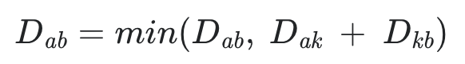

<div align='center'>
  <h1>🔻 Algorithm 🔻</h1>
</div>

> 질문은 <strong>[WeareSoft님의 tech-interview](https://github.com/WeareSoft/tech-interview)</strong>를 참고하였으며, 질문에 대한 답변은 직접 작성하였습니다.

---

## Table of Contents

- [시간, 공간 복잡도](#1)
- [Sort Algorithm](#2)
  - [Bubble Sort](#2-1)
  - [Selection Sort](#2-2)
  - [Insertion Sort](#2-3)
  - [Merge Sort](#2-4)
  - [Heap Sort](#2-5)
  - [Quick Sort](#2-6)
  - [Counting Sort](#2-7)
  - [Radix Sort](#2-8)
- [Divide and Conquer](#3)
- [Dynamic Programming](#4)
- [Greedy Algorithm](#5)
- [Graph](#6)
  - [Graph Traversal: BFS, DFS](#6-1)
  - [Shortest Path](#6-2)
    - [Dijkstra](#6-2-1)
    - [Floyd-Warshall](#6-2-2)
    - [Bellman-Ford](#6-2-3)
  - [Minimum Spanning Tree](#6-3)
    - [Prim](#6-3-1)
    - [Kruskal](#6-3-2)
  - [Union-find](#6-4)
  - [Topological sort](#6-5)

---

## #1

#### 시간, 공간 복잡도

#### References

---

## #2

#### Sort Algorithm

#### References

---

## #2-1

#### Bubble Sort

#### References

---

## #2-2

#### Selection Sort

#### References

---

## #2-3

#### Insertion Sort

#### References

---

## #2-4

#### Merge Sort

#### References

---

## #2-5

#### Heap Sort

#### References

---

## #2-6

#### Quick Sort

#### References

---

## #2-7

#### Counting Sort

#### References

---

## #2-8

#### Radix Sort

#### References

---

## #3

#### Divide and Conquer

#### References

---

## #4

#### Dynamic Programming

#### References

---

## #5

#### Greedy Algorithm

그리디 알고리즘은 현재 단계에서 최선의 방법을 선택하는 알고리즘이다. 가장 큰 값만 선택, 가장 작은 값만 선택 등 한 가지 방법을 정해놓고 다음 단계로 나아가서도 같은 방식으로 문제를 해결한다. 단, 그리디 알고리즘이 적용하기 위해서는 항상 적용될 수 있는지 정당성을 확인해야 한다. 

가장 적은 동전 개수를 거슬러주는 동전 거스름돈 문제를 생각해보자. 
  
1, 5, 10원의 거스름돈이 있다면, **큰 값 먼저 그리디하게** 10원짜리 동전 먼저 되는대로 주고, 다음으로 5원, 남는 돈은 1원으로 처리할 수 있다. 이 경우, 값이 큰 동전들은 값이 작은 동전으로 나눠질 수 있으므로 작은 동전으로 새로운 단위를 만들 수 없기 때문에 그리디 알고리즘이 성립한다.

만약 위 문제에서 거스름돈이 1, 7, 10원이라면 어떻게 될까? 14원을 거슬러주기 위해 그리디 알고리즘을 쓴다면 10원 1개, 1원 4개 총 5개의 동전을 쓸 것이다. 하지만 올바른 답은 7원 2개 총 2개가 필요하다. 이 경우, 10원은 7원으로 나눠질 수 없기 때문에 동적 프로그래밍 알고리즘을 사용하는게 적합하다. 

그리디 알고리즘은 다익스트라 알고리즘 등에도 활용 가능하며, 정렬 등과 함께 사용되는 경우가 많다.

#### References
- [Greedy - Heath.log](https://velog.io/@dldydldy75/Greedy-Algorithm)
- [이것이 코딩테스트다 - 나동빈](https://book.naver.com/bookdb/book_detail.nhn?bid=16439154)
- [탐욕(그리디) 알고리즘(greedy algorithm) - zero cho](https://www.zerocho.com/category/Algorithm/post/584ba5c9580277001862f188)

---

## #6

#### Graph

#### References

---

## #6-1

#### Graph Traversal: BFS, DFS

#### References

---

## #6-2

#### Shortest Path

한 노드에서 다른 노드로 가는 엣지에 cost 가 있는 그래프가 주어졌을 때, 한 지점 -> 목표 지점 또는 모든 지점 -> 모든 지점까지 cost 가 가장 적게 드는 최단 경로를 찾는 문제이다.

대표적인 알고리즘으로 `Dijkstra`, `Floyd-Warshall`, `Bellman-Ford` 가 있다.

## #6-2-1

#### Dijkstra

**한 노드**에서 **다른 모든 노드**까지의 최단 거리를 구하는 최단 경로 알고리즘으로 그리디 알고리즘을 사용한다. 단, cost (거리) 는 반드시 음수가 없어야 한다. 이러한 특성 때문에 GPS 길찾기 등에 응용된다.

기본적인 다익스트라 알고리즘은 다음과 같다.  
1) 먼저 출발 노드를 방문(visited에 기록)하고 갈 수 있는 곳들까지의 거리를 최단 거리 테이블에 기록한다.  
2) 다음으로 테이블을 보고 가장 거리가 짧은 노드를 방문한다.  
3) 다시 해당 노드에서 방문하지 않은 노드 중 갈 수 있는 노드를 보고 테이블의 최단 거리보다 짧다면 테이블을 갱신한다. 
4) 2 와 3 과정을 반복한다.

위 알고리즘의 시간 복잡도는 O(V^2) 이다. 모든 노드에 대해 방문하고 테이블을 모두 살펴보기 때문이다. 이를 개선하기 위해 최단 거리를 찾을 때 heap 을 사용한다. 또한 visited 대신 값을 통해 방문 여부를 확인한다. heap 을 사용한 시간 복잡도는 O(ElogV) 이다.

heap 을 이용한 다익스트라 알고리즘은 다음과 같다.
1) heap 에 출발 노드에 대한 정보 (0, 노드 번호) 를 넣는다.
2) q 에서 출발 노드에 대한 정보를 꺼내고 연결된 노드들까지의 거리를 테이블에 기록한다. 또한 heap 에도 (거리, 노드 번호) 로 넣는다.
3) 2 와 비슷하게 q 에서 노드를 꺼내고 방문한다. 주변에 갈 수 있는 노드들에 대한 정보를 이용하는데, 현재 테이블에 기록된 최단 거리보다 현재 노드에서 갈 수 있는 거리가 더 짧다면 테이블을 갱신하고 heap 에도 정보를 넣는다.
4) min heap 으로 정렬된 q 에서 최소 거리 노드를 꺼내고 3 의 과정을 반복한다. 단, 방문한 노드일 경우 패스한다. 방문한 노드 여부는 테이블에서의 해당 노드 최단 경로가 heap 에서 꺼낸 노드 거리보다 적은 경우 방문했다고 판단한다.
5) q 에 원소가 없을 때까지 반복한다. 

``` python
    import heapq
    import sys
    input = sys.stdin.readline
    INF = int(1e9)

    # 노드 개수, 간선 개수 입력받기
    n, m = map(int, input().split())
    # 시작 노드 번호 입력받기
    start = int(input())
    # 각 노드에 연결되어 있는 노드에 대한 정보를 담는 리스트 만들기
    graph = [[] for i in range(n+1)]
    # 최단 거리 테이블을 모두 무한으로 초기화
    distance = [INF] * (n+1)

    # 모든 간선 정보 입력받기
    for _ in range(m):
    	a, b, c = map(int, input().split())
    	# a 번 노드에서 b 번 노드로 가는 비용이 c 라는 의미
    	graph[a].append((b, c))

    def dijkstra(start):
    	q = []
    	# 시작 노드로 가기 위한 최단 경로는 0 으로 설정하여, 큐에 삽입
    	heapq.heappush(q, (0, start))
    	distance[start] = 0
    	while q: # 큐가 비어있지 않다면
    		# 가장 최단 거리가 짧은 노드에 대한 정보 꺼내기
    		dist, now = heapq.heappop(q)
    		# 현재 노드가 이미 처리된 적이 있는 노드면 무시
    		if distance[now] < dist:
    			continue
    		# 현재 노드와 연결된 다른 인접한 노드들을 확인
    		for to_other in graph[now]:
    			cost = dist + to_other[1]
    			if distance[to_other[0]] > cost:
    				distance[to_other[0]] = cost
    				heapq.heappush(q, (cost, to_other[0]))

    # 다익스트라 알고리즘 수행
    dijkstra(start)

    # 모든 노드로 가기 위한 최단 거리를 출력
    for i in range(1, n+1):
    	# 도달할 수 없는 경우, 무한으로 출력
    	if distance[i] == INF:
    		print("INFINITY")
 	else:
 		print(distance[i])
```

#### References
- [Shortest Path - Heath.log](https://velog.io/@dldydldy75/Shortest-Path)
- [이것이 코딩테스트다 - 나동빈](https://book.naver.com/bookdb/book_detail.nhn?bid=16439154))

---

## #6-2-2

#### Floyd-Warshall

모든 지점에서 모든 지점까지의 최단 경로를 구하는 알고리즘이다. 

A -> B 를 거리를 구할 때, 특정 노드 X 를 중간에 거쳐 가는 값과 기존의 최단 경로 테이블 값 중 어느 것이 짧은지 비교하는 것이 핵심이다. 이 과정에서 X 를 모든 노드로 바꿔가며 진행하면 된다.

모든 노드에 대해 해당 노드를 거쳐 가는 경우를 계산하므로 플로이드-워셜 알고리즘의 시간 복잡도는 O(V^3) 이다.

다익스트라가 그리디한 방식이었다면, 플로이드-워셜은 점화식을 통해 테이블을 갱신하기 때문에 DP 를 사용하는 방식이다.

<div align='center'>
    
</div>
<br/>

``` python
INF = int(1e9) # 무한을 의미하는 값으로 10 억을 설정

# 노드의 개수 및 간선의 개수를 입력받기
n = int(input())
m = int(input())
# 2 차원 리스트 (그래프 표현) 를 만들고, 모든 값을 무한으로 초기화
graph = [[INF] * (n+1) for _ in range(n+1)]

# 자기 자신에서 자기 자신으로 가는 비용은 0 으로 초기화
for i in range(1, n+1):
	graph[i][i] = 0

# 각 간선에 대한 정보를 입력받아, 그 값으로 초기화
for _ in range(m):
	# A 에서 B 로 가는 비용은 C 라고 설정
	a, b, c = map(int, input().split())
	graph[a][b] = c

# 점화식에 따라 플로이드 워셜 알고리즘을 수행
for k in range(1, n+1):
	for a in range(1, n+1):
		for b in range(1, n+1):
			graph[a][b] = min(graph[a][b], graph[a][k] + graph[k][b])

# 수행된 결과를 출력
for a in range(1, n+1):
	for b in range(1, n+1):
		# 도달할 수 없는 경우, 무한으로 출력
		if graph[a][b] == INF:
			print("INFINITY")
		else:
			print(graph[a][b], end = ' ')
	print()
```

#### References
- [Shortest Path - Heath.log](https://velog.io/@dldydldy75/Shortest-Path)
- [플로이드 와샬 알고리즘 - 안경잡이개발자](https://blog.naver.com/ndb796/221234427842)

---

## #6-2-3

#### Bellman-Ford

다익스트라 알고리즘은 간선이 음수인 경우 음수 사이클에 빠질 수 있기 때문에 사용할 수 없다. 벨만 포드 알고리즘을 사용하면 음수 사이클을 찾을 수 있다.

기본적인 개념은 **모든 엣지**를 거치면서 최단거리를 찾는 것이다. 이 작업을 모든 노드에 대해 진행한다. 시간 복잡도는 O(VE) 이다.

**과정**  
1) 출발 노드를 설정한다.    
2) 최단 거리 테이블을 출발 노드는 0 나머지는 INF 로 초기화한다.  
3) V-1 번 아래 과정을 수행한다.  
- 모든 E 를 확인하며 테이블 값보다 (현재 노드 최단거리 + 현재노드에서 해당 노드로 가는 거리)가 작다면 테이블을 갱신한다.

이후 음수 사이클을 확인하기 위해서는 3 의 과정을 한 번만 더 수행한다. 이 때, 테이블이 갱신된다면 음수 테이블이 있는 것이다.

다익스트라 알고리즘은 최적의 해를 찾는데 비해, 벨만 포드 알고리즘은 모든 간선을 모든 노드 개수만큼 반복하는 점에서 비효율적이다. 하지만 음수 사이클을 처리할 수 있는 점이 특징이다. 

``` python
import sys
input = sys.input.readline
INF = int(1e9)

def bf(start):
  dist[start] = 0
  for i in range(n):
    for j in range(m):
      cur = edges[j][0]
      next_node = edges[j][1]
      cost = edges[j][2]
      if dist[cur] != INF and dist[next_node] > dist[cur] + cost:
        dist[next_node] = dist[cur] + cost
        if i == n - 1:
          return True
  return False

n, m = map(int, input().split())
edges = []
dist = [INF] * (n+1)

for _ in range(m):
  a, b, c = map(int, input().split())
  edges.append(a, b, c)

start = 1
negative_cycle = bf(start)

if negative_cycle:
  print("negative cycle")
else:
  for i in range(2, n+1):
    if dist[i] == INF:
      print("INF")
    else:
      print(dist[i])
```

#### References
- [[Python] 최단 경로 - 벨만 포드(Bellman-Ford) 알고리즘 구현하기 - younge.log](https://velog.io/@younge/Python-%EC%B5%9C%EB%8B%A8-%EA%B2%BD%EB%A1%9C-%EB%B2%A8%EB%A7%8C-%ED%8F%AC%EB%93%9CBellman-Ford-%EC%95%8C%EA%B3%A0%EB%A6%AC%EC%A6%98)
- [[알고리즘] 벨만-포드 알고리즘(Bellman-Ford Algorithm) - 딥러닝 공부방](https://deep-learning-study.tistory.com/587)

---

## #6-3

#### Minimum Spanning Tree

#### References

---

## #6-3-1

#### Prim

#### References

---

## #6-3-2

#### Kruskal

#### References

---

## #6-4

#### Union-find

#### References

---

## #6-5

#### Topological sort

#### References

---
