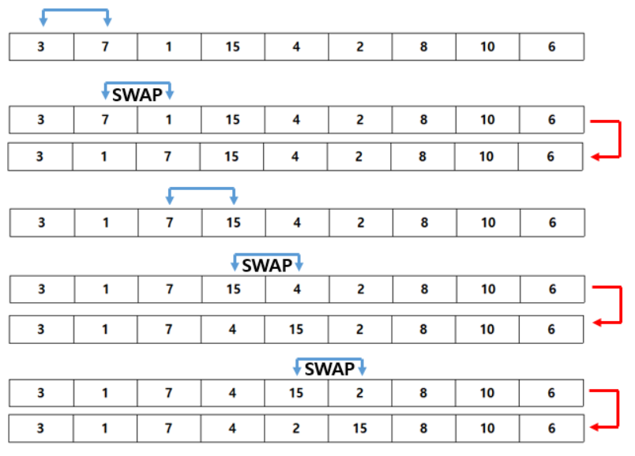
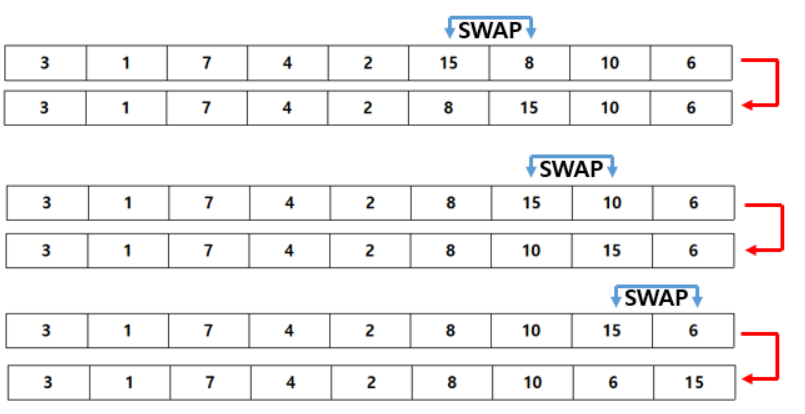
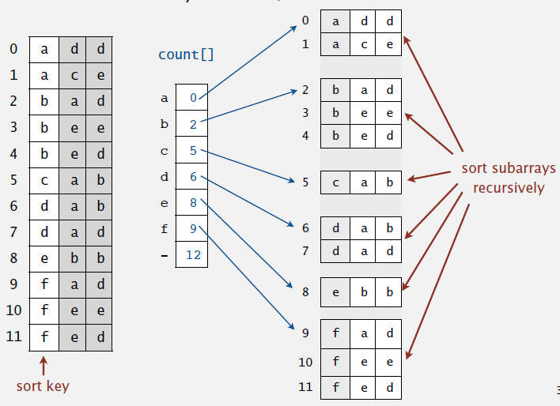

<div align='center'>
  <h1>🔻 Algorithm 🔻</h1>
</div>

> 질문은 <strong>[WeareSoft님의 tech-interview](https://github.com/WeareSoft/tech-interview)</strong>를 참고하였으며, 질문에 대한 답변은 직접 작성하였습니다.

---

## Table of Contents

- [시간, 공간 복잡도](#1)
- Sort Algorithm
  - [Bubble Sort](#2-1)
  - [Selection Sort](#2-2)
  - [Insertion Sort](#2-3)
  - [Merge Sort](#2-4)
  - [Heap Sort](#2-5)
  - [Quick Sort](#2-6)
  - [Counting Sort](#2-7)
  - [Radix Sort](#2-8)
- [Divide and Conquer](#3)
- [Dynamic Programming](#4)
- [Greedy Algorithm](#5)
- [Graph](#6)
  - [Graph Traversal: BFS, DFS](#6-1)
  - [Shortest Path](#6-2)
    - [Dijkstra](#6-2-1)
    - [Floyd-Warshall](#6-2-2)
    - [Bellman-Ford](#6-2-3)
  - [Minimum Spanning Tree](#6-3)
    - [Prim](#6-3-1)
    - [Kruskal](#6-3-2)
  - [Union-find](#6-4)
  - [Topological sort](#6-5)

---

## #1

#### 시간, 공간 복잡도

복잡도란 알고리즘의 성능을 평가하는 척도로 <strong>시간 복잡도(Time Complexity)</strong>와 <strong>공간 복잡도(Space Complexity)</strong>로 나뉜다.

- 시간 복잡도(Time Complexity): 알고리즘에 사용되는 연산 횟수의 총량
- 공간 복잡도(Space Complexity): 알고리즘에 사용되는 메모리 공간의 총량

즉, 시간 복잡도는 속도에 대한 분석 결과이고, 공간 복잡도는 메모리 사용량에 대한 분석 결과이다.

알고리즘의 복잡도는 점근적 표기법으로 나타내는데, 점근적 표기법에는 대표적으로 O(빅오), Ω(오메가), Θ(세타)가 있다.

- O Noation (빅오 표기법)
  - 점근적 상한선
  - 최악의 경우
- Ω Notation (오메가 표기법)
  - 점근적 하한선
  - 최상의 경우
- θ Notation (세타 표기법)
  - 점근적 상한선과 점근적 하한선의 교집합
  - 평균의 경우

일반적으로 최악의 경우의 성능을 측정하는 빅오 표기법을 많이 사용한다.

<div align='center'>
    
</div>
<br>

#### References

- [알고리즘의 시간 복잡도와 Big-O 쉽게 이해하기 - Chulgil.Lee](https://blog.chulgil.me/algorithm/)
- [시간복잡도와 공간복잡도(Time Complexity Space Complexity) - 오늘도 MadPlay!](https://madplay.github.io/post/time-complexity-space-complexity)
- [[컴퓨터 알고리즘 성능분석] 점근적 표기법 (Asymptotic Notation) - 될성부른떡잎](https://ledgku.tistory.com/31)

---

## #2-1

#### Bubble Sort

버블 정렬(Bubble Sort)은 배열의 0번부터 N-1번까지 탐색을 하면서 인접한 칸과 비교하여 swap을 하는 방식의 정렬 알고리즘이다.

<div align='center'>
    
</div>
<div align='center'>
    
</div>
<br>

위의 과정이 버블 정렬을 1회 실시하고 나서의 결과이다. j번째 값과 j+1번째 값을 비교해서 만약 j번째 값이 더 크다면 swap을 해주는 식으로 동작한다.

> 시간 복잡도

<!-- $O(N^2)$ --> 

> 파이썬 구현
```python
def bubbleSort(alist):
    for passnum in range(len(alist)-1, 0, -1):
        for i in range(passnum):
            if alist[i] > alist[i+1]:
                temp = alist[i]
                alist[i] = alist[i+1]
                alist[i+1] = temp
```

#### References

- [[ 정렬 ] 버블정렬 (Bubble Sort) (C++) - 얍문's Coding World..](https://yabmoons.tistory.com/241)
- [버블정렬 - ratsgo's blog](https://ratsgo.github.io/data%20structure&algorithm/2017/11/05/bubblesort/)
- [6.7. The Bubble Sort - Problem Solving with Algorithms and Data Structures using Python](https://runestone.academy/runestone/books/published/pythonds/SortSearch/TheBubbleSort.html)

---

## #2-2

#### Selection Sort

선택 정렬(Selection Sort)은 위치 변경 횟수를 줄여, 버블 정렬을 일부 개선한 기법이다. 주어진 배열 중에 최댓값을 찾아 정렬되지 않은 배열의 맨 뒤의 값과 자리를 바꾸어나가는 정렬 알고리즘이다. 배열의 맨 뒤부터 차례로 정렬이 된다.

<div align='center'>
    
</div>
<br>

버블 정렬은 왼쪽에 있는 값이 비교 대상인 오른쪽에 있는 값보다 크면 자리를 바꿔줬는데 반해, 선택 정렬은 일단 최댓값(혹은 최솟값)을 찾은 뒤에야 이 값을 정해진 위치로 보내주게 된다. 다시 말해 비교 횟수 측면에서는 버블 정렬과 선택 정렬이 같고 둘 모두 <!-- $O(n^2)$ --> 의 계산 복잡성을 갖지만 자리 이동(swap)측면에서는 선택 정렬이 효율적이다.

> 시간 복잡도

<!-- $O(N^2)$ --> 

> 파이썬 구현
```python
def selectionSort(alist):
   for fillslot in range(len(alist)-1, 0, -1):
       positionOfMax = 0
       for location in range(1, fillslot+1):
           if alist[location] > alist[positionOfMax]:
               positionOfMax = location

       temp = alist[fillslot]
       alist[fillslot] = alist[positionOfMax]
       alist[positionOfMax] = temp
```

#### References

- [[ 정렬 ] 선택 정렬 (Selection Sort) (C++) - 얍문's Coding World..](https://yabmoons.tistory.com/242)
- [선택정렬 - ratsgo's blog](https://ratsgo.github.io/data%20structure&algorithm/2017/11/06/selectionsort/)
- [6.8. The Selection Sort - Problem Solving with Algorithms and Data Structures using Python](https://runestone.academy/runestone/books/published/pythonds/SortSearch/TheSelectionSort.html)

---

## #2-3

#### Insertion Sort

삽입 정렬(Insertion Sort)은 배열의 모든 요소를 배열의 시작부터 끝까지 현재 배열의 요소들과 비교해 가면서 적절한 위치에 삽입하는 정렬 알고리즘이다.

<div align='center'>
    
</div>
<br>

> 시간 복잡도
- 최악의 경우(Worst): <!-- $O(N^2)$ --> 
- 평균적인 경우(Average): <!-- $O(N^2)$ --> 
- 최선의 경우(Best): <!-- $O(N)$ --> 

> 파이썬 구현
```python
def insertion_sort(collection):
    for index in range(1, len(collection)):
        while 0 < index and collection[index] < collection[index - 1]: 
            collection[index], collection[
                index - 1] = collection[index - 1], collection[index]
            index -= 1

    return collection
```

#### References

- [[ 정렬 ] 삽입 정렬 (Insertion Sort) (C++) - 얍문's Coding World..](https://yabmoons.tistory.com/243)
- [삽입정렬(Insertion Sort) - ratsgo's blog](https://ratsgo.github.io/data%20structure&algorithm/2017/09/06/insmersort/)
- [6.9. The Insertion Sort - Problem Solving with Algorithms and Data Structures using Python](https://runestone.academy/runestone/books/published/pythonds/SortSearch/TheInsertionSort.html)

---

## #2-4

#### Merge Sort

합병 정렬(Merge Sort)는 배열을 잘게 쪼갠 뒤 둘씩 크기를 비교해 정렬하고 분리된 리스트를 재귀적으로 합쳐서 정렬을 완성하는 정렬 알고리즘이다. 분할된 배열을 저장해둘 공간이 필요해 메모리 소모량이 큰 편이다. 문제를 분리하고 각각을 해결한 후 다시 합치는 Divide & Conquer 방식을 사용한다.

- Divide: 초기 배열을 2개의 배열로 분할한다.
- Conquer: 각 부분 배열을 재귀적으로 병합 정렬을 사용하여 정렬한다.
- Merge: 부분 배열을 하나의 배열로 결합한다.

<div align='center'>
    
</div>
<br>

> 시간 복잡도

<!-- $O(N \log N)$ --> 

> 파이썬 구현
```python
def merge_sort(list):
    if len(list) <= 1:
        return list
    mid = len(list) // 2
    leftList = list[:mid]
    rightList = list[mid:]
    leftList = merge_sort(leftList)
    rightList = merge_sort(rightList)
    return merge(leftList, rightList)
```

#### References

- [[ 정렬 ] 병합 정렬 (Merge Sort) (C++) - 얍문's Coding World..](https://yabmoons.tistory.com/245)
- [합병정렬(Merge Sort) - ratsgo's blog](https://ratsgo.github.io/data%20structure&algorithm/2017/10/03/mergesort/)
- [6.11. The Merge Sort - Problem Solving with Algorithms and Data Structures using Python](https://runestone.academy/runestone/books/published/pythonds/SortSearch/TheMergeSort.html)

---

## #2-5

#### Heap Sort

힙 정렬(Heap Sort)은 완전 이진 트리로 구현되는 정렬 방식으로, 모든 노드가 힙 속성(각 노드의 값이 자신의 자식 노드 값보다 큰 이진 트리)을 만족하도록 재귀적으로 트리 구조를 만들어 정렬을 완성하는 정렬 알고리즘이다.

<div align='center'>
    
</div>
<br>

> 동작 원리

1. 주어진 원소들로 최대 힙을 구성한다.
2. 현재 힙의 루트 노드에는 최대값이 존재하게 된다. 루트의 값을 마지막 요소와 바꾼 후, 힙의 사이즈를 하나 줄인다.
3. 힙의 사이즈가 1보다 크면 위 과정을 반복한다.


> 시간 복잡도

<!-- $O(N \log N)$ --> 

> 파이썬 구현
```python
def heapify(unsorted, index, heap_size):
    largest = index
    left_index = 2 * index + 1
    right_index = 2 * index + 2
    if left_index < heap_size and unsorted[left_index] > unsorted[largest]:
        largest = left_index
    if right_index < heap_size and unsorted[right_index] > unsorted[largest]:
        largest = right_index
    if largest != index:
        unsorted[largest], unsorted[index] = unsorted[index], unsorted[largest]
        heapify(unsorted, largest, heap_size)

def heap_sort(unsorted):
    n = len(unsorted)
    for i in range(n//2-1, -1, -1):
        heapify(unsorted, i, n)
    for i in range(n-1, 0, -1):
        unsorted[0], unsorted[i] = unsorted[i], unsorted[0]
        heapify(unsorted, 0, i)
    return unsorted
```

#### References

- [[ 정렬 ] 힙 정렬 (Heap Sort) (C++) - 얍문's Coding World..](https://yabmoons.tistory.com/246)
- [힙 정렬(Heap Sort) - ratsgo's blog](https://ratsgo.github.io/data%20structure&algorithm/2017/09/27/heapsort/)
- [힙정렬(Heap Sort) 알고리즘 :: 마이구미 - 마이구미의 HelloWorld](https://mygumi.tistory.com/310)

---

## #2-6

#### Quick Sort

퀵 정렬(Quick Sort)는 pivot을 기준으로 pivot 앞에는 pivot보다 작은 값, 뒤에는 큰 값이 오도록 하여 배열을 분할하고, 분할된 두 개 배열 각각에 재귀적으로 이 과정을 반복해 정렬을 완성하는 정렬 알고리즘이다. 합병 정렬과 달리 주어진 배열을 임의로 나누지 않기 때문에 대개는 효율적이지만, pivot이 잘못 선택되면 복잡도가 <!-- $O(n^2)$ --> 이 될 수도 있다.

<div align='center'>
    
</div>
<div align='center'>
    
</div>
<br>

위의 과정이 퀵 정렬을 1회 실시하고 나서의 결과이다. 54(pivot)를 기준으로 두 개의 배열로 나뉜다.

> 시간 복잡도
- 최악의 경우(Worst): <!-- $O(N^2)$ --> 
- 평균적인 경우(Average): <!-- $O(N \log N)$ --> 
- 최선의 경우(Best): <!-- $O(N \log N)$ --> 

> 파이썬 구현
```python
def quickSort(alist):
   quickSortHelper(alist, 0, len(alist)-1)

def quickSortHelper(alist, first, last):
   if first < last:

       splitpoint = partition(alist, first, last)

       quickSortHelper(alist, first, splitpoint-1)
       quickSortHelper(alist, splitpoint+1, last)


def partition(alist, first, last):
   pivotvalue = alist[first]

   leftmark = first + 1
   rightmark = last

   done = False
   while not done:

       while leftmark <= rightmark and alist[leftmark] <= pivotvalue:
           leftmark = leftmark + 1

       while alist[rightmark] >= pivotvalue and rightmark >= leftmark:
           rightmark = rightmark -1

       if rightmark < leftmark:
           done = True
       else:
           temp = alist[leftmark]
           alist[leftmark] = alist[rightmark]
           alist[rightmark] = temp

   temp = alist[first]
   alist[first] = alist[rightmark]
   alist[rightmark] = temp

   return rightmark
```

#### References

- [[ 정렬 ] 퀵 정렬(Quick Sort) (C++) - 얍문's Coding World..](https://yabmoons.tistory.com/244)
- [퀵 정렬(Quick Sort) - ratsgo's blog](https://ratsgo.github.io/data%20structure&algorithm/2017/09/28/quicksort/)
- [6.12. The Quick Sort - Problem Solving with Algorithms and Data Structures using Python](https://runestone.academy/runestone/books/published/pythonds/SortSearch/TheQuickSort.html)

---

## #2-7

#### Counting Sort

계수 정렬(Counting Sort)은 입력값의 빈도를 세어서 이를 결과 리스트의 인덱스로 활용하고 입력 리스트의 요소값에 해당하는 결과 리스트 인덱스 위치에 채워 넣는 방식으로 정렬을 완성하는 정렬 알고리즘이다. 입력 리스트의 최댓값(k)이 커질수록 복잡도가 크게 높아진다.

<div align='center'>
    
</div>
<br>

> 동작 원리
1. 각 데이터의 개수를 모두 count 한다.
2. 최솟값부터 각 값까지의 count 누적합을 구한다.
3. 새로운 배열에 누적합의 개수를 줄여주며 저장한다.

> 시간 복잡도

<!-- $O(N+k)$ --> , <!-- $k$ --> : 데이터의 최댓값

> 파이썬 구현
```python
def counting_sort(A, k):
    B = [-1] * len(A)
    C = [0] * (k + 1)
    
    for a in A:
        C[a] += 1
    
    for i in range(k):
        C[i+1] += C[i]
    
    for j in reversed(range(len(A))):
    	B[C[A[j]] - 1] = A[j]
    	C[A[j]] -= 1

    return B
```

#### References

- [[ 정렬 ] 카운팅 정렬(Counting Sort) (C++) - 얍문's Coding World..](https://yabmoons.tistory.com/249)
- [카운팅 정렬, 래딕스 정렬 - ratsgo's blog](https://ratsgo.github.io/data%20structure&algorithm/2017/10/16/countingsort/)
- [Counting Sort in C++ - prepinsta](https://prepinsta.com/cpp-program/counting-sort/)

---

## #2-8

#### Radix Sort

기수 정렬(Radix Sort)은 입력값의 자릿수(d) 각각에 대해 카운팅 정렬을 적용하여 입력 데이터의 최댓값인 k가 커질수록 효율이 떨어지는 카운팅 정렬의 단점을 보완한 정렬 알고리즘이다. 10진법으로 표현된 입력값에 기수 정렬을 적용하면 k 값이 9로 작아진다.

<div align='center'>
    
</div>
<br>

> 시간 복잡도

$d \times O(N)$, $d$: 입력값의 자릿수

> 파이썬 구현
```python
from math import log

def get_digit(number, d, base):
    return (number//base**d) % base

def counting_sort_with_digit(A, d, base):
    k = base - 1
    B = [-1] * len(A)
    C = [0] * (k + 1)
    for a in A:
        C[get_digit(a, d, base)] += 1
    for i in range(k):
        C[i+1] += C[i]
    for j in reversed(range(len(A))):
        B[C[get_digit(A[j], d, base)]-1] = A[j]
        C[get_digit(A[j], d, base)] -= 1
    return B

def radix_sort(list, base=10):
    digit = int(log(max(list), base)+1)
    for d in range(digit):
        list = counting_sort_with_digit(list, d, base)
    return list
```

#### References

- [[ 정렬 ] 기수 정렬 (Radix Sort) (C++) - 얍문's Coding World..](https://yabmoons.tistory.com/248)
- [카운팅 정렬, 래딕스 정렬 - ratsgo's blog](https://ratsgo.github.io/data%20structure&algorithm/2017/10/16/countingsort/)

---

## #3

#### Divide and Conquer

#### References

---

## #4

#### Dynamic Programming

#### References

---

## #5

#### Greedy Algorithm

#### References

---

## #6

#### Graph

#### References

---

## #6-1

#### Graph Traversal: BFS, DFS

#### References

---

## #6-2

#### Shortest Path

#### References

---

## #6-2-1

#### Dijkstra

#### References

---

## #6-2-2

#### Floyd-Warshall

#### References

---

## #6-2-3

#### Bellman-Ford

#### References

---

## #6-3

#### Minimum Spanning Tree

#### References

---

## #6-3-1

#### Prim

#### References

---

## #6-3-2

#### Kruskal

#### References

---

## #6-4

#### Union-find

#### References

---

## #6-5

#### Topological sort

#### References

---
