## 📝 Table of Contents

- [딥러닝은 무엇인가요? 딥러닝과 머신러닝의 차이는?](#1)
- [Cost Function과 Activation Function은 무엇인가요?](#2)
- [Tensorflow, PyTorch 특징과 차이가 뭘까요?](#3)
- [Data Normalization은 무엇이고 왜 필요한가요?](#4)
- [알고있는 Activation Function에 대해 알려주세요. (Sigmoid, ReLU, LeakyReLU, Tanh 등)](#5)
- [오버피팅일 경우 어떻게 대처해야 할까요?](#6)
- [하이퍼 파라미터는 무엇인가요?](#7)
- [Weight Initialization 방법에 대해 말해주세요. 그리고 무엇을 많이 사용하나요?](#8)
- [볼츠만 머신은 무엇인가요?](#9)
- [TF, PyTorch 등을 사용할 때 디버깅 노하우는?](#10)
- [뉴럴넷의 가장 큰 단점은 무엇인가? 이를 위해 나온 One-Shot Learning은 무엇인가?](#11)
- [요즘 Sigmoid 보다 ReLU를 많이 쓰는데 그 이유는?](#12)
  - [Non-Linearity라는 말의 의미와 그 필요성은?](#12-1)
  - [ReLU로 어떻게 곡선 함수를 근사하나?](#12-2)
  - [ReLU의 문제점은?](#12-3)
  - [Bias는 왜 있는걸까?](#12-4)
- [Gradient Descent에 대해서 쉽게 설명한다면?](#13)
  - [왜 꼭 Gradient를 써야 할까? 그 그래프에서 가로축과 세로축 각각은 무엇인가? 실제 상황에서는 그 그래프가 어떻게 그려질까?](#13-1)
  - [GD 중에 때때로 Loss가 증가하는 이유는?](#13-2)
  - [Back Propagation에 대해서 쉽게 설명 한다면?](#13-3)
- [Local Minima 문제에도 불구하고 딥러닝이 잘 되는 이유는?](#14)
  - [GD가 Local Minima 문제를 피하는 방법은?](#14-1)
  - [찾은 해가 Global Minimum인지 아닌지 알 수 있는 방법은?](#14-2)
- [Training 세트와 Test 세트를 분리하는 이유는?](#15)
  - [Validation 세트가 따로 있는 이유는?](#15-1)
  - [Test 세트가 오염되었다는 말의 뜻은?](#15-2)
  - [Regularization이란 무엇인가?](#15-3)
- [Batch Normalization의 효과는?](#16)
  - [Dropout의 효과는?](#16-1)
  - [BN 적용해서 학습 이후 실제 사용시에 주의할 점은? 코드로는?](#16-2)
  - [GAN에서 Generator 쪽에도 BN을 적용해도 될까?](#16-3)
- [SGD, RMSprop, Adam에 대해서 아는대로 설명한다면?](#17)
  - [SGD에서 Stochastic의 의미는?](#17-1)
  - [미니배치를 작게 할때의 장단점은?](#17-2)
  - [모멘텀의 수식을 적어 본다면?](#17-3)
- [간단한 MNIST 분류기를 MLP+CPU 버전으로 numpy로 만든다면 몇줄일까?](#18)
  - [어느 정도 돌아가는 녀석을 작성하기까지 몇시간 정도 걸릴까?](#18-1)
  - [Back Propagation은 몇줄인가?](#18-2)
  - [CNN으로 바꾼다면 얼마나 추가될까?](#18-3)
- [간단한 MNIST 분류기를 TF, PyTorch 등으로 작성하는데 몇시간이 필요한가?](#19)
  - [CNN이 아닌 MLP로 해도 잘 될까?](#19-1)
  - [마지막 레이어 부분에 대해서 설명 한다면?](#19-2)
  - [학습은 BCE loss로 하되 상황을 MSE loss로 보고 싶다면?](#19-3)
- [딥러닝할 때 GPU를 쓰면 좋은 이유는?](#20)
  - [학습 중인데 GPU를 100% 사용하지 않고 있다. 이유는?](#20-1)
  - [GPU를 두개 다 쓰고 싶다. 방법은?](#20-2)
  - [학습시 필요한 GPU 메모리는 어떻게 계산하는가?](#20-3)

---

## #1

#### 딥러닝은 무엇인가요? 딥러닝과 머신러닝의 차이는?

#### References

---

## #2

#### Cost Function과 Activation Function은 무엇인가요?

#### References

---

## #3

#### Tensorflow, PyTorch 특징과 차이가 뭘까요?

|구분|Tensorflow|PyTorch|
|---|---|---|
|패러다임|Define and Run|Define by Run|
|그래프 형태|Static graph(정적)|Dynamic graph(동적)|

Tensorflow와 Pytorch의 가장 큰 차이점은 딥러닝을 구현하는 패러다임이 다르다는 것이다. Tensorflow는 **Define-and-Run**인 반면에, Pytorch는 **Define-by-Run**이다.

> <strong>Define and Run (Tensorflow)</strong> 코드를 직접 돌리는 환경인 세션을 만들고, placeholder를 선언하고 이것으로 계산 그래프를 만들고(Define), 코드를 실행하는 시점에 데이터를 넣어 실행하는(Run) 방식으로 이는 계산 그래프를 명확히 보여주면서 실행시점에 데이터만 바꿔줘도 되는 유연함을 장점으로 갖지만, 그 자체로 비직관적이다.

> <strong>Define by Run (PyTorch)</strong> 선언과 동시에 데이터를 집어넣고 세션도 필요없이 돌리면 되기때문에 코드가 간결하고 난이도가 낮은 편이다.

이 패러다임의 차이로 Tensorflow의 경우 먼저 모델을 만들고 값을 다 따로 넣어주어야 해서 직관적이지 않지만, Pytorch의 경우 간단하고 직관적이다.

두 프레임워크 모두 계산 그래프를 정의하고 자동으로 그래디언트를 계산하는 기능이 있다. 하지만 Tensorflow의 계산 그래프는 정적이고 Pytorch는 동적이다. 즉 Tensorflow에서는 계산 그래프를 한 번 정의하고 나면 그래프에 들어가는 입력 데이터만 다르게 할 수 있을 뿐 같은 그래프만을 실행할 수 있다. 하지만 PyTorch는 각 순전파마다 새로운 계산 그래프를 정의하여 이용한다.

#### References

- [PyTorch - 위키백과](https://ko.wikipedia.org/wiki/PyTorch)
- [3. PyTorch VS TensorFlow - Dev](https://dev-jm.tistory.com/4)

---

## #4

#### Data Normalization은 무엇이고 왜 필요한가요?

#### References

---

## #5

#### 알고있는 Activation Function에 대해 알려주세요. (Sigmoid, ReLU, LeakyReLU, Tanh 등)

#### References

---

## #6

#### 오버피팅일 경우 어떻게 대처해야 할까요?

**Regularization**

Generalization이 잘되도록 모델에 제약을 주며 학습을 하여 overfitting을 방지하는 방법

- Early stopping
  - training loss는 계속 낮아지더라도 validation loss는 올라가는 시점을 overfitting으로 간주하여 학습을 종료하는 방법

  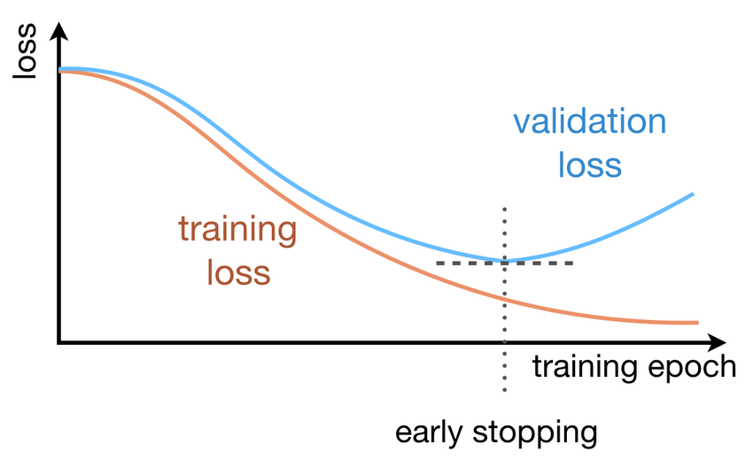

- Parameter norm penalty (weight decay)
  - 비용함수에 제곱을 더하거나(<!-- $L_2$ --> 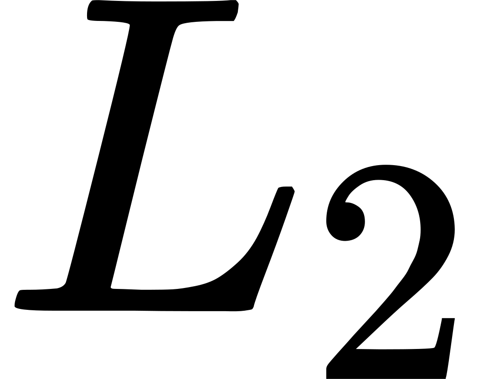-Regularization) 절댓값을 더해서(<!-- $L_1$ --> 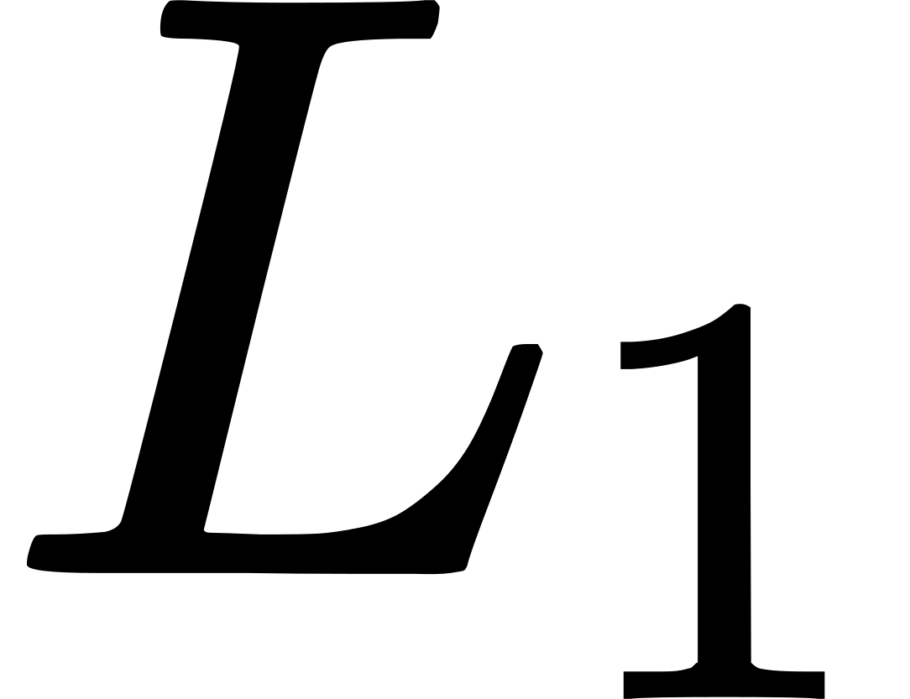-Regularization) weight의 크기에 페널티를 부과하는 방법

  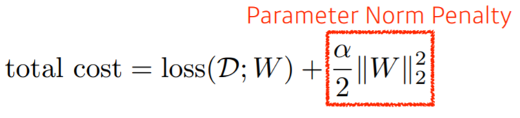

- Data augmentation
  - 훈련 데이터의 개수가 적을 때, 데이터에 인위적으로 변화를 주어 훈련 데이터의 수를 늘리는 방법

  

- Noise robustness
  - 노이즈나 이상치같은 엉뚱한 데이터가 들어와도 흔들리지 않는(robust 한) 모델을 만들기 위해 input data나 weight에 일부러 노이즈를 주는 방법

  

- Label smoothing
  - 모델이 Ground Truth를 정확하게 예측하지 않아도 되게 만들어 주어 정확하지 않은 학습 데이터셋에 치중되는 경향(overconfident)을 막아주는 방법

    

- Dropout
  - 각 계층 마다 일정 비율의 뉴런을 임의로 정해 drop 시키고 나머지 뉴런만 학습하도록 하는 방법

  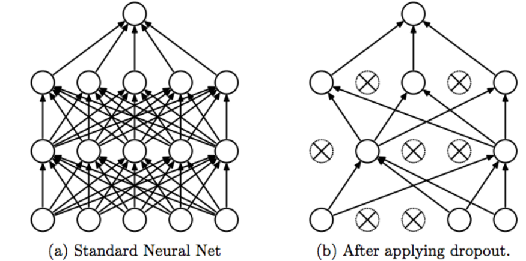

- Batch normalization
  - 활성화함수의 활성화값 또는 출력값을 정규화하는 방법
  - 각 hidden layer에서 정규화를 하면서 입력분포가 일정하게 되고, 이에 따라 Learning rate을 크게 설정해도 괜찮아진다. 결과적으로 학습속도가 빨라지는 효과가 있다.

  

#### References

- [인공신경망 ( ANN ) #6-3 최적화 : 오버피팅 방지( weight decay, droupout ) / 하이퍼파라미터 최적화 - 엄범](https://umbum.dev/222)
- [딥러닝6. Dropout & Early stopping을 통한 최적화 - 살아가는동안](https://m.blog.naver.com/jeonghj66/222004874975)
- [[딥러닝개념] 딥러닝 효과적으로 학습하기(2) (ft. regularization) - WE GONNA MAKE IT](https://wegonnamakeit.tistory.com/9)
- [[Label Smoothing] 요약 정리 - Computer Vision :)](https://cvml.tistory.com/9)
- [문과생도 이해하는 딥러닝 (10) - 배치 정규화 - 데이터 분석하는 문과생, 싸코](https://sacko.tistory.com/44)

---

## #7

#### 하이퍼 파라미터는 무엇인가요?

#### References

---

## #8

#### Weight Initialization 방법에 대해 말해주세요. 그리고 무엇을 많이 사용하나요?

#### References

---

## #9

#### 볼츠만 머신은 무엇인가요?

볼츠만 머신은 가시층(Visible Layer)와 은닉층(Hidden Layer), 총 두 개의 층으로 신경망을 구성하는 방법이다. 볼츠만 머신은 모든 뉴런이 연결되어 있는 완전 그래프 형태이며, 제한된 볼츠만 머신(RBM)에서는 같은 층의 뉴런들은 연결되어 있지 않은 모양이다. 기본적으로 단층구조이며, 확률 모델이다. 분류나 선형 회귀 분석 등에 사용될 수 있다. 특히 DBN(Deep Belief Network)에서는 RBM들을 쌓아올려, 각 볼츠만 머신을 순차적으로 학습시킨다.

#### References

- [Interview Question & Answer 출근 루틴, 하루 3문제 - YongWook](https://yongwookha.github.io/MachineLearning/2021-01-29-interview-question)
- [Restricted Boltzmann Machine - 공돌이의 수학정리노트](https://angeloyeo.github.io/2020/10/02/RBM.html)

---

## #10

#### TF, PyTorch 등을 사용할 때 디버깅 노하우는?

#### References

---

## #11

#### 뉴럴넷의 가장 큰 단점은 무엇인가? 이를 위해 나온 One-Shot Learning은 무엇인가?

#### References

---

## #12

#### 요즘 Sigmoid 보다 ReLU를 많이 쓰는데 그 이유는?

#### References

---

## #12-1

#### Non-Linearity라는 말의 의미와 그 필요성은?

#### References

---

## #12-2

#### ReLU로 어떻게 곡선 함수를 근사하나?

#### References

---

## #12-3

#### ReLU의 문제점은?

#### References

---

## #12-4

#### Bias는 왜 있는걸까?

#### References

---

## #13

#### Gradient Descent에 대해서 쉽게 설명한다면?

Gradient Descent는 어떤 함수의 극소점을 찾기 위해 gradient 반대 방향으로 이동해 가는 방법이다.

딥러닝에서는 Loss function을 최소화시키기 위해 파라미터에 대해 Loss function을 미분하여 그 기울기값(gradient)을 구하고, 경사가 하강하는 방향으로 파라미터 값을 점진적으로 찾기위해 사용된다.

Gradient Descent를 수식으로 표현하면 아래와 같다.

**Gradient Descent의 문제점**

- 적절한 step size(learning rate)
  - step size가 큰 경우 한 번 이동하는 거리가 커지므로 빠르게 수렴할 수 있다는 장점이 있다. 하지만, step size를 너무 크게 설정해버리면 최소값을 계산하도록 수렴하지 못하고 함수 값이 계속 커지는 방향으로 최적화가 진행될 수 있다.
  - 한편 step size가 너무 작은 경우 발산하지는 않을 수 있지만 최적의 x를 구하는데 소요되는 시간이 오래 걸린다는 단점이 있다.

  

- local minima 문제
  - gradient descent 알고리즘을 시작하는 위치는 매번 랜덤하기 때문에 어떤 경우에는 local minima에 빠져 계속 헤어나오지 못하는 경우도 생긴다.

  

> 자세한 내용은 [#14-1. GD가 Local Minima 문제를 피하는 방법은?](#14-1) 참고

#### References

- [경사하강법(gradient descent) - 공돌이의 수학정리노트](https://angeloyeo.github.io/2020/08/16/gradient_descent.html)
- [Gradient Descent 탐색 방법 - 다크 프로그래머](https://darkpgmr.tistory.com/133)

---

## #13-1

#### 왜 꼭 Gradient를 써야 할까? 그 그래프에서 가로축과 세로축 각각은 무엇인가? 실제 상황에서는 그 그래프가 어떻게 그려질까?

Gradient가 양수이면 올라가는 방향이며 음수이면 내려가는 방향이다. 실제 상황에서는 Gradient 그래프가 0을 중심으로 진동하는 모양이 될 것이다.

#### References

- [Interview Question & Answer 출근 루틴, 하루 3문제 - YongWook](https://yongwookha.github.io/MachineLearning/2021-01-29-interview-question)

---

## #13-2

#### GD 중에 때때로 Loss가 증가하는 이유는?

local minimum에 들어갔다가 나오는 경우일 것이다.

실제로 사용되는 GD에서는 local minima 문제를 피하기 위해 Momentum 등의 개념을 도입한 RMSprop, Adam 등의 optimization 전략을 사용한다.

각 optimization 전략에 따라 gradient가 양수인 방향으로도 parameter update step을 가져가는 경우가 생길 수 있으며, 이 경우에는 Loss가 일시적으로 증가할 수 있다.

> 자세한 내용은 [#17. SGD, RMSprop, Adam에 대해서 아는대로 설명한다면?](#17) 참고

#### References

- [Interview Question & Answer 출근 루틴, 하루 3문제 - YongWook](https://yongwookha.github.io/MachineLearning/2021-01-29-interview-question)

---

## #13-3

#### Back Propagation에 대해서 쉽게 설명 한다면?

역전파 알고리즘은 출력값에 대한 입력값의 기울기(미분값)을 출력층 layer에서부터 계산하여 거꾸로 전파시키는 것이다.

이렇게 거꾸로 전파시켜서 최종적으로 출력층에서의 output값에 대한 입력층에서의 input data의 기울기 값을 구할 수 있다.

이 과정에서 `chain rule`이 이용된다.

출력층 바로 전 layer에서부터 기울기(미분값)을 계산하고 이를 점점 거꾸로 전파시키면서 전 layer들에서의 기울기와 서로 곱하는 형식으로 나아가면 최종적으로 출력층의 output에 대한 입력층에서의 input의 기울기(미분값)을 구할 수가 있다. 이를 그림으로 나타내면 아래와 같다.

역전파 알고리즘이 해결한 문제가 바로 파라미터가 매우 많고 layer가 여러개 있을때 가중치w와 b를 학습시키기 어려웠다는 문제이다.

이는 역전파 알고리즘으로 각 layer에서 기울기 값을 구하고 그 기울기 값을 이용하여 Gradient descent 방법으로 가중치w와 b를 update시키면서 해결되었다.

#### References

- [딥러닝 역전파 backpropagation이란? - 프라이데이](https://ganghee-lee.tistory.com/31)
- [3.14. 순전파(forward propagation), 역전파(back propagation), 연산 그래프 - Dive into Deep Learning](https://ko.d2l.ai/chapter_deep-learning-basics/backprop.html)

---

## #14

#### Local Minima 문제에도 불구하고 딥러닝이 잘 되는 이유는?

#### References

---

## #14-1

#### GD가 Local Minima 문제를 피하는 방법은?

#### References

---

## #14-2

#### 찾은 해가 Global Minimum인지 아닌지 알 수 있는 방법은?

#### References

---

## #15

#### Training 세트와 Test 세트를 분리하는 이유는?

#### References

---

## #15-1

#### Validation 세트가 따로 있는 이유는?

#### References

---

## #15-2

#### Test 세트가 오염되었다는 말의 뜻은?

#### References

---

## #15-3

#### Regularization이란 무엇인가?

#### References

---

## #16

#### Batch Normalization의 효과는?

#### References

---

## #16-1

#### Dropout의 효과는?

#### References

---

## #16-2

#### BN 적용해서 학습 이후 실제 사용시에 주의할 점은? 코드로는?

#### References

---

## #16-3

#### GAN에서 Generator 쪽에도 BN을 적용해도 될까?

#### References

---

## #17

#### SGD, RMSprop, Adam에 대해서 아는대로 설명한다면?

> SGD

Loss Function을 계산할 때 전체 train set을 사용하는 것을 Batch Gradient Descent 라고 한다.

그러나 이렇게 계산을 할 경우 한번 step을 내딛을 때 전체 데이터에 대해 Loss Function을 계산해야 하므로 너무 많은 계산량이 필요하다.

이를 방지하기 위해 보통은 Stochastic Gradient Descent (SGD) 라는 방법을 사용한다.

이 방법에서는 loss function을 계산할 때 전체 데이터(batch) 대신 일부 조그마한 데이터의 모음(mini-batch)에 대해서만 loss function을 계산한다.

이 방법은 batch gradient descent 보다 다소 부정확할 수는 있지만, 훨씬 계산 속도가 빠르기 때문에 같은 시간에 더 많은 step을 갈 수 있으며 여러 번 반복할 경우 보통 batch의 결과와 유사한 결과로 수렴한다.

또한, SGD를 사용할 경우 Batch Gradient Descent에서 빠질 local minima에 빠지지 않고 더 좋은 방향으로 수렴할 가능성도 있다.

> RMSprop

RMSProp은 딥러닝의 대가 제프리 힌톤이 제안한 방법으로서, Adagrad의 단점을 해결하기 위한 방법이다.

Adagrad의 식에서 gradient의 제곱값을 더해나가면서 구한 <!-- $G_t$ -->  부분을 합이 아니라 지수평균으로 바꾸어서 대체한 방법이다.

이렇게 대체를 할 경우 Adagrad처럼 <!-- $G_t$ -->  가 무한정 커지지는 않으면서 최근 변화량의 변수간 상대적인 크기 차이는 유지할 수 있다.

식으로 나타내면 다음과 같다.

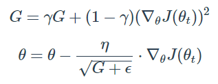

> Adam

Adam(Adaptive Moment Estimation)은 RMSProp과 Momentum 방식을 합친 것 같은 알고리즘이다.

이 방식에서는 Momentum 방식과 유사하게 지금까지 계산해온 기울기의 지수평균을 저장하며, RMSProp과 유사하게 기울기의 제곱값의 지수평균을 저장한다.

다만, Adam에서는 m과 v가 처음에 0으로 초기화되어 있기 때문에 학습의 초반부에서는 <!-- $m_t$ --> ,<!-- $v_t$ --> 가 0에 가깝게 bias 되어있을 것이라고 판단하여 이를 unbiased 하게 만들어주는 작업을 거친다.

<!-- $m_t$ -->  와 <!-- $v_t$ --> 의 식을 ∑ 형태로 펼친 후 양변에 expectation을 씌워서 정리해보면, 다음과 같은 보정을 통해 unbiased 된 expectation을 얻을 수 있다.

이 보정된 expectation들을 가지고 gradient가 들어갈 자리에 <!-- $\widehat{m_t}$ --> 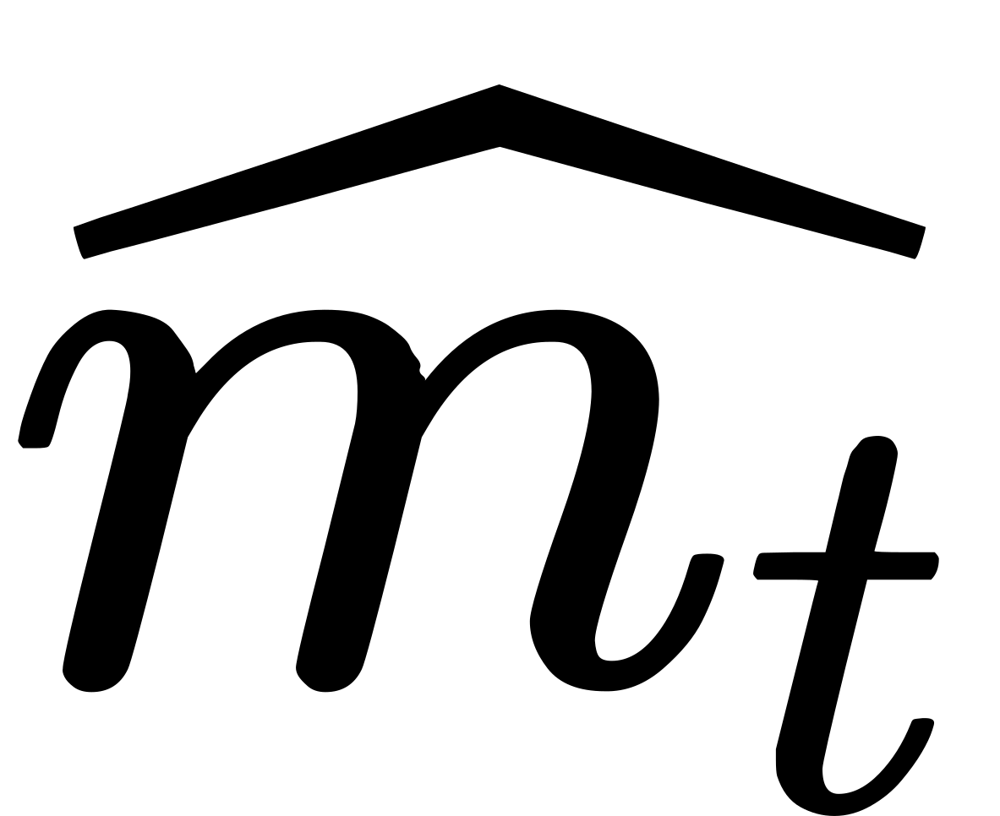, <!-- $G_t$ --> 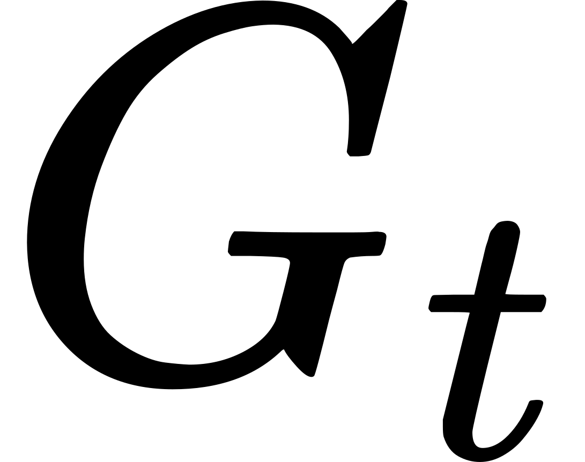가 들어갈 자리에 <!-- $\widehat{v_t}$ --> 를 넣어 계산을 진행한다.

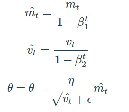

#### References
- [Gradient Descent Optimization Algorithms 정리 - Beomsu Kim's Blog](http://shuuki4.github.io/deep%20learning/2016/05/20/Gradient-Descent-Algorithm-Overview.html)
- [딥러닝 Optimization 함수 정리 - rueki](https://rueki.tistory.com/187)
---

## #17-1

#### SGD에서 Stochastic의 의미는?

SGD는 Loss Function을 계산할 때 전체 train dataset을 사용하는 Batch Gradient Descent와 다르게 일부 조그마한 데이터의 모음(mini-batch)에 대해서만 loss function을 계산한다.

`Stochastic`은 **mini-batch가 전체 train dataset에서 무작위로 선택된다**는 것을 의미한다.

#### References

- [Gradient Descent Optimization Algorithms 정리 - Beomsu Kim's Blog](http://shuuki4.github.io/deep%20learning/2016/05/20/Gradient-Descent-Algorithm-Overview.html)

---

## #17-2

#### 미니배치를 작게 할때의 장단점은?

- 장점
  - 한 iteration의 계산량이 적어지기 때문에 step 당 속도가 빨라진다.
  - 적은 Graphic Ram으로도 학습이 가능하다.

- 단점
  - 데이터 전체의 경향을 반영하기 힘들다. 업데이트를 항상 좋은 방향으로 하지만은 않는다.

> batch size에 관련된 논문은 [Batch Size in Deep Learning - hyeonseob](https://blog.lunit.io/2018/08/03/batch-size-in-deep-learning/) 참고

#### References

- [[호기심] mini-batch는 왜 사용하는가? - 담백한오늘](https://dambaekday.tistory.com/1)

---

## #17-3

#### 모멘텀의 수식을 적어 본다면?

Momentum 방식은 말 그대로 Gradient Descent를 통해 이동하는 과정에 일종의 `관성`을 주는 것이다.

현재 Gradient를 통해 이동하는 방향과는 별개로, 과거에 이동했던 방식을 기억하면서 그 방향으로 일정 정도를 추가적으로 이동하는 방식이다.

<!-- $v_t$ --> : time step t에서의 이동 벡터
 
<!-- $v_t = \gamma v_{t-1} + \eta\nabla_{\theta}J(\theta)$ --> 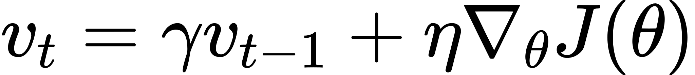
 
<!-- $\theta = \theta - v_t$ --> 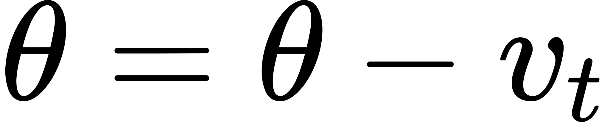
 
이 때, <!-- $\gamma$ --> 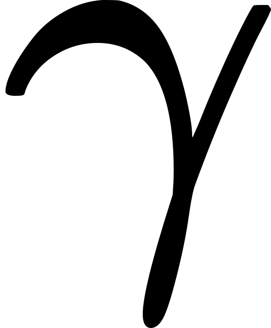는 얼마나 momentum을 줄 것인지에 대한 momentum term이다.

#### References

- [Gradient Descent Optimization Algorithms 정리 - Beomsu Kim's Blog](http://shuuki4.github.io/deep%20learning/2016/05/20/Gradient-Descent-Algorithm-Overview.html)

---

## #18

#### 간단한 MNIST 분류기를 MLP+CPU 버전으로 numpy로 만든다면 몇줄일까?

#### References

---

## #18-1

#### 어느 정도 돌아가는 녀석을 작성하기까지 몇시간 정도 걸릴까?

#### References

---

## #18-2

#### Back Propagation은 몇줄인가?

#### References

---

## #18-3

#### CNN으로 바꾼다면 얼마나 추가될까?

#### References

---

## #19

#### 간단한 MNIST 분류기를 TF, PyTorch 등으로 작성하는데 몇시간이 필요한가?

#### References

---

## #19-1

#### CNN이 아닌 MLP로 해도 잘 될까?

#### References

---

## #19-2

#### 마지막 레이어 부분에 대해서 설명 한다면?

#### References

---

## #19-3

#### 학습은 BCE loss로 하되 상황을 MSE loss로 보고 싶다면?

#### References

---

## #20

#### 딥러닝할 때 GPU를 쓰면 좋은 이유는?

#### References

---

## #20-1

#### 학습 중인데 GPU를 100% 사용하지 않고 있다. 이유는?

#### References

---

## #20-2

#### GPU를 두개 다 쓰고 싶다. 방법은?

#### References

---

## #20-3

#### 학습시 필요한 GPU 메모리는 어떻게 계산하는가?

#### References

---
