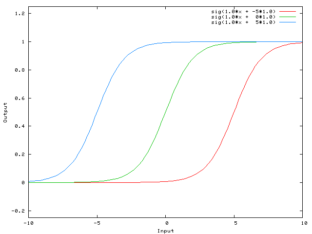
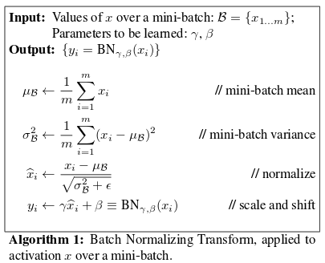
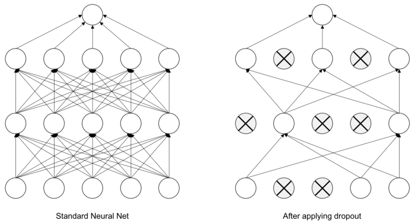

## 📝 Table of Contents

- [딥러닝은 무엇인가요? 딥러닝과 머신러닝의 차이는?](#1)
- [Cost Function과 Activation Function은 무엇인가요?](#2)
- [Tensorflow, PyTorch 특징과 차이가 뭘까요?](#3)
- [Data Normalization은 무엇이고 왜 필요한가요?](#4)
- [알고있는 Activation Function에 대해 알려주세요. (Sigmoid, ReLU, LeakyReLU, Tanh 등)](#5)
- [오버피팅일 경우 어떻게 대처해야 할까요?](#6)
- [하이퍼 파라미터는 무엇인가요?](#7)
- [Weight Initialization 방법에 대해 말해주세요. 그리고 무엇을 많이 사용하나요?](#8)
- [볼츠만 머신은 무엇인가요?](#9)
- [TF, PyTorch 등을 사용할 때 디버깅 노하우는?](#10)
- [뉴럴넷의 가장 큰 단점은 무엇인가? 이를 위해 나온 One-Shot Learning은 무엇인가?](#11)
- [요즘 Sigmoid 보다 ReLU를 많이 쓰는데 그 이유는?](#12)
  - [Non-Linearity라는 말의 의미와 그 필요성은?](#12-1)
  - [ReLU로 어떻게 곡선 함수를 근사하나?](#12-2)
  - [ReLU의 문제점은?](#12-3)
  - [Bias는 왜 있는걸까?](#12-4)
- [Gradient Descent에 대해서 쉽게 설명한다면?](#13)
  - [왜 꼭 Gradient를 써야 할까? 그 그래프에서 가로축과 세로축 각각은 무엇인가? 실제 상황에서는 그 그래프가 어떻게 그려질까?](#13-1)
  - [GD 중에 때때로 Loss가 증가하는 이유는?](#13-2)
  - [Back Propagation에 대해서 쉽게 설명 한다면?](#13-3)
- [Local Minima 문제에도 불구하고 딥러닝이 잘 되는 이유는?](#14)
  - [GD가 Local Minima 문제를 피하는 방법은?](#14-1)
  - [찾은 해가 Global Minimum인지 아닌지 알 수 있는 방법은?](#14-2)
- [Training 세트와 Test 세트를 분리하는 이유는?](#15)
  - [Validation 세트가 따로 있는 이유는?](#15-1)
  - [Test 세트가 오염되었다는 말의 뜻은?](#15-2)
  - [Regularization이란 무엇인가?](#15-3)
- [Batch Normalization의 효과는?](#16)
  - [Dropout의 효과는?](#16-1)
  - [BN 적용해서 학습 이후 실제 사용시에 주의할 점은? 코드로는?](#16-2)
  - [GAN에서 Generator 쪽에도 BN을 적용해도 될까?](#16-3)
- [SGD, RMSprop, Adam에 대해서 아는대로 설명한다면?](#17)
  - [SGD에서 Stochastic의 의미는?](#17-1)
  - [미니배치를 작게 할때의 장단점은?](#17-2)
  - [모멘텀의 수식을 적어 본다면?](#17-3)
- [간단한 MNIST 분류기를 MLP+CPU 버전으로 numpy로 만든다면 몇줄일까?](#18)
  - [어느 정도 돌아가는 녀석을 작성하기까지 몇시간 정도 걸릴까?](#18-1)
  - [Back Propagation은 몇줄인가?](#18-2)
  - [CNN으로 바꾼다면 얼마나 추가될까?](#18-3)
- [간단한 MNIST 분류기를 TF, PyTorch 등으로 작성하는데 몇시간이 필요한가?](#19)
  - [CNN이 아닌 MLP로 해도 잘 될까?](#19-1)
  - [마지막 레이어 부분에 대해서 설명 한다면?](#19-2)
  - [학습은 BCE loss로 하되 상황을 MSE loss로 보고 싶다면?](#19-3)
- [딥러닝할 때 GPU를 쓰면 좋은 이유는?](#20)
  - [학습 중인데 GPU를 100% 사용하지 않고 있다. 이유는?](#20-1)
  - [GPU를 두개 다 쓰고 싶다. 방법은?](#20-2)
  - [학습시 필요한 GPU 메모리는 어떻게 계산하는가?](#20-3)

---

## #1

#### 딥러닝은 무엇인가요? 딥러닝과 머신러닝의 차이는?

#### References

---

## #2

#### Cost Function과 Activation Function은 무엇인가요?

#### References

---

## #3

#### Tensorflow, PyTorch 특징과 차이가 뭘까요?

#### References

---

## #4

#### Data Normalization은 무엇이고 왜 필요한가요?

#### References

---

## #5

#### 알고있는 Activation Function에 대해 알려주세요. (Sigmoid, ReLU, LeakyReLU, Tanh 등)

#### References

---

## #6

#### 오버피팅일 경우 어떻게 대처해야 할까요?

#### References

---

## #7

#### 하이퍼 파라미터는 무엇인가요?

#### References

---

## #8

#### Weight Initialization 방법에 대해 말해주세요. 그리고 무엇을 많이 사용하나요?

#### References

---

## #9

#### 볼츠만 머신은 무엇인가요?

#### References

---

## #10

#### TF, PyTorch 등을 사용할 때 디버깅 노하우는?

#### References

---

## #11

#### 뉴럴넷의 가장 큰 단점은 무엇인가? 이를 위해 나온 One-Shot Learning은 무엇인가?

#### References

---

## #12

#### 요즘 sigmoid 보다 ReLU를 많이 쓰는데 그 이유는?

 

우선 sigmoid와 ReLU 함수의 모양을 보자. sigmoid는 값이 큰 양수일수록 1에, 큰 음수일수록 0에 가까워진다. 반면 ReLU는 값이 양수이면 원래 값을 그대로 가져가고, 음수이면 0이다.

요즘 sigmoid보다 ReLU를 많이 쓰는 가장 큰 이유는 **기울기 소실 문제(Gradient Vanishing)** 때문이다. 기울기는 연쇄 법칙(Chain Rule)에 의해 국소적 미분값을 누적 곱을 시키는데, sigmoid의 경우 기울기가 항상 0과 1사이의 값이므로 이 값을 연쇄적으로 곱하게 되면 0에 수렴할 수 밖에 없다. 반면 ReLU는 값이 양수일 때, 기울기가 1이므로 연쇄 곱이 1보다 작아지는 것을 어느 정도 막아줄 수 있다.

다만, ReLU는 값이 음수이면, 기울기가 0이기 때문에 일부 뉴런이 죽을 수 있다는 단점이 존재한다. 이를 보완한 활성화 함수로 Leaky ReLU가 있다.

#### References

- [ML — sigmoid 대신 ReLU? 상황에 맞는 활성화 함수 사용하기 - Minkyeong Kim](https://medium.com/@kmkgabia/ml-sigmoid-%EB%8C%80%EC%8B%A0-relu-%EC%83%81%ED%99%A9%EC%97%90-%EB%A7%9E%EB%8A%94-%ED%99%9C%EC%84%B1%ED%99%94-%ED%95%A8%EC%88%98-%EC%82%AC%EC%9A%A9%ED%95%98%EA%B8%B0-c65f620ad6fd)
- [[히스] Gradient Vanishing 해결을 위한 ReLU 와 ResNet - boostcamp-ai-tech-4/peer-session](https://github.com/boostcamp-ai-tech-4/peer-session/issues/52)
- [딥러닝에서 사용하는 활성화함수 - reniew's blog](https://reniew.github.io/12/)

---

## #12-1

#### Non-Linearity라는 말의 의미와 그 필요성은?

비선형(non-linearity)의 뜻을 알기 위해서는 우선 선형(linearity)가 무엇인지 알아야 한다. 어떤 모델이 선형적(linearity)라고 한다면 그 모델은 변수 <!-- $x_1, x_2, ... , x_n$ --> 과 가중치 <!-- $w_1, w_2, ... , w_n$ --> 으로 <!-- $y = w_1*x_1 + w_2*x_2 + ... + w_n*x_n$ --> 으로 표현할 수 있다. 그 외에 이렇게 표현할 수 없는 모든 모델을 비선형 관계에 있는 모델이라고 한다.

딥러닝에서 이런 비선형 관계는 활성화 함수(activation function)을 도입함으로써 표현할 수 있다. 그럼 비선형 관계 즉, 활성화 함수가 왜 필요할까? 바로 **활성화 함수를 사용해 여러 층을 쌓아서 더 복잡한 표현을 하기 위해서**이다. 활성화 함수가 <!-- $h(x) = cx$ --> 인 선형 함수라고 생각해보자. 이 때 <!-- $n$ --> 개의 층을 쌓았다고 할 때, 모델은 <!-- $y = h^n(x) = c^nx$ --> 로 나타낼 수 있다. <!-- $c^n=k$ --> 라는 상수로 치환하면 결국 1층을 가진 신경망과 동일하다. 그렇기 때문에 비선형인 활성화 함수가 필요한 것이다.

#### References

- [[밑바닥 딥러닝] 신경망 - 코딩하는펭귄의 저장소](https://cooding-penguin.netlify.app/dl-from-scratch/neural-network/#%EB%B9%84%EC%84%A0%ED%98%95-%ED%95%A8%EC%88%98)

---

## #12-2

#### ReLU로 어떻게 곡선 함수를 근사하나?

ReLU는 양수일 때 <!-- $y=x$ --> 로 선형 부분과 음수일 때 <!-- $y=0$ --> 으로 비선형 부분이 결합된 형태이다. 이를 활성화 함수로 설정하고 여러 층을 쌓으면, 마치 **ReLU 함수를 선형 결합한 형태**를 갖게 된다. ReLU는 비선형 함수이기 때문에 최종적으로 비선형성을 띄게 되고, back propagation을 통해 점점 곡선 함수에 맞게 학습되도록 하여 근사할 수 있다.

#### References

- [활성화 함수(Activation function) 설명 (Sigmoid, ReLU, LeakyReLU, tanh) - 별보는두더지](https://mole-starseeker.tistory.com/m/39)
- [Q2) Sigmoid 보다 ReLu를 많이 쓰는 이유? - JINSOL KIM](https://gaussian37.github.io/math-question-q2/)
- [How do ReLU Neural Networks approximate any continuous function? - towards data science](https://towardsdatascience.com/how-do-relu-neural-networks-approximate-any-continuous-function-f59ca3cf2c39)

---

## #12-3

#### ReLU의 문제점은?

ReLU의 가장 큰 문제점은 바로 <strong>죽은 뉴런(Dead Neurons)</strong>이다. ReLU는 결과값이 음수인 경우 모두 0으로 취급하는데, back propagation시 기울기에 0이 곱해져 해당 부분의 뉴런은 죽고 그 이후의 뉴런 모두 죽게 된다. 이를 해결한 Leaky ReLU는 값이 음수일 때 조금의 음의 기울기를 갖도록 하여 뉴런이 조금이라도 기울기를 갖도록 한다.

두 번째 문제는 <strong>편향 이동(Bias Shift)</strong>이다. ReLU는 항상 0이상의 값을 출력하기 때문에 활성화값의 평균이 0보다 커 zero-centered하지 않다. 활성화값이 zero-centered되지 않으면 가중치 업데이트가 동일한 방향으로만 업데이트가 되서 학습 속도가 느려질 수가 있다.

 

이를 해결하기 위해 배치 정규화(Batch Normalization)을 사용하여 결과값의 평균이 0이 되도록 하거나 zero-centered된 ELU, SeLU와 같은 활성화 함수를 사용한다.

#### References

- [Neural Network - Machine Learning Blog](https://nmhkahn.github.io/NN)
- [What are the disadvantages of using the ReLu when using Neural Networks? - Quora](https://www.quora.com/What-are-the-disadvantages-of-using-the-ReLu-when-using-Neural-Networks)
- [05-1. 심층 신경망 학습 - 활성화 함수, 가중치 초기화 EXCELSIOR](https://excelsior-cjh.tistory.com/177)
- [computer-vision-study-2020s/week3/week3.md - CoodingPenguin/computer-vision-study-2020s](https://github.com/CoodingPenguin/computer-vision-study-2020s/blob/master/week3/week3.md#lecture-6)
- [Activation Functions in Neural Networks - Kshitij Khurana](https://medium.com/@kshitijkhurana3010/activation-functions-in-neural-networks-ed88c56b611b)

---

## #12-4

#### 편향(bias)는 왜 있는걸까?

 
<small><strong>bias별 sigmoid 함수의 위치</strong></small>

 

편향(bias)는 활성화 함수가 왼쪽 혹은 오른쪽으로 이동한다. 가중치(weight)는 활성화 함수의 가파른 정도 즉, 기울기를 조절하는 반면, 편향(bias)는 **활성화 함수를 움직임으로써 데이터에 더 잘 맞도록 한다.**

#### References

- [Glossary of Deep Learning: Bias - Jaron Collis](https://medium.com/deeper-learning/glossary-of-deep-learning-bias-cf49d9c895e2)
- [What is the role of the bias in neural networks? - stackoverflow](https://stackoverflow.com/questions/2480650/what-is-the-role-of-the-bias-in-neural-networks)

---

## #13

#### Gradient Descent에 대해서 쉽게 설명한다면?

#### References

---

## #13-1

#### 왜 꼭 Gradient를 써야 할까? 그 그래프에서 가로축과 세로축 각각은 무엇인가? 실제 상황에서는 그 그래프가 어떻게 그려질까?

#### References

---

## #13-2

#### GD 중에 때때로 Loss가 증가하는 이유는?

#### References

---

## #13-3

#### Back Propagation에 대해서 쉽게 설명 한다면?

#### References

---

## #14

#### Local Minima 문제에도 불구하고 딥러닝이 잘 되는 이유는?

#### References

---

## #14-1

#### GD가 Local Minima 문제를 피하는 방법은?

#### References

---

## #14-2

#### 찾은 해가 Global Minimum인지 아닌지 알 수 있는 방법은?

#### References

---

## #15

#### Training 세트와 Test 세트를 분리하는 이유는?

#### References

---

## #15-1

#### Validation 세트가 따로 있는 이유는?

#### References

---

## #15-2

#### Test 세트가 오염되었다는 말의 뜻은?

#### References

---

## #15-3

#### Regularization이란 무엇인가?

#### References

---

## #16

#### Batch Normalization의 효과는?

 
<small><strong>배치 정규화(Batch Normalization) 수식</strong></small>

 

배치 정규화(Batch Normalization)은 학습 시 **미니배치 단위로 입력의 분포가 평균이 0, 분산이 1이 되도록 정규화**한다. 더불어 <!-- $\gamma$ --> 로 스케일과 <!-- $\beta$ --> 로 이동 변환을 수행한다. 이렇게 배치 정규화를 사용하면 다음과 같은 효과를 얻을 수 있다.

- `장점 1` 기울기 소실/폭발 문제가 해결되어 큰 학습률을 설정할 수 있어 학습속도가 빨라진다.
- `장점 2` 항상 입력을 정규화시키기 대문에 가중치 초깃값에 크게 의존하지 않아도 된다.
- `장점 3` 자체적인 규제(Regularization) 효과가 있어 Dropout이나 Weight Decay와 같은 규제 방법을 사용하지 않아도 된다.

#### References

- [Batch Normalization - Steve-Lee's Deep Insight](https://deepinsight.tistory.com/116)
- [Understanding Batch Normalization for Neural Networks - towards data science](https://towardsdatascience.com/understanding-batch-normalization-for-neural-networks-1cd269786fa6)
- [Batch Normalization - 라온 피플](https://m.blog.naver.com/laonple/220808903260)
- [[Deep Learning] Batch Normalization (배치 정규화) - 꾸준희](https://eehoeskrap.tistory.com/430)

---

## #16-1

#### Dropout의 효과는?

 
<small><a href='https://www.oreilly.com/library/view/deep-learning-for/9781788295628/'><strong>Deep Learning for Computer Vision</strong></a></small>

 

드롭아웃(Dropout)은 **설정된 확률 <!-- $p$ --> 만큼 은닉층(hidden layer)에 있는 뉴런을 무작위로 제거하는 방법**으로, 오버피팅을 방지하기 위한 방법 중 하나이다. (정확히는 출력을 0으로 만들어 더이상의 전파가 되지 않도록 한다.) 드롭아웃(Dropout)은 학습 때마다 무작위로 뉴런을 제거하므로 매번 다른 모델을 학습시키는 것으로 해석할 수 있다. 그리고 추론 시 출력에 제거 확률 <!-- $p$ --> 를 곱함으로써 앙상블 학습에서 여러 모델의 평균을 내는 효과를 얻을 수 있다.

#### References

- [3.13. 드롭아웃(dropout) - Dive into Deep Learning](https://ko.d2l.ai/chapter_deep-learning-basics/dropout.html)
- [An Intuitive Explanation to Dropout - towards data science](https://towardsdatascience.com/an-intuitive-explanation-to-dropout-749c7fb5395c)

---

## #16-2

#### BN 적용해서 학습 이후 실제 사용시에 주의할 점은? 코드로는?

학습 과정에서는 미니 배치의 평균과 분산을 계산하여 배치 정규화를 적용하지만, 추론 시에는 학습 데이터 전체에 대한 평균과 분산을 계산하여 적용을 해야 한다. 왜냐하면 사용자가 설정한 배치의 크기에 따라 추론 결과가 변할 수도 있기 때문이다.

#### References

- [Batch Normalization (ICML 2015) - SanghyukChun's Blog](http://sanghyukchun.github.io/88/)

---

## #16-3

#### GAN에서 Generator 쪽에도 BN을 적용해도 될까?

일반적으로 GAN에서는 생성기(Generator)의 출력층(Output Layer)와 식별기(Discriminator)의 입력층(Input Layer)에는 BN(Batch Normalization)을 적용하지 않는다. 왜냐하면 생성기가 만든 이미지가 BN을 지나면 실제 이미지와는 값의 범위가 달라지기 때문이다.

#### References

- [초짜 대학원생의 입장에서 이해하는 Deep Convolutional Generative Adversarial Network (DCGAN) (1) - Jaejun Yoo's Playground](http://jaejunyoo.blogspot.com/2017/02/deep-convolutional-gan-dcgan-1.html)

---

## #17

#### SGD, RMSprop, Adam에 대해서 아는대로 설명한다면?

#### References

---

## #17-1

#### SGD에서 Stochastic의 의미는?

#### References

---

## #17-2

#### 미니배치를 작게 할때의 장단점은?

#### References

---

## #17-3

#### 모멘텀의 수식을 적어 본다면?

#### References

---

## #18

#### 간단한 MNIST 분류기를 MLP+CPU 버전으로 numpy로 만든다면 몇줄일까?

#### References

---

## #18-1

#### 어느 정도 돌아가는 녀석을 작성하기까지 몇시간 정도 걸릴까?

#### References

---

## #18-2

#### Back Propagation은 몇줄인가?

#### References

---

## #18-3

#### CNN으로 바꾼다면 얼마나 추가될까?

#### References

---

## #19

#### 간단한 MNIST 분류기를 TF, PyTorch 등으로 작성하는데 몇시간이 필요한가?

#### References

---

## #19-1

#### CNN이 아닌 MLP로 해도 잘 될까?

#### References

---

## #19-2

#### 마지막 레이어 부분에 대해서 설명 한다면?

#### References

---

## #19-3

#### 학습은 BCE loss로 하되 상황을 MSE loss로 보고 싶다면?

#### References

---

## #20

#### 딥러닝할 때 GPU를 쓰면 좋은 이유는?

GPU(Graphics Processing Unit)은 부동 소수점 연산을 수행하는 많은 코어가 있어 수 많은 연산을 **병렬처리**할 수 있다. 또한 CPU보다 더 큰 메모리 대역폭을 가지고 있기 때문에 **큰 데이터를 더 효율적으로 빠르게 처리**할 수 있다.

> 메모리 대역폭(Memory Bandwidth)란 메모리가 처리할 수 있는 초당 데이터양을 뜻한다.

#### References

- [What is a GPU and do you need one in Deep Learning? - towards data science](https://towardsdatascience.com/what-is-a-gpu-and-do-you-need-one-in-deep-learning-718b9597aa0d)

---

## #20-1

#### 학습 중인데 GPU를 100% 사용하지 않고 있다. 이유는?

가장 먼저 의심할 수 있는 부분은 GPU가 아니라 **CPU를 사용하고 있을 경우**이다. CPU와 GPU 사용률을 확인해보고 CPU 사용률이 높으면 CPU로 돌아간다는 것을 보고 추론할 수 있다.

다른 경우로는 **GPU의 메모리가 부족한 경우**가 있다. 메모리가 부족하면 병목 현상으로 인해서 GPU를 100% 사용할 수 없다. 이 때 배치 사이즈를 줄이거나 모델을 최적화하여 가볍게 만드는 방법으로 메모리 사용량을 줄일 수 있다.

#### References

- [Pytorch가 GPU를 사용하지 않습니다 Fastai 작업 - Python2.net](https://www.python2.net/questions-251364.html)

---

## #20-2

#### GPU를 두개 다 쓰고 싶다. 방법은?

Pytorch의 경우 `torch.nn.DataParallel`을 사용하여 여러 개의 GPU를 사용할 수 있다.

- `torch.device`를 **cuda**로 설정한다.
- `nn.DataParallel`을 사용하여 모델을 감싼다.
- 모델을 `model.to(device)`를 사용하여 GPU로 보낸다.

#### References

- [OPTIONAL: DATA PARALLELISM - Pytorch Tutorials](https://pytorch.org/tutorials/beginner/blitz/data_parallel_tutorial.html)

---

## #20-3

#### 학습시 필요한 GPU 메모리는 어떻게 계산하는가?

Pytorch를 기준으로 볼 때 `something.to('cuda')`로 변환하는 모든 것들을 생각해보면 된다. 보통 GPU로 올리는 것은 모델과 데이터셋이므로, <strong>(모델의 크기 + 데이터의 크기 × 배치 크기)</strong>로 학습시 필요한 메모리 크기를 계산할 수 있다.

---
