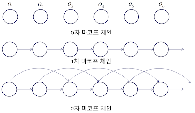
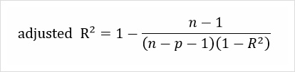
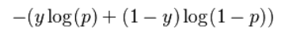
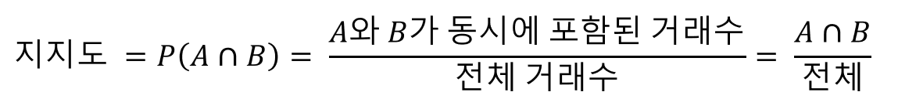
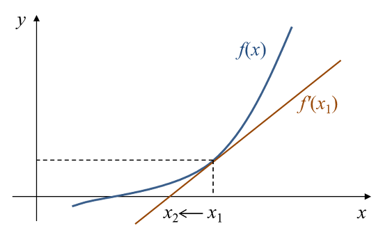
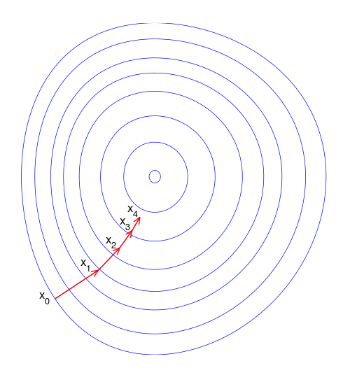

## 📝 Table of Contents

- [알고 있는 metric에 대해 설명해주세요. (ex. RMSE, MAE, recall, precision ...)](#1)
- [정규화를 왜 해야할까요? 정규화의 방법은 무엇이 있나요?](#2)
- [Local Minima와 Global Minima에 대해 설명해주세요.](#3)
- [차원의 저주에 대해 설명해주세요.](#4)
- [dimension reduction 기법으로 보통 어떤 것들이 있나요?](#5)
- [PCA는 차원 축소 기법이면서, 데이터 압축 기법이기도 하고, 노이즈 제거기법이기도 합니다. 왜 그런지 설명해주실 수 있나요?](#6)
- [LSA, LDA, SVD 등의 약자들이 어떤 뜻이고 서로 어떤 관계를 가지는지 설명할 수 있나요?](#7)
- [Markov Chain을 고등학생에게 설명하려면 어떤 방식이 제일 좋을까요?](#8)
- [텍스트 더미에서 주제를 추출해야 합니다. 어떤 방식으로 접근해 나가시겠나요?](#9)
- [SVM은 왜 반대로 차원을 확장시키는 방식으로 동작할까요? SVM은 왜 좋을까요?](#10)
- [다른 좋은 머신 러닝 대비, 오래된 기법인 나이브 베이즈(naive bayes)의 장점을 옹호해보세요.](#11)
- [회귀 / 분류시 알맞은 metric은 무엇일까?](#12)
- [Association Rule의 Support, Confidence, Lift에 대해 설명해주세요.](#13)
- [최적화 기법중 Newton’s Method와 Gradient Descent 방법에 대해 알고 있나요?](#14)
- [머신러닝(machine)적 접근방법과 통계(statistics)적 접근방법의 둘간에 차이에 대한 견해가 있나요?](#15)
- [인공신경망(deep learning이전의 전통적인)이 가지는 일반적인 문제점은 무엇일까요?](#16)
- [지금 나오고 있는 deep learning 계열의 혁신의 근간은 무엇이라고 생각하시나요?](#17)
- [ROC 커브에 대해 설명해주실 수 있으신가요?](#18)
- [여러분이 서버를 100대 가지고 있습니다. 이때 인공신경망보다 Random Forest를 써야하는 이유는 뭘까요?](#19)
- [K-means의 대표적 의미론적 단점은 무엇인가요? (계산량 많다는것 말고)](#20)
- [L1, L2 정규화에 대해 설명해주세요.](#21)
- [Cross Validation은 무엇이고 어떻게 해야하나요?](#22)
- [XGBoost을 아시나요? 왜 이 모델이 캐글에서 유명할까요?](#23)
- [앙상블 방법엔 어떤 것들이 있나요?](#24)
- [feature vector란 무엇일까요?](#25)
- [좋은 모델의 정의는 무엇일까요?](#26)
- [50개의 작은 의사결정 나무는 큰 의사결정 나무보다 괜찮을까요? 왜 그렇게 생각하나요?](#27)
- [스팸 필터에 로지스틱 리그레션을 많이 사용하는 이유는 무엇일까요?](#28)
- [OLS(ordinary least squre) regression의 공식은 무엇인가요?](#29)

---

## #1

#### 알고 있는 metric에 대해 설명해주세요. (ex. RMSE, MAE, recall, precision ...)

#### References

---

## #2

#### 정규화를 왜 해야할까요? 정규화의 방법은 무엇이 있나요?

#### References

---

## #3

#### Local Minima와 Global Minima에 대해 설명해주세요.

#### References

---

## #4

#### 차원의 저주에 대해 설명해주세요.

#### References

---

## #5

#### dimension reduction 기법으로 보통 어떤 것들이 있나요?

#### References

---

## #6

#### PCA는 차원 축소 기법이면서, 데이터 압축 기법이기도 하고, 노이즈 제거기법이기도 합니다. 왜 그런지 설명해주실 수 있나요?

#### References

---

## #7

#### LSA, LDA, SVD 등의 약자들이 어떤 뜻이고 서로 어떤 관계를 가지는지 설명할 수 있나요?

#### References

---

## #8

#### Markov Chain을 고등학생에게 설명하려면 어떤 방식이 제일 좋을까요?

> 마코프 체인(Markov Chain)

마코프 성질(Markov Property)을 지닌 이산 확률 과정(Discrete-time Stochastic Pross)

> 마코프 성질(Markov Property)

n+1회의 상태(state)는 오직 n회에서의 상태, 혹은 그 이전 일정 기간의 상태에만 영향을 받는 것을 의미한다. 예를 들면 동전 던지기는 독립 시행이기 때문에 n번째의 상태가 앞이던지 뒤이던지 간에 n+1번째 상태에 영향을 주지 않는다. 하지만 1차 마코프 체인은 n번째 상태가 n+1번째 상태를 결정하는데에 영향을 미친다. (시간 t에서의 관측은 단지 최근 r개의 관측에만 의존한다는 가정을 하고 그 가정하에서 성립)

> 마코프 모델

마코프 모델은 위의 가정하에 확률적 모델을 만든 것으로써, 가장 먼저 각 상태를 정의하게 된다. 상태(state)는 <!-- $V={v_1,···,v_m}$ --> 로 정의하고, m개의 상태가 존재하게 되는 것이다. 그 다음은 **상태 전이 확률(State transition Probability)**을 정의할 수 있다. 상태 전이 확률이란 각 상태에서 각 상태로 이동할 확률을 말한다. 상태 전이 확률 <!-- $a_{ij}$ --> 는 상태 <!-- $v_i$ --> 에서 상태 <!-- $v_j$ --> 로 이동할 확률을 의미한다.  아래의 식은 상태 전이 확률을 식으로 나타낸 것과 그 아래는 확률의 기본 정의에 의한 상태 전이 확률의 조건이다.

그리고 상태와 상태 전이 확률을 정리하여 **상태 전이도(state transition diagram)**으로도 표현할 수 있다.

#### References

- [Markov Chain - MLWiki](https://sites.google.com/site/machlearnwiki/RBM/markov-chain)
- [[기술면접] Markov Chain, Gibbs Sampling, 마르코프 체인, 깁스 샘플링 (day2 / 201010) - huidea](https://huidea.tistory.com/128?category=879541)

---

## #9

#### 텍스트 더미에서 주제를 추출해야 합니다. 어떤 방식으로 접근해 나가시겠나요?

> 잠재 디리클레 할당(Latent Dirichlet Allocation, LDA)
- LDA는 **문서들은 토픽들의 혼합으로 구성되어져 있으며, 토픽들은 확률 분포에 기반하여 단어들을 생성한다**고 가정
- 데이터가 주어지면 LDA는 토픽을 문서가 생성되던 과정을 역추적
- LDA는 각 문서의 **토픽 분포**와 **각 토픽 내의 단어 분포**를 추정

**<각 문서의 토픽 분포>**

문서1 : 토픽 A 100%

문서2 : 토픽 B 100%

문서3 : 토픽 B 60%, 토픽 A 40%

**<각 토픽의 단어 분포>**

토픽A : **사과 20%, 바나나 40%, 먹어요 40%**, 귀여운 0%, 강아지 0%, 깜찍하고 0%, 좋아요 0%

토픽B : 사과 0%, 바나나 0%, 먹어요 0%, **귀여운 33%, 강아지 33%, 깜찍하고 16%, 좋아요 16%**

LDA는 토픽의 제목을 정해주지 않지만, 이 시점에서 알고리즘의 사용자는 위 결과로부터 두 토픽이 각각 과일에 대한 토픽과 강아지에 대한 토픽이라고 판단해볼 수 있다.

#### References

- [Topic Modeling, LDA - ratsgo's blog](https://ratsgo.github.io/from%20frequency%20to%20semantics/2017/06/01/LDA/)
- [[기술면접] 잠재디리클레할당 (day3 / 201012) - huidea](https://huidea.tistory.com/category/Study/Machine%20learning)
- [딥 러닝을 이용한 자연어 처리 입문](https://wikidocs.net/30708)

---

## #10

#### SVM은 왜 반대로 차원을 확장시키는 방식으로 동작할까요? SVM은 왜 좋을까요?

> SVM(Support Vector Machine)
- SVM은 데이터가 사상된 공간에서 **경계로 표현**되며, 공간상에 존재하는 **여러 경계 중 가장 큰 폭을 가진 경계를 찾는다.**

- SVM은 선형 분류뿐만 아니라 **비선형 분류**에도 사용되는데, 비선형 분류에서는 입력자료를 다차원 공간상으로 맵핑할 때 <strong>커널 트릭(kernel trick)</strong>을 사용하기도 한다.
    - 원공간(Input Space)의 데이터를 선형분류가 가능한 고차원 공간(Feature Space)으로 매핑한 뒤 두 범주를 분류하는 초평면을 찾는다. (Kernel-SVM)

|장점|단점|
|---|---|
|분류와 회귀에 모두 사용할 수 있다.|데이터 전처리와 매개변수 설정에 따라 정확도가 달라질 수 있다.|
|신경망 기법에 비해 과적합 정도가 낮다.|예측이 어떻게 이루어지는지에 대한 이해와 모델에 대한 해석이 어렵다.|
|예측의 정확도가 높다.|대용량 데이터에 대한 모델 구축 시 속도가 느리며,메모리 할당량이 크다.|
|저차원과 고차원 데이터에 대해서 모두 잘 작동한다.||

#### References
- [서포트 벡터 머신 (Support Vector Machine) - ratsgo's blog](https://ratsgo.github.io/machine%20learning/2017/05/23/SVM/)
- [Kernel-SVM - ratsgo's blog](https://ratsgo.github.io/machine%20learning/2017/05/30/SVM3/)
- [Support Vector Machine (SVM)의 개념 - butter_shower](https://butter-shower.tistory.com/7)
- [Support Vector Machine (SVM, 서포트 벡터 머신) - Excelsior-JH](https://excelsior-cjh.tistory.com/66)
- [ADP 필기 올패키지 데이터 분석 전문가](https://search.shopping.naver.com/search/all?where=all&frm=NVSCTAB&query=ADP+%ED%95%84%EA%B8%B0+%EC%98%AC%ED%8C%A8%ED%82%A4%EC%A7%80+%EB%8D%B0%EC%9D%B4%ED%84%B0+%EB%B6%84%EC%84%9D+%EC%A0%84%EB%AC%B8%EA%B0%80)

---

## #11

#### 다른 좋은 머신 러닝 대비, 오래된 기법인 나이브 베이즈(naive bayes)의 장점을 옹호해보세요.

> 나이브 베이즈(Naïve Bayes Classification)

데이터에서 변수들에 대한 **조건부 독립을 가정**하는 알고리즘으로 클래스에 대한 사전 정보와 데이터로부터 추출된 정보를 결합하고, <strong>베이즈 정리(Bayes Theorem)</strong>를 이용하여 어떤 데이터가 특정 클래스에 속하는지 분류하는 알고리즘이다.

|장점|단점|
|---|---|
|단순하고 빠르며 매우 효과적이다|모든 속성은 동등하게 중요하고 독립적이라는 알려진 결함 가정에 의존한다|
|노이즈와 결측 데이터가 있어도 잘 수행한다|수치 속성으로 구성된 많은 데이터셋에 대해 이상적이지 않다|
|훈련에 대한 상대적으로 적은 예제가 필요하지만 매우 많은 예제도 잘 수행한다|추정된 확률은 예측된 범주보다 덜 신뢰적이다|
|예측에 대한 추정된 확률을 얻기 쉽다||

#### References
- [쉽고 강력한 머신러닝, 나이브 베이즈 분류 (Naive Bayes Classification)- 자비스가 필요해](https://needjarvis.tistory.com/621)
- [나이브 베이즈 알고리즘의 장점과 단점 - 웹개발공작소](http://w3devlabs.net/wp/?p=17273)
- [ADP 필기 올패키지 데이터 분석 전문가](https://search.shopping.naver.com/search/all?where=all&frm=NVSCTAB&query=ADP+%ED%95%84%EA%B8%B0+%EC%98%AC%ED%8C%A8%ED%82%A4%EC%A7%80+%EB%8D%B0%EC%9D%B4%ED%84%B0+%EB%B6%84%EC%84%9D+%EC%A0%84%EB%AC%B8%EA%B0%80)

---

## #12

#### 회귀 / 분류시 알맞은 metric은 무엇일까?

[1번](#1) 참고

- 회귀
    - <!-- $R^2$ -->  (결정계수, Coefficient of determination)
    

    - <!-- $adj R^2, R_a^2$ -->  (수정된 결정계수, adjusted coefficient of determination)
    

- 분류
    - Log Loss/Binary Crossentropy

        

    - Categorical Crossentropy

        

#### References
- [상관계수 & 결정계수 & 수정된 결정계수 - 모찌의 맛집 통계](https://mansoostat.tistory.com/76)
- [[결정계수] R square와 adjusted R square - specialscene](https://specialscene.tistory.com/63)
- [3 Best metrics to evaluate Regression Model?](https://towardsdatascience.com/what-are-the-best-metrics-to-evaluate-your-regression-model-418ca481755b)
- [The 5 Classification Evaluation metrics every Data Scientist must know](https://towardsdatascience.com/the-5-classification-evaluation-metrics-you-must-know-aa97784ff226)

---

## #13

#### Association Rule의 Support, Confidence, Lift에 대해 설명해주세요.

> 연관규칙분석(Association Analysis)
- 연관성 분석은 흔히 장바구니 분석(Market Basket Analysis) 또는 서열분석(Sequence Analysis)이라고 불린다.
- 기업의 데이터베이스에서 상품의 구매, 서비스 등 일련의 거래 또는 사건들 간의 규칙을 발견하기 위해 적용한다.

1. Support(지지도)
- 전체 거래 중 항목 A와 항목 B를 동시에 포함하는 거래의 비율로 정의한다.

2. Confidence(신뢰도)
- 항목 A를 포함한 거래 중에서 항목 A와 항목 B가 같이 포함될 확률이다. 연관성의 정도를 파악할 수 있다.

3. Lift(향상도)
- A가 구매되지 않았을 때 품목 B의 구매확률에 비해 A가 구매됐을 때 품목 B의 구매확률의 증가 비이다. 연관규칙 A→B는 품목 A와 품목 B의 구매가 서로 관련이 없는 경우에 향상도가 1이 된다.

#### References
- [[R 연관규칙(Association Rule)] 지지도(support), 신뢰도(confidence), 향상도(lift), IS측도, 교차지지도 - R, Python 분석과 프로그래밍의 친구 (by R Friend)](https://rfriend.tistory.com/191)
- [ADP 필기 올패키지 데이터 분석 전문가](https://search.shopping.naver.com/search/all?where=all&frm=NVSCTAB&query=ADP+%ED%95%84%EA%B8%B0+%EC%98%AC%ED%8C%A8%ED%82%A4%EC%A7%80+%EB%8D%B0%EC%9D%B4%ED%84%B0+%EB%B6%84%EC%84%9D+%EC%A0%84%EB%AC%B8%EA%B0%80)

---

## #14

#### 최적화 기법중 Newton’s Method와 Gradient Descent 방법에 대해 알고 있나요?

> Newton's Method
- 방정식 <!-- $f(x)=0$ --> 의 해를 근사적으로 찾을 때 사용되는 방법
- 현재 x값에서 접선을 그리고 접선이 x축과 만나는 지점으로 x를 이동시켜 가면서 점진적으로 해를 찾는 방법
- 초기값을 잘 주면 금방 해를 찾을 수 있지만 잘못 주면 시간이 오래 걸리거나 아예 해를 찾지 못할 수 있다.

Newton's method를 수식화하면 아무 값이나 초기값 <!-- $x^1$ --> 에서 시작해서 다음 수식에 따라 수렴할 때까지 계속 x를 이동시켜 나가는 것이다.

<!-- $x^{t+1}=x^t-\frac{f(x^t)}{f^\prime(x^t)}$ --> 

종료 조건은 x 값의 변화가 거의 없을 때까지이다. 즉, <!-- $\left|x^{t+1}-x^t\right|$ --> 이 매우 작은 값이면 Newton's method를 종료하고 <!-- $x=x^{t+1}$ --> 이 해, 즉 <!-- $f(x^{t+1})=0$ -->  이라고 생각하는 것이다.

> Gradient Descent
- <!-- $f^\prime(x)$ --> 가 0이 되는 점을 찾는 방법
- 미분하여 극소점을 찾아가는 방법 (local minimum에 빠질수도 있다는 문제점이 있다)
- 모든 차원과 모든 공간에서 적용이 가능

Gradient Descent 방법은 그레디언트의 특성을 이용하여 어떤 비용함수의 값을 최소화시키기 위한 파라미터 값을 아래와 같이 점진적으로 찾는 방법이다.<!-- $x_{k+1}=x_k-\lambda_k\nabla f(x_k), k\geq0$ --> 

#### References
- [뉴턴법/뉴턴-랩슨법의 이해와 활용(Newton's method) - 다크 프로그래머](https://darkpgmr.tistory.com/58)
- [Gradient Descent 탐색 방법 - 다크 프로그래머](https://darkpgmr.tistory.com/133)
- [4주차_#2. 최적화 기법중 Newton's Method와 Gradient Descent 방법을 설명하세요. - 내가 보려고 만든 공간](https://astralworld58.tistory.com/86)

---

## #15

#### 머신러닝(machine)적 접근방법과 통계(statistics)적 접근방법의 둘간에 차이에 대한 견해가 있나요?

#### References

---

## #16

#### 인공신경망(deep learning이전의 전통적인)이 가지는 일반적인 문제점은 무엇일까요?

#### References

---

## #17

#### 지금 나오고 있는 deep learning 계열의 혁신의 근간은 무엇이라고 생각하시나요?

#### References

---

## #18

#### ROC 커브에 대해 설명해주실 수 있으신가요?

#### References

---

## #19

#### 여러분이 서버를 100대 가지고 있습니다. 이때 인공신경망보다 Random Forest를 써야하는 이유는 뭘까요?

#### References

---

## #20

#### K-means의 대표적 의미론적 단점은 무엇인가요? (계산량 많다는것 말고)

#### References

---

## #21

#### L1, L2 정규화에 대해 설명해주세요.

#### References

---

## #22

#### Cross Validation은 무엇이고 어떻게 해야하나요?

#### References

---

## #23

#### XGBoost을 아시나요? 왜 이 모델이 캐글에서 유명할까요?

#### References

---

## #24

#### 앙상블 방법엔 어떤 것들이 있나요?

#### References

---

## #25

#### feature vector란 무엇일까요?

#### References

---

## #26

#### 좋은 모델의 정의는 무엇일까요?

#### References

---

## #27

#### 50개의 작은 의사결정 나무는 큰 의사결정 나무보다 괜찮을까요? 왜 그렇게 생각하나요?

#### References

---

## #28

#### 스팸 필터에 로지스틱 리그레션을 많이 사용하는 이유는 무엇일까요?

#### References

---

## #29

#### OLS(ordinary least squre) regression의 공식은 무엇인가요?

#### References

---
