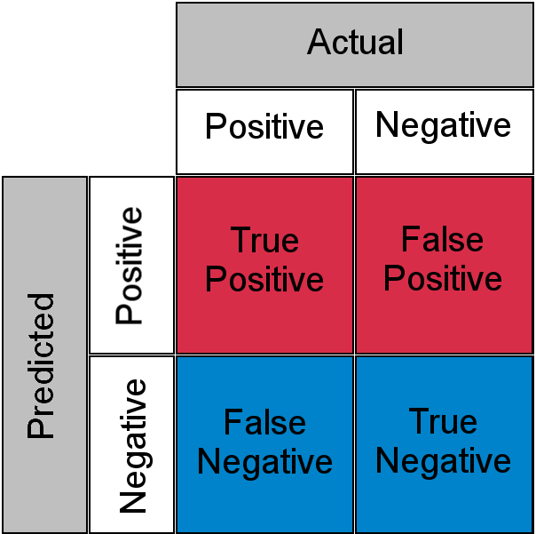
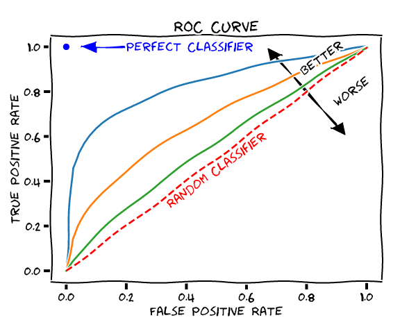

## 📝 Table of Contents

- [알고 있는 metric에 대해 설명해주세요. (ex. RMSE, MAE, recall, precision ...)](#1)
- [정규화를 왜 해야할까요? 정규화의 방법은 무엇이 있나요?](#2)
- [Local Minima와 Global Minima에 대해 설명해주세요.](#3)
- [차원의 저주에 대해 설명해주세요.](#4)
- [dimension reduction 기법으로 보통 어떤 것들이 있나요?](#5)
- [PCA는 차원 축소 기법이면서, 데이터 압축 기법이기도 하고, 노이즈 제거기법이기도 합니다. 왜 그런지 설명해주실 수 있나요?](#6)
- [LSA, LDA, SVD 등의 약자들이 어떤 뜻이고 서로 어떤 관계를 가지는지 설명할 수 있나요?](#7)
- [Markov Chain을 고등학생에게 설명하려면 어떤 방식이 제일 좋을까요?](#8)
- [텍스트 더미에서 주제를 추출해야 합니다. 어떤 방식으로 접근해 나가시겠나요?](#9)
- [SVM은 왜 반대로 차원을 확장시키는 방식으로 동작할까요? SVM은 왜 좋을까요?](#10)
- [다른 좋은 머신 러닝 대비, 오래된 기법인 나이브 베이즈(naive bayes)의 장점을 옹호해보세요.](#11)
- [회귀 / 분류시 알맞은 metric은 무엇일까?](#12)
- [Association Rule의 Support, Confidence, Lift에 대해 설명해주세요.](#13)
- [최적화 기법중 Newton’s Method와 Gradient Descent 방법에 대해 알고 있나요?](#14)
- [머신러닝(machine)적 접근방법과 통계(statistics)적 접근방법의 둘간에 차이에 대한 견해가 있나요?](#15)
- [인공신경망(deep learning이전의 전통적인)이 가지는 일반적인 문제점은 무엇일까요?](#16)
- [지금 나오고 있는 deep learning 계열의 혁신의 근간은 무엇이라고 생각하시나요?](#17)
- [ROC 커브에 대해 설명해주실 수 있으신가요?](#18)
- [여러분이 서버를 100대 가지고 있습니다. 이때 인공신경망보다 Random Forest를 써야하는 이유는 뭘까요?](#19)
- [K-means의 대표적 의미론적 단점은 무엇인가요? (계산량 많다는것 말고)](#20)
- [L1, L2 정규화에 대해 설명해주세요.](#21)
- [Cross Validation은 무엇이고 어떻게 해야하나요?](#22)
- [XGBoost을 아시나요? 왜 이 모델이 캐글에서 유명할까요?](#23)
- [앙상블 방법엔 어떤 것들이 있나요?](#24)
- [feature vector란 무엇일까요?](#25)
- [좋은 모델의 정의는 무엇일까요?](#26)
- [50개의 작은 의사결정 나무는 큰 의사결정 나무보다 괜찮을까요? 왜 그렇게 생각하나요?](#27)
- [스팸 필터에 로지스틱 리그레션을 많이 사용하는 이유는 무엇일까요?](#28)
- [OLS(ordinary least squre) regression의 공식은 무엇인가요?](#29)

---

## #1

#### 알고 있는 metric에 대해 설명해주세요. (ex. RMSE, MAE, recall, precision ...)

평가지표(metric)을 크게 `분류를 위한 평가지표`와 `회귀를 위한 평가지표`로 나눌 수 있다.

---

우선 <strong>분류 작업(task)</strong>에 적용할 수 있는 평가지표를 살펴보자.

> **정확도(accuracy)**

`정확도`는 <u>모델의 예측이 얼마나 정확한지</u>를 의미한다. 정확도는 <strong>(예측 결과가 동일한 데이터 개수)/(전체 예측 데이터 개수)</strong>로 계산할 수 있다. 하지만 라벨 불균형이 있는 데이터에서 정확도를 사용하면 안 된다. 예를 들면, 0과 1의 비율이 9:1인 데이터가 있다고 했을 때, 모두 0으로 예측하면 정확도가 90%가 나올 것이다. 이는 잘못된 판단이므로 정확한 판단을 위해서는 다른 지표를 사용해야 한다.

> **오차 행렬(confusion matrix)**

    

 

`오차 행렬`은 <u>모델이 예측을 하면서 얼마나 헷갈리고 있는지를 보여주는 지표</u>이다. 주로 이진 분류에서 많이 사용하며 이진 분류에 대한 오차 행렬은 위의 그림처럼 같이 나타낼 수 있다. True Positive는 긍정으로 예측을 했는데 실제로 긍정인 경우를, False Negative는 긍정으로 예측했는데 실제로 부정인 경우를, False Negative는 부정으로 예측했는데 실제로 긍정인 경우를, True Negative는 부정으로 예측했는데 실제로 부정인 경우를 말한다. 위의 값을 바탕으로 모델이 어떤 오류를 발생시켰는지를 살펴볼 수 있다.

참고로 정확도는 <strong>(TN + TP) / (TN + FP + FN + TP)</strong>로 계산할 수 있다.

> **정밀도(precision), 재현율(recall)**

정밀도와 재현율은 <u>긍정 데이터 예측 성능에 초점을 맞춘 평가지표</u>이다. `정밀도`란 예측을 긍정으로 한 데이터 중 실제로 긍정인 비율을 말하며, `재현율`은 실제로 긍정인 데이터 중 긍정으로 예측한 비율을 말한다. 오차 행렬을 기준으로 정밀도는 <strong>TP / (FP + TP)</strong>으로, 재현율은 <strong>TP / (FN + TP)</strong>으로 계산할 수 있다.

정밀도와 재현율은 트레이드오프 관계를 갖는다. 정밀도는 FP를, 재현율은 FN을 낮춤으로써 긍정 예측의 성능을 높인다. 이 같은 특성 때문에 정밀도가 높아지면 재현율은 낮아지고 재현율이 높아지면 정밀도는 낮아진다. 가장 좋은 경우는 두 지표 다 적절히 높은 경우이다.

> **F1-Score**

<u>정밀도와 재현율 한 쪽에 치우치지 않고 둘 다 균형을 이루는 것</u>을 나타낸 것이 `F1-Score`이다. F1-Score는 정밀도와 재현율의 조화평균으로 계산할 수 있다.

<!-- $$
F1 = \frac{2}{\frac{1}{recall} + \frac{1}{precision}} = 2 * \frac{precision * recall}{precision + recall}
$$ -->

> **ROC-AUC**

    

 

`ROC`는 <u>FPR(False Positive Rate)가 변할 때 TPR(True Positive Rate)가 어떻게 변하는지를 나타내는 곡선</u>을 말한다. 여기서 FPR이란 <strong>FP / (FP + TN)</strong>이고, TPR은 <strong>TP / (FN + TP)</strong>으로 재현율을 말한다. 그럼 어떻게 FPR을 움직일까? 바로 분류 결정 임계값을 변경함으로써 움직일 수 있다. FPR이 0이 되려면 임계값을 1로 설정하면 된다. 그럼 긍정의 기준이 높으니 모두 부정으로 예측될 것이다. 반대로 1이 되려면 임계값을 0으로 설정하여 모두 긍정으로 예측시키면 된다. 이렇게 임계값을 움직이면서 나오는 FPR과 TPR을 각각 x와 y 좌표로 두고 그린 곡선이 ROC이다.

AUC는 ROC 곡선의 넓이를 말한다. AUC가 높을수록 즉, AUC가 왼쪽 위로 휘어질수록 좋은 성능이 나온다고 판단한다. 즉, TPR이 높고 FPR이 낮을수록 예측 오류는 낮아지기 때문에 성능이 잘 나온다 볼 수 있다.

---

마지막으로 **회귀 작업**에 적용할 수 있는 평가지표를 살펴보자.

`MAE(Mean Absolute Error)`는 예측값과 정답값 사이의 차이의 절대값의 평균을 말한다.

<!-- $$
MAE = \frac{1}{N} \sum^N_{i=1} |y_i - \acute{y_i}|
$$ -->

`MSE(Mean Squared Error)`는 예측값과 정답값 사이의 차이의 제곱의 평균을 말하며, MAE와 달리 제곱을 했기 때문에 이상치에 민감하다.

<!-- $$
MSE = \frac{1}{N} \sum^N_{i=1} (y_i - \acute{y_i})^2
$$ -->

`RMSE(Root Mean Squared Error)`는 MSE에 루트를 씌운 값을 말한다.

<!-- $$
RMSE = \sqrt{MSE} = \sqrt{\frac{1}{N} \sum^N_{i=1} (y_i - \acute{y_i})^2}
$$ -->

`RMSLE(Root Mean Squared Logarithmic Error)`는 RMSE와 비슷하나 예측값과 정답값에 각각 로그를 씌워 계산을 한다.

<!-- $$
RMSLE = \sqrt{\frac{1}{N} \sum^N_{i=1} (\log(y_i+1) - \log(\acute{y_i}+1))^2}
$$ -->

`R Squared`는 분산을 기반으로 예측 성능을 평가하는 지표를 말한다. 정답값의 분산 대비 예측값의 분산 비율을 지표로 하며, 1에 가까울수록 정확도가 높다.

#### References

- [14 Popular Machine Learning Evaluation Metrics - RUBIK'S CODE](https://rubikscode.net/2020/10/19/14-popular-machine-learning-evaluation-metrics/)
- [Metrics to Evaluate your Machine Learning Algorithm - towards data science](https://towardsdatascience.com/metrics-to-evaluate-your-machine-learning-algorithm-f10ba6e38234)
- [머신러닝 용어집 - 구글 머신러닝 단기 집중과정](https://developers.google.com/machine-learning/glossary)
- [3. 평가 - 파이썬 머신러닝 완벽 가이드](http://www.yes24.com/Product/Goods/87044746?OzSrank=1)
- [Regression 모델 평가 : MSE, MAE, RMSE, RMSLE, R-Squared - Steadiness](https://steadiness-193.tistory.com/277)

---

## #2

#### 정규화를 왜 해야할까요? 정규화의 방법은 무엇이 있나요?

`정규화`는 개별 피처의 크기를 모두 똑같은 단위로 변경하는 것을 말한다. 정규화를 하는 이유는 <u>피처의 스케일이 심하게 차이가 나는 경우 값이 큰 피처가 더 중요하게 여겨질 수 있기 때문</u>이다. 이를 막기 위해 피처 모두 동일한 스케일로 반영되도록 하는 것이 정규화이다.

정규화하는 방법으로는 대표적으로 두 가지가 존재한다. 첫 번째 정규화 방법은 <strong>최소-최대 정규화(min-max normalization)</strong>으로 각 피처의 최소값을 0, 최대값을 1로 두고 변환하는 방법이다. 값을 <!-- $x$ --> 로, 최소값을 <!-- $min$ --> , 최대값을 <!-- $max$ --> 로 둘 때, 정규화된 값은 <!-- $\frac{x - min}{max - min}$ --> 으로 계산할 수 있다. 두 번째 정규화 방법으로 <strong>Z-점수 정규화(z-score normalization)</strong>이 있다. 이 방법은 각 피처의 표준편차와 평균으로 값을 정규화시킨다. 정규화된 값은 <!-- $\frac{x - mean}{std}$ --> 로 계산할 수 있다.

#### References

- [정규화(Normalization) 쉽게 이해하기 - 아무튼 워라밸](http://hleecaster.com/ml-normalization-concept/)
- [2. 사이킷런으로 시작하는 머신러닝 - 파이썬 머신러닝 완벽 가이드](http://www.yes24.com/Product/Goods/87044746?OzSrank=1)

---

## #3

#### Local Minima와 Global Minima에 대해 설명해주세요.

비용 함수(cost function)에서의 `Global Minima`는 에러가 최소화되는 즉, 우리가 찾고자 하는 지점을 말하며, `Local Minima`는 에러가 최소가 될 수 있는 후보가 되는 지점 중 Global Minima를 뺀 지점을 말한다. Local Minima는 자칫 에러가 최소화되는 지점을 찾았다고 생각할 수 있기에 함정에 비유할 수 있다. 이를 해결하기 위해 Momentum과 같은 최적화 알고리즘을 사용하거나 학습률(learning rate)를 잘 조절하여 Local Minima에서 벗어날 수 있다.

#### References

- [Local Minima 문제에 대한 새로운 시각 - 다크 프로그래머](https://darkpgmr.tistory.com/148)
- [Minima - Hong's](https://jihongl.github.io/2017/09/18/minima/)

---

## #4

#### 차원의 저주에 대해 설명해주세요.

    

`차원의 저주란 데이터 차원이 증가할수록 해당 공간의 크기가 기하급수적으로 증가하여 데이터 간 거리가 기하급수적으로 멀어지고 희소한 구조를 갖게 되는 현상을 말한다. 이를 해결하기 위해서는 차원을 증가시킨만큼 더 많은 데이터를 추가하거나 PCA, LDA, LLE, MDS와 같은 차원 축소 알고리즘으로 차원을 줄여 해결할 수 있다.

#### References

- [차원의 저주(Curse of dimensionality) - BioinformaticsAndMe](https://bioinformaticsandme.tistory.com/197)
- [차원의 문제 - 다크 프로그래머](https://darkpgmr.tistory.com/145)
- [6. 차원 축소 - 파이썬 머신러닝 완벽 가이드](http://www.yes24.com/Product/Goods/87044746?OzSrank=1)

---

## #5

#### dimension reduction 기법으로 보통 어떤 것들이 있나요?

차원 축소는 `피처 선택(feature selection)`과 `피처 추출(feature extraction)`으로 나눌 수 있다. 우선 피처 선택은 <u>특정 피처에 종속성이 강한 불필요한 피처는 제거하고 데이터의 특징을 잘 표현하는 주요 피처만 선택하는 것</u>을 말한다. 반면 피처 추출은 기존 피처를 저차원의 피처로 압축하여, <u>피처를 함축적으로 잘 설명할 수 있도록 저차원으로 매핑하는 것</u>을 말한다. 대표적인 피처 추출 알고리즘으로 PCA, SVD, NMF, LDA 등이 있다.

#### References

- [6. 차원 축소 - 파이썬 머신러닝 완벽 가이드](http://www.yes24.com/Product/Goods/87044746?OzSrank=1)

---

## #6

#### PCA는 차원 축소 기법이면서, 데이터 압축 기법이기도 하고, 노이즈 제거기법이기도 합니다. 왜 그런지 설명해주실 수 있나요?

`PCA(Principle Component Analysis)`는 <u>입력 데이터의 공분산 행렬을 기반으로 고유벡터를 생성하고 이렇게 구한 고유 벡터에 입력 데이터를 선형 변환하여 차원을 축소하는 방법</u>이다. 차원은 곧 입력 데이터의 피처를 뜻하므로 데이터 압축 기법으로 볼 수도 있다.

또한 PCA는 고유값이 가장 큰, 즉 데이터의 분산이 가장 큰 순으로 주성분 벡터를 추출하는데, 가장 나중에 뽑힌 벡터보다 가장 먼저 뽑힌 벡터가 데이터를 더 잘 설명할 수 있기 때문에 노이즈 제거 기법이라고도 불린다.

#### References

- [6. 차원 축소 - 파이썬 머신러닝 완벽 가이드](http://www.yes24.com/Product/Goods/87044746?OzSrank=1)
- [[기술면접] 차원축소, PCA, SVD, LSA, LDA, MF 간단정리 (day1 / 201009) - Hui_dea](https://huidea.tistory.com/126)

---

## #7

#### LSA, LDA, SVD 등의 약자들이 어떤 뜻이고 서로 어떤 관계를 가지는지 설명할 수 있나요?

`PCA`는 **Principle Component Analysis**의 약자로 데이터의 공분산 행렬을 기반으로 고유벡터를 생성하고 이렇게 구한 고유 벡터에 입력 데이터를 선형 변환하여 차원을 축소하는 방법이다. `SVD`는 **Singular Value Decomposition**의 약자로 PCA와 유사한 행렬 분해 기법을 사용하나 정방 행렬(square matrix)를 분해하는 PCA와 달리 행과 열의 크기가 다른 행렬에도 적용할 수 있다.

`LSA`는 **Latent Semantic Analysis**의 약자로 잠재 의미 분석을 말하며, 주로 토픽 모델링에 자주 사용되는 기법이다. LSA는 DTM(Document-Term Matrix)이나 TF-IDF(Term Frequency-Inverse Document Frequency) 행렬에 Trucated SVD를 적용하여 차원을 축소시키고, 단어들의 잠재적인 의미를 이끌어낸다.

`LDA`는 **Latent Dirichlet Allocation** 혹은 **Linear Discriminant Analysis**의 약자이다. 전자는 토픽모델링에 사용되는 기법 중 하나로 LSA와는 달리 단어가 특정 토픽에 존재할 확률과 문서에 특정 토픽이 존재할 확률을 결합확률로 추정하여 토픽을 추정하는 기법을 말한다. 후자는 차원축소기법 중 하나로 분류하기 쉽도록 클래스 간 분산을 최대화하고 클래스 내부의 분산은 최소화하는 방식을 말한다.

#### References

- [잠재 의미 분석(Latent Semantic Analysis, LSA) - 딥러닝을 이용한 자연어 처리 입문](https://wikidocs.net/24949)
- [잠재 디리클레 할당(Latent Dirichlet Allocation, LDA) - 딥러닝을 이용한 자연어 처리 입문](https://wikidocs.net/30708)
- [문서 단어 행렬(Document-Term Matrix, DTM) - 딥러닝을 이용한 자연어 처리 입문](https://wikidocs.net/24559)
- [TF-IDF(Term Frequency-Inverse Document Frequency) - 딥러닝을 이용한 자연어 처리 입문](https://wikidocs.net/31698)
- [6. 차원 축소 - 파이썬 머신러닝 완벽 가이드](http://www.yes24.com/Product/Goods/87044746?OzSrank=1)

---

## #8

#### Markov Chain을 고등학생에게 설명하려면 어떤 방식이 제일 좋을까요?

#### References

---

## #9

#### 텍스트 더미에서 주제를 추출해야 합니다. 어떤 방식으로 접근해 나가시겠나요?

#### References

---

## #10

#### SVM은 왜 반대로 차원을 확장시키는 방식으로 동작할까요? SVM은 왜 좋을까요?

#### References

---

## #11

#### 다른 좋은 머신 러닝 대비, 오래된 기법인 나이브 베이즈(naive bayes)의 장점을 옹호해보세요.

#### References

---

## #12

#### 회귀 / 분류시 알맞은 metric은 무엇일까?

#### References

---

## #13

#### Association Rule의 Support, Confidence, Lift에 대해 설명해주세요.

#### References

---

## #14

#### 최적화 기법중 Newton’s Method와 Gradient Descent 방법에 대해 알고 있나요?

#### References

---

## #15

#### 머신러닝(machine)적 접근방법과 통계(statistics)적 접근방법의 둘간에 차이에 대한 견해가 있나요?

#### References

---

## #16

#### 인공신경망(deep learning이전의 전통적인)이 가지는 일반적인 문제점은 무엇일까요?

#### References

---

## #17

#### 지금 나오고 있는 deep learning 계열의 혁신의 근간은 무엇이라고 생각하시나요?

#### References

---

## #18

#### ROC 커브에 대해 설명해주실 수 있으신가요?

#### References

---

## #19

#### 여러분이 서버를 100대 가지고 있습니다. 이때 인공신경망보다 Random Forest를 써야하는 이유는 뭘까요?

#### References

---

## #20

#### K-means의 대표적 의미론적 단점은 무엇인가요? (계산량 많다는것 말고)

#### References

---

## #21

#### L1, L2 정규화에 대해 설명해주세요.

정규화(**일반화**)의 목적은 모델이 학습 데이터에 오버피팅되지 않고 처음 보는 테스트 데이터에도 좋은 성능을 내도록 만드는 것이다. 

L1 정규화 (라쏘 회귀)

L2 정규화 (릿지 회귀)

loss 식에 람다 * 모델의 웨이트에 대한 L1 or L2 norm 을 더해줌으로써 모델의 일반화가 가능해진다.

loss 는 데이터 값과 추정 값의 차이로 모델은 loss 를 최소화하는 방향으로 학습하는데, L1 or L2 정규화를 사용하면 loss 가 웨이트의 크기만큼 커지기 때문에 데이터 값에 예측 값이 fit 해지지 않기 때문이다.
 
*norm 은 벡터의 크기를 나타내는 것으로 L1 norm 은 벡터의 절댓값 크기를 나타내고, L2 norm 은 직선 거리 (제곱의 루트) 를 나타낸다.
  
위 그림에서 초록선은 L2 norm 을 의미하고, 나머지 선은 L1 norm 을 의미한다.
 
L1 loss
  

L2 loss

#### References
- [딥러닝 용어 정리, L1 Regularization, L2 Regularization 의 이해, 용도와 차이 설명 - 빛나는 나무](https://light-tree.tistory.com/125)
- [L1, L2 Norm, Loss, Regularization? - 생각 정리](https://junklee.tistory.com/29)

---

## #22

#### Cross Validation은 무엇이고 어떻게 해야하나요?

#### References

---

## #23

#### XGBoost을 아시나요? 왜 이 모델이 캐글에서 유명할까요?

#### References

---

## #24

#### 앙상블 방법엔 어떤 것들이 있나요?

#### References

---

## #25

#### feature vector란 무엇일까요?

#### References

---

## #26

#### 좋은 모델의 정의는 무엇일까요?

#### References

---

## #27

#### 50개의 작은 의사결정 나무는 큰 의사결정 나무보다 괜찮을까요? 왜 그렇게 생각하나요?

#### References

---

## #28

#### 스팸 필터에 로지스틱 리그레션을 많이 사용하는 이유는 무엇일까요?

#### References

---

## #29

#### OLS(ordinary least squre) regression의 공식은 무엇인가요?

#### References

---
